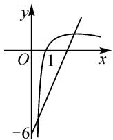
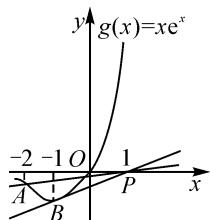

# “构造函数解不等式恒成立问题”的专题设计

# 江苏省连云港市城头高级中学 王德金

典型问题的解法具有极高的研究价值,适度总结推广可用于类型题的破解中.因此解法探究教学中,建议引导学生深入挖掘问题解法,提炼生成策略,再适度拓展变式,强化练习.下面整理“构造函数破解不等式恒成立问题”的教学微设计,以供研讨借鉴.

# 1 从问题解法突破说起

问题 已知函数 $f(x)=3\ln x-kx^{2}+6x$ ，若 $f(x)>0$ 的解集为 $(m,n)$ ，且 $(m,n)$ 中只有两个整数，则 k 的最小值为 \_\_\_\_.

解法突破: 由 $f(x)>0$ , 可得 $f(x)=3\ln x-kx^{2}+6x>0$ , 整理变形则有 $\frac{3\ln x}{x}>kx-6$ .

设 $g(x)=\frac{3\ln x}{x}, h(x)=kx-6,$ 则可将问题转化为两个函数的取值比较.对于函数 $g(x)$ ，其导函数 $g'(x)=\frac{3(1-\ln x)}{x^{2}}$ .由 $g'(x)>0$ ，得 0<x<e;由 $g'(x)<0$ , 得 x>e. 可知 $g(x)$ 在(0,e)上单调递增,在 $(e,+\infty)$ 上单调递减.而 $h(x)=kx-6$ 的图象是一条恒过点 $(0,-6)$ 的直线,函数 $g(x)$ 与 $h(x)$ 的图象如图1所示.

  
图1

根据题意分析, 得 0 < m < 1. 若 $(m, n)$ 中只有两个整数, 这两个整数只能是 1 和 2, 则 $\left\{\begin{aligned} g(2) &> h(2), \\ g(3) &\leqslant h(3), \end{aligned}\right.$ 可解得 $\frac{6 + \ln 3}{3} \leqslant k < \frac{12 + 3 \ln 2}{4}$ , 所以 k 的最小值为 $\frac{6 + \ln 3}{3}$ .

解法回顾:上述实则为不等式成立求参数取值问题,即 $f(x)>0$ 及设定条件下求参数 k 的最小值,为不等式恒成立问题.

解题的关键有两点:一是构造函数,将不等式问题转化为分析函数特性;二是利用导数来分析函数的性质,确定函数在区间上的变化,涉及到了导数的相关知识.

综合来看,可视为是构造函数,利用导数的知识破解不等式问题.教学引导中可以重点讲解如下具体思路:

第一步,整理变形,根据不等式构造新函数;

第二步,利用导数研究函数的单调性,可结合函数的图象,求出最值;

第三步,根据取值反推参数的取值范围.

# 2 围绕解法开展教学微设

# 2.1 教学环节 1: 方法套用, 思路强化

问题 1 若关于 x 的不等式 $xe^{x}-ax+a<0$ 的解集为 $(m,n)(n<0)$ ，且 $(m,n)$ 中只有一个整数，则实数 a 的取值范围是 \_\_\_\_.

说明:本题与上述问题类似,也是设定不等式的解集,以及其中只有一个整数,要求参数 a 的取值范围.显然可以按照上述构建的三步策略来突破.

第一步,构造函数.

该步引导学生关注 $xe^{x}-ax+a<0$ ，整理变形则有 $xe^{x}<ax-a$ ，再根据不等号两侧的结构构造函数。设 $g(x)=xe^{x}, y=ax-a$ 。

第二步,利用导数研究函数性质.

该步指导学生利用导数来研究函数的性质. 易知 $g'(x)=(x+1)\mathrm{e}^{x}$ . 由 $g'(x)>0$ , 解得 x>-1; 由 $g'(x)<0$ , 解得 x<-1. 所以函数 $g(x)$ 在 $(-∞,-1)$ 上单调递减, 在 $[-1,+∞)$ 上单调递增.

同时还需指导学生关注以下特性: 当 $x \to -\infty$ , $g(x) < 0$ 且 $g(x) \to 0$ , 又 $g(0) = 0$ , 则 $g(x) = x e^{x}$ 的大致图象如图 2 所示.

第三步,分析求范围.

该步需要数形结合来分析其中的最值. $x\mathrm{e}^x -ax + a <   0$ 有唯一整数解, 即不等式 $x \mathrm{e}^{x} < a(x - 1)$ 有唯一整数解, 因此 $g(x) = x \cdot \mathrm{e}^{x}$ 在直线 y = ax - a 下方的部分对应唯一整数 x. 又 $g(x)_{\min} = g(-1) = -\frac{1}{\mathrm{e}}$ , 而 y = ax - a 恒过定点 $P(1,0)$ , 因此结合函数图象可得出 $k_{PA} \leqslant a < k_{PB}$ , 即 $\frac{2}{3e^{2}} \leqslant a < \frac{1}{2e}$ .

text_image

g(x)=xe^x
-2 -1 O 1
A B P x

图2

解题过程需要引导学生关注两点:一是数形结合分析问题,绘制函数图象;二是最值或取值范围的分析要关注图象的交点与函数的定义域.

# 2.2 教学环节 2: 拾级而上, 灵活变通

构造函数解决不等式恒成立问题时,需要关注不等式的结构.教学中需要引导学生灵活变通,降低思维难度.对于涉及多变量的情形,可先分离变量,再构造新函数.

问题 2 已知函数 $f(x)=x^{2}-ax-a\ln x(a\in\mathbf{R})$ , $g(x)=-x^{3}+\frac{5}{2}x^{2}+2x-6$ , $g(x)$ 在 $[1,4]$ 上的最大值为 b，当 $x\in[1,+\infty)$ 时， $f(x)\geqslant b$ 恒成立，则 a 的取值范围是 \_\_\_\_.

说明: 解题过程先引导学生利用导函数分析函数 $g(x)$ 的单调性. 当 $1 \leqslant x \leqslant 2$ 时, $g'(x) \geqslant 0$ , 此时函数 $g(x)$ 单调递增; 当 $2 \leqslant x \leqslant 4$ 时, $g'(x) \leqslant 0$ , 此时函数 $g(x)$ 单调递减. 根据函数的单调性可推知 $b = g(x)_{\max} = g(2) = 0$ , 从而可得 $f(x) \geqslant 0$ 在 $x \in [1, +\infty)$ 上恒成立.

分析可知 $f(x)=x^{2}-a(x+\ln x)\geqslant0$ ，教学中引导学生整理不等式，分离其中的参数，得 $a\leqslant\frac{x^{2}}{x+\ln x}$ ，从而将条件转化为 $a\leqslant\frac{x^{2}}{x+\ln x}$ 在 $x\in[1,+\infty)$ 上恒成立.

此时再引导学生基于不等式构造函数，即令 $h(x) = \frac{x^2}{x + \ln x}, x \in [1, +\infty)$ ，则对应导函数为 $h'(x) = \frac{x(x - 1) + 2x\ln x}{(x + \ln x)^2} \geqslant 0$ ，从而可确定函数 $h(x)$ 在 $[1, +\infty)$ 上为增函数，则 $h(x)_{\min} = h(1) = 1$ ，故 $a \leqslant 1$ 。

该环节是关于构造函数方法的进一步完善,需要引导学生明晰“先分离,再构造”的方法思路.

# 2.3 教学环节 3: 解题挑战, 破解综合

该环节重点是利用函数构造法来破解综合性问题,问题结构、难度需要与高考相匹配,建议选用真题或模考题.让学生自主分析问题,独立设计思路,结合方法破解.

问题 3 已知 $f(x)=2\ln x+ax+\frac{b}{x}$ 在 x=1 处的切线方程为 y=-3x.

(1) 求函数 $f(x)$ 的解析式；

(2) $f'(x)$ 是 $f(x)$ 的导函数,证明:对任意 $x\in[1,+\infty)$ ,都有 $f(x)-f'(x)\leqslant-2x+\frac{1}{x}+1.$

本环节需要引导学生关注两点:一是关注两问之间的关联,充分利用第(1)问证明第(2)问;二是灵活利用导函数分析函数性质.

第(1)问破解引导: 解析其中的切线条件. 由 $f'(x)=\frac{2}{x}+a-\frac{b}{x^{2}}$ ，可知 $f'(1)=2+a-b=-3$ ，即 a-b=-5，又 $f(1)=a+b=-3$ ，则 a=-4, b=1，从而可求出 $f(x)$ 的解析式.

第(2)问破解引导:结合第(1)问,则有 $f(x)=2\ln x-4x+\frac{1}{x}$ , 由其导函数可直接构造所证不等式的, 即为 $f(x)-f'(x)=2\ln x-4x-\frac{1}{x}+\frac{1}{x^{2}}+4$ . 此时, 引导学生构造函数, 令 $g(x)=2\ln x-4x-\frac{1}{x}+\frac{1}{x^{2}}+4-\left(-2x+\frac{1}{x}+1\right)=2\ln x-2x-\frac{2}{x}+\frac{1}{x^{2}}+3$ , 利用导函数来分析其性质. 对函数 $g'(x)$ 求导, 得 $g'(x)=\frac{-2(1-x)^{2}(1+x)}{x^{3}}\leqslant0$ , 则 $g(x)$ 在 $x\in[1,+\infty)$ 上单调递减. 进一步知 $g(x)\leqslant g(1)=0$ , 即 $g(x)=2\ln x-4x-\frac{1}{x}+\frac{1}{x^{2}}+4-\left(-2x+\frac{1}{x}+1\right)\leqslant0$ , 所以可推知 $f(x)-f'(x)\leqslant-2x+\frac{1}{x}+1$ , 完成证明.

# 3 基于解题开展教学研究

# 3.1 注意典例解法的总结思考

解法探究是提升学生解题能力的重要方式,教学研讨中需要注意对典例的方法解析,指导学生体验解题过程,从“解题思路突破”转向“总结分步思路”,生成具有一般性的“方法策略”.典例解法分析中,需要注意三点:一是注意解法本质的深入阐述;二是注意构建解法分步策略;三是深入讲解解法的适用问题.对于涉及图象的问题,还需要指导学生掌握数形结合破解问题的思路,何时需要剖析图象,如何利用图象来分析与推理.

# 3.2 关注教学环节的互动设计

教学中完成解法总结后,还需要引导学生加以应用,实际教学建议采用“专题设计”的方式,分环节设计解题活动,引导学生互动交流.整个过程需要引导学生充分参与教学探究活动,感悟问题,分析方法,总结归纳.师生互动的教学模式,能够充分启发学生的思维,提升学生的探究能力,帮助学生真正掌握解题方法.探究过程中学生出现思维障碍时,教师要适时引导,可设计启发性问题,由易到难,逐步发掘问题.教学预设中,则需注意精设铺垫性问题,让学生回顾解法、基础知识,独立思考探索.Z