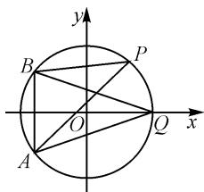
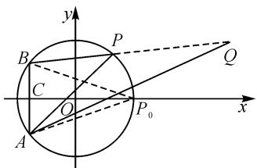

# 一道二模试卷中代数式最值试题的探究

# ● 江苏省徐州市第三中学 郭睿峰

摘要: 涉及平面解析几何场景下的代数式的最值(或取值范围)问题, 是高考试卷中的一个创新点与难点所在, 常考常新, 变化多样. 结合一道代数式最值问题的求解, 挖掘代数式的结构, 从不同思维视角切入, 借助不同技巧方法解决, 开拓学生的解题思路, 指导数学教学与解题研究.

关键词: 解几; 最值; 圆; 余弦定理; 柯西不等式

平面解析几何场景下的代数式的最值(或取值范围)问题,通常是模拟考试、高考、自主招生以及竞赛等考试数学命题中的一个热点与难点,各类题型都可以创新设置,命题角度广,内涵丰富,备受命题者青睐.同时,平面解析几何场景下的代数式的最值(或取值范围)问题,形式多变,创新新颖,花样翻新,难度较高,但其基本解题思路与技巧方法仍然有章可循,有法可依.

# 1 问题呈现

问题（2024届安徽省天域全国名校协作体高考数学二模数学试卷·14）若实数 $x, y$ 满足 $x^{2} + y^{2} = 25$ ，则 $\sqrt{50 + 8x + 6y} + \sqrt{50 + 8x - 6y}$ 的最大值为 \_\_\_\_.

此题以圆的方程为问题背景,利用圆上的一动点 $P(x,y)$ 所满足的代数式(一次式与根式的复合)来创设,进而求解对应代数式的最大值.问题简单明了,但内涵丰富,如何合理切入成为解决问题的关键.

合理挖掘根式的结构特征,可以从根式的几何意义入手,利用平面解析几何中的两点间的距离公式来转化与应用;也可以从根式的特征入手,转化为不等式的形式,利用重要不等式的性质来合理放缩与转化.而在实际解决问题时,要合理深入挖掘与优化拓展,从而实现巧妙解题与应用.

# 2 问题破解

# 2.1 解三角形思维

解法 1:(余弦定理法)

因为实数 $x, y$ 满足 $x^{2} + y^{2} = 25$ ，所以可以将所求代数式变形为 $\sqrt{50 + 8x + 6y} + \sqrt{50 + 8x - 6y} = \sqrt{x^2 + y^2 + 8x + 6y + 25} + \sqrt{x^2 + y^2 + 8x - 6y + 25} = \sqrt{(x + 4)^2 + (y + 3)^2} + \sqrt{(x + 4)^2 + (y - 3)^2}$ .

该式子的几何意义为圆 $x^{2} + y^{2} = 25$ 上的任意一点 $P(x,y)$ 到点 $A(-4, - 3)$ 与 $B(-4,3)$ 的距离之和即 $\left|PA\right|+\left|PB\right|$ ，如图 1 所示.

设点 $Q(5,0)$ ，则 $|AQ| = |BQ| = \sqrt{(5 + 4)^2 + 3^2} = 3\sqrt{10}$ .

在 $\triangle ABQ$ 中， $|AB|=6$ ，利用余弦定理，可得 $\cos\angle AQB=\frac{|AQ|^{2}+|BQ|^{2}-|AB|^{2}}{2|AQ||BQ|}$ ，所以有

text_image

y
B
P
O
Q
x
A

图1

$$
\cos \angle A Q B = \frac {9 0 + 9 0 - 3 6}{2 \times 3 \sqrt {1 0} \times 3 \sqrt {1 0}} = \frac {4}{5}.
$$

而点 $P$ 在圆 $x^{2} + y^{2} = 25$ 上运动时，始终有 $\angle AQB = \angle APB$ ，所以 $\cos \angle APB = \frac{4}{5}$

设 $|AP|=m,|BP|=n$ ，则由余弦定理可得 $\cos\angle APB=\frac{m^{2}+n^{2}-36}{2mn}=\frac{4}{5}$ ，即有 $m^{2}+n^{2}-36=\frac{8}{5}mn$ ，所以 $(m+n)^{2}-2mn-36=\frac{8}{5}mn$ ，即 $mn=\frac{5}{18}(m+n)^{2}-10.$

又因为 $m > 0, n > 0$ ，利用基本不等式可得 $mn \leqslant \frac{(m + n)^2}{4}$ ，当且仅当 $m = n$ 时，等号成立。

所以 $\frac{5}{18} (m + n)^2 - 10 = mn \leqslant \frac{(m + n)^2}{4}$ , 解得 $m + n \leqslant 6\sqrt{10}$ , 当且仅当 $m = n = 3\sqrt{10}$ 时, 等号成立.

所以 $\sqrt{50+8x+6y}+\sqrt{50+8x-6y}$ 的最大值为 $6\sqrt{10}$ .

解法 2: (正弦定理法)

因为实数 x, y 满足 $x^{2} + y^{2} = 25$ ，所以可以将所求代数式变形为 $\sqrt{50 + 8x + 6y} + \sqrt{50 + 8x - 6y} = \sqrt{x^{2} + y^{2} + 8x + 6y + 25} + \sqrt{x^{2} + y^{2} + 8x - 6y + 25} = \sqrt{(x + 4)^{2} + (y + 3)^{2}} + \sqrt{(x + 4)^{2} + (y - 3)^{2}}$ .

该式子的几何意义为圆 $x^{2} + y^{2} = 25$ 上的任意一点 $P(x,y)$ 到点 $A(-4, - 3)$ 与 $B(-4,3)$ 的距离之和

即 $|PA| + |PB|$ .

如图 2, 延长 BP 至点 Q, 使得 $\left|PQ\right| = \left|PA\right|$ , 连接 AQ, 则 $\sqrt{50 + 8x + 6y} + \sqrt{50 + 8x - 6y} = \left|BQ\right|$ .

设圆 $x^{2} + y^{2} = 25$ 与 $x$ 轴正半轴交于点$P_{0}$ ，连接 $P_{0}A,P_{0}B$ ，线段 $AB$ 与 $x$ 轴的交点为点 $C$ 则 $\angle AQB = \frac{1}{2}\angle APB = \angle AP_0C$ ，可得 $\sin \angle AQB =$ $\sin \angle AP_0C = \frac{3}{\sqrt{3^2 + 9^2}} = \frac{1}{\sqrt{10}}.$

text_image

y
B
P
Q
C
O
x
A
P₀

图2

而点 Q 在以 AB 为弦, r 为半径的优弧 AB 上运动, 其中 r 由 $\frac{|AB|}{\sin\angle AQB}=2r$ 确定.

又利用正弦定理有 $2r = \frac{|AB|}{\sin\angle AQB} = \frac{6}{\frac{1}{\sqrt{10}}} = 6\sqrt{10}$ ，数形结合可知， $|BQ|$ 的最大值为 $6\sqrt{10}$

所以 $\sqrt{50 + 8x + 6y} +\sqrt{50 + 8x - 6y}$ 的最大值为 $6\sqrt{10}$

点评:通过所求代数式的结构特征,由根式联想到平面解析几何中的两点间的距离公式,借助圆的方程进行常数代数处理,巧妙配方,分别将两个根式构建为定圆上的动点到两相应定点间的距离问题,给问题的解决奠定基础.而求解平面解析几何中的两线段长度之和的最值问题,可以借助解三角形思维,通过直观的图形,利用余弦定理或正弦定理这两种的视角切入加以应用,进而求解对应的最值问题.通过合理的数形结合与巧妙的直观想象,从而实现问题的突破与求解.

# 2.2 不等式思维

解法 3: (柯西不等式法)

利用柯西不等式,可得

$$
\begin{array}{l} \sqrt {5 0 + 8 x + 6 y} + \sqrt {5 0 + 8 x - 6 y} \\ \leqslant \sqrt {(1 + 1) [ (5 0 + 8 x + 6 y) + (5 0 + 8 x - 6 y) ]} \\ = \sqrt {2 (1 0 0 + 1 6 x)} \\ \leqslant \sqrt {2 (1 0 0 + 1 6 \times 5)} = 6 \sqrt {1 0}, \\ \end{array}
$$

当且仅当 $\left\{ \begin{array}{l}50 + 8x + 6y = 50 + 8x - 6y,\\ x = 5, \end{array} \right.$ 即 $\left\{ \begin{array}{l}x = 5,\\ y = 0 \end{array} \right.$ 时，等号成立.

所以 $\sqrt{50+8x+6y}+\sqrt{50+8x-6y}$ 的最大值为 $6\sqrt{10}$ .

点评:根据所求代数式的结构特征,吻合柯西不等式的变形式 $\sqrt{a} +\sqrt{b}\leqslant \sqrt{(1 + 1)(a + b)}$ ，进而借助柯西不等式来合理放缩处理，同时进一步结合圆 $x^{2}+$ $y^{2} = 25$ 上动点所对应的变量的取值限制 $-5\leqslant x\leqslant 5$ 来放缩，达到求解与应用的目的.多次利用不等式的基本性质来放缩处理时，一定要注意多次放缩时等号成立的一致性，才能保证最值求解的正确性与严谨性.

# 2.3 对称思维

解法 4: (对称法)

因为实数 $x, y$ 满足 $x^{2} + y^{2} = 25$ ，所以可将所求代数式变形为 $\sqrt{50 + 8x + 6y} + \sqrt{50 + 8x - 6y} = \sqrt{x^2 + y^2 + 8x + 6y + 25} + \sqrt{x^2 + y + 8x - 6y + 25} = \sqrt{(x + 4)^2 + (y + 3)^2} + \sqrt{(x + 4)^2 + (y - 3)^2}$ .

该式子的几何意义为圆 $x^{2} + y^{2} = 25$ 上的任意一点 $P(x,y)$ 到点 $A(-4, - 3)$ 与 $B(-4,3)$ 的距离之和即 $\vert PA\vert +\vert PB\vert$ ，如图1所示.

根据对称性思维,当动点 P 位于圆与 x 轴正半轴的交点 $Q(5,0)$ 时, $|PA| + |PB|$ 取得最大值, 此时最大值为 $2\sqrt{(5+4)^{2}+3^{2}} = 6\sqrt{10}$ .

所以 $\sqrt{50+8x+6y}+\sqrt{50+8x-6y}$ 的最大值为 $6\sqrt{10}$ .

点评:通过所求代数式的结构特征,合理变形转化为圆上的一个动点到两相应定点间的距离问题时,利用动点到两定点的对称性思维,数形结合,直观想象确定动点位于两定点构成的线段的中垂线上时,其取得最值,进而数形直观来确定相应的最值问题.对称思维是结合以上解三角形思维的特点,并结合特殊思维来直接确定,虽然缺乏一定的严谨性,但解题目标更加明确,效果更加良好.

# 3 教学启示

涉及平面解析几何场景下的代数式的最值(或取值范围等)的综合应用问题,借助“动”与“静”的场景创设,具有一定的探索性与综合性,是平面解析几何与平面几何、函数或方程、不等式、三角函数、平面向量等模块知识合理交汇与融合的一个重要场所,成为全面落实“四基”与考查“四能”的一个基本考点.

特别,对于此类平面解析几何场景下的代数式的最值(或取值范围等)问题,合理抓住一些常见的典型问题,从题设条件入手,挖掘问题的内涵与实质,合理构建与之相关的参数或代数式所对应的不等式、代数式或几何直观模型等,巧妙变形与转化,利用相应的技巧方法与策略来分析与处理,有时单种技巧策略分析,有时多种技巧策略综合,实现综合应用问题的巧妙解决. Z