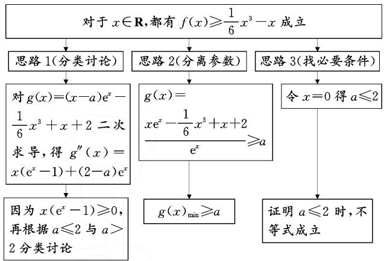
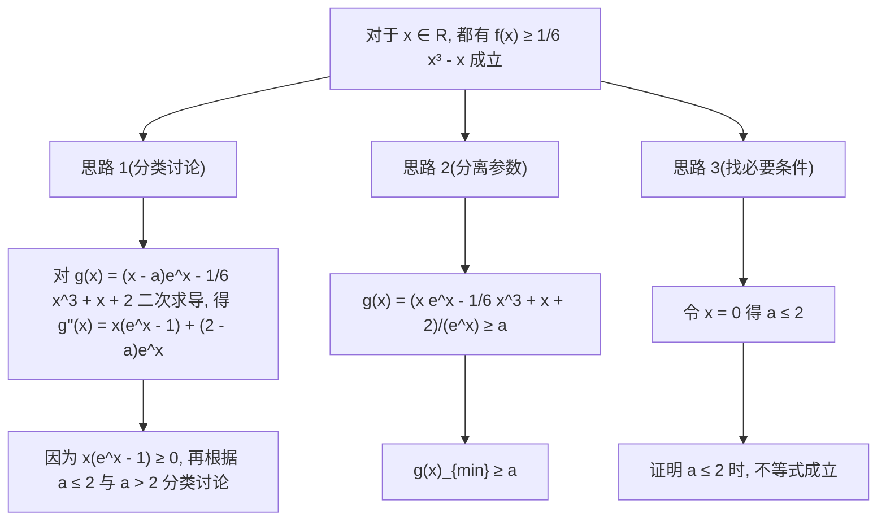

# 一道导数原创题的解法探讨

# ● 云南省昆明市第十中学 王志红 谢玮 倪文妍 宋鸿雁

摘要:通过对一道导数原创题的解法探讨,探析一类导数压轴试题的解题思路,即从分类讨论、分离参数、找必要条件等常规通法入手,通过运算变形与转化进行求解,力求让学生能够做到做一题而通一类.

关键词: 高考数学; 导数; 解题思路

# 1 新题呈现

原创题 已知函数 $f(x)=(x-a)\mathrm{e}^{x}+2, a \in \mathbf{R}$ .

(1) 讨论 $f(x)$ 的单调区间；  
(2) 若对于 $x \in \mathbf{R}$ , 都有 $f(x) \geqslant \frac{1}{6} x^3 - x$ 成立, 求 $a$ 的取值范围.

# 2 考查目标

本题以一次函数和指数函数构成的新函数为载体,考查了函数的单调性、不等式恒成立求参数取值范围的问题,意在考查逻辑推理、化归与转化、运算求解能力,考查的核心素养是逻辑推理、直观想象和数学运算.

# 3 解题分析

第(1)问,直接求导判断单调性即可.第(2)问是含参不等式恒成立问题,可以对 $g(x)=(x-a)\mathrm{e}^{x}-\frac{1}{6}x^{3}+x+2$ 二次求导得 $g''(x)=x(\mathrm{e}^{x}-1)+(2-a)\mathrm{e}^{x}$ , 因为 $x(\mathrm{e}^{x}-1)\geqslant0$ , 所以只需对 $a\leqslant2$ 与 a>2 进行分类讨论, 通过隐零点求出 $g(x)$ 的最小值, 再证明 $g(x)$ 的最小值大于等于 0 即可. 另外, 还可通过分离参数来求解,分参后令 $g(x)=\frac{x\mathrm{e}^{x}-\frac{1}{6}x^{3}+x+2}{\mathrm{e}^{x}}$ , 再利用导数求出 $g(x)$ 的最小值即可. 此外, 也可以将 $f(x)\geqslant\frac{1}{6}x^{3}-x$ 变形为 $(x-a)\mathrm{e}^{x}-\frac{1}{6}x^{3}+x+2\geqslant0$ , 令 $g(x)=(x-a)\mathrm{e}^{x}-\frac{1}{6}x^{3}+x+2$ , 代入特殊点不难发现 $g(0)=2-a\geqslant0$ , 所以 $f(x)\geqslant\frac{1}{6}x^{3}-x$ 的必要条件为 $a\leqslant2$ ; 接下来对充分性进行证明即可.

# 4 思维导图(解题思路)

第(2)问的思维导图如图1.

flowchart

图 1

# 5 新题解析

解:(1)对函数 $f(x)=(x-a)\mathrm{e}^{x}+2$ 求导, 可得 $f'(x)=(x+1-a)\mathrm{e}^{x}$ .

当 $x \in (-\infty, a-1)$ 时， $f'(x) < 0, f(x)$ 单调递减；当 $x \in (a-1, +\infty)$ 时， $f'(x) > 0, f(x)$ 单调递增.

(2) 法 1: (分类讨论) 将 $f(x) \geqslant \frac{1}{6} x^3 - x$ 变形为 $(x - a)e^x - \frac{1}{6} x^3 + x + 2 \geqslant 0$ .

令函数 $g(x)=(x-a)\mathrm{e}^{x}-\frac{1}{6}x^{3}+x+2$ ，求导得 $g'(x)=(x+1-a)\mathrm{e}^{x}-\frac{1}{2}x^{2}+1.$

令函数 $h(x)=(x+1-a)\mathrm{e}^{x}-\frac{1}{2}x^{2}+1$ ，求导得 $h'(x)=(x+2-a)\mathrm{e}^{x}-x=x(\mathrm{e}^{x}-1)+(2-a)\mathrm{e}^{x}$

令 $r(x) = x(\mathrm{e}^x -1)$ ，则 $r(x)\geqslant 0$

当 $2 - a \geqslant 0$ ，即 $a \leqslant 2$ 时， $h'(x) \geqslant 0$ ，则 $g'(x)$ 单调递增，且 $g'(0) = 2 - a \geqslant 0$ .

对于 $g'(a-3)=(a-3+1-a)\mathrm{e}^{a-3}-\frac{1}{2}(a-3)^{2}+$ $1=-2\mathrm{e}^{a-3}-\frac{1}{2}(a-3)^{2}+1$ ，令 $t=a-3(t\leqslant-1)$ , $m(t)=-2\mathrm{e}^{t}-\frac{1}{2}t^{2}+1$ ，则 $m'(t)=-2\mathrm{e}^{t}-t$ .

易知 $m'(t)$ 单调递减，可以 $m'(t) \geqslant m'(-1) = -\frac{2}{\mathrm{e}} + 1 > 0$ ，所以 $m(t)$ 在 $(-∞, -1]$ 上单调递增，则 $m(t) \leqslant m(-1) = -\frac{2}{\mathrm{e}} - \frac{1}{2} + 1 = -\frac{2}{\mathrm{e}} + \frac{1}{2} < 0$ ，从而 $g'(a - 3) < 0$ 。

由零点存在定理知，存在 $x_0 \in (a - 3,0]$ ，使得 $g'(x_0) = (x_0 + 1 - a)\mathrm{e}^{x_0} - \frac{1}{2} x_0^2 + 1 = 0.$

因此， $g(x)_{\min} = g(x_0) = (x_0 - a)\mathrm{e}^{x_0} - \frac{1}{6} x_0^3 +$ $x_0 + 2 = \frac{1}{2} x_0^2 -\mathrm{e}^{x_0} - 1 - \frac{1}{6} x_0^3 +x_0 + 2 = -\frac{1}{6} x_0^3 +$ $\frac{1}{2} x_0^2 -\mathrm{e}^{x_0} + x_0 + 1.$

令函数 $k(x) = -\frac{1}{6} x^3 + \frac{1}{2} x^2 - \mathrm{e}^x + x + 1$ ，则 $k'(x) = -\frac{1}{2} x^2 + x - \mathrm{e}^x + 1$ .

因为 $x + 1 \leqslant \mathrm{e}^{x}$ , 即 $x + 1 - \mathrm{e}^{x} \leqslant 0$ , 所以 $k'(x) \leqslant 0$ .

所以 $k(x)$ 单调递减， $k(x_{0})\geqslant k(0)=0$ ，则 $g(x)_{\min}\geqslant0$ 。故 $a\leqslant2$ 符合题意。

当 2-a<0，即 a>2 时， $g(0)=-a+2<0$ 与条件矛盾.

综上所述： $a\leqslant 2$

法2:(分离参数) $f(x)\geqslant\frac{1}{6}x^{3}-x$ 可整理为 $\frac{x\mathrm{e}^{x}-\frac{1}{6}x^{3}+x+2}{\mathrm{e}^{x}}\geqslant a.$ 令 $g(x)=\frac{x\mathrm{e}^{x}-\frac{1}{6}x^{3}+x+2}{\mathrm{e}^{x}}$

则 $g^{\prime}(x) = \frac{\mathrm{e}^{x} + \frac{1}{6} x^{3} - \frac{1}{2} x^{2} - x - 1}{\mathrm{e}^{x}}.$

令函数 $u(x)=\mathrm{e}^{x}+\frac{1}{6}x^{3}-\frac{1}{2}x^{2}-x-1$ ，则可得 $u'(x)=\mathrm{e}^{x}+\frac{1}{2}x^{2}-x-1.$

因为 $e^{x} \geqslant x + 1$ 恒成立，所以 $u'(x) = e^{x} + \frac{1}{2} x^{2} - x - 1 \geqslant 0$ ，则 $u(x)$ 单调递增。又 $u(0) = 0$ ，所以当 $x \in (-\infty, 0)$ 时， $u(x) < 0$ ，即 $g'(x) < 0, g(x)$ 单调递减；当 $x \in (0, +\infty)$ 时， $u(x) > 0$ ，即 $g'(x) > 0, g(x)$ 单调递增.所以 $g(x) \geqslant g(0) = 2$ ，故 $a \leqslant 2$ .

法3:(找必要条件)将 $f(x) \geqslant \frac{1}{6} x^{3} - x$ 变形为 $(x - a)e^{x} - \frac{1}{6} x^{3} + x + 2 \geqslant 0.$

令 $g(x) = (x - a)\mathrm{e}^{x} - \frac{1}{6} x^{3} + x + 2$ ，则 $g(0) = 2 - a\geqslant 0$ ，所以 $f(x)\geqslant \frac{1}{6} x^3 -x$ 的必要条件为 $a\leqslant 2$

下面证明充分性：

当 $a \leqslant 2$ 时，因为 $\mathrm{e}^x > 0$ ，所以 $g(x) = (x - a)\mathrm{e}^x - \frac{1}{6} x^3 + x + 2 \geqslant (x - 2)\mathrm{e}^x - \frac{1}{6} x^3 + x + 2.$

令函数 $u(x)=(x-2)\mathrm{e}^{x}-\frac{1}{6}x^{3}+x+2$ ，则可得 $u'(x)=(x-1)\mathrm{e}^{x}-\frac{1}{2}x^{2}+1.$

令函数 $t(x)=(x-1)\mathrm{e}^{x}-\frac{1}{2}x^{2}+1$ ，则可得 $t'(x)=x\mathrm{e}^{x}-x=x(\mathrm{e}^{x}-1)$ .

当 $x \geqslant 0$ 时， $\mathrm{e}^x - 1 \geqslant 0$ ，则 $t'(x) \geqslant 0$ ；当 $x \leqslant 0$ 时， $\mathrm{e}^x - 1 \leqslant 0$ ，则 $t'(x) \geqslant 0$ 。所以 $t'(x) \geqslant 0$ ，从而 $t(x)$ 单调递增，即 $u'(x)$ 单调递增。

又 $u^{\prime}(0) = 0$ ，所以当 $x\in (-\infty ,0)$ 时， $u^{\prime}(x) <   0$ $u(x)$ 单调递减；当 $x\in (0, + \infty)$ 时， $u^{\prime}(x) > 0,u(x)$ 单调递增.所以 $u(x)\geqslant u(0) = 0$ 恒成立.

所以当 $a \leqslant 2$ 时， $g(x) \geqslant 0$ 恒成立.

综上所述: $a \leqslant 2$ .

# 6 试题链接(学生练习)

链接 1 设函数 $f(x)=ax^{2}-x+b\ln x\left(a\geqslant\frac{1}{4}\right)$ .

(1) 若 x=1 是函数 $f(x)$ 的一个极值点, 求函数 $f(x)$ 的单调区间;

(2) 当 a=1 时, 对于任意的 $x \in (1, e)$ (e 为自然对数的底数) 都有 $f(x) < 0$ 成立, 求实数 b 的取值范围.

链接2 若函数 $f(x) = \frac{x}{\mathrm{e}^x}, g(x) = ax^2 + 2\mathrm{e}x + \mathrm{e}$ .

(1) 判断函数 $f(x)$ 的单调性, 并求其最值;

(2) 若 $g(x) \geqslant f(x)$ 恒成立, 求实数 a 的取值范围.

高考评价注重基础性,分类讨论、分离参数、找必要条件,是不等式恒成立求参数取值范围问题的三种通法,结合代数关系式的变形与转化,确定参数的取值范围,综合考查学生数学抽象、逻辑推理、直观想象和数学运算等核心素养.在平时的教学和复习备考中,要有意识地强化从通性通法中寻求解题思路,在运算变形中寻找突破,有利于提升核心素养,为高校培养有探究能力的人才.Z