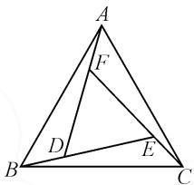
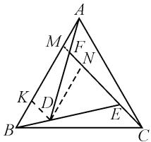
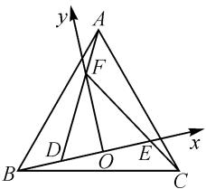
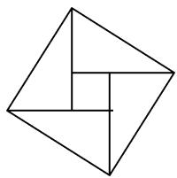
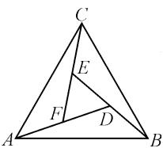
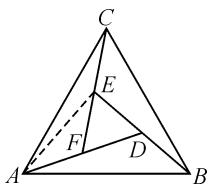
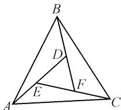

# 一道新颖的向量数量积试题求解

# 河南省郑州市第十八中学 张香莉

作为平面向量模块知识中最为重要的基本知识之一,平面向量数量积成为近年高考试卷中常见常新的基本考点之一.在实际求解平面向量数量积的综合问题时,借助平面向量“数”与“形”的双重属性,抓住数量积自身或“数”的应用,或“形”的特征,并结合不同的应用场景,选择相应的方法与解题策略来处理对应的问题,使得问题的解决更加合理、有效、可行、正确、快捷,达到“数”与“形”的紧密结合,以及知识与能力的有效融合.

# 1 问题呈现

问题 如图 1, $\triangle ABC$ 是边长为 2 的正三角形, 直线 AD, BE, CF 围成一个正三角形 DEF, 且 $\overrightarrow{DF} = 2 \overrightarrow{FA}$ , 则 $\overrightarrow{AB} \cdot \overrightarrow{EF} = (\quad)$

text_image

A
F
D
E
B
C

图1

$$
\mathrm{A.} - \frac {8}{1 3} \quad \mathrm{B.} \frac {8}{1 3} \quad \mathrm{C.} - \frac {1 2}{1 3} \quad \mathrm{D.} \frac {1 2}{1 3}
$$

此题以正三角形为问题场景,利用大正三角形内“套”小正三角形来构建平面几何图形,结合线段的比例关系来设置条件,进而确定对应平面向量的数量积.

在解题时,回归平面向量“数”与“形”的双重属性,从“数”的视角切入,基底法;从“形”的视角切入,几何法;从双重属性视角切入,坐标法主导.这些都是破解平面向量及其综合应用问题中最为常用的基本技巧与方法.

# 2 问题破解

解法 1: 基底法.

依题, 结合平面几何的基本性质易证 $\triangle ABD \cong \triangle CAF$ , 则有 AF = BD. 设 $\overrightarrow{FA} = a, \overrightarrow{BD} = b$ , 则 $\langle a, b \rangle = 60^{\circ}, a \cdot b = \frac{1}{2} a^{2}$ .

又 $\overrightarrow{AB} = -3\boldsymbol{a} - \boldsymbol{b},\overrightarrow{EF} = 2(\boldsymbol {a} - \boldsymbol {b})$ ，所以可得 $\overrightarrow{AB^2} = 9\boldsymbol{a}^2 +6\boldsymbol {a}\cdot \boldsymbol {b} + \boldsymbol{b}^2 = 13\boldsymbol{a}^2 = 4$ ，则 $a^2 = \frac{4}{13}.$

所以 $\overrightarrow{AB} \cdot \overrightarrow{EF} = -2(3a^{2} - 2a \cdot b - b^{2}) = -2a^{2} = -\frac{8}{13}.$

点评:合理选取平面向量的一组基底,借助平面向量的数量积公式及其应用来分析与求解,往往是解决此类问题的“通性通法”.选取基底时,关键在于确定对应基底向量的模以及基底间的夹角,合理通过平面向量的线性运算并结合数量积运算来分析与应用.在实际解题与应用过程中,平面向量中往往不同的基底组合的选取,对应不同的技巧方法.

解法 2: 几何法.

依题,结合平面几何的基本性质容易证得 $\triangle ABD\cong\triangle BCE\cong\triangle CAF$ .如图2所示,延长EF交AB于点M,作DN//AB交EF于点N,作DK//EF交AB于点K,则KM=2BK=2AM,AB=

text_image

A
M
F
N
K
D
B
E
C

图2

4AM，且 NF=2FM. 又 EN=2MN, CM=4MN，可得 $EF=\frac{8}{13}CM$ ，由 AB=2，故 $\overrightarrow{AB}\cdot\overrightarrow{EF}=\frac{8}{13}\overrightarrow{AB}\cdot\overrightarrow{CM}=\frac{8}{13}\overrightarrow{AB}\cdot\left(\overrightarrow{CA}+\frac{1}{4}\overrightarrow{AB}\right)=\frac{8}{13}\left(\overrightarrow{AB}\cdot\overrightarrow{CA}+\frac{1}{4}\overrightarrow{AB^{2}}\right)=\frac{8}{13}(-2+1)=-\frac{8}{13}.$

点评:合理借助平面几何图形的直观形象,结合平面几何中的图形直观与几何性质来综合与应用,也是解决此类问题的一种基本技巧方法.回归平面向量中“形”的结构特征,合理抓住平面几何图形的直观,应用平面几何的基本性质,综合平面向量及其数量积的应用来分析与突破.平面向量中几何法的应用,往往离不开平面几何图形的直观,以及平面几何中辅助线的构建与应用等.

解法 3: 坐标法.

依题, 设 AF=t, 可知 BD=t, DF=DE=2t.

在 $\triangle ABD$ 中，由余弦定理可得 $4=t^{2}+9t^{2}-2\times$

$t \times 3t \times \cos 120^{\circ} = 13t^{2}$ ，即 $t^{2} = \frac{4}{13}$ 。建立如图3所示的平面直角坐标系，则 $\overrightarrow{AB} = \overrightarrow{DB} - \overrightarrow{DA} = \overrightarrow{DB} - \frac{3}{2} \overrightarrow{DF} = (-t, 0) -$

text_image

y
A
F
D
B
O
E
x
C

图3

$\frac{3}{2} (t, \sqrt{3} t) = \left(-\frac{5}{2} t, -\frac{3\sqrt{3}}{2} t\right)$ . 又 $\overrightarrow{EF} = (-t, \sqrt{3} t)$ , 所以 $\overrightarrow{AB} \cdot \overrightarrow{EF} = \frac{5}{2} t^2 - \frac{9}{2} t^2 = -2t^2 = -\frac{8}{13}$ .

点评:合理借助平面向量“数”与“形”的双重属性,以“形”的几何特征,构建坐标系,引入坐标,通过“数”的运算来达到目的.坐标法的关键在于合理构建相应的平面直角坐标系,确定相应的坐标,为进一步的数学运算与逻辑推理创造条件.

# 3 变式拓展

# 3.1 一般拓展

变式 1 △ABC 是边长为 2 的正三角形, 直线 AD, BE, CF 围成一个正三角形 DEF, 且 $\overrightarrow{DF} = \lambda \overrightarrow{FA} (\lambda > 0)$ , 则 $\overrightarrow{AB} \cdot \overrightarrow{EF} =$ \_\_\_\_. (答案: $-\frac{4\lambda}{\lambda^{2} + 3\lambda + 3}$ .)

对原问题进行一般拓展,也是问题的变式与应用的一个基本升华过程,可以将原问题进行合理的改编与变式,实现问题的多样化与变式.

# 3.2 应用拓展

变式 2 大约在公元 222 年, 赵爽为《周髀算经》一书作序时介绍了“勾股圆方图”, 亦称“赵爽弦图”(如图 4). 某数学兴趣小组类比“赵爽弦图”构造出图 5: △ABC 为正三角形, AD, BE, CF 围成的 △DEF 也为正三角形. 若 D 为 BE 的中点, (1) △DEF 与 △ABC 的面积比为 \_\_\_\_; (2) 设 $\overrightarrow{AD} = \lambda \overrightarrow{AB} + \mu \overrightarrow{AC}$ , 则 $\lambda + \mu =$ \_\_\_\_ .

natural_image

Geometric diagram of a square divided into triangles and a quadrilateral (no text or symbols)

图4

  
图5

解析:(1)如图6所示,连接AE,由题意知 $\triangle ABD\cong\triangle BCE\cong\triangle CAF$ ,且D,E,F分别为BE,CF,AD的中点.所以 $S_{\triangle AEF}=S_{\triangle DEF}=\frac{1}{2}S_{\triangle AFC},S_{\triangle ABC}=S_{\triangle AFC}+$ $S_{\triangle ABD} + S_{\triangle BCE} + S_{\triangle DEF} = 7S_{\triangle DEF}$ ，则 $S_{\triangle DEF} : S_{\triangle ABC} = 1 : 7$ .

(2) 由于 $\overrightarrow{AD} = \overrightarrow{AB} + \overrightarrow{BD} = \overrightarrow{AB} + \frac{1}{2}\overrightarrow{BE} = \overrightarrow{AB} + \frac{1}{2} (\overrightarrow{BC} + \overrightarrow{CE}) = \overrightarrow{AB} + \frac{1}{2}\left(\overrightarrow{BC} + \frac{1}{2}\overrightarrow{CF}\right)$ , 又 $\overrightarrow{BC} = \overrightarrow{AC} -$

  
图6

$\overrightarrow{AB},\overrightarrow{CF}=\overrightarrow{AF}-\overrightarrow{AC}=\frac{1}{2}\overrightarrow{AD}-\overrightarrow{AC}$ ，化简可得 $\overrightarrow{AD}=$ $\frac{4}{7}\overrightarrow{AB}+\frac{2}{7}\overrightarrow{AC}$ ，所以 $\lambda+\mu=\frac{4}{7}+\frac{2}{7}=\frac{6}{7}$ .

变式 3 如图 7, $\triangle ABC$ 是由三个全等的钝角三角形和一个小的正三角形拼成的一个大的正三角形. 若 AD = 4, BD = 2, 那么 $\overrightarrow{BE} \cdot \overrightarrow{CD} =$ \_\_\_\_; M 为线段 CE 上的动点, 则 $\overrightarrow{MA} \cdot \overrightarrow{MC}$ 的最小值为 \_\_\_\_.

  
图 7

解析:依题可知, $\angle ADB=120^{\circ}$ ,且 $\triangle DEF$ 是为长为2的正三角形.

所以有 $\overrightarrow{BE}\cdot\overrightarrow{CD}=(\overrightarrow{DE}-\overrightarrow{DB})\cdot(\overrightarrow{FD}-\overrightarrow{FC})=(\overrightarrow{DE}-\overrightarrow{FD})\cdot(\overrightarrow{FD}-\overrightarrow{EF})=\overrightarrow{DE}\cdot\overrightarrow{FD}-\overrightarrow{DE}\cdot\overrightarrow{EF}-\overrightarrow{FD^{2}}+\overrightarrow{FD}\cdot\overrightarrow{EF}=2\times2\times\left(-\frac{1}{2}\right)-2\times2\times\left(-\frac{1}{2}\right)-2\times2+2\times2\times\left(-\frac{1}{2}\right)=-6.$

由余弦定理, 得 $AB^{2}=AD^{2}+BD^{2}-2AD\times BD\times\cos\angle ADB=28.$

在 $\triangle ABD$ 中，由余弦定理可得 $\cos \angle BAD = \frac{AB^2 + AD^2 - BD^2}{2AB\times AD} = \frac{5\sqrt{7}}{14}$ 则 $\cos \angle ACE = \cos \angle BAD = \frac{5\sqrt{7}}{14}$ . 设 $\overrightarrow{CM} = \lambda \overrightarrow{CE} (0\leqslant \lambda \leqslant 1)$ ，则可得 $\overrightarrow{MA}\cdot \overrightarrow{MC} = \lambda (\overrightarrow{MC} +\overrightarrow{CA})\cdot \overrightarrow{EC} = \lambda^2\overrightarrow{EC}^2 +\lambda \overrightarrow{CA}\cdot \overrightarrow{EC} = 16\lambda^2+$ $\lambda \times 2\sqrt{7}\times 4\times \left(-\frac{5\sqrt{7}}{14}\right) = 16\lambda^2 -20\lambda = 16\left(\lambda -\frac{5}{8}\right)^2-$ $\frac{25}{4}$ 即当 $\lambda = \frac{5}{8}$ 时， $\overrightarrow{MA}\cdot \overrightarrow{MC}$ 的最小值为 $-\frac{25}{4}$

# 4 教学启示

在实际解答平面向量数量积的求值与最值等综合问题时,借助代数思维或几何思维的应用,通过不同思维下的代数法与几何法的应用,合理构建成一幅完美和谐统一的“画卷”,成为新高考数学试卷命题中的一个创新点与热点.

解决此类问题时,往往借助平面向量“数”与“形”的双重属性,抓住数量积自身或“数”的属性,或“形”的几何特征,结合不同的应用场景,选择相应的方法与解题策略来处理对应的平面向量数量积问题.

“数”与“形”的不同视角,使得数量积综合问题的求解与应用更加合理、有效、可行、正确、快捷,或从“数”来代数运算,或从“形”来直观想象,也可以实现“数”与“形”的紧密结合,有效实现知识与能力的融合.Z