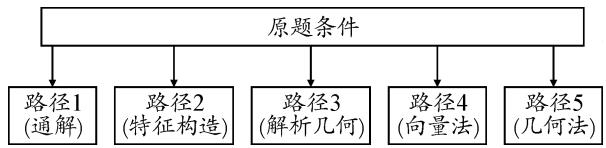
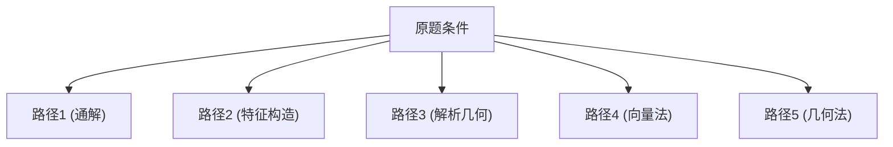
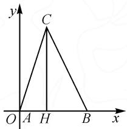

# 一道高考真题的多角度解析及教学启示

——以 2023 年新课标全国Ⅰ卷第 17 题为例

# ● 贵州省贵阳市第八中学 陈天野

解三角形问题是历年高考的基本考点之一,难度通常维持在中等档次,可能以选择题或解答题的形式出现.解决此类问题需要综合应用平面几何、三角函数、平面向量、基本不等式等相关知识,充分体现新课标中“在知识交汇点处命题”的指导思想.该类问题通常运算量大、公式应用多,考查考生的运算求解能力、化归与转化思想等.解决解三角形问题的关键在于善于审题,采用公式和策略优化过程,提升效益.解题时需注意细节和书写,展示解题思路和策略,注意时间分配和考试规则,以获得更好的解题效果.解三角形问题的重要性不言而喻,需要考生具备扎实的数学基础和良好的解题策略.

# 1 问题呈现

问题 （2023 年新高考全国Ⅰ卷第 17 题）已知在 $\triangle ABC$ 中， $A + B = 3C, 2\sin(A - C) = \sin B.$

(1) 求 $\sin A$ ;   
(2) 设 AB=5，求 AB 边上的高.

此题是历年高考中解三角形问题的常见形式，以同角三角函数基本关系式、解三角形的正弦定理为载体，考查数学运算技能。第(1)问首先根据题设得到角C，然后利用两角和差公式得到 $\sin A=3\cos A$ ，进而求得 $\sin A$ 。第(2)问根据第(1)问的结果，利用同角三角函数的基本关系求得 $\cos A$ ，进而得到 $\sin B$ ，再利用正弦定理求得AC，即可根据等面积法求得AB边上的高。

# 2 问题破解

# 2.1 第(1)问的解析

解法一: 最优解法.

由 $A + B = 3C, A + B + C = \pi$ ，得 $\pi - C = 3C$ ，即 $C = \frac{\pi}{4}$ . 又 $2\sin (A - C) = \sin B$ ，则 $2\sin \left(A - \frac{\pi}{4}\right) = \sin \left(\frac{3\pi}{4} - A\right)$ . 展开，得

$$
\sqrt {2} (\sin A - \cos A) = \frac {\sqrt {2}}{2} (\sin A + \cos A).
$$

化简得 $\sin A = 3\cos A$ ，又 $\sin^{2}A + \cos^{2}A = 1, A \in (0, \pi)$ ，解得 $\sin A = \frac{3}{\sqrt{10}} = \frac{3\sqrt{10}}{10}$ .

说明：“ $A \in (0, \pi)$ ”不交代角度的范围不扣分（2022年江苏高考在此方向是扣1分，还是要养成写角度范围的习惯）.

解法二:由 $2\sin(A-C)=\sin B=\sin(A+C)$ ，得 $2\sin A\cos C-2\cos A\sin C=\sin A\cos C+\cos A\sin C.$ 化简，得 $\sin A \cos C = 3 \cos A \sin C$ .

由 $A + B = 3C, A + B + C = \pi$ ，得 $C = \frac{\pi}{4}$ . 所以 $\sin A = 3\cos A$ ，又 $\sin^2 A + \cos^2 A = 1, A \in (0, \pi)$ ，解得 $\sin A = \frac{3}{\sqrt{10}} = \frac{3\sqrt{10}}{10}$ .

解法三:由 $A+B=3C, A+B+C=\pi$ , 得 $C=\frac{\pi}{4}$ .

由 $2\sin (A - C) = \sin B$ ，得

$$
2 (\sin A \cos C - \cos A \sin C) = \sin B.
$$

由正弦定理、余弦定理，得

$$
2 \left(a \cdot \frac {a ^ {2} + b ^ {2} - c ^ {2}}{2 a b} - c \cdot \frac {b ^ {2} + c ^ {2} - a ^ {2}}{2 b c}\right) = b.
$$

化简，得 $2a^{2} - 2c^{2} = b^{2}$

又 $c^{2}=a^{2}+b^{2}-2ab\cos C=a^{2}+b^{2}-\sqrt{2}ab$ ，结合上式解得 $b=\frac{2\sqrt{2}}{3}a, c=\frac{\sqrt{5}}{3}a$ .

所以 $\cos A=\frac{b^{2}+c^{2}-a^{2}}{2bc}=\frac{\sqrt{10}}{10}.$

又 $A \in (0, \pi)$ , 所以 $\sin A = \frac{3\sqrt{10}}{10}$ .

说明：“ $\cos A = \frac{b^2 + c^2 - a^2}{2bc} = \frac{\sqrt{10}}{10}$ ”直接用正弦定理也可.

解法四:由 $A+B=3C, A+B+C=\pi$ , 得 $C=\frac{\pi}{4}$ .

过点 A 作 $AH \perp BC$ 于点 H，设 AH = CH = x，则 $AC = \sqrt{2}x$ .

因为 $2\sin(A-C)=\sin B=2\sin\angle BAH$ ，所以 $2BH=AH=x$ ，则 $AB=\frac{\sqrt{5}}{2}x.$

在 $\triangle ABC$ 中，由正弦定理可知 $\frac{AB}{\sin C} = \frac{BC}{\sin A}$ ，即 $\frac{\frac{\sqrt{5}}{2}x}{\sin \frac{\pi}{4}} = \frac{\frac{x}{2} + x}{\sin A}$ ，解得 $\sin A = \frac{3\sqrt{10}}{10}$ .

# 2.2 第(2)问的解析

# 2.2.1 第(2)问解题路径

路径 1: 通解. 运用解三角形相关知识求解.

路径 2: 特征构造法. 抓住条件和所求的特征, 构造相应的图形作答.

路径 3: 解析几何法. 通过建系, 利用解析几何相关知识作答.

路径 4: 向量法. 通过建系, 借助向量知识作答.

路径 5: 几何法. 利用初中平面相关知识作答.

第(2)问解题路径如图1所示.

flowchart

图1

# 2.2.2 第(2)问按类详解

本题第(2)问已知 AB, 求 AB 边上的高, 通常有两类联想: 联想 1, 结合解三角形的五个路径, 利用面积公式求高; 联想 2, 结合解三角形的五个路径直接求高.

# (I)第一类:利用面积公式求高

(1)借助三角形面积公式 $S=\frac{1}{2}ah$ ，抓住条件中 A-C 的特征，巧妙地构造出 A-C 这个角，利用角平分线定理及勾股定理来求解，简化运算.  
(2)借助三角形面积公式 $S=\frac{1}{2}ab\sin C$ ，利用面积等积式来求解.

解法一: $S_{\triangle ABC} = \frac{1}{2} AB \cdot AC \cdot \sin A = \frac{\sqrt{2}}{4} \cdot$

$$
4 R ^ {2} \sin A \sin B = \frac {\sqrt {2}}{4} \left(\frac {A B}{\sin C}\right) ^ {2} \cdot \sin A \cdot \sin \left(\frac {3}{4} \pi - A\right).
$$

因为 AB=5, $\sin A=\frac{3\sqrt{10}}{10}$ , $C=\frac{\pi}{4}$ , 所以 $S_{\triangle ABC}=15$ .

所以 AB 边上的高为 6.

解法二:由正弦定理及 AB=5, 得

$$
B C = \frac {A B \sin A}{\sin C} = 3 \sqrt {5}.
$$

由余弦定理, 得 $\cos C = \frac{AC^{2} + BC^{2} - AB^{2}}{2 \cdot AC \cdot BC} = \frac{\sqrt{2}}{2}$ .

整理, 得 $AC^{2}-3\sqrt{10}AC+20=0$ .

解得 $AC=2\sqrt{10}$ 或 $\sqrt{10}$ .

由 $\cos A > 0$ 舍去 $AC = \sqrt{10}$ ，则 $AC = 2\sqrt{10}$ .

由 $S_{\triangle ABC}=\frac{1}{2}AC\cdot BC\cdot\sin C=\frac{1}{2}AB\cdot h$ ，解得 h=6 ，所以 AB 边上的高为 6 .

解法三: 过点 C 作 AB 的垂线交 AB 于点 H, 设 h = CH, 由 $\tan A = \frac{h}{AH} = 3$ , 得 $AH = \frac{1}{3}h$ , 所以 AC = $\frac{\sqrt{10}}{3}h$ . 于是 $BH = 5 - \frac{1}{3}h$ , $BC = \sqrt{h^{2} + \left(5 - \frac{1}{3}h\right)^{2}}$ .

由 $S_{\triangle ABC}=\frac{1}{2}AB\cdot h=\frac{1}{2}AC\cdot BC\cdot \sin C$ ，可得 $h^{2}-3h-18=0$ ，解得 h=6（舍负值）.

# (Ⅱ)第二类:直接求高

(1)图形问题可以通过建系,将求 AB 边上的高 h 转化为关键点 C 的坐标,鼓励用 $\overrightarrow{AC}, \overrightarrow{BC}$ 数量积关系式求出点 C 的坐标.  
(2)由于边 AB 被高 h 分成两个直角三角形的边,故可用 h 表示出线段 AH,BH,用方程思想求解.  
(3)由三角形的一边和其所对的角能确定三角形外接圆的半径,所以联想到构造辅助圆求解.  
(4)由于 $\angle C = \frac{\pi}{4}$ 被分成两个角的和，因此联想到利用两角和的正切公式建立关系式求解.

解法四:(最优解)由(1)知 $\cos A=\frac{\sqrt{10}}{10}$ , $\sin B=\sin(A+C)=\sin A\cos C+\cos A\sin C=\frac{3\sqrt{10}}{10}\times\frac{\sqrt{2}}{2}+\frac{\sqrt{10}}{10}\times\frac{\sqrt{2}}{2}=\frac{2\sqrt{5}}{5}$ .

又 AB=5，由正弦定理得 $AC=\frac{AB\sin B}{\sin C}=2\sqrt{10}$ .

所以 AB 边上的高为 $AC \cdot \sin A = 6$ .

解法五:AB=5,由(1)知 $\sin A=\frac{3\sqrt{10}}{10}$ ，由正弦定理得 $\frac{BC}{\sin A}=\frac{AB}{\sin C}$ ，则 $BC=\frac{AB\sin A}{\sin C}=3\sqrt{5}$ .

又 $\sin B = 2\sin (A - C) = \frac{2\sqrt{5}}{5}$ , 所以 $AB$ 边上的高为 $BC \cdot \sin B = 6$ .

解法六:由(1)可知 $\tan A=3, C=\frac{\pi}{4}$ ，则

$$
\tan B = \tan (3 C - A) = \tan \left(\frac {3}{4} \pi - A\right) = 2.
$$

过点 C 作 AB 的垂线交 AB 于点 H，设 h = CH，则 $\tan A = \frac{h}{AH}$ ， $\tan B = \frac{h}{BH}$ ，所以 $AH = \frac{h}{3}$ ， $BH = \frac{h}{2}$ .

所以 $AB = AH + BH = \frac{h}{3} + \frac{h}{2} = 5$ ，解得 h = 6。

解法七: 过点 C 作 AB 的垂线交 AB 于点 H, 设 h = CH, 则 $\tan A = \frac{h}{AH} = 3$ , 所以 $AH = \frac{1}{3} h$ , 于是 $\tan \angle ACH = \frac{1}{3}$ .

又 $\tan \angle BCH = \tan \left(\frac{\pi}{4} -\angle ACH\right) = \frac{1}{2}$ ，所以 $BH = \frac{1}{2} h.$

所以 $AB = AH + BH = \frac{h}{3} + \frac{h}{2} = 5$ ，解得 h = 6。

解法八: 过点 C 作 AB 的垂线交 AB 于点 H, 设 AH = x, 则 BH = 5 - x, CH = 3x.

于是 $AC = \sqrt{10}x, BC = \sqrt{(5 - x)^{2} + 9x^{2}}.$

由余弦定理，得 $\cos C=\frac{AC^{2}+BC^{2}-AB^{2}}{2AC\cdot BC}=\frac{\sqrt{2}}{2}$ ，代入整理得 $x^{2}-x-2=0$ .

解得 x=2（舍负值），所以 CH=3x=6。

解法九: 过点 B 作 AC 的垂线交 AC 于点 H, 则在 $\triangle ABH$ 中, $\sin A = \frac{3\sqrt{10}}{10}$ , AB = 5, 所以 BH = $AB \cdot \sin A = \frac{3\sqrt{10}}{2}$ , $AH = \frac{\sqrt{10}}{2}$ .

在 $\triangle BCH$ 中， $\angle C = \frac{\pi}{4}$ ，则 $CH = BH = \frac{3\sqrt{10}}{2}$ ，所以 $AC = AH + CH = 2\sqrt{10}$ .

所以 AB 边上的高为 $AC \cdot \sin A = 6$ .

解法十: 设 AB 边上的高为 h, 则由 $h = AC \cdot \sin A$ 及 $\frac{AB}{\sin C} = \frac{AC}{\sin B}$ , 得 $h = \frac{\sin B \sin A}{\sin C} AB = 6$ .

所以 AB 边上的高 h=6.

解法十一:如图2,以A为原点,AB方向为x轴的正方向,建立如图所示的平面直角坐标系,则 $A(0,0)$ , $B(5,0)$ .

由第(1)问可得, $\tan A=3$ ,设

text_image

y
C
O A H B x

图2

$$
A H = x, \text {则} C (x, 3 x).
$$

所以 $\overrightarrow{AC}=(x,3x),\overrightarrow{BC}=(x-5,3x)$ .

根据 $\overrightarrow{AC} \cdot \overrightarrow{BC} = |\overrightarrow{AC}| |\overrightarrow{BC}| \cos \frac{\pi}{4}$ , 通过代入坐标, 可得到方程 $x(x - 5) + 3x^{2} = \sqrt{x^{2} + (3x)^{2}} \times \sqrt{(x - 5)^{2} + (3x)^{2}} \times \frac{\sqrt{2}}{2}$ . 解得 $x = 2$ , 所以 $CH = 6$ .

故 AB 边上的高为 6.

# 3 试题溯源

命题者结合人教 A 版必修第一册第 229 页第 9 题 “已知 $\sin(\alpha+\beta)=\frac{1}{2}$ , $\sin(\alpha-\beta)=\frac{1}{3}$ , 求证: (1) $\sin \alpha \cos \beta = 5 \cos \alpha \sin \beta$ ; (2) $\tan \alpha = 5 \tan \beta$ ”, 将 $\alpha - \beta$ 换成 A-C, $\alpha + \beta$ 换成 $\pi - (A+B)$ , 又增加 $A + B = 3C$ , 从而得出第 (1) 题; 又结合人教 A 版必修第二册第 48 页第 3 题 “在 $\triangle ABC$ 中, 已知 $\cos A = \frac{4}{5}$ , $B = \frac{\pi}{3}$ , $b = \sqrt{3}$ , 求 a, c”将问题改成求 AB 边上的高, 从而得第 (2) 小题.

# 4 解后反思

针对解三角形中的交汇与综合问题,我们需要根据题目条件,有效发现三角形中的边、角等要素之间的内在联系,并结合解三角形中的相关知识(正弦定理、余弦定理、三角形面积公式等)进行有效转化.

具体而言,可以通过以下步骤解决此类问题:

(1) 确定题目条件, 明确问题所涉及到的三角形要素及它们之间的关系.  
(2)结合解三角形中的相关知识,如正弦定理、余弦定理、三角形面积公式等,进行有效转化,找到问题的关键点.  
(3)借助三角形的性质、三角函数、基本不等式等相关知识,进行合理分析与应用.  
(4)在分析与应用过程中,需要注意把握数学知识点之间的联系,避免重复计算,提高解题效率.  
(5)总结问题解决过程中涉及到的知识点,进行反思和总结,找出不足之处,进一步提高数学解题能力和应用能力.

解决此类问题,需要我们充分运用数学知识点间的有效联系和转化,注重思维能力的培养,从而达到全面提升数学解题能力和数学应用能力的目的. Z