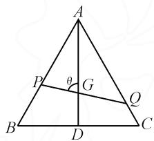
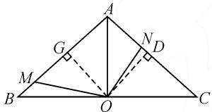
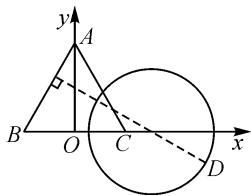

# 专题突破:探究解三角形中最值问题的四种方法

# 福建省漳州市第三中学 林颜

在高考中,最值问题通常作为中高难度题目出现,是考查学生数学素养和综合能力的重要内容.解决该类问题常见的四类方法包括:构造函数法、基本不等式法、辅助角公式法、数形结合法.

# 1 构造函数法

例 1 在边长为 $2\sqrt{3}$ 的等边三角形 ABC 中, G 是中心, 直线 l 经过点 G 且与 AB, AC 两边分别交于 P, Q 两点, 则 $\frac{1}{GP} + \frac{1}{GQ}$ 的最大值为 \_\_\_\_.

分析: 设 $\angle AGP = \theta$ ，分别在 $\triangle APG, \triangle AQG$ 中根据正弦定理，用 $\theta$ 表示出 PG, GQ，再利用正余弦的和角公式，将 $\frac{1}{GP} + \frac{1}{GQ}$ 表示为 $\theta$ 的函数，求该函数的最值即可.

解析: 设 BC 的中点为 D, $\angle AGP = \theta, \theta \in \left[\frac{\pi}{3}, \frac{2\pi}{3}\right]$ , 如图 1 所示. 因为 G 是重心, 所以 $AG = \frac{2}{3} \cdot AD = \frac{2}{3} \times \frac{\sqrt{3}}{2} \cdot AC = 2$ . 在$\triangle AGP$ 中，由正弦定理得 $\frac{GP}{\sin\angle PAG} = \frac{AG}{\sin\angle APG}$ ，所以 $GP = \frac{1}{\sin\left(\frac{\pi}{6} + \theta\right)}$ 。同理，在 $\triangle AGQ$ 中， $GQ = \frac{1}{\sin\left(\theta - \frac{\pi}{6}\right)}$ 。所以可得 $\frac{1}{GP} + \frac{1}{GQ} = \sin\left(\frac{\pi}{6} + \theta\right) +$

text_image

A
P
θ
G
Q
B
D
C

图1

$\sin\left(\theta-\frac{\pi}{6}\right)=2\sin\theta\cdot\cos\frac{\pi}{6}=\sqrt{3}\sin\theta,\theta\in\left[\frac{\pi}{3},\frac{2\pi}{3}\right].$ 所以 $\theta=\frac{\pi}{2}$ 时， $\left(\frac{1}{GP}+\frac{1}{GQ}\right)_{\max}=\sqrt{3}\sin\frac{\pi}{2}=\sqrt{3}.$ 故填： $\sqrt{3}.$

适用情形:已知三角形的边和角,通过构造辅助函数并利用边角关系(如正弦定理和余弦定理)求解最值问题.例如,在已知两边及夹角的情况下,可以构造函数以求解三角形的面积或第三边的最值.此外,涉及三角形面积、三角形高或中线的最值问题,可以通过构造相应的表达式并利用导数求极值;同时,也可以针对三角形周长或内切圆、外接圆半径等构造函数,结合边长关系来寻找最值;对于相似或全等三角形的最值问题,可以通过构造相关函数和利用比例关系来求解.

解题思路:首先是明确已知条件和要解的最值问题,通常包括边长、角度或面积,而最值问题可能涉及最大周长、最大面积或最大内切圆半径等.接下来,根据已知条件选择适当的变量进行构造,这些变量可以是边长、角度或其他几何量.然后,用所选变量表示需要求解的几何量,构建目标函数,并依据三角形的性质和已知条件写出约束条件.最后,应用数学方法求解目标函数的最大或最小值,具体步骤可能涉及求导数、解方程和验证极值等.

# 2 基本不等式法

例 2 在 $\triangle ABC$ 中，角 A, B, C 的对边分别为 a, b, c，且 $2c\cos B = 2a + b$ ，若 $\triangle ABC$ 的面积为 $S = \sqrt{3}c$ ，则 ab 的最小值为（）.

A.28

B.36

C.48

D.56

解析:由题设条件及余弦定理得 $2c \cdot \frac{a^{2} + c^{2} - b^{2}}{2ac} = \frac{a^{2} + c^{2} - b^{2}}{a} = 2a + b$ ，即 $a^{2} + b^{2} - c^{2} = -ab$ ，则 $\cos C = \frac{a^{2} + b^{2} - c^{2}}{2ab} = -\frac{1}{2}$ ，于是可得 $C = \frac{2\pi}{3}$ 。又因为 $S = \sqrt{3}c = \frac{1}{2}ab \sin \frac{2\pi}{3} = \frac{\sqrt{3}}{4}ab$ ，所以 $c = \frac{ab}{4}$ 。由 $c^{2} = a^{2} + b^{2} - 2ab \cos \frac{2\pi}{3} = a^{2} + b^{2} + ab \geqslant 3ab$ ，当且仅当 a = b 时等号成立，得 $\frac{a^{2}b^{2}}{16} \geqslant 3ab$ ，解得 $ab \geqslant 48$ 。故选：C。

适用情形:对于面积最大或最小的问题,当需要求解三角形面积的最值时,利用基本不等式法能够有效简化问题.在处理三角形周长问题时,基本不等式法也非常有用,特别是在已知特定边长并需求第三边的最大值或最小值时,可以通过三角不等式约束三边关系.此外,对于优化三角形形状或角度的问题,以及涉及等腰或等边三角形的特例,都能通过基本不等式法有效解决,从而迅速找到最优解.

解题思路: 首先明确已知条件和要解的最值问题, 这些条件可能包括边长、角度和面积, 而最值问题可能涉及最大周长、最大面积或最大内切圆半径等. 接着,根据具体条件选择合适的基本不等式,并引入适当的变量将问题转化为不等式问题.然后,将选定的不等式应用于引入的变量,以获得不等式关系,进而确定目标函数的上下界.最后,验证不等式的条件和结果,确定等号成立的情况,以找到对应的最值.

# 3 辅助角公式法

例 3 已知等腰三角形 ABC 的面积为 2，其中 $AB \perp AC$ ，点 O, M, N 分别在线段 BC, AB, AC 上， $AO \perp BC$ 且 $\angle MON = \frac{2\pi}{3}$ ，当点 M, N 在对应线段上运动时（含端点位置）， $\frac{1}{|OM|^{2}} + \frac{1}{|ON|^{2}}$ 的最大值为 \_\_\_\_.

分析: 过点 O 分别作 AC, AB 的垂线, 垂足分别为 D, G, 在 $\triangle OND$ 与 $\triangle OMG$ 中, 通过正(余)弦定理表示出 $\frac{1}{OM^{2}}$ , $\frac{1}{ON^{2}}$ , 再求最值即可.

解析:依题,AB=2,设 $\angle OMA=\alpha\left(\frac{\pi}{4}\leqslant\alpha\leqslant\frac{7\pi}{12}\right)$ ,则 $\angle ONA = \frac{5\pi}{6} -\alpha .$ 如图2，过点 $O$ 分别作 $AC,AB$ 的垂线，垂足分别为 $D,G$ ，则 $OD = OG = 1.$ 在 $\triangle OND$ 与 $\triangle OMG$ 中，易得 $\frac{1}{OM^2} =$

text_image

A
G
N
D
M
B
O
C

图2

$\sin^2\alpha, \frac{1}{ON^2} = \sin^2\left(\frac{5\pi}{6} - \alpha\right) = \sin^2\left(\frac{\pi}{6} + \alpha\right)$ ，则 $\frac{1}{|OM|^2} + \frac{1}{|ON|^2} = \frac{\sqrt{3}}{2}\sin\left(2\alpha - \frac{\pi}{3}\right) + 1$ ，当 $2\alpha - \frac{\pi}{3} = \frac{\pi}{2}$ ，即 $\alpha = \frac{5\pi}{12}$ 时， $\frac{1}{|OM|^2} + \frac{1}{|ON|^2}$ 取得最大值 $\frac{\sqrt{3}}{2} + 1$ 。故填： $\frac{\sqrt{3}}{2} + 1$ 。

适用情形:在处理涉及多个三角函数项的表达式时,如 $\sin\theta$ 与 $\cos\theta$ 的线性组合,使用辅助角公式可以将这些组合转化为单一的三角函数形式,从而简化问题并便于求解最大或最小值.此外,在三角形解题中,涉及角度的正弦和余弦值与边长的关系时,辅助角公式同样能够简化复杂的三角函数关系,帮助更好地理解和解决问题.对于某些具有对称性的三角函数,辅助角公式可以利用其对称性,将问题转化为标准形式,使得最大值或最小值的分析更为直观.

解题思路:首先,明确题目中涉及的三角函数表达式,识别出如 $\sin\theta$ 和 $\cos\theta$ 的组合项.接着,通过引入一个新的角度变量,将这些三角函数的组合转化为单一的三角函数形式,选取合适的辅助角是关键.然后,利用引入的辅助角简化原表达式,运用三角函数的基本性质和恒等式.最后,在简化表达式的基础上,分析其取值范围,找出该三角函数表达式的最大值或最小值,因为三角函数在其定义域内的取值范围通常是已知的.

# 4 数形结合法

例 4 已知边长为 2 的等边三角形 ABC, D 是平面 ABC 内一点, 且满足 DB:DC=2:1, 则三角形 ABD 面积的最大值是().

$$
\mathrm{A.} \frac {2 \sqrt {3}}{3} + \frac {4}{3}
$$

B. $\sqrt{3}$

$$
\mathrm{C.} \frac {4 \sqrt {3}}{3} + \frac {4}{3}
$$

D. $\frac{4\sqrt{3}}{3}$

解析: 以 BC 的中点 O 为原点, 建立如图 3 所示的平面直角坐标系, 则 $A(0, \sqrt{3})$ , $B(-1, 0)$ , $C(1, 0)$ . 设点 $D(x, y)$ , 由 DB : DC = 2 : 1, 可得 $(x + 1)^{2} + y^{2} = 4(x - 1)^{2} +$

text_image

y
A
B
O
C
x
D

图3

$4y^{2}$ ，即 $\left(x-\frac{5}{3}\right)^{2}+y^{2}=\frac{16}{9}$ ，所以点D的轨迹为以 $\left(\frac{5}{3},0\right)$ 为圆心，以 $\frac{4}{3}$ 为半径的圆。当点D到直线AB的距离最大时， $\triangle ABD$ 的面积最大。易得直线AB的方程为 $\sqrt{3}x-y+\sqrt{3}=0,\left|AB\right|=2$ ，设圆心 $\left(\frac{5}{3},0\right)$ 到直线AB的距离为d，则点D到直线AB的最大距离为 $d+r=\frac{\left|\frac{5\sqrt{3}}{3}+\sqrt{3}\right|}{2}+\frac{4}{3}=\frac{4\sqrt{3}}{3}+\frac{4}{3}$ ，所以 $\triangle ABD$ 面积的最大值为 $\frac{4\sqrt{3}}{3}+\frac{4}{3}$ 。故选：C.

适用情形: 在解决直角三角形的某条边或角的最值问题时, 可以运用数形结合法, 通过直角三角形的几何特性来分析和求解. 此外, 在研究斜边与对应高的关系时, 绘制高线并分析其与底边和斜边的关系同样适用. 针对三角形的面积和周长的最值问题, 利用数形结合法可以通过分析三角形边长和角度的变化来提供解决方案. 在探讨三角形的内接圆和外接圆半径的最值时, 该方法也能通过绘图与分析几何关系进行求解.

解题思路:首先,根据已知条件绘制三角形或相关几何图形,以便直观理解问题并发现可能的对称性或特殊结构.接着,引入适当的变量表示几何图形中的相关量,并建立它们之间的关系方程,如边长、角度、面积和周长等.最后,结合几何性质与代数方法(如函数和方程),通过直观分析找到满足条件的解,从而实现问题的求解.Z