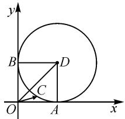
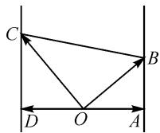
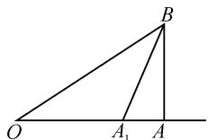
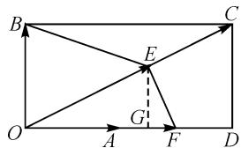

# 例析数形结合直观突破向量模长最值问题

# 江苏省包场高级中学 杨益锋

摘要: 数形结合思想非常契合于解决平面向量这一同时兼备“数”与“形”的数学问题. 通过平面向量的模长最值(或取值范围等)问题的不同类型, 结合实例剖析, 就数形结合思想的应用加以分析, 总结解题规律与技巧策略, 帮助考生进行复习备考.

关键词: 数形结合; 平面向量; 模; 最值

数形结合思想是实现数学对象中“数”与“形”两者巧妙结合与转化的一种基本数学思想方法，而平面向量自身同时兼备“数”与“形”的基本属性，因而数形结合思想在平面向量问题中的应用显得非常自然。数形结合思想成为解决平面向量问题中一种非常巧妙的思维方式。

# 1 单一向量的模长最值问题

例 1 已知单位向量 a, b 满足 $a \cdot b = 0$ ，若平面向量 c 满足 $|c - a - b| = 1$ ，则 $|c|$ 的取值范围是 \_\_\_\_.

分析:根据题设条件,在平面直角坐标系中以向量的数量积为0以及单位向量构建几何模型,通过题设中数据信息的转化与应用,进而确定动点C的轨迹,利用圆的几何性质与图形的直观,数形结合确定向量的模长的取值范围问题.

解析: 如图 1 所示, 在平面直角坐标系 xOy 中, 设向量 $a = \overrightarrow{OA}$ , $b = \overrightarrow{OB}$ , $c = \overrightarrow{OC}$ , $\overrightarrow{OA} + \overrightarrow{OB} = \overrightarrow{OD}$ .

text_image

y
B
D
C
O
A
x

由 $a \cdot b = 0$ ，可知 $\overrightarrow{OA} \perp \overrightarrow{OB}$ .

图1

而由 $|c - a - b| = 1$ ，可得

$|c-a-b|=|c-(a+b)|=|\overrightarrow{OC}-\overrightarrow{OD}|=|\overrightarrow{DC}|=1,$ 则知动点 C 的轨迹是以点 D 为圆心，1 为半径的圆.

又 $|OD|=\sqrt{2}$ ，结合圆的几何性质与图形的直观，可得 $|c|\in[\sqrt{2}-1,\sqrt{2}+1]$ .

故填答案: $\left[\sqrt{2}-1,\sqrt{2}+1\right]$ .

点评:借助题设中的平面向量的概念、线性运算、数量积以及模长等信息,合理构建几何模型,在几何直观下确定动点的轨迹,为进一步数形结合确定向量的模长最值(或取值范围等)问题提供条件.数形结合可以有效挖掘题中平面向量的代数与几何等方面的信息内涵,为问题的直观处理奠定基础.

# 2 多个向量线性关系的模长最值问题

例 2 [福建省泉州市 2023 届高中毕业班质量监测(三)数学试卷]已知平面向量 a, b, c 满足 $\left|a\right|=1$ , $b \cdot c=0$ , $a \cdot b=1$ , $a \cdot c=-1$ , 则 $\left|b+c\right|$ 的最小值为().

A.1

B. $\sqrt{2}$

C.2

D.4

分析:根据题设条件,从平面向量的模以及数量积等信息,结合平面向量的“形”的几何特征,通过平面向量的几何内涵或对应的几何意义,从“形”的视角切入,结合向量的线性运算,通过图形直观,数形结合来确定线段长度的最值,即两个向量的和运算的模长最值问题.

解析: 如图 2 所示, 设向量 $a = \overrightarrow{OA}$ , $b = \overrightarrow{OB}$ , $c = \overrightarrow{OC}$ , $\overrightarrow{OD} = -\overrightarrow{OA}$ .

因为 $a \cdot b = 1, a \cdot c = -1, b \cdot c = 0$ ，结合平面向量数量积的几何意义，可得 $AB \perp OA, DC \perp DO, OB \perp OC$ .

  
图2

易得 $|\pmb {b} + \pmb{c}| = |\pmb {b} - \pmb{c}| =$ $|\overrightarrow{OB} -\overrightarrow{OC}| = |\overrightarrow{CB} |.$

结合图形直观, 可知 $\left|\overrightarrow{CB}\right|$ 为夹在两平行直线 AB 与 CD 间的线段长.

所以当 $BC \perp AB$ 时， $|\overrightarrow{CB}|$ 取到最小值 2，则 $|b + c|$ 的最小值为 2.

故选择答案:C.

点评:从平面向量的几何特征入手,通过数形结合加以直观想象,从平面几何特征层面来研究与平面向量模长最值的相关问题.这里结合平面向量的数量积的几何意义,从射影、垂直等几何视角来直观处理,利用几何图形直观,结合“动”态变化规律来解决“静”态的最值问题.

# 3 多个向量模长的线性关系最值问题

例 3 （2022 届浙江省重点中学高三模拟数学试卷）已知向量 a, b 满足 $\left|b\right|=3\sqrt{2}$ ，且对任意 $t \in R$ ，恒有 $\left|b-ta\right| \geqslant \left|b-a\right|$ ，则 $\left|a-b\right| + \left|a\right|$ 的最大值是 \_\_\_\_.

分析:根据题设条件,通过平面几何图形加以数形结合,利用条件中 $t \in R$ 确定 a 与 $(a - b)$ 的位置关系为 $(a - b) \perp a$ ,通过勾股定理的转化,结合关系式的特征进行三角换元处理,将所求的平面向量的模的和转化为三角函数关系式,结合辅助角的应用,利用三角函数的图象与性质来确定最值问题.

解析:如图3所示,设 $\overrightarrow{OA}=a$ , $\overrightarrow{OB}=b$ , $\overrightarrow{OA_{1}}=ta$ , 则有 $|b-ta|=|A_{1}B|$ , $|b-a|=|AB|$ .

根据题意,对任意 $t \in R$ , 恒有 $|b - ta| \geqslant |b - a|$ , 可得 $|A_{1}B| \geqslant |AB|$ .

  
图3

由于 $t \in R$ ，则知点 $A_{1}$ 的轨迹是直线 OA，数形结合可知 $AB \perp OA$ .

由于 $|\pmb{b}| = |OB| = 3\sqrt{2}$ ，则有 $|AB|^2 + |OA|^2 = |OB|^2 = 18$ 。

三角换元，令 $|AB|=3\sqrt{2}\cos\theta,|OA|=3\sqrt{2}\sin\theta,$ $\theta\in\left[0,\frac{\pi}{2}\right].$

于是 $|a-b|+|a|=|AB|+|OA|=3\sqrt{2}\cos\theta+3\sqrt{2}\sin\theta=6\sin\left(\theta+\frac{\pi}{4}\right)$ .

所以当 $\sin\left(\theta+\frac{\pi}{4}\right)=1$ ，即 $\theta=\frac{\pi}{4}$ ，亦即 $|a|=3$ ，向量 a, b 的夹角为 $\frac{\pi}{4}$ 时， $|a-b|+|a|=6$ .

所以 $\left|a-b\right|+\left|a\right|$ 的最大值是 6. 故填答案: 6.

点评:此题是一道平面向量的综合问题,借助有关平面向量的模恒成立的不等式来巧妙创新设置,从平面几何视角隐蔽创设平面向量之间的位置关系,为进一步的分析与破解提供条件.借助平面向量的“形”的几何特征,数形结合,直观形象来分析与确定,从而破解起来更加直观.

# 4 创新定义下的模长最值问题

例 4 [2022 届浙江省杭州市高三年级下学期 4 月教学质量检测(杭州二模)数学试卷] 对于二元函数 $f(x,y), \min_{x} \left\{\max_{y} \{f(x,y)\}\right\}$ 表示 $f(x,y)$ 先关于 y 求最大值，再关于 x 求最小值. 已知平面内非零向量a, b, c，满足 $a \perp b, \frac{a \cdot c}{|a|} = 2 \frac{b \cdot c}{|b|}$ ，记 $f(m, n) = \frac{|mc - b|}{|mc - na|}$ （其中 $m, n \in R$ ，且 $m \neq 0, n \neq 0$ ），则 $\min_{m} \{\max_{n} \{f(m, n)\}\} =$ \_\_\_\_ .

分析:根据题设条件,抓住平面向量关系式的结构特征,利用投影的几何意义以及平面几何图形的直观性,借助创新定义的内涵,结合动点的变化情况,合理转化创新函数所对应的平面向量的线性关系的模长的比值,进而将问题转化为确定距离比的最值问题,数形结合,直观想象,进而确定对应的最值问题.

解析：记 $a = \overrightarrow{OA}$ , $b = \overrightarrow{OB}$ , $c = \overrightarrow{OC}$ ，其中 $\angle AOB = \frac{\pi}{2}$ , $\overrightarrow{OE} = mc$ , $\overrightarrow{OF} = na$ ，如图4所示，

text_image

B
C
E
G
O
A
F
D

图4

结合 $\frac{a\cdot c}{|a|}=2\frac{b\cdot c}{|b|}$ ，借助投影的几何意义可知 $\overrightarrow{OC}$ 在 $\overrightarrow{OA}$ 上的投影恰为 $\overrightarrow{OC}$ 在 $\overrightarrow{OB}$ 上的投影的两倍，即 $|OD|=2|CD|$ .

所以 $f(m,n)=\frac{|mc-b|}{|mc-na|}=\frac{|\overrightarrow{BE}|}{|\overrightarrow{FE}|}$ .

先让 m 不变, n 变化, 即点 E 固定, 点 F 变化, 那么 $f(m, n) = \frac{|mc - b|}{|mc - na|} = \frac{|\overrightarrow{BE}|}{|\overrightarrow{FE}|} \leqslant \frac{|\overrightarrow{BE}|}{|\overrightarrow{GE}|}$ , 其中 $EG \perp OA$ 于 G;

接着再让 m 变化, 即点 E 变化, 求 $\frac{|\overrightarrow{BE}|}{|\overrightarrow{GE}|}$ 的最小值, 则有 $\left(\frac{|\overrightarrow{BE}|}{|\overrightarrow{GE}|}\right)_{\min} = \frac{|BC|}{|CD|} = \frac{|OD|}{|CD|} = 2$ . (可利用坐标法, 设出点 E 的坐标, 求出相关表达式, 进而求出最小值, 此略.)

所以 $\min\{\max\{f(m,n)\}\}=2.$ 故填答案:2.

点评:此题是以平面向量为背景,结合平面向量的位置关系、模、数量积以及投影等相关知识,交汇函数的最值问题,借助创新定义来巧妙设置,探讨多元函数的最值问题.抓住创新定义的实质,数形结合建立平面几何模型,图形直观分析,更加具体,更加直接,易懂易操作.

基于此,借助数形结合思想来处理平面向量中的一些相关问题,特别是解决与平面向量的模长范围(或最值)问题,成为培养数学直观想象素养的一种重要场所.依托平面向量中“数”与“形”的有机结合与巧妙转化,给问题的解决开拓一个更加巧妙的视角,对问题的解决、能力的提升以及素养的培养等都是十分有益的.Z