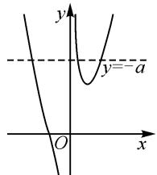
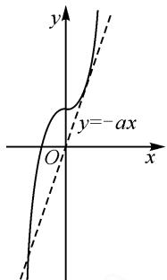
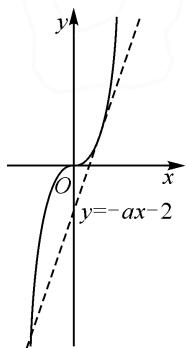

# 函数与方程视角,推理与直观结合\*

# 甘肃省武威市古浪县第五中学 杨文福

涉及高次函数的零点及其综合应用问题,是高考数学试卷中比较常见的一类常见题型.此类综合应用问题,设问新颖创新,形式变化多端,可以合理融入函数与方程思想、函数与导数应用等,交汇函数模块、导数模块中的基础知识,考查考生的逻辑推理、直观想象、数学运算等数学核心素养,具有较好的选拔性与区分度.本文中结合2023年高考数学全国乙卷文科第8题的多角度破解,合理发散学生思维,总结常规方法,提升学生解决问题的能力.

# 1 真题呈现

高考真题 函数 $f(x)=x^{3}+ax+2$ 存在 3 个零点，则 a 的取值范围是（）.

$$
\mathrm{A.} (- \infty , - 2)
$$

$$
\mathrm{B.} (- \infty , - 3)
$$

$$
\mathrm{C.} (- 4, - 1)
$$

$$
\mathrm{D.} (- 3, 0)
$$

此题以含参的三次函数为问题背景,结合函数存在的零点个数加以创设,进而确定参数的取值范围问题.

该题问题简捷明了,具体破解时,可以从函数思维视角切入,以“数”应用,结合求导处理,利用函数的单调性来分析与处理;也可以从方程思维视角切入,结合方程的变形,转化为直线与曲线的图象问题,以“形”直观,利用图象交点来直观分析与处理.

# 2 真题破解

# 2.1 函数思维

解法 1: 整体思维法.

由函数 $f(x)=x^{3}+ax+2$ ，求导可得 $f'(x)=3x^{2}+a$ .

当 $a \geqslant 0$ 时， $f'(x) \geqslant 0$ ，函数 $f(x)$ 在定义域 R 上单调递增，故不存在 3 个零点，不符合题意，舍去.

当 $a < 0$ 时，由 $f'(x) = 0$ ，解得 $x = \pm \sqrt{-\frac{a}{3}}$

当 $x \in \left(-\infty, -\sqrt{-\frac{a}{3}}\right)$ 时， $f'(x) > 0$ ，函数 $f(x)$

单调递增；当 $x \in \left(-\sqrt{-\frac{a}{3}}, \sqrt{-\frac{a}{3}}\right)$ 时， $f'(x) < 0$ ，函数 $f(x)$ 单调递减；当 $x \in \left(\sqrt{-\frac{a}{3}}, +\infty\right)$ 时，

$f'(x)>0$ , 函数 $f(x)$ 单调递增.

所以，函数 $f(x)$ 的极大值为 $f\left(-\sqrt{-\frac{a}{3}}\right) = -\frac{2a}{3}\sqrt{-\frac{a}{3}} + 2$ ，极小值为 $f\left(\sqrt{-\frac{a}{3}}\right) = \frac{2a}{3}\sqrt{-\frac{a}{3}} + 2.$

而函数 $f(x)$ 存在3个零点，则必须满足函数 $f(x)$ 的极大值大于0且极小值小于0，即

$$
\left\{ \begin{array}{l} - \frac {2 a}{3} \sqrt {- \frac {a}{3}} + 2 > 0, \\ \frac {2 a}{3} \sqrt {- \frac {a}{3}} + 2 <   0. \end{array} \right.
$$

解得 a<-3.

所以 a 的取值范围是 $(-∞, -3)$ .

故选：B.

解后反思:根据函数存在零点,通过函数的整体思维,合理求导,利用参数的分类讨论,并结合函数的单调性与极值的判断,巧妙化归与转化,合理构建含参不等式组来分析与求解.保留函数的整体性,整体法思维也是解决此类问题最为直接、最为常用的方法,只是有时数学运算量较大.

# 2.2 方程思维

解法 2: 参变分离法.

令 $f(x)=0$ ，即 $x^{3}+ax+2=0$ ，显然 $x\neq0$ ，可得 $-a=x^{2}+\frac{2}{x}$ .

设函数 $g(x)=x^{2}+\frac{2}{x}, x \neq 0$ ，则有 $g'(x)=2x-\frac{2}{x^{2}}=\frac{2(x^{3}-1)}{x^{2}}=\frac{2(x-1)(x^{2}+x+1)}{x^{2}}$ .

令 $g'(x)=0$ ，而 $x^{2}+x+1=(x+\frac{1}{2})^{2}+\frac{3}{4}>0$ ，
可得 x=1.

当 $x \in (-\infty, 0)$ 时， $g'(x) < 0$ ，函数 $g(x)$ 单调递减，且当 $x \to -\infty$ 时， $g(x) \to +\infty$ ，当 $x \to 0$ 时， $g(x) \to -\infty$ ；

当 $x \in (0,1)$ 时， $g'(x) < 0$ ，函数 $g(x)$ 单调递减，且当 $x \to 0$ 时， $g(x) \to +\infty$ ;

当 $x \in (1, +\infty)$ 时， $g'(x) > 0$ ，函数 $g(x)$ 单调递

增，且当 $x \to +\infty$ 时， $g(x) \to +\infty$ 。

所以当 x=1 时，函数 $g(x)$ 取得极小值 $g(1)=3$ .

要使得函数 $f(x)$ 存在 3 个零点, 如图 1 所示, 则直线 y = -a 与函数 $g(x) = x^{2} + \frac{2}{x}$ 的图象有三个交点.

text_image

y
y=-a
O
x

图1

易知 $-a > 3$ ，即 $a < -3$

所以 a 的取值范围是 $(-∞, -3)$ .

故选择答案:B.

解后反思:根据含参函数零点的个数,转化为对应的方程问题,合理进行参变分离,巧妙“一分为二”,将问题转化为直线与函数图象的交点问题,结合函数图象的单调性以及极值的判断,合理数形结合与处理.参变分离,直接研究相关函数的图象问题,可以使得问题的解决更加直观形象.

解法 3: 半参变分离法 1.

令 $f(x)=x^{3}+ax+2=0$ ，可得 $-ax=x^{3}+2$ 。

考察直线 y = -ax 与曲线 $y = x^{3} + 2$ 相交的情形.

当 $a \geqslant 0$ 时，直线 y = -ax 与曲线 $y = x^{3} + 2$ 有且只有一个交点，不合题意，舍去；

当 a<0 时，先考虑直线 y=-ax 与 $y=x^{3}+2$ 的图象相切的情形.

设切点坐标为 $(t, t^3 + 2)$ ，由 $y = x^3 + 2$ 求导可得 $y' = 3x^2$ ，则有 $\left\{ \begin{array}{l} 3t^2 = -a, \\ t^3 + 2 = -at, \end{array} \right.$ 解得 $\left\{ \begin{array}{l} t = 1, \\ a = -3. \end{array} \right.$

如图 2 所示, 结合图形直观可得, 当 -a > 3, 即 a < -3 时, 直线 y = -ax 与曲线 $y = x^{3} + 2$ 有三个交点, 从而使得函数 $f(x)$ 存在 3 个零点.

text_image

y
y=-ax
O
x

图2

所以 a 的取值范围是 $(-∞, -3)$ .

故选择答案:B.

解法 4: 半参变分离法 2.

令 $f(x) = x^{3} + ax + 2 = 0$ ，可得 $x^{3} = -ax - 2.$

要使函数 $f(x)$ 存在 3 个零点，则直线 y = -ax - 2 与曲线 $y = x^{3}$ 有 3 个交点.

易知直线 y = -ax - 2 恒过定点 $(0, -2)$ .

考虑直线 $y = -ax - 2$ 与曲线 $y = x^3$ 的相切于在第一象限时的极限位置.

设切点坐标为 $(t,t^{3})$ ，对函数 $y=x^{3}$ 求导可得 $y^{\prime}=3x^{2}$ ，则有 $\left\{\begin{aligned}&3t^{2}=-a,\\ &t^{3}=-at-2,\end{aligned}\right.$ 解得 $\left\{\begin{aligned}&t=1,\\ &a=-3.\end{aligned}\right.$

如图 3 所示, 结合图形直观可得, 当 -a > 3, 即 a < -3 时, 直线 y = -ax - 2 与曲线 $y = x^{3}$ 的有 3个交点,从而使得函数 $f(x)$ 存在 3 个零点.

text_image

y
O
x
y=-ax-2

图3

所以 a 的取值范围是 $(-∞, -3)$ .

故选择答案:B.

解后反思:根据含参函数存在零点,化归为对应的方程问题,合理进行半参变分离,同样加以“一分为二”,将问题转化为直线与相应简单函数的图象的交点问题,结合参数的分类讨论,并从直线与曲线相切的情形入手来确定相切时的参数值,数形结合,根据直线的斜率确定参数的取值范围.半参变分离,借助函数的图象与数形结合,有时也可以很好地解决相应的含参函数的取值范围问题.

# 3 变式拓展

借助原高考真题的场景与解析过程,从参数的取值情况以及函数零点的个数之间的关系,从另一个视角来设计变式问题.

变式 1 若函数 $f(x)=x^{3}+ax+2$ 存在 2 个零点，则 a 的取值范围是 \_\_\_\_.

答案： $\{-3\}$ .

变式 2 若函数 $f(x)=x^{3}+ax+2$ 仅存在 1 个零点，则 a 的取值范围是 \_\_\_\_.

答案: $(-3,+\infty)$ .

以上两个变式问题,是基于原高考真题的场景,通过改变函数的零点个数,从不同视角来确定参数的取值范围.具体的解题过程,可参照以上高考真题的解析过程,这里不多加以叙述.

# 4 教学启示

# 4.1 总结常规方法,归纳常见思维

解答一些相关函数的零点及其综合应用问题时，最常用的常规方法就是函数思维与方程思维，或直接利用函数本质，结合函数的求导处理，利用函数的单调性与极值等来数学运算与逻辑推理；或利用方程内涵的恒等变形，采取分离参数，主元分离等方法，做到一“静”一“动”，一“变”一“常”或一“直”一“曲”，“动”直线，“静”曲线，巧平移，妙变换，借助函数图象的直观性来处理.

通过函数思维或方程思维,借助逻辑推理或数形结合解决问题.函数思维重逻辑推理,合理数学运算;方程思维重“直”“曲”分离,“动”“静”配合,直观想象.

# 4.2 倡导“一题多解”，实现“一题多得”

借助典型高考真题的“一题多解”，合理发散数学思维，巧妙融合数学基础知识与数学思想方法，进一步结合“一题多思”“一题多变”等探究，可以使得我们的解题思维更加开阔，解题思路更加活跃，数学知识的掌握更加熟练，问题的破解更加快速有效，从而全面提高我们的知识水平和思维能力，养成良好的数学品质，培养数学核心素养.Z