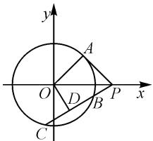
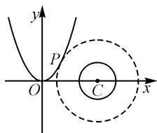

# 合理归类剖析,凸显方法引领

# ● 江苏省苏州市吴江区汾湖高级中学 朱宏雷

解析几何中的最值(或取值范围等)的综合应用问题是解析几何模块的一类重要题型,也是近年高考数学试卷中的热点题型之一.此类问题创新新颖,变化多端,解决问题的技巧方法多种多样,解题时要注意观察题设条件及结论,灵活选用相应的技巧方法与策略来切入与应用.

# 1 构造函数,利用函数的基本性质

例 1 已知 $F_{1}, F_{2}$ 分别为椭圆 $\frac{x^{2}}{4} + \frac{y^{2}}{3} = 1$ 的左、右焦点，P 是过椭圆右顶点且与长轴垂直的直线上的动点，则 $\sin \angle F_{1} PF_{2}$ 的最大值为 \_\_\_\_.

分析:根据题设条件,通过动点坐标的设置,利用距离公式转化相应线段的长度,通过余弦定理构建三角函数值的函数关系式,借助关系式的结构特征,利用二次函数的图象与性质来确定对应的最值,即可确定对应正弦值的最值问题.

解析:依题知 $F_{1}(-1,0)$ , $F_{2}(1,0)$ ，椭圆的右顶点为 $A(2,0)$ .

设过椭圆右顶点且与长轴垂直的直线上的动点 $P(2,t)$ ，不失一般性，不妨设t>0。

在 $\triangle PF_{1}F_{2}$ 中，由 $|PF_{1}| = \sqrt{t^{2} + 9}, |PF_{2}| = \sqrt{t^{2} + 1}$ ，结合余弦定理，有

$$
\begin{array}{l} \cos \angle F _ {1} P F _ {2} = \frac {\left| P F _ {1} \right| ^ {2} + \left| P F _ {2} \right| ^ {2} - \left| F _ {1} F _ {2} \right| ^ {2}}{2 \left| P F _ {1} \right| \left| P F _ {2} \right|} = \\ \frac {t ^ {2} + 9 + t ^ {2} + 1 - 4}{2 \sqrt {t ^ {2} + 9} \times \sqrt {t ^ {2} + 1}} = \frac {t ^ {2} + 3}{\sqrt {(t ^ {2} + 3 + 6) (t ^ {2} + 3 - 2)}} = \\ \frac {t ^ {2} + 3}{\sqrt {(t ^ {2} + 3) ^ {2} + 4 (t ^ {2} + 3) - 1 2}} = \sqrt {\frac {1}{- 1 2 \left(\frac {1}{t ^ {2} + 3}\right) ^ {2} + \frac {4}{t ^ {2} + 3} + 1}} = \\ \sqrt {\frac {1}{- 1 2 \left(\frac {1}{t ^ {2} + 3} - \frac {1}{6}\right) ^ {2} + \frac {4}{3}}} \geqslant \sqrt {\frac {1}{\frac {4}{3}}} = \frac {\sqrt {3}}{2}, \\ \end{array}
$$

当且仅当 $\frac{1}{t^2 + 3} = \frac{1}{6}$ ，即 $t = \sqrt{3}$ 时，等号成立.

由于 $0 \leqslant \angle F_{1}PF_{2} < \frac{\pi}{2}$ , 因此 $0 \leqslant \angle F_{1}PF_{2} \leqslant \frac{\pi}{6}$ .

所以 $\sin\angle F_{1}PF_{2}\leqslant\frac{1}{2}$ ，即 $\sin\angle F_{1}PF_{2}$ 的最大值为 $\frac{1}{2}$ . 故填答案: $\frac{1}{2}$ .

点评: 函数思维解法是处理此类最值(或取值范围等)综合应用问题的“通性通法”, 解题的关键在于构建相应的函数关系式, “数”算最值条件, 进而转化为函数问题, 利用函数的基本性质来分析与解决. 具体可以借助基本初等函数的图象与性质、导数法及其应用等, 这些都是解决此类问题有效的函数工具.

# 2 建立方程,利用方程的判别式

例 2 已知实数 x, y 满足 $x^{2} + y^{2} - 4x - 2y - 4 = 0$ ，则 x - y 的最大值是（）.

$$
\mathrm{A.} 1 + \frac {3 \sqrt {2}}{2}
$$

B.4

$$
\mathrm{C.} 1 + 3 \sqrt {2}
$$

D.7

分析:根据题设条件,通过所求一次代数式的整体换元引入参数,代入题设条件的二元二次方程,将问题转化为相关的一元二次方程问题,借助相关的一元二次方程有实数根,通过判别式满足的条件构建不等式,即可求解相应的最值(或取值范围)问题.

解析: 设 x-y=k，则 $x=y+k$ ，代入 $x^{2}+y^{2}-4x-2y-4=0$ ，整理可得

$$
2 y ^ {2} + (2 k - 6) y + k ^ {2} - 4 k - 4 = 0.
$$

由于以上关于 y 的二次方程有实数根, 则

$$
\Delta = (2 k - 6) ^ {2} - 4 \times 2 (k ^ {2} - 4 k - 4) \geqslant 0.
$$

整理得 $k^2 - 2k - 17 \leqslant 0$ ，则 $1 - 3\sqrt{2} \leqslant k \leqslant 1 + 3\sqrt{2}$ .

所以 x-y 的最大值是 $1+3\sqrt{2}$ . 故选择答案: C.

点评:在利用一元二次方程的判别式处理解析几何中的最值(或取值范围)问题时,抓住所求代数关系式的结构特征,根据整体思维引入参数,合理消参转化为相关的一元二次方程,为进一步利用判别式构建不等式打下基础.

# 3 引入角参,借助三角函数的有界性

例 3 已知 $\odot O$ 的半径为 1，直线 PA 与 $\odot O$ 相切于点 A，直线 PB 与 $\odot O$ 交于 B，C 两点，D 为 BC 的中点，若 $|PO| = \sqrt{2}$ ，则 $\overrightarrow{PA} \cdot \overrightarrow{PD}$ 的最大值为（）.

$$
\mathrm{A.} \frac {1 + \sqrt {2}}{2}
$$

$$
\mathrm{B.} \frac {1 + 2 \sqrt {2}}{2}
$$

$$
\mathrm{C.} 1 + \sqrt {2}
$$

$$
\mathrm{D}. 2 + \sqrt {2}
$$

分析:根据题设条件,结合问题的平面几何场景,建立平面直角坐标系,利用解析几何思维切入,通过点的坐标的角参设置,结合平面向量的数量积转化,利用三角函数的恒等变换与图象性质来确定相应的

最值问题.

解析:依题, 可知 $\angle APO = \frac{\pi}{4}, |PA| = 1$ .

建立如图 1 所示的平面直角坐标系, 取点 P 的坐标为 $(\sqrt{2}, 0)$ , 则 $A\left(\frac{\sqrt{2}}{2}, \frac{\sqrt{2}}{2}\right)$ .

text_image

y
A
O
D
B
P
x
C

图 1

依题可知点 D 的轨迹是以 OP 为直径的圆, 则其轨迹方程为

$$
\left(x - \frac {\sqrt {2}}{2}\right) ^ {2} + y ^ {2} = \frac {1}{2}.
$$

设 $D\left(\frac{\sqrt{2}}{2} + \frac{\sqrt{2}}{2}\cos \theta, \frac{\sqrt{2}}{2}\sin \theta\right), \theta \in [0, 2\pi)$ ，则有 $\overrightarrow{PA} \cdot \overrightarrow{PD} = \left(-\frac{\sqrt{2}}{2}, \frac{\sqrt{2}}{2}\right) \cdot \left(-\frac{\sqrt{2}}{2} + \frac{\sqrt{2}}{2}\cos \theta, \frac{\sqrt{2}}{2}\sin \theta\right) = \frac{1}{2} - \frac{1}{2}\cos \theta + \frac{1}{2}\sin \theta = \frac{1}{2} + \frac{\sqrt{2}}{2}\sin \left(\theta - \frac{\pi}{4}\right)$ .

而 $\theta \in [0,2\pi)$ ，所以当 $\theta - \frac{\pi}{4} = \frac{\pi}{2}$ ，即 $\theta = \frac{3\pi}{4}$ 时， $\overrightarrow{PA} \cdot \overrightarrow{PD}$ 取得最大值为 $\frac{1}{2} + \frac{\sqrt{2}}{2}$ . 故选择答案：A.

点评:在解决解析几何的相关综合应用问题时,往往可以通过曲线的参数方程等引入角参,将对应的点的坐标表示为角参的表达式,利用解析几何中的相关知识以及其他交汇知识点,构建三角函数关系式,利用三角函数图象与性质中的有界性来确定相应的最值(或取值范围)等综合应用问题.

# 4 设而不求,利用基本不等式的放缩

例 4 设抛物线 $E: y^{2} = 4x$ 的焦点为 F，过点 F 的直线与 E 相交于 A, B 两点，则 $\left|AF\right| + 2\left|BF\right|$ 的最小值为（）.

A. $3+2\sqrt{2}$

B. $2+3\sqrt{2}$

C.3

D. $2\sqrt{2}$

分析:根据题设条件,通过巧妙设置焦点弦所在的直线方程,与抛物线方程联立,借助函数与方程思维的转化与应用,回归点的坐标,结合抛物线定义的运用,设而不求,进而借助基本不等式来放缩处理.

解析:依题知 p=2, 则焦点 $F(1,0)$ , 准线方程为 x=-1.

设直线 AB 的方程为 $x=my+1$ ，点 A, B 的坐标分别为 $(x_{1}, y_{1}), (x_{2}, y_{2})$ .

联立 $\left\{\begin{aligned}x&=my+1,\\ y^{2}&=4x,\end{aligned}\right.$ 消去x，得 $y^{2}-4my-4=0$ ，则 $y_{1}+y_{2}=4m,y_{1}y_{2}=-4$ ，可得 $x_{1}x_{2}=\frac{(y_{1}y_{2})^{2}}{16}=1.$

根据抛物线的定义并利用基本不等式, 可得 $\left|AF\right| + 2\left|BF\right| = x_{1} + \frac{p}{2} + 2\left(x_{2} + \frac{p}{2}\right) = 3 + x_{1} +$ $2x_{2}\geqslant3+2\sqrt{x_{1}\times2x_{2}}=3+2\sqrt{2}$ ，当且仅当 $x_{1}=2x_{2}$ ，
即 $x_{1}=\sqrt{2}, x_{2}=\frac{\sqrt{2}}{2}$ 时，等号成立.

所以 $|AF| + 2|BF|$ 的最小值为 $3 + 2\sqrt{2}$ . 故选: A.

点评:定义法是解决圆锥曲线问题中最常用的一种技巧方法,回归圆锥曲线的定义本质,往往会为解决直线与圆锥曲线的位置关系问题提供更加有效的思路与方法.而这里利用定义的回归与关系式的构建,合理利用基本不等式来巧妙放缩处理,该思维过程也是解决解析几何中的最值(或取值范围)问题的最基本方法之一.

# 5 直观转化,利用数形结合的直观性

例 5 若 P, Q 分别是抛物线 $x^{2}=y$ 与圆 $(x-3)^{2}+y^{2}=1$ 上的点，则 $|PQ|$ 的最小值为 \_\_\_\_.

分析:根据题设条件,通过数形结合,利用“放大”的圆与抛物线对应相切,借助图形直观,确定唯一切点对应坐标的值,进而确定“放大”的圆的半径,直观即可确定 $|PQ|$ 的最小值.

解析: 设圆 $E:(x-3)^{2}+y^{2}=r^{2}(r>1)$ 与抛物线 $x^{2}=y$ 外切, 联立两方程并消去参数 y, 整理可得 $(x-3)^{2}+x^{4}-r^{2}=0$ , 即 $x^{4}+x^{2}-6x+9-r^{2}=0$ .

构建函数 $f(x) = x^{4} + x^{2} - 6x + 9 - r^{2}$ ，则

$$
f ^ {\prime} (x) = 4 x ^ {3} + 2 x - 6 = 2 (x - 1) \left(2 x ^ {2} + 2 x + 3\right).
$$

而 $2x^{2}+2x+3=2\left(x+\frac{1}{2}\right)^{2}+\frac{5}{2}>0$ ，因此由 $f'(x)=0$ 可得 x=1.

如图 2 所示, 由于圆 E 与抛物线 $x^{2}=y$ 外切时只有一个切点, 将 x=1 代入 $x^{4}+x^{2}-6x+9-r^{2}=0$ , 可得 $r=\sqrt{5}$ .

所以 $|PQ|$ 的最小值为 $\sqrt{5} - 1$ .

故填答案: $\sqrt{5}-1$ .

text_image

y
P
O
C
x

图2

点评:利用直观思维处理解析几何中的最值(或取值范围)问题时,往往要回归相关的定义,以及直线与圆、圆锥曲线等不同曲线之间的位置变化情况,从问题的本质入手加以数形结合,直观形象地解决相应的综合应用问题.

解析几何中的最值(或取值范围等)的综合应用问题,具有一定的探索性与综合性,是解析几何与函数或方程、不等式、平面几何、三角函数、平面向量等知识合理交汇与融合的一个重要场所.抓住一些常见的典型问题,从题设条件入手,合理构建与之相关的参数或代数式所对应的不等式、代数式或几何直观模型等,利用相应的技巧方法与策略来分析与处理,有时单种技巧策略分析,有时多种技巧策略综合,实现综合应用问题的巧妙解决.Z