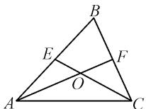
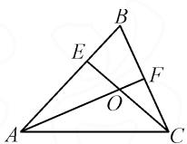
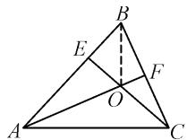
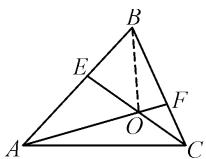
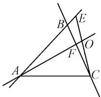
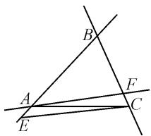
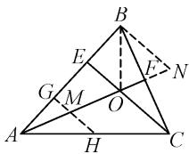

# 基于教材例题探索三角形边的等分线交点问题

● 北京市中关村中学张振环   
北京市丰台区第二中学卢沟桥学校 李雪琴

摘要:本文中以教材例题为起点,将中线交点问题变成三等分线和中线的交点问题,进一步拓展到任意分线,并利用向量知识深入探究此类问题,给出了任意情况下交点所分成的两条线段的比例,最后结合几何知识给出了直观解释,从数和形两个维度对该类问题进行了深入阐释.

关键词: 等分线; 向量; 三点共线

# 1 问题起源

《普通高中教科书·数学·必修第二册》(人教 B 版)第 6.3 节“平面向量线性运算的应用”的例题 3, 给出了如下问题:

如图 1 所示, 已知 $\triangle ABC$ 中, E, F 分别是 AB, BC 的中点, AF 和 CE 相交于点 O, 求 AO:OF 与 CO:OE 的值.

  
图1

解: 因为

$$
\overrightarrow {A C} = \overrightarrow {A O} + \overrightarrow {O C} = \overrightarrow {A B} + \overrightarrow {B C},
$$

又 E, F 都是中点, 所以

$$
\overrightarrow {A O} + \overrightarrow {O C} = \overrightarrow {A B} + \overrightarrow {B C} = 2 \overrightarrow {E B} + 2 \overrightarrow {B F} = 2 \overrightarrow {E F}.
$$

另外， $\overrightarrow{EF}=\overrightarrow{EO}+\overrightarrow{OF}$ ，所以

$$
\overrightarrow {A O} + \overrightarrow {O C} = 2 \overrightarrow {E O} + 2 \overrightarrow {O F}.
$$

设 $\overrightarrow{AO} = s\overrightarrow{OF},\overrightarrow{CO} = t\overrightarrow{OE}$ ，则有 $s\overrightarrow{OF} -t\overrightarrow{OE} =$ $2\overrightarrow{EO} +2\overrightarrow{OF}$ ，即

$$
(s - 2) \overrightarrow {O F} = (t - 2) \overrightarrow {O E},
$$

于是由共线向量基本定理可知 s=t=2.

因此， $AO:OF=CO:OE=2.$

评述:上述问题通过向量的线性运算,得到了三角形重心的性质,如果上述问题中的中线变成其他等分线,是否会有类似的结论呢?

# 2 问题变式

如图 2 所示, 已知 $\triangle ABC$ 中, E 是 AB 靠近 B 的三等分点, F 是 BC 的中点, AF 和 CE 相交于点 O, 求 AO : OF 与 CO : OE 的值.

解法 1: 因为 $\overrightarrow{AC} = \overrightarrow{OC} - \overrightarrow{OA}$ ,

  
图2

设 $\overrightarrow{AO} = s\overrightarrow{AF},\overrightarrow{CO} = t\overrightarrow{CE}$ ，所以 $\overrightarrow{AC} = \overrightarrow{OC} -\overrightarrow{OA} =$ $t\overrightarrow{EC} -s\overrightarrow{FA} = t(\overrightarrow{BC} -\overrightarrow{BE}) - s(\overrightarrow{BA} -\overrightarrow{BF}).$

因为 E 是 AB 靠近 B 的三等分点，F 是 BC 的中点，所以 $\overrightarrow{AC}=t\left(\overrightarrow{BC}-\frac{1}{3}\overrightarrow{BA}\right)-s\left(\overrightarrow{BA}-\frac{1}{2}\overrightarrow{BC}\right)$ ，即 $\overrightarrow{AC}=\left(-s-\frac{1}{3}t\right)\overrightarrow{BA}+\left(\frac{1}{2}s+t\right)\overrightarrow{BC}.$

又 $\overrightarrow{AC}=\overrightarrow{BC}-\overrightarrow{BA}$ ，则由平面向量基本定理可知

$$
\left\{ \begin{array}{l} - s - \frac {1}{3} t = - 1, \\ \frac {1}{2} s + t = 1. \end{array} \right.
$$

解得 $s=\frac{4}{5}, t=\frac{3}{5}$ .

因此， $AO:OF=4:1,CO:OE=3:2.$

解法 2: 设 $\overrightarrow{AO}=s\overrightarrow{AF},\overrightarrow{CO}=t\overrightarrow{CE}$ . 因为 E 是 AB 靠近 B 的三等分点, F 是 BC 的中点, 所以 $\overrightarrow{AF}=\frac{1}{2}\overrightarrow{AB}+\frac{1}{2}\overrightarrow{AC},\overrightarrow{CE}=\frac{2}{3}\overrightarrow{CB}+\frac{1}{3}\overrightarrow{CA}$ , 则有

$$
\overrightarrow {A O} = s \overrightarrow {A F} = \frac {3 s}{4} \overrightarrow {A E} + \frac {s}{2} \overrightarrow {A C},
$$

$$
\overrightarrow {C O} = t \overrightarrow {C E} = \frac {t}{3} \overrightarrow {C A} + \frac {4 t}{3} \overrightarrow {C F}.
$$

因为 C, O, E 三点共线, A, O, F 三点共线, 所以 $\frac{3s}{4} + \frac{s}{2} = 1, \frac{t}{3} + \frac{4t}{3} = 1.$

所以 $s=\frac{4}{5}, t=\frac{3}{5}.$

因此 AO : OF = 4 : 1, CO : OE = 3 : 2.

解法 3: 如图 3, 连接 BO, 设 $\overrightarrow{AO} = s \overrightarrow{AF}, \overrightarrow{CO} = t \overrightarrow{CE}$ , 由向量的减法法则可得 $\overrightarrow{BO} - \overrightarrow{BA} = s \overrightarrow{BF} - s \overrightarrow{BA}, \overrightarrow{BO} - \overrightarrow{BC} = t \overrightarrow{BE} - t \overrightarrow{BC}$ , 即

$$
\overrightarrow {B O} = s \overrightarrow {B F} + (1 - s) \overrightarrow {B A},
$$

$$
\overrightarrow {B O} = t \overrightarrow {B E} + (1 - t) \overrightarrow {B C}.
$$

因为 E 是 AB 靠近 B 的三等分点, F 是 BC 的中点, 所以

  
图3

$$
\overrightarrow {B O} = \frac {s}{2} \overrightarrow {B C} + 3 (1 - s) \overrightarrow {B E},
$$

$$
\overrightarrow {B O} = \frac {t}{3} \overrightarrow {B A} + 2 (1 - t) \overrightarrow {B F}.
$$

因为 C, O, E 三点共线, A, O, F 三点共线, 所以

$$
\frac {s}{2} + 3 (1 - s) = 1,
$$

$$
\frac {t}{3} + 2 (1 - t) = 1.
$$

所以 $s=\frac{4}{5}, t=\frac{3}{5}$ .

因此， $AO:OF=4:1,CO:OE=3:2.$

评述:通过三种解法发现,将问题拓展为中线和三等分线之后,交点分线段依然是固定的比例,与三角形的形状无关.解法1以 $\{\overrightarrow{BA},\overrightarrow{BC}\}$ 为基底表示 $\overrightarrow{AC}$ ,解法2和解法3以三点共线的向量基本结论为切入点,即“若A,B,C三点共线,则 $\overrightarrow{OA}=s\overrightarrow{OB}+t\overrightarrow{OC}$ ,且 $s+t=1$ ”.感兴趣的读者还可以尝试利用坐标法解决问题.

# 3 规律拓展

如图4，将上述问题一般化：已知 $\triangle ABC$ 中， $E,F$ 分别是边 $AB$ ， $BC$ 上的任意两点，满足 $\overrightarrow{BE} = m\overrightarrow{BA},\overrightarrow{BF} = n\overrightarrow{BC}$ ，其中 $m,n\in (0,1),AF$ 和 $CE$ 相交于点 $O$ ，求 $AO:OF$ 与 $CO:OE$ 的值.

  
图4

解: 沿用问题变式中的方法 3. 连接 BO, 设 $\overrightarrow{AO} = s \overrightarrow{AF}, \overrightarrow{CO} = t \overrightarrow{CE}$ , 由向量的减法法则可得 $\overrightarrow{BO} - \overrightarrow{BA} = s \overrightarrow{BF} - s \overrightarrow{BA}, \overrightarrow{BO} - \overrightarrow{BC} = t \overrightarrow{BE} - t \overrightarrow{BC}$ , 即

$$
\overrightarrow {B O} = s \overrightarrow {B F} + (1 - s) \overrightarrow {B A},
$$

$$
\overrightarrow {B O} = t \overrightarrow {B E} + (1 - t) \overrightarrow {B C}.
$$

因为 $\overrightarrow{BE} = m\overrightarrow{BA},\overrightarrow{BF} = n\overrightarrow{BC}$ ，所以

$$
\overrightarrow {B O} = s n \overrightarrow {B C} + \frac {1 - s}{m} \overrightarrow {B E},
$$

$$
\overrightarrow {B O} = m t \overrightarrow {B A} + \frac {1 - t}{n} \overrightarrow {B F}.
$$

因为 C, O, E 三点共线, A, O, F 三点共线, 所以

$$
s n + \frac {1 - s}{m} = 1,
$$

$$
m t + \frac {1 - t}{n} = 1.
$$

所以 $s=\frac{1-m}{1-mn}, t=\frac{1-n}{1-mn}.$

因此可得， $AO:OF=(1-m):(m-mn)$ ， $CO:OE=(1-n):(n-mn)$ .

如图 5, 将上述问题进一步推广: 已知 $\triangle ABC, E, F$ 分别是直线 AB、直线 BC 上的任意点, 满足 $\overrightarrow{BE} = m \overrightarrow{BA}, \overrightarrow{BF} = n \overrightarrow{BC} (m, n \in \mathbb{R}, mn \neq 1)$ , 直线 AF 和直线 CE 相交于点 O, 由于点 O 可能处于 $\triangle ABC$ 边上或者外部, 因此结论只需要调整

  
图 5

$$
\overrightarrow {A O} = \frac {1 - m}{m - m n} \overrightarrow {O F},
$$

$$
\overrightarrow {C O} = \frac {1 - n}{n - m n} \overrightarrow {O E}.
$$

如图 6, 可以进一步证明当 mn=1 时, AF 和 CE 平行, 此时不存在交点 O.

text_image

A
B
C
E
F

图6

# 4 直观解释

正如华罗庚所言：“数缺形时少直观，形少数时难入微。”如何更加直观地展现上述结论呢？

不妨以上述变式中的问题为例,如图7,取线段AE和线段AC的中点分别为G,H,易证GH//EC,过点B作BN//EC交AF延长线于点N,可以证明 $\triangle FOC\cong$ $\triangle FNB$ ，所以 $OF = FN, BN = OC.$ 因为 $GM \parallel EO \parallel BN$ 由平行线分线段成比例定理可知 $AM:MO:ON = AG:GE:EB = 1$ ，所以 $AO:OF = 4:1.$ 同理可证明 $\triangle AOE \sim \triangle ANB, OE:BN = AE:AB = 2:3$ ，所以 $CO:OE = 3:2.$

  
图 7

# 5 结束语

上述问题的探索,体现了“用教材教而不是教教材”的理念.依据教材提供的例题素材,溯本求源,借助“以算代证”的思维方式解决了三角形边的等分线交点问题,通过比较发现,向量的线性运算在解决平面几何某些问题时,具有很大的优越性,避免了初中平面几何需要添加辅助线的思维难点.Z