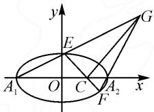
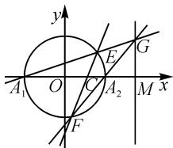
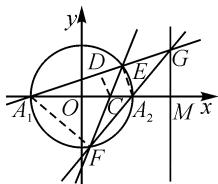
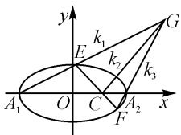
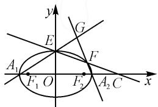
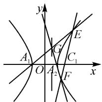

# 对一道定值问题的探源与推广

# ● 江苏省宿迁中学 王腾飞

摘要:本文中通过对一道全市期末统考解析几何问题的深入研究,对定值问题进行推广,从具体的椭圆到一般的椭圆,再到圆和双曲线.通过对问题的拓展探索和推理论证,提升学生数学运算和逻辑推理素养.

关键词: 定值问题; 定直线问题; 推广结论

解析几何中的定值、定直线问题是高考的热点和难点，一般情况下题目涉及知识的交汇点较多，综合性较强。这类问题考查学生的函数与方程、转化与化归等数学思想的运用能力，有利于促进学生逻辑推理、数学运算、直观想象等数学核心素养的提升。其难点在于最优解题思路的获取及数学运算的精准。有时候虽然知道解题思路，但限于运算能力薄弱，导致解题失败，影响学生考试的心态和正常水平的发挥[1]。

本文中研究一道椭圆中的定值问题,进而引发对定直线问题的探索,再进一步将结论不断推广.

# 1 问题呈现

(2019年宿迁市高二期末考试第19题)如图1,在平面直角坐标系xOy中,点 $P\left(1,\frac{\sqrt{3}}{2}\right)$ 在椭圆 $M:\frac{x^{2}}{a^{2}}+\frac{y^{2}}{b^{2}}=1(a>b>0)$ 上,且椭圆M的离心率为 $\frac{\sqrt{3}}{2}$ .

  
图1

(1)求椭圆 M 的标准方程；  
(2) 记椭圆 M 的左、右顶点分别为 $A_{1}, A_{2}, C$ 是 x 轴上任意一点（异于 $A_{1}, A_{2}, O$ ），过点 C 的直线 l 与椭圆相交于 E, F 两点.  
(i) 若点 C 的坐标为 $(\sqrt{3}, 0)$ ，直线 EF 的斜率为 -1，求 $\triangle A_{1}EF$ 的面积；  
（ii）若点 C 的坐标为 $(1,0)$ ，连接 $A_{1}E, A_{2}F$ 交于点 G，记直线 $A_{1}E, GC, A_{2}F$ 的斜率分别为 $k_{1}, k_{2}, k_{3}$ ，证明： $\frac{k_{1}+k_{3}}{k_{2}}$ 是定值.

分析:对于这类问题,通常是设点或设直线,不同方法后续计算的繁简程度迥异,有时可能也就决定了解题成败的关键.

解法 1: 设直线方程.

(1)椭圆 M 的标准方程是 $\frac{x^{2}}{4} + y^{2} = 1$ ，过程略.

(2)(i) $S_{\triangle A_{1}EF}=\frac{1}{2}\times(\sqrt{3}+2)\times\frac{4\sqrt{2}}{5}=\frac{2\sqrt{6}+4\sqrt{2}}{5}$ ,
过程略.   
（ii）设 $E(x_{1},y_{1})$ ，直线 $A_{1}G:y=k_{1}(x+2)$ ，联立 $\left\{\begin{aligned}y=k_{1}(x+2),\\ x^{2}+4y^{2}=4,\end{aligned}\right.$ 消去 y，得

$$
(4 k _ {1} ^ {2} + 1) x ^ {2} + 1 6 k _ {1} ^ {2} x + 1 6 k _ {1} ^ {2} - 4 = 0.
$$

所以 $-2x_{1}=\frac{16k_{1}^{2}-4}{4k_{1}^{2}+1}$ ，则 $x_{1}=\frac{2-8k_{1}^{2}}{4k_{1}^{2}+1}$ ， $y_{1}=\frac{4k_{1}}{4k_{1}^{2}+1}$ .

所以 $E\left(\frac{2 - 8k_1^2}{4k_1^2 + 1},\frac{4k_1}{4k_1^2 + 1}\right)$

同理, 可得 $F\left(\frac{8k_{3}^{2}-2}{4k_{3}^{2}+1}, \frac{-4k_{3}}{4k_{3}^{2}+1}\right)$ .

又因为 C, E, F 三点共线，所以 $k_{EC} = k_{FC}$ ，即 $\frac{y_{E} - y_{C}}{x_{E} - x_{C}} = \frac{y_{F} - y_{C}}{x_{F} - x_{C}}$ ，将 C, E, F 三点坐标代入得

$$
\frac {\frac {4 k _ {1}}{4 k _ {1} ^ {2} + 1} - 0}{\frac {2 - 8 k _ {1} ^ {2}}{4 k _ {1} ^ {2} + 1} - 1} = \frac {\frac {- 4 k _ {3}}{4 k _ {3} ^ {2} + 1} - 0}{\frac {8 k _ {3} ^ {2} - 2}{4 k _ {3} ^ {2} + 1} - 1}.
$$

化简，得 $\frac{4k_1}{1 - 12k_1^2} = \frac{-4k_3}{4k_3^2 - 3}$

整理，得 $(3k_{1} - k_{3})(1 + 4k_{1}k_{3}) = 0.$ 因为 $k_{1}k_{3} > 0$ 所以 $3k_{1} - k_{3} = 0$ ，即 $k_{3} = 3k_{1}$

又由 $\left\{\begin{aligned}y&=k_{1}(x+2),\\ y&=k_{3}(x-2),\end{aligned}\right.$ 得 $G\left(\frac{2(k_{1}+k_{3})}{k_{3}-k_{1}},\frac{4k_{1}k_{3}}{k_{3}-k_{1}}\right).$

所以，可得 $k_{2} = k_{CG} = \frac{y_{G} - 0}{x_{G} - 1} = \frac{\frac{4k_{1}k_{3}}{k_{3} - k_{1}}}{\frac{2(k_{1} + k_{3})}{k_{3} - k_{1}} - 1} =$

$$
\frac {4 k _ {1} k _ {3}}{3 k _ {1} + k _ {3}} = \frac {1 2 k _ {1} ^ {2}}{6 k _ {1}} = 2 k _ {1}.
$$

所以 $\frac{k_{1}+k_{3}}{k_{2}}=\frac{4k_{1}}{2k_{1}}=2.$

当 $x_{1}=1$ 时，点 $E\left(1,\frac{\sqrt{3}}{2}\right),F\left(1,-\frac{\sqrt{3}}{2}\right)$ ， $G(4,\sqrt{3})$ ，或 $E\left(1,-\frac{\sqrt{3}}{2}\right),F\left(1,\frac{\sqrt{3}}{2}\right),G(4,-\sqrt{3})$ ，均满足 $\frac{k_{1}+k_{3}}{k_{2}}=2.$

故 $\frac{k_{1}+k_{3}}{k_{2}}$ 为定值.

此方法计算量较大,需要有较强的运算能力才能得到最后的结果.

解法 2: 设点的坐标.

对于第(2)中的第二小问：

设点 $G(x_0, y_0), E(x_1, y_1), F(x_2, y_2)$ ，且 $x_1 \neq x_2$ ，则 $k_1 = \frac{y_0}{x_0 + 2}, k_2 = \frac{y_0}{x_0 - 1}, k_3 = \frac{y_0}{x_0 - 2}$ .

所以 $\frac{k_1 + k_3}{k_2} = \frac{\frac{y_0}{x_0 + 2} + \frac{y_0}{x_0 - 2}}{\frac{y_0}{x_0 - 1}} = \frac{2x_0(x_0 - 1)}{(x_0 + 2)(x_0 - 2)}.$

因为 $C, E, F$ 三点共线且 $E, F$ 两点都在椭圆上，

所以 $\left\{ \begin{array}{l} \frac{y_1}{x_1 - 1} = \frac{y_2}{x_2 - 1}, \\ y_1^2 = 1 - \frac{x_1^2}{4}, \\ y_2^2 = 1 - \frac{x_2^2}{4}, \end{array} \right.$ 即 $\left\{ \begin{array}{l} \frac{y_1}{y_2} = \frac{x_1 - 1}{x_2 - 1}, \\ \frac{y_1^2}{y_2^2} = \frac{4 - x_1^2}{4 - x_2^2}, \end{array} \right.$ 化简可得

$$
x _ {1} x _ {2} = \frac {5}{2} (x _ {1} + x _ {2}) - 4. \tag {①}
$$

又因为 $G, E, A_{1}$ 三点共线， $G, F, A_{2}$ 三点也共

线，所以 $\left\{\begin{aligned}\frac{y_{0}}{x_{0}+2}&=\frac{y_{1}}{x_{1}+2},\\ \frac{y_{0}}{x_{0}-2}&=\frac{y_{2}}{x_{2}-2},\end{aligned}\right.$ 两式相除，得

$$
\frac {x _ {0} - 2}{x _ {0} + 2} = \frac {y _ {1}}{y _ {2}} \cdot \frac {x _ {2} - 2}{x _ {1} + 2} = \frac {x _ {1} - 1}{x _ {2} - 1} \cdot \frac {x _ {2} - 2}{x _ {1} + 2} =
$$

$$
\frac {x _ {1} x _ {2} - 2 x _ {1} - x _ {2} + 2}{x _ {1} x _ {2} + 2 x _ {2} - x _ {1} - 2}. \tag {②}
$$

把①式代入②式,可以得到

$$
\frac {x _ {0} - 2}{x _ {0} + 2} = \frac {x _ {1} x _ {2} - 2 x _ {1} - x _ {2} + 2}{x _ {1} x _ {2} + 2 x _ {2} - x _ {1} - 2} = \frac {\frac {1}{2} x _ {1} + \frac {3}{2} x _ {2} - 2}{\frac {3}{2} x _ {1} + \frac {9}{2} x _ {2} - 6} =
$$

$\frac{1}{3}$ ，即 $\frac{x_{0}-2}{x_{0}+2}=\frac{1}{3}$ ，解得 $x_{0}=4$ .

所以 $\frac{k_1 + k_3}{k_2} = \frac{2x_0(x_0 - 1)}{(x_0 + 2)(x_0 - 2)} = 2$ （定值）.

当 $x_{1}=x_{2}$ 时，经验证也满足 $\frac{k_{1}+k_{3}}{k_{2}}=2$ .

从上面的解题过程可以发现,这个问题的等价结论是点 G 在一条定直线 x=4 上，从而斜率比 $\frac{k_{1}+k_{3}}{k_{2}}$ 才是定值.

# 2 问题探源

这道题是如何命制出来的呢？源头在哪里呢？

在教材中，圆和椭圆有密切的关系，圆可以通过伸缩变换得到椭圆。反过来，椭圆也可以通过伸缩变换得到圆。例如圆： $x^{2}+y^{2}=1$ 作伸缩变换 $\varphi:\left\{\begin{aligned}x^{\prime}&=ax,\\ y^{\prime}&=by\end{aligned}\right.$ 后可变成椭圆： $\frac{x^{\prime2}}{a^{2}}+\frac{y^{\prime2}}{b^{2}}=1^{[1]}$ 。

既然圆和椭圆之间可以通过伸缩变换相互得到，而且变换前后曲线的某些性质保持不变.下面来研究在圆中是否会有对应的结论：

如图 2, $A_{1},A_{2}$ 是圆 $C:x^{2}+y^{2}=r^{2}(r$ 为半径)与x轴的交点. $C(m,0)$ 是x轴上的一个定点，且 $m\in(-r,r)$ ，过点C的直线l交圆C于E,F两点，连接直线 $A_{1}E,A_{2}F$ 交于点G.求证：点G在一条定直线上.

text_image

y
A₁ O C A₂ M x
F
E G

图2

证明：设 $\angle GA_{1}M = \theta_{1},\angle GA_{2}M = \theta_{2}$ ，则直线 $A_{1}E$ 的斜率 $k_{1} = \tan \theta_{1}$ ，直线 $A_{2}F$ 的斜率 $k_{2} = \tan \theta_{2}$ 设 $G(x_0,y_0)$ ，则由方程组 $\left\{ \begin{array}{l}y = k_1(x + r),\\ y = k_2(x - r) \end{array} \right.$ 得 $k_{1}(x_{0} + r) =$ $k_{2}(x_{0} - r)$ ，即 $\frac{x_0 - r}{x_0 + r} = \frac{k_1}{k_2} = \frac{\tan\theta_1}{\tan\theta_2}.$

如图 3, 连接 $A_{1}F, A_{2}E$ , 过点 C 作 $CD \perp A_{1}E$ 于点 D.

由圆的性质, 可知 $\angle GA_{2}M = \angle A_{1}A_{2}F = \angle A_{1}EF = \theta_{2}$ ，且 $\angle EA_{1}C = \theta_{1}$ . 所以 $\tan \theta_{1} = \frac{CD}{A_{1}D}$ ,$\tan\theta_{2}=\frac{CD}{ED}$ ，因为 $A_{1}A_{2}$ 为直径，所以 $A_{2}E\perp A_{1}E$ ，则 $CD\parallel A_{2}E$ .

text_image

y
D
E
G
A₁ O C A₂ M x
F

图3

又因为 $A_{1}C=r+m, A_{2}C=r-m$ ，所以 $\frac{ED}{A_{1}D}=\frac{A_{2}C}{A_{1}C}$ .

又因为 $\frac{x_{0}-r}{x_{0}+r}=\frac{k_{1}}{k_{2}}=\frac{\tan\theta_{1}}{\tan\theta_{2}}=\frac{ED}{A_{1}D},\frac{A_{2}C}{A_{1}C}=\frac{r-m}{r+m},$ 所以 $\frac{x_{0}-r}{x_{0}+r}=\frac{r-m}{r+m}$ ，解得 $x_{0}=\frac{r^{2}}{m}$ （为定值）.

由此可见，在圆中这个结论也是成立的。而伸缩变换揭示了圆与椭圆之间的内在关系，保持了一些性质的“不变”。把圆中的这些性质类比到椭圆中，就可得到椭圆中的一些“新”性质，这就是这道全市统测题的源头所在 $^{[2]}$ 。

# 3 问题推广

对于一般的椭圆,可有以下结论:

推广 1 如图 4, 椭圆 $C: \frac{x^{2}}{a^{2}} + \frac{y^{2}}{b^{2}} = 1 (a > b > 0)$ , $A_{1}, A_{2}$ 是椭圆的左、右顶点, $C(m, 0)$ 是 x 轴上的一个定点, 且 $|m| \neq a$ , 过点 C的直线 l 交椭圆于 E, F 两点, 连接直线 $A_{1}E, A_{2}F$ 交于点 G. 求证: 动点 G 在一条定直线上.

  
图4

证明：（1）当 $m \in (-a, a) (a > 0)$ 时，设 $E(x_{1}, y_{1}), F(x_{2}, y_{2}) (x_{1} \neq x_{2}), G(x_{3}, y_{3})$

因为 E, C, F 三点共线且点 E, F 在椭圆上, 所以

$$
\begin{array}{l} \left\{ \begin{array}{l} {\frac {y _ {1}}{x _ {1} - m} = \frac {y _ {2}}{x _ {2} - m},} \\ {y _ {1} ^ {2} = b ^ {2} \left(1 - \frac {x _ {1} ^ {2}}{a ^ {2}}\right), \text {化简得}} \\ {y _ {2} ^ {2} = b ^ {2} \left(1 - \frac {x _ {2} ^ {2}}{a ^ {2}}\right),} \end{array} \right. \\ x _ {1} x _ {2} = \frac {a ^ {2} + m ^ {2}}{2 m} (x _ {1} + x _ {2}) - a ^ {2}. \tag {③} \\ \end{array}
$$

又 $G, E, A_{1}$ 三点共线， $G, F, A_{2}$ 三点共线，所以

$$
\left\{ \begin{array}{l} \frac {y _ {3}}{x _ {3} + a} = \frac {y _ {1}}{x _ {1} + a}, \\ \frac {y _ {3}}{x _ {3} - a} = \frac {y _ {2}}{x _ {2} - a}, \end{array} \right. \text {于是可得}
$$

$$
\frac {x _ {3} - a}{x _ {3} + a} = \frac {y _ {1}}{y _ {2}} \cdot \frac {x _ {2} - a}{x _ {1} + a} = \frac {x _ {1} x _ {2} - a x _ {1} - m x _ {2} + m a}{x _ {1} x _ {2} + a x _ {2} - m x _ {1} - m a}. \tag {④}
$$

把③式代入④式,得

$$
\frac {x _ {3} - a}{x _ {3} + a} = \frac {x _ {1} x _ {2} - a x _ {1} - m x _ {2} + m a}{x _ {1} x _ {2} + a x _ {2} - m x _ {1} - m a} = \frac {a - m}{a + m}.
$$

解得 $x_{3}=\frac{a^{2}}{m}$ (定值).

当 $x_{1} = x_{2} = m$ 时，可得点 $E\left(m, \frac{b}{a}\sqrt{a^2 - m^2}\right)$ ， $F\left(m, -\frac{b}{a}\sqrt{a^2 - m^2}\right)$ ，从而 $x_{3} = \frac{a^2}{m}$ 也成立[1].

(2) 当 $\left|m\right| > a$ 时, 如图 5 所示, 同理可以推导出点 G 所在的直线方程为 $x = \frac{a^{2}}{m}$ , $y \in$

$$
\left(- \infty , - \frac {b}{| m |} \sqrt {m ^ {2} - a ^ {2}}\right) \cup
$$

$$
\left(\frac {b}{| m |} \sqrt {m ^ {2} - a ^ {2}}, + \infty\right).
$$

text_image

y
G
E
A₁
F₁ O
F₂
A₂ C
x

图5

进一步发散思维,探究双曲线中是否也有这个性质.推广 2 如图 6, 双曲线 $C: \frac{x^{2}}{a^{2}} - \frac{y^{2}}{b^{2}} = 1 (a > 0, b > 0)$ ,

$A_{1},A_{2}$ 是双曲线的左、右顶点， $C(m,0)(|m|>a)$ 是 x 轴上的一个定点，过点 C 的直线 l 交双曲线同一支于 E，F 两点，连接直线 $A_{1}E,A_{2}F$ 交于点 G. 求证：点 G 在一条定直线上.

text_image

y
A₁ O A₂ F C₁ x
G E

图6

证明: 设 $E(x_{1}, y_{1}), F(x_{2}, y_{2})$ $(x_{1} \neq x_{2}), G(x_{3}, y_{3})$ .

因为 E, C, F 三点共线且点 E, F 在双曲线上, 所

以 $\left\{\begin{aligned}\frac{y_{1}}{x_{1}-m}&=\frac{y_{2}}{x_{2}-m},\\ y_{1}^{2}&=b^{2}\left(\frac{x_{1}^{2}}{a^{2}}-1\right),\\ y_{2}^{2}&=b^{2}\left(\frac{x_{2}^{2}}{a^{2}}-1\right),\end{aligned}\right.$ 化简得

$$
x _ {1} x _ {2} = \frac {a ^ {2} + m ^ {2}}{2 m} (x _ {1} + x _ {2}) - a ^ {2}. \tag {⑤}
$$

又因为 $G, E, A_{1}$ 三点共线， $G, F, A_{2}$ 三点也共

线，所以 $\left\{ \begin{array}{l} \frac{y_3}{x_3 + a} = \frac{y_1}{x_1 + a}, \\ \frac{y_3}{x_3 - a} = \frac{y_2}{x_2 - a}, \end{array} \right.$ 可得

$$
\frac {x _ {3} - a}{x _ {3} + a} = \frac {y _ {1}}{y _ {2}} \cdot \frac {x _ {2} - a}{x _ {1} + a} = \frac {x _ {1} - m}{x _ {2} - m} \cdot \frac {x _ {2} - a}{x _ {1} + a}. \tag {6}
$$

将⑤式代入⑥式，得 $\frac{x_{3}-a}{x_{3}+a}=\frac{a-m}{a+m}$ ，

解得 $x_{3}=\frac{a^{2}}{m}$ (定值).

当 $x_{1} = x_{2} = m$ 时，可得点 $E\left(m, \frac{b}{a}\sqrt{m^2 - a^2}\right)$ ， $F\left(m, -\frac{b}{a}\sqrt{m^2 - a^2}\right)$ ，从而 $x_{3} = \frac{a^{2}}{m}$ 也成立.

所以，当直线 EF 与双曲线交于同一支时，点 C(m,0) 且 $|m| > a$ ，如图 6，此时点 G 的轨迹是两条线段 $x = \frac{a^{2}}{m}$ .

一道数学问题,引出如此丰富的结论,让人兴奋不已.要想提升学生的数学素养,增强学生解决问题的能力,追寻数学问题本源,进行同类问题探索推广,应当是不可或缺的途径.同时,应精心选择好的问题素材,重视对解题过程的反思,引导学生探本求源,分析问题的本质,做到由“一个”到“一类”,从而激发学生的学习热情,提高学习质量 $^{[2]}$ .

# 参考文献：

[1]罗大川.一道高考题中定值关系的推广[J].数学学习与研究,2018(14):113.  
[2]花奎, 张晓飞. 解题反思孕“念头”回归教材寻“源头”——高三解题教学中回归教材的几则案例及思考 [J]. 数学通报, 2021(8): 30-34, 38. Z