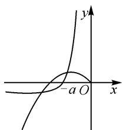

# 巧借导数工具,妙解函数零点

# 江苏省张家港市沙洲中学 杜文正

摘要:借助导数这一基本工具分析与解决一些函数中的零点以及相应的问题,是新高考数学试卷中比较常见的一类综合应用问题.结合常见考查类型,以函数零点为场景,导数为工具,从函数零点存在定理入手,合理构建新函数,综合极限思维等方式加以综合分析与处理,形成思维习惯,养成良好品质,有效指导解题研究与复习备考.

关键词: 导数; 函数; 零点; 不等式

函数与导数的应用,可以用来分析与解决高中阶段的很多综合问题,成为解决数学问题的一个基本工具.而在解决一些复杂的函数零点及其综合性问题时,经常也离不开函数与导数的应用,巧妙借助导数法来转化分析与合理解决,是突破考生学习难点与瓶颈的一个关键节点.

# 1 判断(证明)函数的零点个数问题

例 1 （2023 届广西桂林市、崇左市高考数学一模试卷）已知函数 $f(x)=\mathrm{e}^{x}-ax+\sin x-1$ .

(1) 若函数 $f(x)$ 在 $(0, +\infty)$ 上单调递增，求实数 a 的取值范围；  
(2) 当 $1 \leqslant a < 2$ 时, 求函数 $g(x) = (x - 2)f(x)$ 零点的个数.

分析:(1)依题求出函数的导函数,结合函数的单调性及其应用巧妙分离参数,通过不等式恒成立构建新函数,利用导数说明函数的单调性,即可求出参数的取值范围;(2)首先直观可得2与0是函数 $g(x)$ 的两个零点,再利用导数说明函数的单调性,结合函数的零点存在性定理判断即可.

解析:(1)由 $f(x)=\mathrm{e}^{x}-ax+\sin x-1$ ，求导可得 $f'(x)=\mathrm{e}^{x}-a+\cos x$ .

由函数 $f(x)$ 在 $(0, +\infty)$ 上单调递增，得 $a \leqslant \mathrm{e}^x + \cos x$ 在 $(0, +\infty)$ 上恒成立.

令函数 $h(x)=\mathrm{e}^{x}+\cos x, x\in(0,+\infty)$ ，求导得 $h'(x)=\mathrm{e}^{x}-\sin x.$

当 x>0 时， $e^{x}>1$ ，则 $h'(x)=\mathrm{e}^{x}-\sin x>0$ 恒成立.

所以函数 $h(x)$ 在 $(0, +\infty)$ 上单调递增，则有 $h(x) > h(0) = 2$ . 故 $a \leqslant 2$ .

(2) 由 $g(x) = (x - 2)f(x) = (x - 2)(\mathrm{e}^x - ax + \sin x - 1)$ ，可知 $g(2) = 0, g(0) = 0$ .

所以 2 与 0 是 $g(x)=(x-2)f(x)$ 的两个零点.

因为 $1 \leqslant a < 2$ ，由(1)知，函数 $f(x)$ 在 $(0, +\infty)$ 上

单调递增,则 $f(x) > f(0) = 0$ ,无零点.

① 当 $x \in (-\infty, -\pi]$ 时，由 $1 \leqslant a < 2$ 知 $-ax \geqslant \pi$ 则有 $f(x) \geqslant e^x + \pi + \sin x - 1 > 0$ ，无零点.  
② 当 $x \in (-\pi, 0)$ 时，由于 $\sin x < 0$ ，设函数 $u(x) = f'(x)$ ，求导有 $u'(x) = \mathrm{e}^x - \sin x > 0$ ，所以函数 $u(x) = f'(x)$ 在 $(- \pi, 0)$ 上单调递增.

又 $f'(0)=2-a>0, f'(-\pi)=\mathrm{e}^{-\pi}-1-a<0$ ，结合函数零点存在定理，可知存在唯一零点 $x_{0}\in(-\pi,0)$ ，使得 $f'(x_{0})=0$ 。

当 $x \in (-\pi, x_0)$ 时， $f'(x) < 0, f(x)$ 在 $(- \pi, x_0)$ 上单调递减；当 $x \in (x_0, 0)$ 时， $f'(x) > 0, f(x)$ 在 $(x_0, 0)$ 上单调递增.

又 $f(-\pi) = \mathrm{e}^{-\pi} + a\pi - 1 > 0, f(0) = 0$ ，所以函数 $f(x)$ 在 $(- \pi, 0)$ 上有且仅有 1 个零点.

综上，当 $1 \leqslant a < 2$ 时，函数 $g(x) = (x - 2)f(x)$ 有且仅有3个不同的零点.

点评:利用导数法分析与判断(或证明)相关函数的零点个数问题时,经常采用以下两种方法.(1)构造函数 $g(x)$ (其中 $g'(x)$ 易求,且 $g'(x)=0$ 可解),利用导数研究函数 $g(x)$ 的基本性质(主要是单调性),结合函数 $g(x)$ 的图象,得以直观判断相应函数的零点个数;(2)利用函数零点存在定理,先确定函数在给定区间上有零点的条件,再结合图象与性质确定函数零点的个数.

# 2 根据函数的零点个数确定参数问题

例 2 [2022 届浙江省温州市普通高中高考适应性测试(2022 年 3 月份)数学试题(温州二模数学)] 已知 a > 0，函数 $f(x) = x^{4} + x^{3} + ax + a^{2}$ 有且仅有两个不同的零点，则 a 的取值范围为 \_\_\_\_.

分析:依题分析,确定函数 $f(x)$ 有且仅有两个不同的负零点,构建对应的方程,结合方程的变形处理,巧妙分离函数,化函数的零点问题为两个函数图象的交点问题,利用导数法确定函数图象的大体特征,然后数形结合直观求出参数的取值范围.

解析:依题,当 $x \geqslant 0$ 时, $f(x)=x^{4}+x^{3}+ax+a^{2} \geqslant a^{2}>0$ ,所以 $f(x)$ 有且仅有两个不同的负零点.

由 $f(x) = x^4 + x^3 + ax + a^2 = 0 (x \neq 0)$ ，可得 $x^2 + x + \frac{a}{x} + \frac{a^2}{x^2} = 0$ ，即 $\frac{a^2}{x^2} + \frac{a}{x} = -(x^2 + x)$ .

由上可知，函数 $g(x)=\frac{a^{2}}{x^{2}}+\frac{a}{x}$ 与 $y=-(x^{2}+x)$ 的图象在 $(-∞,0)$ 上有两个不同的交点.

由于 $g'(x) = -\frac{2a^{2}}{x^{3}} - \frac{a}{x^{2}} = -\frac{a}{x^{3}} (2a + x)$ ，则 $g(x)$ 在 $(-∞, -2a)$ 上单调递减，在 $(-2a, 0)$ 上单调递增.

结合 $g(-a)=0$ ，作出 $g(x)$ 与 $y=-(x^{2}+x)$ 的图象，如图 1，直观分析，可得 -1<-a<0，即 0<a<1 时，函数 $g(x)$ 与函数 $y=-(x^{2}+x)$ 的图象在 $(-∞,0)$ 上有两个不同的交点.

text_image

-a O
x
y

图1

故填答案:(0,1).

点评:根据函数的零点个数情况确定相关参数的取值范围问题的常见技巧方法——(1)将函数中的参数 $\lambda$ 与变量 x 分离, 得 $\lambda = g(x)$ , 转化为研究方程 $\lambda = g(x)$ 根的个数问题, 然后利用导数研究函数 $g(x)$ 的最值或值域, 结合图象, 根据直线 $y = \lambda$ 与函数 $g(x)$ 的图象交点的个数确定参数 $\lambda$ 的取值范围; (2) 直接研究函数 $f(x)$ 的单调性与极值情况, 必要时分类讨论, 同时结合函数零点存在定理以及其他条件合理建立相应的不等式(组)求解; (3) 化“数”为“形”, 借助两个基本初等函数图象的位置关系与特征, 再根据零点个数进一步构建不等式求解.

# 3 与函数的零点有关的不等式证明问题

例 3 （2023 届河北省邯郸市高三二模数学试题）已知函数 $f(x)=(\ln x+1)x-mx^{2}+m$ .

(1) 若 $f(x)$ 单调递减, 求 m 的取值范围;

(2) 若 $f'(x)$ 的两个零点分别为 a, b，且 2a < b，
证明： $ab^{2}>\frac{32}{e^{6}}$ .（参考数据： $\ln2\approx0.69$ .）

分析:(1)依题结合函数的单调性构建对应导函数,利用不等式恒成立加以转化与分离参数,借助构造一个新函数,利用导数求函数的最大值,进而确定参数m的取值范围;(2)结合对参数m的分类讨论,并利用当m>0时,合理恒等转化所要证明的不等式,

通过利用两个零点的比值整体引入参数进行换元处理,利用导数求函数的最值来转化,进而得以证明对应的不等式成立.

解析:(1)由 $f(x)=(\ln x+1)x-mx^{2}+m$ ，求导得 $f'(x)=\ln x-2mx+2(x>0)$ .

因为 $f(x)$ 单调递减，所以 $f'(x)=\ln x-2mx+2\leqslant0$ 在 $(0,+\infty)$ 上恒成立.

所以 $2m \geqslant \frac{\ln x + 2}{x}$ 在 $(0, +\infty)$ 上恒成立，即 $2m \geqslant \left(\frac{\ln x + 2}{x}\right)_{\max}$ .

令函数 $g(x)=\frac{\ln x+2}{x}(x>0)$ ，求导得 $g'(x)=\frac{-\ln x-1}{x^{2}}$ .

可知，当 $0 < x < \frac{1}{e}$ 时， $g'(x) > 0, g(x)$ 单调递增；
当 $x>\frac{1}{e}$ 时， $g'(x)<0, g(x)$ 单调递减.

所以当 $x=\frac{1}{e}$ 时， $g(x)$ 取得最大值 $g\left(\frac{1}{e}\right)=e$ .

所以 $2m \geqslant \mathrm{e}$ , 即 $m \geqslant \frac{\mathrm{e}}{2}$ .

故 $m$ 的取值范围是 $\left[\frac{\mathrm{e}}{2}, +\infty\right)$ .

(2)依题 $f'(x)=\ln x-2mx+2(x>0)$ 有两个零点 a, b，令 $\varphi(x)=f'(x)=\ln x-2mx+2(x>0)$ ，求导有 $\varphi'(x)=\frac{1}{x}-2m.$

当 $m \leqslant 0$ 时， $\varphi'(x) > 0, \varphi(x)$ 单调递增，不符合题意.

当 m>0 时，由 $\varphi'(x)=0$ ，解得 $x=\frac{1}{2m}$ 。当 0<x< $\frac{1}{2m}$ 时， $\varphi'(x)>0,\varphi(x)$ 单调递增；当 $x>\frac{1}{2m}$ 时， $\varphi'(x)<0,\varphi(x)$ 单调递减。

由此可知，当 $m > 0$ 时， $f'\left(\frac{1}{2m}\right) = -\ln 2m + 1 > 0.$

要证明 $ab^2 > \frac{32}{\mathrm{e}^6}$ , 只需证明 $\ln a + 2\ln b > 5\ln 2 - 6$ .

由 $f'(a)=0, f'(b)=0$ , 可得 $\left\{\begin{aligned}\ln a-2ma+2=0,\\ \ln b-2mb+2=0,\end{aligned}\right.$ 化
简得 $\left\{\begin{aligned}\ln a=2ma-2,\\ \ln b=2mb-2,\end{aligned}\right.$ 所以 $2m=\frac{\ln a-\ln b}{a-b}$ .

而 $\ln a + 2\ln b = 2m (a + 2b) - 6 = \frac{\ln a - \ln b}{a - b}$

$$
(a + 2 b) - 6 = \frac {\ln \frac {a}{b}}{\frac {a}{b} - 1} \left(\frac {a}{b} + 2\right) - 6.
$$

令 $t = \frac{a}{b} \in \left(0, \frac{1}{2}\right)$ , 要证明 $\ln a + 2\ln b > 5\ln 2 - 6$ , 只需证明 $\frac{\ln t}{t - 1}(t + 2) > 5\ln 2$ .

令函数 $h(t) = \frac{\ln t}{t - 1} (t + 2), t \in \left(0, \frac{1}{2}\right)$ ，求导得 $h'(t) = \frac{t - 3\ln t - \frac{2}{t} + 1}{(t - 1)^2}$ .

令函数 $u(t)=t-3\ln t-\frac{2}{t}+1, t\in\left(0,\frac{1}{2}\right)$ ，求导有 $u'(t)=1-\frac{3}{t}+\frac{2}{t^{2}}=\frac{(t-1)(t-2)}{t^{2}}>0.$

易知函数 $u(t)$ 在 $\left(0, \frac{1}{2}\right)$ 上单调递增，则 $u(t) < u\left(\frac{1}{2}\right) = \frac{1}{2} + 3 \ln 2 - 3 < 0$ ，故 $h'(t) < 0$ .

所以函数 $h(t)$ 在 $\left(0, \frac{1}{2}\right)$ 上单调递减.

所以 $h(t) > h\left(\frac{1}{2}\right) = 5 \ln 2$ ，即 $\frac{\ln t}{t-1}(t+2) > 5 \ln 2$ ，则有 $\ln a + 2 \ln b > 5 \ln 2 - 6$ .

所以 $ab^{2}>\frac{32}{e^{6}}$ ，即原不等式成立。

点评:以上解题的思维技巧就是结合函数的零点情况,通过“根商”构造函数来证明不等式.通过“根商”构造函数证明不等式的基本思路是直接消掉参数,再结合所证问题巧妙引入变量 $t=\frac{x_{1}}{x_{2}}$ ,从而构造函数.其具体步骤一般包括三步.(1)巧妙消参:利用方程 $f(x_{1})=f(x_{2})=0$ 消掉解析式中的参数;(2)抓商构元:令 $t=\frac{x_{1}}{x_{2}}$ ,消掉变量 $x_{1},x_{2}$ ,构造关于 t 的函数 $h(t)$ ;(3)用导数求解:利用导数研究函数 $h(t)$ 的单调性和极值、最值,即可证得结论.

在利用导数工具解决函数的零点问题时,场景复杂,变化多端,结合具体问题,采取适当措施,抓住“一个定理(函数零点存在定理)”加以试探,构造“一个函数(结合恒等变形后对应的一个新函数)”加以转化,借助“一个性质(函数的单调性)”加以应用,从而巧妙实现函数中相关零点的场景创设及其综合应用问题,得以化归与转化,实现问题的突破与解决.

# (上接第22页)

(1) 证明: BD = b.   
(2) 若 AD=2DC，求 $\cos\angle ABC$ .  
(1)证明:由正弦定理,得 $\frac{b}{\sin\angle ABC}=\frac{c}{\sin C}$ ,即

$$
\sin \angle A B C = \frac {b \sin C}{c}. \tag {①}
$$

将①式代入 $BD\sin\angle ABC=a\sin C$ ，得 bBD=ac。
因为 $b^{2}=ac$ ，所以 BD=b

(2) 解: 由 AD = 2DC, 易得 $\overrightarrow{BD} = \frac{1}{3}\overrightarrow{BA} + \frac{2}{3}\overrightarrow{BC}$ .

两边平方，得 $|\overrightarrow{BD}|^2 = \frac{1}{9} |\overrightarrow{BA}|^2 +\frac{4}{9} |\overrightarrow{BC}|^2+$ $\frac{4}{9}\overrightarrow{BA}\cdot \overrightarrow{BC}$ ，即 $b^{2} = \frac{1}{9} c^{2} + \frac{4}{9} a^{2} + \frac{4}{9} ac\cdot \frac{a^{2} + c^{2} - b^{2}}{2ac}.$

又 $b^{2}=ac$ ，整理得 $6a^{2}-11ac+3c^{2}=0$ 。

所以 $a=\frac{3}{2}c$ 或 $a=\frac{1}{3}c$ .

当 $a=\frac{3}{2}c$ 时，解得 $\cos\angle ABC=\frac{7}{12}$ ;

当 $a=\frac{1}{3}c$ 时，解得 $\cos\angle ABC=\frac{7}{6}>1$ （舍去）.

综上， $\cos \angle ABC = \frac{7}{12}$

教学说明:思维升华,直通高考,让学生感受知识的生成过程,掌握综合性问题的应对策略.体现重难点的应用,反馈学生知识掌握的情况,及时发现问题,解决问题.能独立解决原本比较棘手的高考题,帮助学生树立信心,潜移默化影响学生在平时的学习过程中要增强钻研意识,下定遇到问题不退缩的决心.

本教学设计来源于教学实践需要以及对2021年全国I卷第19题的思考,其中每一个题组的设计都渗透了一类数学思想方法,强化利用数学思想方法突破难点的思维,对提升学生数学学科核心素养非常有帮助.设计的内容整体上由浅入深,由具体到抽象,有梯度有深度,不仅解决了解三角形中线问题,突显了向量工具的强大,也为后面解决更复杂的组合三角形问题做好铺垫.内容主要涵盖了函数与方程思想、转化与化归思想、数形结合思想等多种数学思想方法,对学生数学思想方法的提升有很大帮助.设计的理念是教学过程重在引导学生发现问题、解决问题,淡化公式的生搬硬套,强化知识的生成过程,学会运用数学知识背后蕴含的思想方法突破数学问题中的重难点.

# 参考文献：

[1]章建跃.培养思维是发展核心素养的关键[J].中国数学教育,2023(Z2):3-4.Z