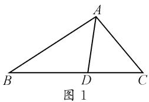
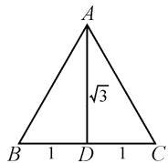

# 巧思维展开,妙视角变式:一道解三角形题的探究

# 江苏省沛县第二中学 徐 征

在新教材、新课程、新高考的“三新”背景中，解三角形是基于平面向量的一类基本应用问题，平面几何的“形”与三角函数的“数”二者巧融合的一类数学综合问题，可以巧妙融合初中、高中阶段的数学基础知识，交汇高中阶段中的不同知识模块之间的联系，成为充分落实新课标中“在知识交汇点处命题”的命题指导思想的一个重要考点，备受各方关注.

# 1 问题呈现

问题 在 $\triangle ABC$ 中,点 $D$ 在线段 $BC$ 上, $AD$ 是 $\angle A$ 的角平分线,若 $AD=\sqrt{3}$ , $BD\cdot CD=1$ ,则 $\frac{\sin B+\sin C}{\sin A}=$ \_\_\_\_.

此题以三角形为问题场景,借助三角形的角平分线所对应的长度,以及角平分线分对应边所成的两部分长度的关系来创设,由此确定三角形的几何特征与性质,进而确定三角形的三内角的正弦值所对应的三角关系式的值.

在实际解决问题时,回归解三角形问题的本质与内涵,可以从解三角形思维切入来分析与求解,是解决问题的一种“通性通法”;而借助所求三角函数关系式的值,可以从三角函数思维切入来解决,结合三角恒等变换公式来转化与应用;结合三角形这一平面几何图形的直观性,以及所求结果的定值这一性质特征,可以从特殊思维切入来巧妙突破,实现问题的“巧技妙解”.

# 2 问题破解

# 2.1 解三角形思维

解法 1: 解三角形法.

依题, 设 BD = x, AB = xy, 如图 1, 结合 $BD \cdot CD = 1$ , 可得 $CD = \frac{1}{x}$ .

text_image

A
B D C
图 1

而 $AD$ 是 $\angle A$ 的角平分线,结合三角形的内角平分线定理,可得 $\frac{AB}{AC}=\frac{BD}{CD}$ ,则 $AC=\frac{y}{x}.$

在 $\triangle ABD$ 中,由余弦定理可得

$$
x ^ {2} y ^ {2} = x ^ {2} + 3 - 2 \sqrt {3} x \cos \angle A D B. \tag {①}
$$

在 $\triangle ACD$ 中,由余弦定理可得

$$
\frac {y ^ {2}}{x ^ {2}} = \frac {1}{x ^ {2}} + 3 + \frac {2 \sqrt {3}}{x} \cos \angle A D B. \tag {②}
$$

由①②两式消去 $\cos\angle ADB$ ，可得 $y^{2}=4$ ，解得 y=2。

所以，结合正弦定理可得 $\frac{\sin B + \sin C}{\sin A} = \frac{b + c}{a} =$ $\frac{2x + \frac{2}{x}}{x + \frac{1}{x}} = 2.$ 故填答案：2.

点评:借助解三角形与平面几何中的相关知识来分析与处理,是解决此类解三角形问题中最为常用的技巧方法.具体解题时,合理引入参数,综合三角形的基本性质与基本定理,以及解三角形中的正弦定理与余弦定理等,构建相应的关系式与方程,给问题的分析与求解创造条件.

解法 2: 斯库顿定理法.

由于 AD 是 $\angle A$ 的角平分线, 如图 1, 结合斯库顿定理有 $AD^{2}=AB\cdot AC-BD\cdot CD=bc-1=3$ , 可得 bc=4.

利用三角形面积关系 $S_{\triangle ABC} = S_{\triangle ABD} + S_{\triangle ACD}$ ，可得 $\frac{1}{2}bc \sin A = \frac{1}{2}c \cdot \sqrt{3} \cdot \sin \frac{A}{2} + \frac{1}{2}b \cdot \sqrt{3} \cdot \sin \frac{A}{2}$ ,

所以 $b+c=\frac{bc\sin A}{\sqrt{3}\sin\frac{A}{2}}=\frac{4\sin A}{\sqrt{3}\sin\frac{A}{2}}=\frac{8\cos\frac{A}{2}}{\sqrt{3}}$ .

结合余弦定理, 可得 $a^{2}=b^{2}+c^{2}-2bc\cos A=$

$$
\begin{array}{l} {(b + c) ^ {2} - 2 b c (1 + \cos A) = \frac {6 4 \cos^ {2} \frac {A}{2}}{3} - 8 (1 + \cos A) =} \\ {\frac {6 4 \cos^ {2} \frac {A}{2}}{3} - 1 6 \cos^ {2} \frac {A}{2} = \frac {1 6}{3} \cos^ {2} \frac {A}{2}, \text {可得} a = \frac {4}{\sqrt {3}} \cos \frac {A}{2}.} \end{array}
$$

所以,结合正弦定理有 $\frac{\sin B+\sin C}{\sin A}=\frac{b+c}{a}=2.$

点评:借助三角形的斯库顿定理,利用边长之间的关系来确定两边的乘积关系,为三角形的面积公式、余弦定理与正弦定理等的进一步应用创造条件.三角形的斯库顿定理,是课外的一个拓展与提升,初中平面几何教材中并没有涉及,是一个非常特殊且用处较大的平面几何基本定理.

# 2.2 三角函数思维

解法 3: 三角恒等变换法.

依题, 结合正弦定理有 $\frac{BD}{\sin\frac{A}{2}} = \frac{AD}{\sin B}, \frac{CD}{\sin\frac{A}{2}} = \frac{AD}{\sin C}$ ，则可得 $BD \sin B = AD \sin \frac{A}{2}, CD \sin C = AD \sin \frac{A}{2}$ ，进而结合 $AD = \sqrt{3}, BD \cdot CD = 1$ ，于是可得 $\sin B \sin C = AD^{2} \sin^{2} \frac{A}{2} = 3 \sin^{2} \frac{A}{2}$ .

利用积化和差与二倍角公式, 得 $\frac{1}{2}\left[\cos(B-C)-\cos(B+C)\right]=3\times\frac{1}{2}(1-\cos A)$ ，则有 $\cos(B-C)+\cos A=3(1-\cos A)$ .

所以 $4\cos A = 3 - \cos (B - C) = 3 - \left(2\cos^2\frac{B - C}{2} -1\right) =$ $4 - 2\cos^2{\frac{B - C}{2}}.$

那么 $2\cos^2\frac{B - C}{2} = 4(1 - \cos A) = 8\sin^2\frac{A}{2}$ ，即 $\cos^2\frac{B - C}{2} = 4\sin^2\frac{A}{2}$ ，从而 $\cos \frac{B - C}{2} = 2\sin \frac{A}{2}$ .

所以 $2 = \frac{\cos \frac{B - C}{2}}{\sin \frac{A}{2}} = \frac{2 \sin \frac{B + C}{2} \cos \frac{B - C}{2}}{2 \sin \frac{B + C}{2} \sin \frac{A}{2}} = \frac{\sin B + \sin C}{2 \cos \frac{A}{2} \sin \frac{A}{2}} = \frac{\sin B + \sin C}{\sin A}$ （注意这里 $\sin \frac{B + C}{2} = \sin \frac{\pi - A}{2} = \cos \frac{A}{2}$ ），即 $\frac{\sin B + \sin C}{\sin A} = 2.$

点评:借助三角函数关系式的求解结果,从解三角形中的正弦定理切入,利用积化和差公式、二倍角公式、诱导公式等对应的三角恒等变换来转化与应用,实现三角函数关系式的求值与应用.利用三角恒等变换公式法来分析与处理时,逻辑推理比较复杂,思维方式比较难以把握.

# 2.3 特殊思维

解法 4: 特殊法.

依题,问题中所求结果为定值,借助特殊思维,取特殊的 $\triangle ABC$ .令 $AD=\sqrt{3}$ ,BD=CD=1,此时满足 $BD\cdot CD=1$ ,且 $AD\perp BC$ ,如图2.

结合勾股定理可知， $AB = AC = \sqrt{3 + 1} = 2.$ 所以，结合正弦定理有 $\frac{\sin B + \sin C}{\sin A} = \frac{b + c}{a} = \frac{2 + 2}{1 + 1} = 2.$

  
图2

点评:借助所求结果的确定性以及平面几何图形的特殊性,合理构建特殊平面几何图形,通过特殊法思维来分析与处理,给问题的分析与求解创造更加简捷的方式,为快速处理此类问题奠定基础.用特殊思维法解题时,要注重问题的基本特征,不能盲目特殊化处理,同时还要注意条件与结论之间的联系与转化.

# 3 变式拓展

# 3.1 一般化变式

变式1 在 $\triangle ABC$ 中，点 $D$ 在线段 $BC$ 上， $AD$ 是 $\angle A$ 的角平分线，若 $AD = \lambda (\lambda > 0), BD \cdot CD = 1$ ，则 $\frac{\sin B + \sin C}{\sin A} =$ \_\_\_\_. ( $\sqrt{\lambda^2 + 1}$ )

# 3.2 类比性变式

变式 2 在 $\triangle ABC$ 中, 点 $D$ 在线段 $BC$ 上, $AD$ 是 $\angle A$ 的角平分线, 若 $AB=2, AD=AC=1$ , 则 $BD=(\quad)$ . (B)

A. $\frac{\sqrt{2}}{2}$

B. $\sqrt{2}$

C.2

D. $\frac{3\sqrt{2}}{2}$

合理借助解三角形中的三角形面积关系与面积公式加以巧妙转化,综合余弦定理的应用,实现线段长度的分析与求解.

# 4 教学启示

# 4.1 “数”“形”融合,化归转化

解三角形综合问题中,合理通过情境,巧妙创设初中、高中阶段不同数学基础知识之间的联系,从而自然地融入数学思想方法与技巧策略等.

而在具体破解此类问题时，“数”与“形”的融合与应用都可以达到目的。实际解题时，经常可以借助解三角形中“数”的本质与内涵，有序进行数学运算；也可以借助解三角形中“形”的实质与回归，巧妙直观想象，合理化归转化。

# 4.2 回归本质,拓展思维

在解三角形综合问题中,借助解三角形、平面几何等知识中相应的定理、公式等,有机实现三角形中对应边与对应角的转化与应用.同时合理回归平面几何图形的直观形象,数形结合来直观处理与应用.

从问题中合理挖掘内涵,回归问题的本质,借助解三角形问题的数学运算或直观想象,实现初中、高中知识间的交汇与融合,特别是巧妙将相关的解三角形、三角函数、函数与方程等知识巧妙地渗透与融合进去,拓展数学思维方式与解题策略,实现解题过程的优化与创新应用.Z