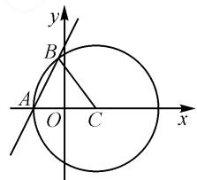

# 开放有序,创新无限

# ● 河北定州中学 卢小颖

在新教材、新课标、新高考的“三新”背景下，高考数学命题进入新“风口”与新“赛道”，命题寻求谋新、谋变、谋真、谋活，坚持开放创新，借助举例问题、存在问题、结构不良问题、多选问题等开放创新问题的巧妙引入与灵活设置，坚持数学核心素养导向，倡导数学关键能力考查，注重数学创新意识与创新应用，体现高考的选拔性与区分度。本文中结合2023年高考数学新高考Ⅱ卷第15题，从多视角切入，挖掘问题的内涵与实质，开拓思维。

# 1 真题呈现

高考真题 （2023年高考数学新高考Ⅱ卷·15）已知直线 $x - my + 1 = 0$ 与 $\odot C: (x - 1)^{2} + y^{2} = 4$ 交于 A, B 两点，写出满足“△ABC 面积为 $\frac{8}{5}$ ”的 m 的一个值 \_\_\_\_.

本题以直线与圆的位置关系为背景,利用直线与圆相交时的两个交点以及圆心所构成的三角形,通过三角形面积数值的给出,进而确定直线中参数的值.场景比较熟悉,知识比较基础.

# 2 真题破解

# 2.1 解析几何思维

解法 1: 坐标转化法.

如图1所示，依题意知直线 $x - my + 1 = 0$ 与 $\odot C$ 的一个交点为 $x$ 轴上的点（-1,0），设点 $A(-1,0)$ ，点 $B(x_{B},y_{B})$ ，根据图形的对称性，不妨令 $y_{B} > 0$ ，则有 $\triangle ABC$ 面积 $S_{\triangle ABC} = \frac{1}{2}\times |AC|\times$ $y_{B} = y_{B} = \frac{8}{5}.$

text_image

y
B
A
O
C
x

图1

根据点 B 在 $\odot C$ 上，则有 $(x_{B}-1)^{2}+\left(\frac{8}{5}\right)^{2}=4$ ，解得 $x_{B}=-\frac{1}{5}$ 或 $x_{B}=\frac{11}{5}$ .

当 $x_{B}=-\frac{1}{5}$ 时，则 $m=\frac{x_{B}+1}{y_{B}}=\frac{1}{2}$ ;

当 $x_{B}=\frac{11}{5}$ 时，则 $m=\frac{x_{B}+1}{y_{B}}=2.$

综上分析,结合图形的对称性,可得 $m=\pm\frac{1}{2}$ 或 $m=\pm2$ .

故填答案: $2\left(\text{或}\frac{1}{2}, -\frac{1}{2}, -2.\right.$ 答案不唯一, 只要选择以上四个答案中的一个填入即可).

解法 2: 弦长公式转化法.

依题知 $\odot C$ 的圆心 $C(1,0)$ ，半径r=2。

设圆心 C 到弦 AB 的距离为 d，结合弦长公式可得 $\left|AB\right|=2\sqrt{4-d^{2}}$ ，则有 $\triangle ABC$ 面积 $S_{\triangle ABC}=\frac{1}{2}\times\left|AB\right|\times d=d\sqrt{4-d^{2}}=\frac{8}{5}$ ，解得 $d^{2}=\frac{4}{5}$ 或 $d^{2}=\frac{16}{5}$ ，所以 $d=\frac{2\sqrt{5}}{5}$ 或 $d=\frac{4\sqrt{5}}{5}$ .

当 $d = \frac{2\sqrt{5}}{5}$ 时，利用点到直线的距离公式，可得 $d = \frac{|1 - 0 + 1|}{\sqrt{1 + m^2}} = \frac{2}{\sqrt{1 + m^2}} = \frac{2\sqrt{5}}{5}$ ，解得 $m = \pm 2$ ；当 $d = \frac{4\sqrt{5}}{5}$ 时，利用点到直线的距离公式，可得 $d =$ $\frac{|1 - 0 + 1|}{\sqrt{1 + m^2}} = \frac{2}{\sqrt{1 + m^2}} = \frac{4\sqrt{5}}{5}$ ，解得 $m = \pm \frac{1}{2}$

综上分析,可得 $m=\pm\frac{1}{2}$ 或 $m=\pm2$ .

故填答案: $2\left(\text{或}\frac{1}{2}, -\frac{1}{2}, -2.\right.$ 答案不唯一, 只要选择以上四个答案中的一个填入即可).

# 2.2 平面几何思维

解法 3: 解三角形法.

依题知 $\odot C$ 的圆心 $C(1,0)$ ，半径r=2。

如图1所示，依题知直线 $x - my + 1 = 0$ 与 $\odot C$ 的一个交点为 $x$ 轴上的点 $(-1,0)$ ，不妨设 $A(-1,0)$ ，于是可得 $\triangle ABC$ 的面积 $S_{\triangle ABC} = \frac{1}{2} r^2\sin \angle ACB = 2\sin \angle ACB = \frac{8}{5}$ ，解得 $\sin \angle ACB = \frac{4}{5}$ . 利用平方关系可得 $\cos \angle ACB = \pm \frac{3}{5}$ ，结合余弦定理得 $|AB| =$

$\sqrt{r^{2}+r^{2}-2r^{2}\cos\angle ACB}$ ，可得 $|AB|=\frac{4\sqrt{5}}{5}$ 或 $|AB|=$ $\frac{8\sqrt{5}}{5}.$

当 $|AB|=\frac{4\sqrt{5}}{5}$ 时，此时圆心C到弦AB的距离为 $d=\sqrt{r^{2}-\left(\frac{|AB|}{2}\right)^{2}}=\frac{4\sqrt{5}}{5}$ ，结合点到直线的距离公式，得 $d=\frac{|1-0+1|}{\sqrt{1+m^{2}}}=\frac{2}{\sqrt{1+m^{2}}}=\frac{4\sqrt{5}}{5}$ ，解得 $m=\pm\frac{1}{2}$ .

当 $|AB|=\frac{8\sqrt{5}}{5}$ 时，此时圆心C到弦AB的距离为 $d=\sqrt{r^{2}-\left(\frac{|AB|}{2}\right)^{2}}=\frac{2\sqrt{5}}{5}$ ，结合点到直线的距离公式，得 $d=\frac{|1-0+1|}{\sqrt{1+m^{2}}}=\frac{2}{\sqrt{1+m^{2}}}=\frac{2\sqrt{5}}{5}$ ，解得 $m=\pm2$ .

综上分析, 可得 $m = \pm \frac{1}{2}$ 或 $m = \pm 2$ .

故填答案: $\left(2\text{或}\frac{1}{2},-\frac{1}{2},-2.\right)$ 答案不唯一,只要选择以上四个答案中的一个填入即可).

解法 4: 三角函数法.

依题知 $\odot C$ 的圆心 $C(1,0)$ ，半径r=2。

如图1所示，依题知直线 $x - my + 1 = 0$ 与 $\odot C$ 的一个交点为 $x$ 轴上的点 $(-1,0)$ ，不妨设 $A(-1,0)$ ，则 $\triangle ABC$ 面积 $S_{\triangle ABC} = \frac{1}{2} r^2\sin \angle ACB = 2\sin \angle ACB = \frac{8}{5}$ ，可得 $\sin \angle ACB = \frac{4}{5}$ .

设 $\angle ACB = 2\theta$ ，则有 $2\sin \theta \cos \theta = \frac{4}{5}$ ，可得 $\frac{2\sin\theta\cos\theta}{\sin^2\theta + \cos^2\theta} = \frac{4}{5}$ 即 $\frac{2\tan\theta}{\tan^2\theta + 1} = \frac{4}{5}$ 解得 $\tan \theta = \frac{1}{2}$ 或 $\tan \theta = 2.$

若 $m \neq 0$ ，由 x - my + 1 = 0 得 $y = \frac{1}{m}x + \frac{1}{m}$ .

根据图形的对称性, 当 $\tan\theta=\frac{1}{2}$ 时, 可得 $\left|\frac{1}{m}\right|=2$ , 解得 $m=\pm\frac{1}{2}$ .

当 $\tan \theta = 2$ 时，可得 $\left|\frac{1}{m}\right| = \frac{1}{2}$ ，解得 $m = \pm 2$ .

若 m=0 ，显然不合题意。

综上分析, 可得 $m = \pm \frac{1}{2}$ 或 $m = \pm 2$ .

故填答案: $2\left(\text{或}\frac{1}{2}, -\frac{1}{2}, -2.\right.$ 答案不唯一, 只要

选择以上四个答案中的一个填入即可）.

# 3 变式拓展

# 3.1 命题形式的改变

变式 1 已知直线 $x - my + 1 = 0$ 与 $\odot C: (x - 1)^{2} + y^{2} = 4$ 交于 A, B 两点，则所有满足 “ $\triangle ABC$ 面积为 $\frac{8}{5}$ ” 的 m 的值构成的集合为 \_\_\_\_.

答案: $\left\{-2,-\frac{1}{2},\frac{1}{2},2\right\}$ .

# 3.2 命题视角的改变

变式 2 过定点 M 的直线 $l: ax + y - 2a + 4 = 0$ 与 $\odot C: x^{2} + y^{2} = 4$ 交于 A, B 两点，A 恰好为 MB 的中点，写出满足条件的 a 的一个值 \_\_\_\_.

解析:由直线 $l:ax+y-2a+4=0$ ，可得 $y+4=-a(x-2)$ ，则知直线 $l:ax+y-2a+4=0$ 过定点 $M(2,-4)$ 。设 $A(m,n)$ ，结合 A 恰好为 MB 的中点，可得 $B(2m-2,2n+4)$ 。

根据 A, B 两点均在 $\odot C: x^{2} + y^{2} = 4$ 上，所以可以得到 $\left\{\begin{aligned} m^{2} + n^{2} &= 4, \\ (2m - 2)^{2} + (2n + 4)^{2} &= 4, \end{aligned}\right.$ 解得 $\left\{\begin{aligned} m &= 0, \\ n &= -2, \end{aligned}\right.$ 或 $\left\{\begin{aligned} m &= \frac{8}{5}, \\ n &= -\frac{6}{5}, \end{aligned}\right.$ 即 $A(0, -2)$ 或 $A\left(\frac{8}{5}, -\frac{6}{5}\right)$ .

将 $A(0,-2)$ 代入直线 $l:ax+y-2a+4=0$ ，得 a=1；将 $A\left(\frac{8}{5},-\frac{6}{5}\right)$ 代入直线 $l:ax+y-2a+4=0$ ，可得 a=7。

综上分析，a=1 或 a=7.

故填答案:1(或7,答案不唯一,只要选择以上两个答案中的一个填入即可).

# 4 教学启示

此类举例问题具有很好的创新性、开放性与灵活性，能很好地考查考生的“四基”水平，解题具有明确的思维开放性与操作灵活性，给不同层次的考生提供了发挥自身知识水平、灵活应用能力等方面的平台与空间.

在新教材、新课标、新高考的“三新”背景下，随着新课程教学与新高考改革的不断推进与深入，积极贯彻《深化新时代教育评价改革总体方案》的要求，高考命题也尝试适度加大开放题的创新力度，经常以创新场景融合基础知识、以创新形式结合常规知识等，创设举例问题、存在问题、结构不良问题、多选问题等开放创新问题，多视角、多方位考查考生的“四基”，全面推进新课程教学与新高考改革，贯彻数学创新与数学应用，吻合高考的选拔与区分功能，培养数学核心素养，提升数学关键能力.