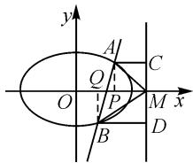

# 由一道高考题体验角相等问题的多种证法

# ● 安徽省宿州市第二中学 文 芳 周敏敏

一题多解可以进一步拓宽解题思路,提高分析和解决问题的能力.本文中对一道高考试题进行多种解法研究,希望能在一题多解方面抛砖引玉,对发展学生数学核心素养起到引领作用.

# 1 题目

(2018·新课标Ⅰ卷·19)设椭圆 $C:\frac{x^{2}}{2}+y^{2}=1$ 的右焦点为 F，过 F 的直线 l 与 C 交于 A，B 两点，点 M 的坐标为 (2,0).

(1) 当 l 与 x 轴垂直时, 求直线 AM 的方程;  
(2) 设 O 为坐标原点, 证明: $\angle OMA = \angle OMB$ .

# 2 解法展示

本题第(1)问较为简单, 易求直线 AM 的方程为 $y = -\frac{\sqrt{2}}{2}x + \sqrt{2}$ 或 $y = \frac{\sqrt{2}}{2}x - \sqrt{2}$ ; 第(2)问中当 l 与 x 轴重合时较为简单, 本文不作研究, 也就是说, 下面对第(2)问的研究默认 l 与 x 轴不重合.

预备结论(此结论在本文后续解法中都会用到,为节省版面,在此处统一设置为预备结论):当直线 l 与 x 轴不重合时,设直线 l 的方程为 $x=my+1$ , $A(x_{1},y_{1})$ , $B(x_{2},y_{2})$ ,联立直线与椭圆 $C:\frac{x^{2}}{2}+y^{2}=1$ , 整理得, $(m^{2}+2)y^{2}+2my-1=0$ , 所以 $y_{1}+y_{2}=-\frac{2m}{m^{2}+2}$ , $y_{1}y_{2}=-\frac{1}{m^{2}+2}$ .

思路 1: $\angle OMA, \angle OMB$ 分别是直线 MA, MB 与 x 轴所成的角, $\angle OMA = \angle OMB$ 实质是 MA, MB 的倾斜角互补, 所以可以通过证明 MA, MB 的斜率之和为 0 使结论得到证明.

证明 1: 当 l 与 x 轴垂直时, OM 为 AB 的垂直平分线, 所以 $\angle OMA = \angle OMB$ .

当 l 与 x 轴不重合也不垂直时，设 $l: y = k(x - 1)$ $(k \neq 0)$ , $A(x_{1}, y_{1})$ , $B(x_{2}, y_{2})$ ，则 $x_{1} < \sqrt{2}$ , $x_{2} < \sqrt{2}$ ，直线 MA, MB 的斜率之和为

$$
k _ {M A} + k _ {M B} = \frac {y _ {1}}{x _ {1} - 2} + \frac {y _ {2}}{x _ {2} - 2}.
$$

由 $y_{1}=kx_{1}-k, y_{2}=kx_{2}-k$ , 得

$$
k _ {M A} + k _ {M B} = \frac {2 k x _ {1} x _ {2} - 3 k (x _ {1} + x _ {2}) + 4 k}{(x _ {1} - 2) (x _ {2} - 2)}.
$$

将 $y=k(x-1)$ 代入 $\frac{x^{2}}{2}+y^{2}=1$ ，整理得

$$
(2 k ^ {2} + 1) x ^ {2} - 4 k ^ {2} x + 2 k ^ {2} - 2 = 0.
$$

所以 $x_{1}+x_{2}=\frac{4k^{2}}{2k^{2}+1},x_{1}x_{2}=\frac{2k^{2}-2}{2k^{2}+1}.$

于是，可得 $2kx_{1}x_{2} - 3k(x_{1} + x_{2}) + 4k = \frac{4k^{3} - 4k - 12k^{3} + 8k^{3} + 4k}{2k^{2} + 1} = 0.$

所以 $k_{MA} + k_{MB} = 0$ ，即 MA, MB 的倾斜角互补，故 $\angle OMA = \angle OMB$ .

综上， $\angle OMA = \angle OMB.$

点评:此证法充分利用了两直线关于 x 轴对称则两直线的倾斜角互补这一信息,将角相等问题转化为两直线的斜率之和的问题,使问题得到证明 $^{[1]}$ .

思路 2 证明 $\angle OMA = \angle OMB$ 实质是证明 MF 为 $\angle AMB$ 的平分线, 所以可以利用角平分线的定义进行证明.

证明 2:(简证)由预备结论及题意知,直线 AM 的方程为 $y=\frac{y_{1}}{x_{1}-2}(x-2)$ ，直线 BM 的方程为 $y=\frac{y_{2}}{2-x_{2}}(x-2)$ .

易得点 F 到直线 AM, BM 的距离分别为

$$
d _ {A M} = \frac {\left| - y _ {1} \right|}{\sqrt {y _ {1} ^ {2} + (2 - x _ {1}) ^ {2}}}, d _ {B M} = \frac {\left| - y _ {2} \right|}{\sqrt {y _ {2} ^ {2} + (2 - x _ {2}) ^ {2}}}.
$$

计算可得 $d_{AM}^{2}-d_{BM}^{2}=0$ ，即 $d_{AM}=d_{BM}$ ，所以 DM 为 $\angle AMB$ 的平分线。故 $\angle OMA=\angle OMB$ 。

点评: 此证法充分利用了角平分线的定义, 将证明角相等转化为计算点 F 到角的两边的距离的计算问题, 利用点到直线的距离公式使问题得到证明.

思路 3 要证明 $\angle OMA = \angle OMB$ ，实质是在 $\triangle MAB$ 中证明 MF 为 $\angle AMB$ 的平分线，所以，可以利用三角形内角平分线定理进行证明.

证明 3:(简证)由预备结论及题意,知

$$
\left| A F \right| = \sqrt {\left(x _ {1} - 1\right) ^ {2} + y _ {1} ^ {2}}, \left| A M \right| = \sqrt {\left(x _ {1} - 2\right) ^ {2} + y _ {1} ^ {2}},
$$

$$
\left| B F \right| = \sqrt {\left(x _ {2} ^ {2} - 1\right) ^ {2} + y _ {2} ^ {2}}, \left| B M \right| = \sqrt {\left(x _ {2} - 2\right) ^ {2} + y _ {2} ^ {2}}.
$$

由上述各式可得 $|AF|\cdot|BM|-|AM|\cdot|BF|=0.$

所以 $\frac{|AF|}{|BF|} = \frac{|AM|}{|BM|}$ ，由三角形内角平分线定理得 $\angle OMA = \angle OMB$ .

点评:此证法充分利用了角平分线定理,将证明角相等的问题转化为距离的计算问题,使用两点间距离公式使问题得到证明.

思路 4 设出点 A, B 的坐标, 则 $\triangle MAB$ 中各线段及 MF 的长度均可计算, 所以可以利用余弦定理证明 $\cos \angle OMA = \cos \angle OMB$ , 从而证得 $\angle OMA = \angle OMB$ .

证明 4: (简证)由预备结论及题意, 先利用距离公式可求出 $\left|AM\right|$ , $\left|MF\right|$ , $\left|AF\right|$ , $\left|BM\right|$ , $\left|BF\right|$ , 再利用余弦定理得出

$$
\begin{array}{l} \cos \angle O M A - \cos \angle O M B \\ = \frac {\left| A M \right| ^ {2} + \left| M F \right| ^ {2} - \left| A F \right| ^ {2}}{2 \left| A M \right| \left| F M \right|} \\ \frac {\left| B M \right| ^ {2} + \left| M F \right| ^ {2} - \left| B F \right| ^ {2}}{2 \left| B M \right| \left| F M \right|} \\ = 0. \\ \end{array}
$$

又由题意可知 $\angle OMA, \angle OMB$ 均为锐角，所以 $\angle OMA = \angle OMB.$

点评:此证法将证明角相等转化为解三角形问题,使用余弦定理使结论得到证明,可进一步训练思维的发散性.

思路 5 设出点 A, B 的坐标, 则 $\triangle MAB$ 中各点坐标均可求出, 于是, 可以利用向量证明 $\angle OMA = \angle OMB$ .

证明 5: (简证)由预备结论及题意, 先利用向量坐标公式可以表示出 $\overrightarrow{MA}, \overrightarrow{MB}, \overrightarrow{MF}$ , 再利用向量的数量积求出 $\cos\angle OMA - \cos\angle OMB = \frac{\overrightarrow{MA} \cdot \overrightarrow{MF}}{|\overrightarrow{MA}| |\overrightarrow{MF}|} - \frac{\overrightarrow{MB} \cdot \overrightarrow{MF}}{|\overrightarrow{MB}| |\overrightarrow{MF}|} = 0.$

又由题意可知 $\angle OMA, \angle OMB$ 均为锐角，所以 $\angle OMA = \angle OMB$ .

点评:此证法充分利用了向量知识,将证明角相等的问题转化为向量夹角的计算问题,借助于向量的数量积和向量模的计算使问题得到解决,此解法突显了向量的工具性作用.

思路 6 利用角的对称性, 角的两边关于角平分线对称, 可以借助对称性证明 $\angle OMA = \angle OMB$ .

证明 6: (简证)由预备结论及题意, 知点 $B(x_{2}, y_{2})$ 关于 x 轴的对称点为 $B_{0}(x_{2}, -y_{2})$ ，直线 AM 的方程为 $y = \frac{y_{1}}{x_{1} - 2}(x - 2)$ .

将点 $B_{0}$ 坐标代入 AM 的方程, 方程成立, 所以点 B 关于 x 轴的对称点在直线 AM 上.

所以 $\angle OMA = \angle OMB$

点评:此证法充分利用了角平分线是角的对称轴这一性质,将证明角相等转化为证明对称问题,通过判断对称使结论得到证明,进一步拓宽了解题思路.

思路 7 M 恰好为椭圆的准线与 x 轴的交点, 要证明 $\angle OMA = \angle OMB$ , 只需证明其余角相等即可.

证明 7: (简证) 如图 1, 过点 M 作直线 x=2, 其恰好为椭圆的准线, 过点 A, B 分别作直线 x=2 的垂线, 垂足分别为 C, D, 由椭圆第二定义, 得 $\frac{|AF|}{|AC|} = \frac{|BF|}{|BD|} = e$

text_image

y
A
C
Q
O
P
M x
B
D

图1

(e 为椭圆离心率). 过点 A, B 分别作直线 x 轴的垂线, 交 x 轴于点 P, Q, 显然, $\triangle APF \sim \triangle BQF$ , 所以有 $\frac{|AF|}{|AP|} = \frac{|BF|}{|BQ|}$ . 又因为 $|AP| = |CM|$ , $|BQ| = |DM|$ , 可得 $\frac{|AC|}{|BD|} = \frac{|CM|}{|DM|}$ , 所以 $\triangle ACM \sim \triangle BDM$ , 则 $\angle AMC = \angle BMD$ , 从而 $\angle OMA = \angle OMB$ .

点评:此证法充分利用了 M 是椭圆准线与 x 轴的交点这一特殊信息解题,借助于椭圆第二定义,通过判断三角形相似使结论得到证明 $^{[2]}$ .

高考题的特点是条条道路通罗马,从多个角度入手都可以解题,但是,不同的解题角度体现出不同的思维水平.本文中结合一道高考试题对角相等问题的证法进行了多角度分析,涉及了更多的思路和方法,充分拓宽了解题视野.多角度解题可以促使我们站在数学学科整体的高度分析问题、研究问题,文中的多种证法可以更好地帮助我们求解角相等的问题,同时由点及面,进一步提高思维的发散性、灵活性,对于拓宽解题思路和发展数学素养大有裨益.

# 参考文献：

[1]章建跃.利用几何图形建立直观通过代数运算刻画规律——解析几何内容分析与教学思考(之一)[J].数学通报,2021,60(7):7-14.

[2]颜英邦,郑兴明,张怀义,等.高考数学试题分类解析[J].数学教学通讯,2002(SC):5-39.Z