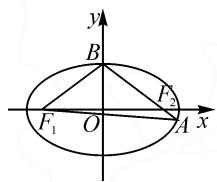

# 间接思维设角参,直接思维设边参

——一道离心率最值的确定

# ● 福建省长泰第二中学 沈秋彬

基于圆锥曲线的场景设置与综合应用,借助离心率的求值与最值(或取值范围)问题,通常是高考命题中的一个热点问题,场景创新,形式多变,常考常新.此类问题能够巧妙立足平面解析几何场景,合理融合函数与方程、平面几何、平面向量与解三角形、三角函数、不等式等相关知识点与基础内容,非常契合高考数学试卷“在知识交汇点处”命题的指导思想,是数学命题的一种灵活变换与综合应用,备受各方关注.

# 1 问题呈现

问题 如图 1, 已知椭圆 C 的左、右焦点分别为 $F_{1}, F_{2}$ 上顶点为 B, 直线 $BF_{2}$ 与 C 相交于另一点 A, 当 $\cos\angle F_{1}AB$ 最小时, C 的离心率为 \_\_\_\_.

text_image

y
B
F₂
F₁ O A x

图1

此题以椭圆为问题场景, 结合椭圆中相关点的确定与角的构建, 利用 $\cos\angle F_{1}AB$ 取值的最小值来设置条件, 进而确定此时对应椭圆的离心率的值. 合理的创设, 巧妙将平面解析几何与解三角形、三角函数等相关知识加以融合, 实现知识的交汇与能力的综合.

在实际解答过程中,可以抓住问题中的关键条件“ $\cos\angle F_{1}AB$ 取最小值”,或采用直接思维直接构建与之相关的表达式,或采用间接思维间接构建其他相关表达式来转化,这些都是解决此问题时比较常用的基本技巧方法.

# 2 问题破解

# 2.1 间接思维

解法 1: 设角参.

设椭圆 C 的长轴长、短轴长、焦距分别为 2a, 2b,
2c, $\angle F_{1}AB=\alpha,\angle F_{1}F_{2}B=\beta.$ 显然 $\alpha\in\left(0,\frac{\pi}{2}\right).$

在 Rt△BOF₂ 中， $|BF_{2}| = a, |OB| = b, |OF_{2}| = c, \sin \beta = \frac{b}{a}, \cos \beta = \frac{c}{a}$ . 在 $\triangle AF_{1}F_{2}$ 中，利用正弦定

理，可得 $\frac{|AF_1|}{\sin(\pi - \beta)} = \frac{|AF_2|}{\sin(\beta - \alpha)} = \frac{2c}{\sin\alpha}$ ，于是结合比例性质可以得到 $\frac{|AF_1| + |AF_2|}{\sin(\pi - \beta) + \sin(\beta - \alpha)} = \frac{2c}{\sin\alpha}$ ，则可得 $\frac{2a}{\sin\beta + \sin(\beta - \alpha)} = \frac{2c}{\sin\alpha}$ ，亦即 $\frac{a}{2\sin\left(\beta - \frac{\alpha}{2}\right)\cos\frac{\alpha}{2}} = \frac{c}{2\sin\frac{\alpha}{2}\cos\frac{\alpha}{2}}$ ，则有 $c\sin\left(\beta - \frac{\alpha}{2}\right) = a\sin\frac{\alpha}{2}$ ，展开可得 $c\sin\beta\cos\frac{\alpha}{2} - c\cos\beta\sin\frac{\alpha}{2} = a\sin\frac{\alpha}{2}$ .

所以 $\tan\frac{\alpha}{2}=\frac{c\sin\beta}{a+c\cos\beta}=\frac{bc}{a^{2}+c^{2}}=\frac{bc}{b^{2}+2c^{2}}\leqslant$ $\frac{bc}{2\sqrt{2}bc}=\frac{1}{2\sqrt{2}}$ ，当且仅当 $b^{2}=2c^{2}$ ，即 $b=\sqrt{2}c$ 时， $\tan\frac{\alpha}{2}$ 取得最大值，从而 $\frac{\alpha}{2}$ 取得最大值，即 $\alpha$ 取得最大值，此时 $\cos\angle F_{1}AB$ 取得最小值.

$$
\text { 由 } b = \sqrt {2} c, \text { 得 } e = \frac {c}{a} = \sqrt {\frac {c ^ {2}}{2 c ^ {2} + c ^ {2}}} = \frac {\sqrt {3}}{3}.
$$

点评:间接思维的本质就是基于所求问题,通过等价形式来转化与求解,进而结合逻辑推理与数学运算来转化.关键在于借助解三角形中的正弦定理加以切入,结合诱导公式、三角恒等变换公式(和差化积公式、二倍角公式、两角差的正弦公式等)等,综合比例性质、基本不等式、正切函数与余弦函数的单调性等来应用,间接来确定所求角的余弦值的最值问题.间接思维中,借助角参的设置,对数学思维的能力要求比较高.

# 2.2 直接思维

解法 2: 设边参 1.

设椭圆 C 的长轴长、短轴长、焦距分别为 2a, 2b, 2c，则 $\left|BF_{1}\right| = \left|BF_{2}\right| = a$ 。设 $\left|AF_{2}\right| = m$ ，结合椭圆的定义可知 $\left|AF_{1}\right| = 2a - m$ 。在 $\triangle AF_{1}F_{2}$ 和 $\triangle ABF_{1}$ 中，分别利用余弦定理，可得

$$
\begin{array}{l} \cos \angle F _ {1} A B = \frac {\left| A F _ {1} \right| ^ {2} + \left| A F _ {2} \right| ^ {2} - \left| F _ {1} F _ {2} \right| ^ {2}}{2 \left| A F _ {1} \right| \left| A F _ {2} \right|} = \\ \frac {(2 a - m) ^ {2} + m ^ {2} - 4 c ^ {2}}{2 m (2 a - m)}. \\ \end{array}
$$

$$
\cos \angle F _ {1} A B = \frac {\left| A F _ {1} \right| ^ {2} + \left| A B \right| ^ {2} - \left| B F _ {1} \right| ^ {2}}{2 \left| A F _ {1} \right| \left| A B \right|} =
$$

$$
\frac {(2 a - m) ^ {2} + (a + m) ^ {2} - a ^ {2}}{2 (2 a - m) (a + m)}.
$$

$$
\text {   故   } \frac {(2 a - m) ^ {2} + m ^ {2} - 4 c ^ {2}}{2 m (2 a - m)} = \frac {(2 a - m) ^ {2} + (a + m) ^ {2} - a ^ {2}}{2 (2 a - m) (a + m)},
$$

整理可得 $m=\frac{a(a^{2}-c^{2})}{a^{2}+c^{2}}$ .

于是得 $\cos \angle F_{1}AB = \frac{(2a - m)^{2} + m^{2} - 4c^{2}}{2m(2a - m)} =$

$$
\frac {a ^ {4} + a ^ {2} c ^ {2} + 2 c ^ {4}}{a ^ {4} + 3 a ^ {2} c ^ {2}} = \frac {2}{9} (3 e ^ {2} + 1) + \frac {\frac {8}{9}}{3 e ^ {2} + 1} - \frac {1}{9} \geqslant
$$

$$
2 \sqrt {\frac {2}{9} (3 e ^ {2} + 1) \times \frac {\frac {8}{9}}{3 e ^ {2} + 1}} - \frac {1}{9} = \frac {7}{9}, \text {当且仅当} \frac {2}{9} \times
$$

$(3e^{2} + 1) = \frac{\frac{8}{9}}{3e^{2} + 1}$ , 即 $e^{2} = \frac{1}{3}$ , 亦即 $e = \frac{\sqrt{3}}{3}$ 时, 等号成立.

所以当 $\cos\angle F_{1}AB$ 取得最小值 $\frac{7}{9}$ 时，C 的离心率为 $\frac{\sqrt{3}}{3}$ .

解法 3: 设边参 2.

设椭圆 C 的长轴长、短轴长、焦距分别为 2a, 2b, 2c，则 $\left|BF_{1}\right| = \left|BF_{2}\right| = a$ 。设 $\left|AF_{2}\right| = m$ ，结合椭圆的定义可知 $\left|AF_{1}\right| = 2a - m$ 。在 $\triangle ABF_{1}$ 中，利用余弦定理，可得 $\cos\angle F_{1}AB = \frac{\left|AF_{1}\right|^{2} + \left|AB\right|^{2} - \left|BF_{1}\right|^{2}}{2\left|AF_{1}\right|\left|AB\right|} =$

$$
\frac {(2 a - m) ^ {2} + (a + m) ^ {2} - a ^ {2}}{2 (2 a - m) (a + m)} = \frac {m ^ {2} - a m + 2 a ^ {2}}{- m ^ {2} + a m + 2 a ^ {2}} = - 1 -
$$

$$
\frac {4 a ^ {2}}{m ^ {2} - a m - 2 a ^ {2}} = - 1 - \frac {4 a ^ {2}}{\left(m - \frac {a}{2}\right) ^ {2} - \frac {9}{4} a ^ {2}}. \text {当} m = \frac {a}{2}
$$

时， $\left(m - \frac{a}{2}\right)^2 -\frac{9}{4} a^2$ 取得最小值一 $\frac{9}{4} a^2$ ，此时 $\cos \angle F_{1}AB$ 取得最小值 $\frac{7}{9}$ .而此时 $\triangle AF_1F_2$ 中， $|AF_2| =$ $\frac{a}{2},|AF_1| = \frac{3a}{2}$ ，利用余弦定理，可得 $\cos \angle F_1AF_2 =$

$$
\cos \angle F _ {1} A B = \frac {\left| A F _ {1} \right| ^ {2} + \left| A F _ {2} \right| ^ {2} - \left| F _ {1} F _ {2} \right| ^ {2}}{2 \left| A F _ {1} \right| \left| A F _ {2} \right|} = \frac {7}{9}, \text {即}
$$

$$
\frac {\frac {9}{4} a ^ {2} + \frac {1}{4} a ^ {2} - 4 c ^ {2}}{2 \times \frac {3}{4} a ^ {2}} = \frac {7}{9}, \text {整理得} a ^ {2} = 3 c ^ {2}.
$$

所以 C 的离心率 $e=\frac{c}{a}=\frac{\sqrt{3}}{3}$ .

点评: 直接思维的本质就是基于所求问题直接切入与展开应用, 利用解三角形中的余弦定理, 构建对应角的余弦值的表达式, 利用表达式的转化或变形, 或直接通过函数思维来分析表达式的最值情况, 或利用基本不等式思维来放缩确定表达式的最值, 都可以达到直接判断与应用的目的. 直接思维中, 借助边参的设置, 对于表达式的构建与转化, 数学运算量比较大, 过程比较繁琐, 实际解题过程中要细致认真.

# 3 变式拓展

# 3.1 同类变式

基于原问题及解析过程, 改变设问方式, 直接求 $\cos\angle F_{1}AB$ 的最小值, 得到以下对应的变式问题.

变式 1 已知椭圆 C 的左、右焦点分别为 $F_{1}, F_{2}$ ，上顶点为 B，若直线 $BF_{2}$ 与 C 相交于另一点 A，则 $\cos\angle F_{1}AB$ 的最小值为 \_\_\_\_。（答案： $\frac{7}{9}$ .）

# 3.2 类比变式

基于原问题的创新设置,改变题设条件,通过问题场景的类比设置与应用,巧妙拓展,得到以下对应的变式问题.

变式 2 设 $F_{1}, F_{2}$ 为椭圆 $\Omega$ 的焦点，在 $\Omega$ 上取一点 P（异于长轴端点），记 O 为 $\triangle PF_{1}F_{2}$ 的外心，若 $\overrightarrow{PO} \cdot \overrightarrow{F_{1}F_{2}} = 2\overrightarrow{PF_{1}} \cdot \overrightarrow{PF_{2}}$ ，则 $\Omega$ 的离心率的最小值为 \_\_\_\_.（答案： $\frac{\sqrt{6}}{4}$ .）

# 4 教学启示

涉及圆锥曲线场景下离心率的综合应用问题,成为高考命题中的一类基本考查方式,往往以小题(选择题或填空题)为主,以离心率的求值与最值(或取值范围)为考查重点,难度一般为中等偏上.

在实际解题与应用时,以平面解析几何为基本应用场景,或通过解三角形思维切入,或利用平面几何思维应用,合理构建与之相关的关系式,进而结合圆锥曲线的离心率的公式及其变形来创设,综合其他相关的知识加以应用. Z