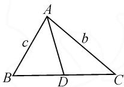
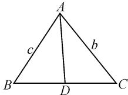
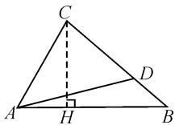

# 高中解三角形中常见三类问题的方法探究

# 陕西省延安市实验中学 郝变军

摘要: 解三角形是教学的重点之一, 也是高考考查的重要内容. 文章结合教学实践, 基于试题分析了高中数学解三角形中常见三类问题的方法, 为数学教学提供参考.

关键词: 角平分线; 中线; 高线; 解题方法

在高中数学教学和高考试题中,解三角形占据重要地位,解三角形不仅是学生理解几何和代数的重要桥梁,更是培养学生数学思维和解决实际问题能力的重要内容 $^{[1]}$ .笔者结合教学实际,剖析了高中数学解三角形中常见三类问题的方法.

# 1 角平分线相关计算求值问题

例1 在 $\triangle ABC$ 中， $\angle BAC = 60^{\circ}$ ， $AB = 2$ ， $BC = \sqrt{6}$ ， $\angle BAC$ 的角平分线交 $BC$ 于点 $D$ ，则 $AD =$ 解析:如图1所示,记AB=c,
AC=b,BC=a.

方法1:由余弦定理可得 $2^{2}+b^{2}-2\times2\times b\times\cos60^{\circ}=6$ .因为b>0,所以解得 $b=1+\sqrt{3}$ .由 $S_{\triangle ABC}=$ $S_{\triangle ABD} + S_{\triangle ACD}$ ，可得 $\frac{1}{2}\times 2\times b\times \sin 60^{\circ} = \frac{1}{2}\times 2\times$ $AD\times \sin 30^{\circ} + \frac{1}{2}\times AD\times b\times \sin 30^{\circ}$ ，解得 $AD =$ $\frac{\sqrt{3}b}{1 + \frac{b}{2}} = \frac{2\sqrt{3}(1 + \sqrt{3})}{3 + \sqrt{3}} = 2.$

  
图1

方法2：由余弦定理，可得 $2^{2} + b^{2} - 2\times 2\times b\times$ $\cos 60^{\circ} = 6$ ，因为 $b > 0$ ，所以 $b = 1 + \sqrt{3}$ .由正弦定理，可得 $\frac{\sqrt{6}}{\sin 60^{\circ}} = \frac{b}{\sin B} = \frac{2}{\sin C}$ ，解得 $\sin B = \frac{\sqrt{6} + \sqrt{2}}{4}$ $\sin C = \frac{\sqrt{2}}{2}$ 因为 $1 + \sqrt{3} >\sqrt{6} >\sqrt{2}$ ，所以 $C = 45^{\circ},B =$ $180^{\circ} - 60^{\circ} - 45^{\circ} = 75^{\circ}$ ，又 $\angle BAD = 30^{\circ}$ ，所以 $\angle ADB =$ $75^{\circ}$ ，则 $AD = AB = 2$

解法总结:(1)方法一:余弦定理与面积法.首先利用余弦定理计算边AC的长度.然后,通过三角形的面积公式,将三角形ABC的面积表示为两部分,即 $\triangle ABD$ 和 $\triangle ACD$ 的面积.设置AD为未知量,通过相应的三角函数和已知角度求解,最终得出AD的值.这种方法结合了三角形的几何性质和代数运算,适合较为复杂的三角形.

(2) 方法二: 正弦定理与角度求解. 在得到边 AC的长度后,应用正弦定理,设定对应的角度关系,从而通过已知的边和角求解其他角度的大小.借助已知角度(如 $\angle BAC$ 和计算出的角B或C),可进一步求出AD的长度.此方法强调了角度与边之间的关系,适合需要精确角度分析的题型.

这两种方法相辅相成,解决角平分线相关问题时,可根据具体情况选择使用.

# 2 中线及等分线相关计算求值问题

例 2 （多选题）已知 $\triangle ABC$ 的三个内角 A, B, C 所对应的边分别为 a, b, c，则下列选项中正确的是（）.

A. 若 $\sin A > \sin B$ ，则 A > B

B. 若 $\triangle ABC$ 是边长为 2 的正三角形, 则 $\overrightarrow{AB} \cdot \overrightarrow{BC} = 2$

C. 若 $a \cos A = b \cos B$ ，则 $\triangle ABC$ 是等腰三角形

D. 若 $a=\sqrt{3}$ ，BC 的中线 AD 长为 1，则 bc 的最大值为 $\frac{7}{4}$

解析:对于选项 A, 曲 $\sin A > \sin B$ , 结合正弦定理 $\frac{a}{\sin A} = \frac{b}{\sin B}$ , 可得 $\frac{a}{b} = \frac{\sin A}{\sin B} > 1$ , 所以 a > b, 即 A > B, 故选项 A 正确. 对于选项 B, $\overrightarrow{AB} \cdot \overrightarrow{BC} = 2 \times 2 \times \cos \frac{2\pi}{3} = 2 \times 2 \times \left(-\frac{1}{2}\right) = -2$ , 故选项 B 错误. 对于选项 C, 因为 $a \cos A = b \cos B$ , 所以由正弦定理可得 $\sin A \cos A = \sin B \cos B$ , 所以 $\sin 2A = \sin 2B$ , 所以 2A = 2B 或 $2A + 2B = \pi$ , 所以 A = B, 或 $A + B = \frac{\pi}{2}$ , 所以 $\triangle ABC$ 是等腰三角形或直角三角形, 故选项 C错误.对于选项D,如图2所示,
AD=1, 因为 $a=\sqrt{3}$ , D 为中点,
所以 $BD = CD = \frac{\sqrt{3}}{2}$ . 在 $\triangle ABC$

中， $\cos C = \frac{AC^2 + BC^2 - AB^2}{2AC \cdot BC} =$

$\frac{b^{2}+3-c^{2}}{2\sqrt{3}b}$ ; 在 $\triangle ACD$ 中, $\cos C=\frac{AC^{2}+CD^{2}-AD^{2}}{2AC\cdot CD}=$

  
图 2

$\frac{b^{2}+\frac{3}{4}-1}{\sqrt{3}b}=\frac{b^{2}-\frac{1}{4}}{\sqrt{3}b}$ ，所以 $\frac{b^{2}+3-c^{2}}{2\sqrt{3}b}=\frac{b^{2}-\frac{1}{4}}{\sqrt{3}b}$ ，化简得 $b^{2}+c^{2}=\frac{7}{2}$ 。因为 $b^{2}+c^{2}\geqslant2bc$ ，当且仅当 $b=c=\frac{\sqrt{7}}{2}$ 时等号成立，所以 $2bc\leqslant\frac{7}{2}$ ，即 $bc\leqslant\frac{7}{4}$ 。所以bc的最大值为 $\frac{7}{4}$ ，故选项D正确。

故正确答案为选项 AD.

解法总结:(1)利用正弦定理与边角关系.通过正弦定理,可以得到边长和角度的比例关系.在处理涉及中线的计算时,可以根据已知的角度、边长和中线,结合正弦定理进行相应的求解.例如,若已知某边的中线长度,可通过正弦定理和边角关系推导出其他边或角的数值.

(2) 利用余弦定理. 对于三角形的中线或等分线问题, 若已知三边或两个边角关系, 可以使用余弦定理来推导角度或边的关系. 在涉及到中线计算时, 可以结合余弦定理和中点性质来求解边长与中线的长度. 已知边长和角度, 余弦定理可以帮助确定边长之间的关系.  
(3) 利用几何性质与中线定理. 中线的长度可以通过中线定理直接求得. 在等分线的计算中, 利用几何性质, 通过已知的角度分割和边的关系, 可以构建出等分线的长度公式. 特别是在等腰三角形和直角三角形中, 借助对称性质, 可以进一步简化计算.

# 3 高线的处理与应用

例 3 △ABC 的内角 A, B, C 所对的边分别是 a, b, c，且 $A = \frac{\pi}{3}$ ，若 $\cos B = \frac{2\sqrt{7}}{7}$ ，D 是 BC 边上一点，且 CD = 4BD，△ACD 的面积为 $\frac{6\sqrt{3}}{5}$ ，求 AC.

解析: 如图 3 所示, 作 $CH \perp AB$ 于点 H. 设 AH = x, 可求得 $CH = \sqrt{3}x, BH = 2x$ .

方法 1: 因为 $\triangle ACD$ 的面积为 $\frac{6\sqrt{3}}{5}$ ，且 CD = 4BD，所以$\triangle ABC$ 的面积为 $\frac{3\sqrt{3}}{2}$ . 因为 $\cos B = \frac{2\sqrt{7}}{7}$ , 且 $B \in (0, \pi)$ , 所以 $\sin B = \sqrt{1 - \cos^2 B} = \frac{\sqrt{21}}{7}$ .

  
图 3

又因为 $A = \frac{\pi}{3}$ 所以 $\sin C = \sin (A + B) = \sin \left(B + \frac{\pi}{3}\right) = \frac{3\sqrt{21}}{14}$ . 在 $\triangle ABC$ 中，由正弦定理，得 $\frac{b}{\sin B} = \frac{a}{\sin A}$ ，则 $b = \frac{\sin B}{\sin A} \cdot a = \frac{2\sqrt{7}}{7} a$ ，即 $a = \frac{\sqrt{7}}{2} b$ . 因

为 $\triangle ABC$ 的面积为 $\frac{3\sqrt{3}}{2}$ ，所以 $\frac{3\sqrt{3}}{2}=\frac{1}{2}ab\sin C=\frac{3\sqrt{3}}{8}b^{2}$ ，
所以 b=2，故 AC=2。

方法 2: 易知 $\tan B = \frac{\sqrt{3}}{2}$ ，所以 $\frac{3\sqrt{3}x^{2}}{2} = \frac{3\sqrt{3}}{2}$ ，解得 x = 1，则 AC = 2.

解法总结:(1)方法1:利用面积与边的关系.在已知三角形的一个内角及其对边时,可以通过三角形的面积公式来求解边长.首先,利用已知的角度和边长关系,设定三角形的面积.根据题设,三角形的面积可以用高线和底边的长度表示.在此问题中,利用点D的特性 $(CD=4BD)$ 可以将CD和BD进行比例划分,进而利用面积的关系,得到整个三角形ABC的面积.接着,根据正弦定理求出其他边长的值,进而得到AC的长度.通过该方法,可以系统地运用三角形的面积公式与边角的关系,有效地求解出三角形的其他边长.

(2) 方法 2: 利用三角函数的性质. 在已知三角形的两个内角及一条边时, 可以通过三角函数求解未知边. 首先, 利用已知角 A 和角 B 的余弦值计算出角 C 的正弦值. 根据正弦定理, 可以得出边长与角度的关系, 进而求出另一条边的长度. 在本题中, 通过计算 $\tan B$ 与 $\sin B$ 的关系, 可以得出与边 AC 相关的比例关系. 将这些关系代入相应的三角函数中, 结合已知的边长和角度, 可以逐步得到 AC 的具体长度. 该方法强调三角函数的运用, 使得求解过程更加简洁直观.

# 4 总结

针对角平分线的相关计算,利用角平分线定理是基础,它表明角平分线将对边分成成比例的两部分.此外,通过将三角形分成两个小三角形,运用它们的面积和等于大三角形的面积,可以简化计算.在一些情况下,角的互补性也能帮助我们建立关系 $^{[2]}$ .对于中线和等分线问题,学生应熟练掌握三角形的基本几何性质,灵活运用中线定理是解题的关键.此外,向量和坐标方法可以将几何问题转化为代数问题,使得运算更为简便;同时,借助三角函数和正弦定理来处理边长与角度的关系,提供了另一种解决途径.至于高线的处理,构造辅助线是常用技巧,通过辅助线的引入,有助于形成更清晰的几何关系.高线与三角函数相结合,尤其在计算角度和边长时,可以显著提高解题效率.代数方法同样重要,尤其在高线问题中,设未知数、列方程组的策略常能找到意想不到的解决方案.综合运用这些策略,能够有效提高解题的准确性与效率,帮助学生在考试中应对各种相关题型.

# 参考文献：

[1]林翠,刘德金.强化“三思维”,破解三角形[J].中学数学,2024(9):85-86.  
[2]梁正玲.一道解三角形模拟试题的探究[J].中学数学,2024(3):78-79.Z