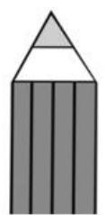
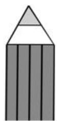
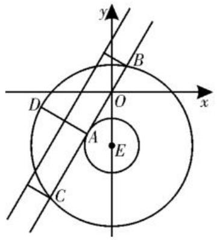
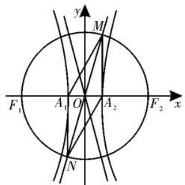

# 2025年新高考全国卷中解析几何客观题的试题分析及解题启示

■河南省信阳市固始县信合外国语高级中学 胡亚运

2025 年新高考全国卷对解析几何客观题(Ⅰ卷 3 道小题, Ⅱ卷 2 道小题)的考查遵循“两小或三小”, 基本为一道容易题、一道或两道中高档题, 侧重于考查基本概念、几何性质等, 总体难度不是很高。本文旨在通过对 2025 年新高考全国卷中解析几何客观题的分析, 追根溯源, 回归教材, 深入探究丰富的解题思路, 在此基础上, 提供备考策略, 为同学们的复习备考提供一些帮助。

# 一、真题呈现及解法探究

# 特点一：聚焦主干知识，强化基础考查

例 1 （2025 年新高考全国 I 卷第 3 题）已知双曲线 C 的虚轴长为实轴长的 $\sqrt{7}$ 倍，则 C 的离心率为（）。

A. $\sqrt{2}$

B. 2

C. $\sqrt{7}$

D. $2 \sqrt{2}$

解法一:(定义法)由题意得 $2b=\sqrt{7}\times2a$ ，所以 $\frac{b}{a}=\sqrt{7}$ ，所以双曲线 C 的离心率 e= $\frac{c}{a}=\sqrt{1+\left(\frac{b}{a}\right)^{2}}=2\sqrt{2}$ 。

故选D。

解法二:(特殊值法)取 a=1, 则 $b=\sqrt{7}$ , $c=\sqrt{a^{2}+b^{2}}=2\sqrt{2}$ ，故 $e=\frac{c}{a}=2\sqrt{2}$ 。

故选D。

解法三:(排除法)由题意得 $c > b = \sqrt{7} a$ ，故 C 的离心率 $e = \frac{c}{a} > \sqrt{7}$ ，因为选项 A, B, C 都小于或等于 $\sqrt{7}$ ，所以 D 正确。

故选D。

点评:本题主要考查双曲线的实轴长、虚轴长、焦距及离心率等基本概念,考查同学们对圆锥曲线基本知识的掌握程度和基本的逻辑推理能力。

例 2 （2025 年新高考全国Ⅱ卷第 6 题）设抛物线 C: $y^{2}=2px$ (p>0) 的焦点为 F，点 A 在 C 上，过 A 作 C 的准线的垂线，垂

足为 B。若直线 BF 的方程为 $y = -2x + 2$ ，则 $\left|AF\right| = (\quad)$ 。

A. 3

B. 4

C. 5

D. 6

解法一:由题意知, $F\left(\frac{p}{2},0\right)$ ,准线方程为 $x=-\frac{p}{2}$ 。设 $A(x_{0},y_{0})$ ，则 $B\left(-\frac{p}{2},y_{0}\right)$ 。因为直线 BF 的方程为 $y=-2x+2$ ，所以 $\left\{\begin{aligned}y_{0}&=-2\times\left(-\frac{p}{2}\right)+2,\\ 0&=-2\times\frac{p}{2}+2,\end{aligned}\right.$ 解得 $\left\{\begin{aligned}p=2,\\ y_{0}&=4.\end{aligned}\right.$ 因为点

A 在 C 上, 所以 $16 = 4x_{0}$ , 即 $x_{0} = 4$ , 所以 $\left|AF\right|=x_{0}+\frac{p}{2}=4+1=5$ 。

故选C。

解法二:由题意知,直线 $BF: y = -2x + 2$ 与 x 轴的交点即为焦点 $F(1,0)$ , 则抛物线的准线方程为 x = -1, 抛物线的方程为 $y^{2} = 4x$ , 所以 $B(-1,4)$ , 则可设 $A(x_{A}, 4)$ , 将其代入抛物线的方程得 $x_{A} = 4$ , 所以 $A(4,4)$ , 则 $|AF| = \sqrt{(4-1)^{2} + (4-0)^{2}} = 5$ 。

故选C。

点评:本题考查直线与抛物线的位置关系等基本概念,特别是抛物线的定义、标准方程及简单几何性质,需要能将代数表达转化为几何特征,将几何特征翻译为代数表达,整合具体情境特征,选择合理的解决路径。

例 3 （2025 年新高考全国 I 卷第 7 题）已知圆 $x^{2}+(y+2)^{2}=r^{2}(r>0)$ 上到直线 $y=\sqrt{3}x+2$ 的距离为 1 的点有且仅有两个，则 r 的取值范围是（）。

A. $(0,1)$

B. $(1,3)$

C. $(3, +\infty)$

D. $(0, +\infty)$

解法一: 圆 $x^{2}+(y+2)^{2}=r^{2}(r>0)$ 的圆心为 $(0,-2)$ ，半径为 r，圆心到直线 $y=\sqrt{3}x+2$ 的距离 $d=\frac{|2+2|}{\sqrt{1+3}}=2$ ，由圆 $x^{2}+$

$(y+2)^{2}=r^{2}(r>0)$ 上到直线 $y=\sqrt{3}x+2$ 的距离为1的点有且仅有2个，得d-1<r<d+1，所以 $r\in(1,3)$ 。

故选 B。

解法二:由题意知,圆 $x^{2}+(y+2)^{2}=r^{2}$ (r>0) 的圆心为 $E(0,-2)$ , 半径为 r。圆心 $E(0,-2)$ 到直线 $y=\sqrt{3}x+2$ 的距离 d=

$$
\frac {| 0 \times \sqrt {3} - (- 2) + 2 |}{\sqrt {(\sqrt {3}) ^ {2} + (- 1) ^ {2}}} = 2,
$$

由图 1 可知, 当 r=1 时, 圆 E 上有且仅有一个点 A 到直线 $y=\sqrt{3}x+2$ 的距离等于 1; 当 r=3 时, 圆 E 上有且仅有点 B, C, D 到直线$y=\sqrt{3}x+2$ 的距离等于1;当 $r\in(1,3)$ 时,圆E上有且仅有两个点到直线 $y=\sqrt{3}x+2$ 的距离等于1。

text_image

y
B
D
O
x
A
E
C

图1

故选B。

解法三:到直线 $y=\sqrt{3}x+2$ 的距离为 1 的点显然是与之平行的两平行线, 当圆 $x^{2}+(y+2)^{2}=r^{2}$ 的半径 r 足够大时, 显然两直线都与圆相交, 故排除 CD; 当 $r\to0$ 时, 而圆 $x^{2}+(y+2)^{2}=r^{2}$ 的圆心 $(0,-2)$ 到直线 $\sqrt{3}x-y+2=0$ 的距离 $d=\frac{|2+2|}{\sqrt{(\sqrt{3})^{2}+1}}=2$ , 显然不满足题意, 故排除 A。

故选B。

点评:本题考查点到直线的距离公式,直线与圆的位置关系等基本知识,考查数形结合、分类讨论等数学思想,以及运算求解能力,试题背景源于教材,难度适中,要求同学们能将求圆的半径转化为求圆心到直线的距离。

# 特点二:体现多想少算,落实“双减”

例 4 （2025 年新高考全国 I 卷第 10 题）(多选)已知抛物线 C: $y^{2}=6x$ 的焦点为 F，过 F 的一条直线交 C 于 A、B 两点，过 A 作直线 $l: x=-\frac{3}{2}$ 的垂线，垂足为 D，过 F 且与 AB 垂直的直线交 l 于 E，则()。

A. $|AD|=|AF|$

B. $|AE|=|AB|$

C. $|AB|\geqslant6$

D. $|AE|\cdot|BE|\geqslant18$

解析:由题意知 $F\left(\frac{3}{2},0\right)$ ，结合抛物线的定义知 $|AD|=|AF|$ ，所以 A 正确；由通径最短得 $|AB|\geqslant2p=6$ ，所以 C 正确；设 AB: $x=my+\frac{3}{2}$ ， $A(x_{1},y_{1})$ ， $B(x_{2},y_{2})$ ，联立 $\left\{\begin{aligned}x&=my+\frac{3}{2},\\ y^{2}&=6x,\end{aligned}\right.$ 消去 x 整理得 $y^{2}-6my-9=0$ ，则 $y_{1}+y_{2}=6m$ ， $y_{1}y_{2}=-9$ ，所以 $x_{1}+x_{2}=m(y_{1}+y_{2})+3=6m^{2}+3$ ，所以 $|AB|=x_{1}+\frac{3}{2}+x_{2}+\frac{3}{2}=6m^{2}+6$ ，当 m=0 时， $E\left(-\frac{3}{2},0\right)$ ， $|AE|=\sqrt{|AF|^{2}+|EF|^{2}}=3\sqrt{2}$ ， $|AB|=2p=6$ ，此时 $|AE|\neq|AB|$ ，所以 B 错误；由上知，当 m=0 时， $|AE|=|BE|=3\sqrt{2}$ ，则 $|AE|\cdot|BE|=18$ ，当 $m\neq0$ 时， $EF:x=-\frac{1}{m}y+\frac{3}{2}$ ， $E\left(-\frac{3}{2},3m\right)$ ，则 $|EF|=\sqrt{9+9m^{2}}$ ，所以 $S_{\triangle AEB}=\frac{1}{2}|AE|\cdot|BE|\sin\angle AEB=\frac{1}{2}|AB|\cdot|EF|=\frac{1}{2}(6m^{2}+6)\sqrt{9+9m^{2}}>9$ ， $|AE|\cdot|BE|>\frac{18}{\sin\angle AEB}>18$ ，综上可得 $|AE|\cdot|BE|\geqslant18$ ，所以 D 正确。

故选 ACD。

点评:试题考查同学们对圆锥曲线与直线的位置关系及度量关系的理解,考查对抛物线概念的几何意义(包括焦点、准线等)的掌握,涉及抛物线焦点弦的二级结论,试题的四个选项之间存在一定的联系,减轻了同学们的计算负担,符合“双减”的课程改革理念。

# 特点三: 坚持综合性考查, 突出选拔功能

例 5 （2025 年新高考全国Ⅱ卷第 11 题）(多选)双曲线 $C: \frac{x^{2}}{a^{2}} - \frac{y^{2}}{b^{2}} = 1 (a > 0, b > 0)$ 的左、右焦点分别是 $F_{1}$ 、 $F_{2}$ ，左、右顶点分别为 $A_{1}$ 、 $A_{2}$ ，以 $F_{1}F_{2}$ 为直径的圆与 C 的一条渐近线交于 M、N 两点，且 $\angle NA_{1}M=\frac{5\pi}{6}$ ，则（）。

A. $\angle A_{1}MA_{2} = \frac{\pi}{6}$

B. $\left| {M{A}_{1}}\right|  = 2\left| {M{A}_{2}}\right|$

C. C 的离心率为 $\sqrt{13}$

D. 当 $a = \sqrt{2}$ 时, 四边形 $NA_{1}MA_{2}$ 的面积为 $8\sqrt{3}$

解法一: 如图 2, 不妨设点 M 在第一象限, 渐近线为 $y = \frac{b}{a} x$ 。对于 A, 由对称性可知, 四边形 $NA_{1}MA_{2}$ 为平行四边形, 所以 $\angle A_{1}MA_{2} = \pi - \angle NA_{1}M = \frac{\pi}{6}$ , 故 A 正

text_image

y
M
F₁ A₁ O A₂ F₂ x
N

图2

确；对于B，由题意知， $OM = ON = c$ ，所以 $MA_{2}$ 和 $NA_{1}$ 垂直于 $x$ 轴，故 $\angle MA_1A_2 = \frac{5\pi}{6}$ $-\frac{\pi}{2} = \frac{\pi}{3}$ ，由正弦定理得 $\frac{|MA_1|}{|MA_2|} = \frac{\sin\frac{\pi}{2}}{\sin\frac{\pi}{3}} =$ $\frac{2}{\sqrt{3}}$ ，故B错误；对于C，由前述分析知， $\frac{2a}{b} =$ $\tan \frac{\pi}{6} = \frac{1}{\sqrt{3}}\Rightarrow e = \frac{c}{a} = \sqrt{1 + \frac{b^2}{a^2}} =$ $\sqrt{1 + (2\sqrt{3})^2} = \sqrt{13}$ ，故C正确；对于D，由前述分析知，平行四边形 $MA_{1}NA_{2}$ 的面积 $S =$ $2ab = 4\sqrt{3} a^2 = 8\sqrt{3}$ ，故D正确。

故选 ACD。

解法二:对于 A, 根据双曲线的对称性知四边形 $A_{1}MA_{2}N$ 为平行四边形, 因为 $\angle MA_{1}N=\frac{5\pi}{6}$ , 所以 $\angle MA_{2}N=\frac{\pi}{6}$ , 故 A 正确; 对于 B, 在 $\triangle A_{1}MO$ 中, $|A_{1}M|^{2}=a^{2}+c^{2}-2ac\cos\angle MOA_{1}=a^{2}+c^{2}+2ac\times\frac{a}{c}=3a^{2}+c^{2}$ , 在 $\triangle A_{2}MO$ 中, $|A_{2}M|^{2}=a^{2}+c^{2}-2ac\cos\angle MOA_{2}=a^{2}+c^{2}-2ac\times\frac{a}{c}=c^{2}-a^{2}$ , 在 $\triangle A_{2}MA_{1}$ 中, $|A_{2}A_{1}|^{2}=|MA_{1}|^{2}+$

$\left|MA_{2}\right|^{2} - 2\left|MA_{1}\right|\times \left|MA_{2}\right|\cos \frac{\pi}{6}$ ，即 $4a^{2} = 2c^{2}$ $+2a^{2} - 2\sqrt{3a^{2} + c^{2}}\times \sqrt{c^{2} - a^{2}}\times \frac{\sqrt{3}}{2}$ ，则 $13a^{2} =$ $c^2$ ，所以 $\left|A_1M\right|^2 = 16a^2$ ， $\left|A_2M\right|^2 = 12a^2$ ，所以 $\left|A_{1}M\right|\neq 2\left|A_{2}M\right|$ ，故B错误；对于C，根据 $13a^{2}$ $= c^{2}$ ，有 $e = \sqrt{13}$ ，故C正确；对于D，当 $a = \sqrt{2}$ 时， $\left|A_1M\right| = \sqrt{32},\left|A_2M\right| = \sqrt{24}$ ，所以四边形 $A_{1}MA_{2}N$ 的面积 $S = \left|A_{1}M\right|\times \left|A_{2}M\right|\sin \frac{\pi}{6}$ $= \sqrt{32}\times \sqrt{24}\times \frac{1}{2} = 8\sqrt{3}$ ，故D正确。

故选 ACD。

点评:本题以双曲线为背景,以对 $\triangle A_{1}MO$ 的分析为切入点,从数与形两个角度来描述双曲线的性质。 $\triangle A_{1}MO$ 中的边角关系是双曲线的半焦距、半实轴长和渐近线之间性质特征的直接体现,同时也是双曲线标准方程中a,b,c数量关系的体现。试题涵盖除双曲线外的多个几何图形,如直线、圆、三角形、四边形,同学们需要综合运用几何图形的性质,以及代数或几何方法,结合具体图形特征来选择解决问题的合理途径,对同学们的逻辑思维能力有一定的要求,具有很好的选拔功能。

# 二、课本溯源

题源 1 （人教 A 版选择性必修第一册第 124 页例 3）求双曲线 $9y^{2}-16x^{2}=144$ 的实半轴长和虚半轴长、焦点坐标、离心率、渐近线方程。

题源 2 （人教 A 版选择性必修第一册第 138 页练习第 2 题）点 $M(m,4)$ 在抛物线 $y^{2}=24x$ 上，F 为焦点，直线 MF 与准线相交于点 N，求 $|FN|$ 。

题源 3 （湘教版选择性必修第一册第172页复习题三第14题）若双曲线 $C:\frac{x^{2}}{a^{2}}-\frac{y^{2}}{b^{2}}=1(a>0,b>0)$ 的一条渐近线被圆 $(x-2)^{2}+y^{2}=4$ 所截得的弦长为 2，求 C 的离心率。

# 三、备考策略

通过对 2025 年解析几何客观题的分析, 发现解析几何客观主要题涉及两个专题: ① 直线与圆; ② 圆锥曲线的定义、方程与性质。下面总结一下命题特点及解题策略:

# “解析几何”跟踪训练

# ■湖南省郴州市第二中学

# 颜昀晖

natural_image

Illustration of two smiling children playing with musical notes above their faces (no text or symbols)

# 一、单选题

1. 若双曲线的一条渐近线为 $y = x$ ，则该双曲线的离心率为（ ）。

A. $\sqrt{3}$

B. $\sqrt{2}$

C. $\sqrt{5}$

D. $2\sqrt{2}$

2. 已知抛物线 $x^{2}=4y$ 的焦点为 F，点 $A(2\sqrt{2},a)$ 在抛物线上，则 $|AF|=(\quad)$ 。

A. 1

B. 4

C. 2

D. 3

3. 已知椭圆 $C: \frac{x^2}{4} + \frac{y^2}{3} = 1$ 的左、右焦点分别为 $F_1, F_2$ , 直线 $l$ 过点 $F_1$ 且与 $C$ 交于 $A, B$ 两点, 则 $\triangle ABF_2$ 的周长为 ( )。

A. 4

B. 6

C. 8

D. 10

4. 已知双曲线 $x^{2}-4y^{2}-64=0$ 上一点 P 与它的一个焦点的距离等于 1，那么点 P 与另外一个焦点的距离等于（）。

A. 13

B. 17

C. 15

D. 16

5. 如图 1, 已知线段 PD 的中点 M 的轨迹是椭圆 $\frac{x^{2}}{4} + y^{2} = 1$ , 且 $PD \perp x$ 轴, D 为垂足, 则点 P 的轨迹长度是 ( )。

text_image

y
P
M
O
D
x

图1

A. $3 \pi$

B. $\pi$

C. $2\pi$

D. $4 \pi$

6. 已知抛物线 $y^{2}=2x$ ，过点 $P(2,0)$ 的直线与抛物线交于 $A(x_{1},y_{1})$ ， $B(x_{2},y_{2})$ 两点，则 $y_{1}^{2}+y_{2}^{2}$ 的最小值是（）。

A. 4

B. 6

C. 8

D. 10

7. 设动点 $P$ 到点 $A(-1,0)$ 和 $B(1,0)$ 的距离分别为 $d_{1}$ 和 $d_{2}, \angle APB = 2\theta$ ，且存在常数 $\lambda (0 < \lambda < 1)$ ，使得 $d_{1}d_{2}(1 - \cos 2\theta) = 2\lambda$ ，则 $|d_{1} - d_{2}| = (\quad)$ 。

A. $2\sqrt{1-\lambda}$

B. $\sqrt{1 - \lambda}$

C. $\sqrt{2-\lambda}$

D. $2 \sqrt{2 - \lambda}$

8. 若点 P 在椭圆 $C_{1}:\frac{x^{2}}{3}+y^{2}=1$ 上， $A(\sqrt{3},0)$ ，将 $\overrightarrow{AP}$ 逆时针旋转 $90^{\circ}$ 得到 $\overrightarrow{AR}$ （若向量 $a=(m,n)$ 绕其起点逆时针旋转 $90^{\circ}$ 得到 b，则 $b=(-n,m)$ ），点 R 在椭圆 $C_{2}$ ： $x^{2}+\frac{y^{2}}{3}=t^{2}(t>0)$ 上，且满足 $|\overrightarrow{AP}|=|\overrightarrow{AR}|$ ，则椭圆 $C_{2}$ 的长轴长的取值范围是（）。

A. $\left[2\sqrt{2},6\sqrt{2}\right]$

B. $\left[2\sqrt{2},6\sqrt{3}\right]$

C. $[2\sqrt{3}, 6\sqrt{2}]$

D. $[2\sqrt{3}, 6\sqrt{3}]$

# 二、多选题

9. 已知双曲线 $C: x^{2} - \frac{y^{2}}{3} = 1$ ，则下列对双曲线 $C$ 判断正确的是（ ）。

A. 焦点在 $y$ 轴上

(1) 解析几何小题为压轴小题或半压轴小题成为一种常态, 高考题中的小题很少考查二级结论性的问题, 可适当补充二级结论, 不宜以二级结论为主。

(2) 直线与圆的位置关系的基础性小题的地位逐渐提高, 圆的切线是命题热点。

(3)椭圆和双曲线一般考查的是曲线的定义和性质的综合,以平面几何关系为解题的主线,以方程、函数、解三角形、不等式为解题的工具,很少用解析法联立解小题。

(4)由于抛物线自身较简单,难以构建复

杂的平面关系,所以抛物线的问题易出基础题,难题多以直线与抛物线的位置关系为主,考查解析法,巧解的较少,这和双曲线或椭圆在方法上有区别,复习中要注意总结。

(5)高考解析几何题一般不给图形,以考查同学们的建模能力。

选择题和填空题体现基础性、综合性、应用性的考查,需要同学们在掌握概念、公式、定理的基础上,灵活运用所学知识解决问题。以定义和性质为基础,综合平面几何关系与解三角形是常用方法和策略。(责任编辑 王福华)