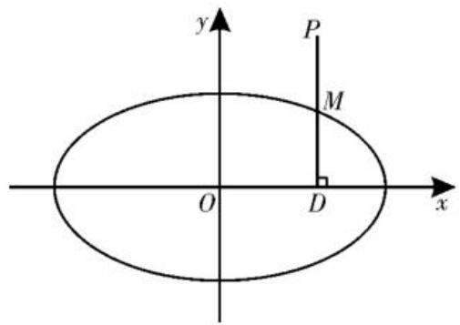
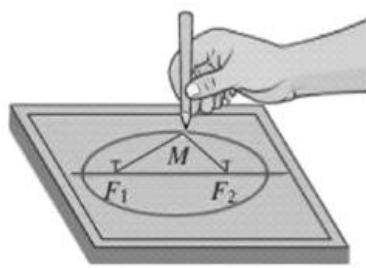
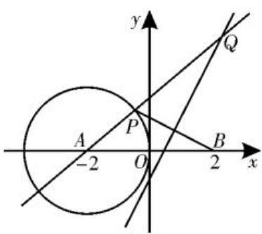
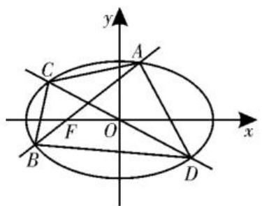
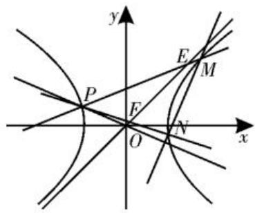

# “解析几何”跟踪训练

# ■湖南省郴州市第二中学

# 颜昀晖

natural_image

Illustration of two smiling children with musical notes above their faces (no text or symbols)

# 一、单选题

1. 若双曲线的一条渐近线为 $y = x$ ，则该双曲线的离心率为（ ）。

A. $\sqrt{3}$

B. $\sqrt{2}$

C. $\sqrt{5}$

D. $2\sqrt{2}$

2. 已知抛物线 $x^{2}=4y$ 的焦点为 F，点 $A(2\sqrt{2},a)$ 在抛物线上，则 $|AF|=(\quad)$ 。

A. 1

B. 4

C. 2

D. 3

3. 已知椭圆 $C: \frac{x^2}{4} + \frac{y^2}{3} = 1$ 的左、右焦点分别为 $F_1, F_2$ , 直线 $l$ 过点 $F_1$ 且与 $C$ 交于 $A, B$ 两点, 则 $\triangle ABF_2$ 的周长为 ( )。

A. 4

B. 6

C. 8

D. 10

4. 已知双曲线 $x^{2}-4y^{2}-64=0$ 上一点 P 与它的一个焦点的距离等于 1，那么点 P 与另外一个焦点的距离等于（）。

A. 13

B. 17

C. 15

D. 16

5. 如图 1, 已知线段 PD 的中点 M 的轨迹是椭圆 $\frac{x^{2}}{4} + y^{2} = 1$ , 且 $PD \perp x$ 轴, D 为垂足, 则点 P 的轨迹长度是 ( )。

text_image

y
P
M
O
D
x

图1

A. $3 \pi$

B. $\pi$

C. $2\pi$

D. $4 \pi$

6. 已知抛物线 $y^{2}=2x$ ，过点 $P(2,0)$ 的直线与抛物线交于 $A(x_{1},y_{1})$ ， $B(x_{2},y_{2})$ 两点，则 $y_{1}^{2}+y_{2}^{2}$ 的最小值是（）。

A. 4

B. 6

C. 8

D. 10

7. 设动点 $P$ 到点 $A(-1,0)$ 和 $B(1,0)$ 的距离分别为 $d_{1}$ 和 $d_{2}, \angle APB = 2\theta$ ，且存在常数 $\lambda (0 < \lambda < 1)$ ，使得 $d_{1}d_{2}(1 - \cos 2\theta) = 2\lambda$ ，则 $|d_{1} - d_{2}| = (\quad)$ 。

A. $2\sqrt{1-\lambda}$

B. $\sqrt{1 - \lambda}$

C. $\sqrt{2-\lambda}$

D. $2 \sqrt{2 - \lambda}$

8. 若点 P 在椭圆 $C_{1}:\frac{x^{2}}{3}+y^{2}=1$ 上， $A(\sqrt{3},0)$ ，将 $\overrightarrow{AP}$ 逆时针旋转 $90^{\circ}$ 得到 $\overrightarrow{AR}$ （若向量 $a=(m,n)$ 绕其起点逆时针旋转 $90^{\circ}$ 得到 b，则 $b=(-n,m)$ ），点 R 在椭圆 $C_{2}$ ： $x^{2}+\frac{y^{2}}{3}=t^{2}(t>0)$ 上，且满足 $|\overrightarrow{AP}|=|\overrightarrow{AR}|$ ，则椭圆 $C_{2}$ 的长轴长的取值范围是（）。

A. $\left[2\sqrt{2},6\sqrt{2}\right]$

B. $[2\sqrt{2},6\sqrt{3} ]$

C. $[2\sqrt{3}, 6\sqrt{2}]$

D. $[2\sqrt{3},6\sqrt{3} ]$

# 二、多选题

9. 已知双曲线 $C: x^{2} - \frac{y^{2}}{3} = 1$ ，则下列对双曲线 $C$ 判断正确的是（ ）。

A. 焦点在 $y$ 轴上

(1) 解析几何小题为压轴小题或半压轴小题成为一种常态, 高考题中的小题很少考查二级结论性的问题, 可适当补充二级结论, 不宜以二级结论为主。

(2) 直线与圆的位置关系的基础性小题的地位逐渐提高, 圆的切线是命题热点。

(3)椭圆和双曲线一般考查的是曲线的定义和性质的综合,以平面几何关系为解题的主线,以方程、函数、解三角形、不等式为解题的工具,很少用解析法联立解小题。

(4)由于抛物线自身较简单,难以构建复

杂的平面关系,所以抛物线的问题易出基础题,难题多以直线与抛物线的位置关系为主,考查解析法,巧解的较少,这和双曲线或椭圆在方法上有区别,复习中要注意总结。

(5)高考解析几何题一般不给图形,以考查同学们的建模能力。

选择题和填空题体现基础性、综合性、应用性的考查,需要同学们在掌握概念、公式、定理的基础上,灵活运用所学知识解决问题。以定义和性质为基础,综合平面几何关系与解三角形是常用方法和策略。(责任编辑 王福华)

B. 实轴长为 2

C. 焦距为 4

D. 两条渐近线的夹角是 $\frac{\pi}{3}$

10. 如图 2, 取一条定长为 $2a$ 的细绳, 两端分别固定在图板的 $F_{1}, F_{2}$ 两点, 且 $|F_{1}F_{2}| = 2c$ , 当 $a > c$ 时, 套上铅笔, 拉紧绳子移动笔尖形成椭圆 $C$ , 则下列说法正确的是 (

text_image

Diagram illustrating a hand using a pencil to write a circle on a plane, with labeled points M and F1/F2.

图 2

A. 笔尖到 $F_{1}, F_{2}$ 的距离之和恒为定值

B. 若椭圆 C 上存在点 P，使得 $\left|PF_{1}\right|=\left|F_{1}F_{2}\right|$ ，则 C 的离心率的范围是 $\left[\frac{1}{3},1\right)$

C. 若椭圆 C 上存在点 Q，使得 $\triangle QF_{1}F_{2}$ 为等腰直角三角形，则 C 的离心率为 $\frac{\sqrt{2}}{2}$

D. 若椭圆 C 上任意一点 M 到 $F_{1}, F_{2}$ 的距离的平方和的最小值为 2，则 C 的长轴长为 2

11. 已知圆 $C: (x + 2)^{2} + y^{2} = 3$ ，抛物线 $E: y^{2} = 2px (p > 0)$ ，且抛物线 $E$ 的准线与圆 $C$ 截得的弦长为 $\sqrt{3}$ ，设 $T$ 是圆 $C$ 上的动点，抛物线 $E$ 上四点 $A, B, M, N$ 满足 $\overrightarrow{TA} = 2\overrightarrow{TM}, \overrightarrow{TB} = 2\overrightarrow{TN}, AB$ 的中点为 $D$ ，则下列说法正确的是（）。

A. 线段 OT 的最大值为 $2\sqrt{2} + \sqrt{3}$   
B. 抛物线 E 的方程为 $y^{2}=2x$   
C. 直线 $TD$ 的斜率为定值  
D.△TAB的面积的最大值为48

# 三、填空题

12. 抛物线 $x^{2}=2y$ 的准线与坐标轴的交点是 \_\_\_\_。  
13. 已知双曲线 $\frac{x^{2}}{4}-\frac{y^{2}}{b^{2}}=1(b>0)$ 的左、右焦点分别为 $F_{1}$ 、 $F_{2}$ ，过 $F_{2}$ 的直线交双曲线的右支于 A, B 两点，若 $\triangle ABF_{1}$ 是正三角形，则 $\triangle ABF_{1}$ 的面积为 \_\_\_\_。  
14. 已知椭圆和双曲线有共同的焦点 $F_{1}$ 、 $F_{2}$ ，它们的一个交点为 $M$ ，且 $\sin \angle F_{1}MF_{2} = \frac{2\sqrt{2}}{3}$ ，记椭圆和双曲线的离心率分别为 $e_{1}, e_{2}$ ，

则 $\frac{1}{e_{1}e_{2}}$ 的最大值为\_\_\_\_。

# 四、解答题

15. 已知抛物线 $C: y^{2} = 2px (p > 0)$ 过点 $P(1, 2)$ 。

(1) 求抛物线 C 的方程及准线方程;  
(2) 过焦点 F 且斜率为 1 的直线 l 与抛物线交于 A, B 两点, 求弦长 $\left|AB\right|$ 。  
16. 已知椭圆 $C_{1}:\frac{x^{2}}{a^{2}}+\frac{y^{2}}{b^{2}}=1(a>b>0)$ 的右焦点 F 与抛物线 $C_{2}$ 的焦点重合， $C_{1}$ 的中心与 $C_{2}$ 的顶点重合。过 F 且与 x 轴垂直的直线交 $C_{1}$ 于 A, B 两点，交 $C_{2}$ 于 C, D 两点，且 $|CD|=\frac{4}{3}|AB|$ 。

(1) 求 $C_{1}$ 的离心率；  
(2) 若 $C_{1}$ 的四个顶点到 $C_{2}$ 的准线的距离之和为 18，求 $C_{1}$ 与 $C_{2}$ 的方程。  
17. 已知 $P(-2,1)$ 为焦点在 x 轴上的等轴双曲线上的一点。

(1)求双曲线的方程;

(2)已知直线 $l \perp PO$ 且 l 交双曲线的右支于 M, N 两点, 直线 PM, PN 分别交该双曲线斜率为正的渐近线于 E, F 两点, 设四边形 EFNM 和 $\triangle PEF$ 的面积分别为 $S_{1}$ 和 $S_{2}$ , 求 $\frac{S_{1}}{S_{2}}$ 的取值范围。

18. 如图 3, 在平面直角坐标系 $xOy$ 中, 圆 $A$ 的方程为 $(x + 2)^{2} + y^{2} = 4$ , 点 $B$ 的坐标为 $(2,0)$ , $P$ 为圆 $A$ 上的动点, 线段 $BP$ 的中垂线与直线 $AP$ 相交于点 $Q$ 。

text_image

y
Q
A
P
-2
O
B
x
2

图3

(1)求交点Q的轨迹C的方程。  
(2)若过点 $E(0,1)$ 的直线与轨迹 C 相交于 M, N 两点，求 $\overrightarrow{OM} \cdot \overrightarrow{ON}$ 的取值范围。  
(3) 若 Q 为轨迹 C 在第一象限内的任意一点, $D(-1,0)$ , 试问: 是否存在常数 $\lambda (\lambda > 0)$ , 使得 $\angle QBD = \lambda \angle QDB$ 恒成立? 若存在, 求出 $\lambda$ 的值; 若不存在, 请说明理由。  
19. 如图 4, 已知椭圆 $E: \frac{x^2}{a^2} + \frac{y^2}{b^2} = 1 (a >$

$b > 0$ )的离心率为 $\frac{\sqrt{3}}{2}$ ，过左焦点 $F(-\sqrt{3},0)$ 且斜率为 $k$ 的直线交椭圆 $E$ 于 $A,B$ 两点，线段 $AB$ 的中点为 $M$ ，直线 $l:x + 4ky = 0$ 交椭圆 $E$ 于 $C,D$ 两点。

text_image

y
C
A
F
O
x
B
D

图4

(1)求椭圆 E 的方程。

(2) 求证: 点 M 在直线 l 上。

(3)试问:是否存在实数 k, 使得 $S_{\triangle BDM}=3S_{\triangle ACM}$ ? 若存在, 求出 k 的值; 若不存在, 请说明理由。

# 参考答案及提示

# 一、选择题

1. B 
2. D 
3. C 
4. B 
5. D 
6. C

7. A

8. D 提示: 设点 $P(\sqrt{3}\cos\theta,\sin\theta)$ ，其中 $\theta\in(0,\pi)\cup(\pi,2\pi)$ ， $R(x_{R},y_{R})$ ，则 $\overrightarrow{AP}=(\sqrt{3}\cos\theta-\sqrt{3},\sin\theta)$ ， $\overrightarrow{AR}=(x_{R}-\sqrt{3},y_{R})$ ，由已知条件得 $\left\{\begin{aligned}x_{R}-\sqrt{3}&=-\sin\theta,\\ y_{R}&=\sqrt{3}\cos\theta-\sqrt{3},\end{aligned}\right.$ 则 $R(\sqrt{3}-\sin\theta,\sqrt{3}\cos\theta-\sqrt{3})$ 。因为点 R 在椭圆 $C_{2}$ 上，则 $(\sqrt{3}-\sin\theta)^{2}+\frac{(\sqrt{3}\cos\theta-\sqrt{3})^{2}}{3}=t^{2}$ ，化简整理得 $t^{2}=5-4\sin\left(\theta+\frac{\pi}{6}\right)\in[1,9]$ ，即 $t\in[1,3]$ ，则椭圆 $C_{2}$ 的长轴长 $2\sqrt{3}t$ 的取值范围是 $[2\sqrt{3},6\sqrt{3}]$ 。

# 二、多选题

9. BCD 10. ABD

11. BCD 提示: 由题意知, $|OT|_{\max} = |OC| + r = 2 + \sqrt{3}$ , 故 A 错误。因为抛物线 E 的准线 $x = -\frac{p}{2}$ 与圆 C 截得的弦长为 $\sqrt{3}$ , 则点 $\left(-\frac{p}{2}, \frac{\sqrt{3}}{2}\right)$ 在圆 C 上, 所以 $\left(-\frac{p}{2} + 2\right)^2 + \frac{3}{4} = 3$ , 解得 $p = 1$ , 所以抛物线 E 的方程为 $y^2 = 2x$ , 故 B 正确。设 $T(x_0, y_0), A(x_1, y_1), B(x_2, y_2)$ , 因为 $\overrightarrow{TA} = 2\overrightarrow{TM}$ , 所以 M 是 AT 的中点, 则 M 的坐标为 $\left(\frac{x_0 + x_1}{2}, \frac{y_0 + y_1}{2}\right)$ 。因

为 M、A 都在抛物线 E 上，所以 $\left\{\begin{aligned}\left(\frac{y_{0}+y_{1}}{2}\right)^{2}&=x_{0}+x_{1},\\ y_{1}^{2}&=2x_{1},\end{aligned}\right.$ 则 $y_{1}^{2}-2y_{0}y_{1}+4x_{0}-$

$y_{0}^{2}=0$ ，同理 $y_{2}^{2}-2y_{0}y_{2}+4x_{0}-y_{0}^{2}=0$ ，所以 $y_{1}, y_{2}$ 是关于 y 的一元二次方程 $y^{2}-2y_{0}y+4x_{0}-y_{0}^{2}=0$ 的两个不等实根，因此 $y_{1}+y_{2}=2y_{0}, y_{1}y_{2}=4x_{0}-y_{0}^{2}$ 。因为 D 是 AB 的中点，所以 $y_{D}=\frac{y_{1}+y_{2}}{2}=y_{0}$ ，故直线 TD 的斜率为定值，且定值为 0，故 C 正确。 $\left|y_{1}-y_{2}\right|=\sqrt{(y_{1}+y_{2})^{2}-4y_{1}y_{2}}=\sqrt{4y_{0}^{2}-4(4x_{0}-y_{0}^{2})}=\sqrt{8y_{0}^{2}-16x_{0}}=2\sqrt{2}\cdot\sqrt{y_{0}^{2}-2x_{0}}, x_{D}=\frac{x_{1}+x_{2}}{2}=\frac{1}{4}(y_{1}^{2}+y_{2}^{2})=\frac{1}{4}\left[(y_{1}+y_{2})^{2}-2y_{1}y_{2}\right]=\frac{1}{4}\left[4y_{0}^{2}-2(4x_{0}-y_{0}^{2})\right]=\frac{3}{2}y_{0}^{2}-2x_{0}$ ，则 $\left|TD\right|=x_{D}-x_{0}=\frac{3}{2}y_{0}^{2}-3x_{0}$ ，故 $S_{\triangle TAB}=\frac{1}{2}\left|TD\right|\cdot\left|y_{1}-y_{2}\right|=\frac{3\sqrt{2}}{2}(y_{0}^{2}-2x_{0})\cdot\sqrt{y_{0}^{2}-2x_{0}}$ 。又 $T(x_{0},y_{0})$ 在圆 C 上，所以 $y_{0}^{2}=3-(x_{0}+2)^{2}$ ，且 $x_{0}\in[-2-\sqrt{3},-2+\sqrt{3}]$ ，设 $t=y_{0}^{2}-2x_{0}$ ，则 $t=-(x_{0}+3)^{2}+8\in[4-2\sqrt{3},8]$ ，所以 $S_{\triangle TAB}=\frac{3\sqrt{2}}{2}t\sqrt{t}\leqslant48$ ，当且仅当 t=8, $x_{0}=-3$ 时等号成立，故 $\triangle TAB$ 的面积的最大值为 48，故 D 正确。

# 三、填空题

12. $\left(0, -\frac{1}{2}\right)$ 13. $16\sqrt{3}$

14. $\frac{3\sqrt{2}}{4}$ 提示: 不妨设 $M$ 为第一象限的点, $F_{1}, F_{2}$ 分别为左、右焦点, 设椭圆的长半轴长为 $a_{1}$ , 双曲线的实半轴长为 $a_{2}$ , 则 $|MF_{1}| + |MF_{2}| = 2a_{1}, |MF_{1}| - |MF_{2}| = 2a_{2}$ , 所以 $|MF_{1}| = a_{1} + a_{2}, |MF_{2}| = a_{1} - a_{2}$ 。在 $\triangle F_{1}MF_{2}$ 中, $\sin \angle F_{1}MF_{2} = \frac{2\sqrt{2}}{3}$ , 则 $\cos \angle F_{1}MF_{2} = \sqrt{1 - \left(\frac{2\sqrt{2}}{3}\right)^{2}} = \frac{1}{3}$ 。又 $|F_{1}F_{2}| = 2c$ , 则 $4c^{2} = (a_{1} + a_{2})^{2} + (a_{1} - a_{2})^{2}$

$-\frac{2}{3}(a_{1}+a_{2})(a_{1}-a_{2})$ ，化简整理得 $3c^{2}=a_{1}^{2}+2a_{2}^{2}$ ，则 $3=\frac{1}{e_{1}^{2}}+\frac{2}{e_{2}^{2}}\geqslant2\sqrt{\frac{1}{e_{1}^{2}}\cdot\frac{2}{e_{2}^{2}}}=2\sqrt{\frac{2}{e_{1}^{2}e_{2}^{2}}}$ ，解得 $\frac{1}{e_{1}e_{2}}\leqslant\frac{3\sqrt{2}}{4}$ ，当且仅当 $\frac{1}{e_{1}^{2}}=\frac{2}{e_{2}^{2}}$ ，即 $e_{1}=\frac{\sqrt{6}}{3},e_{2}=\frac{2\sqrt{3}}{3}$ 时等号成立。

# 四、解答题

15.(1)根据抛物线 C: $y^{2}=2px$ (p>0) 过点 P(1,2) 可得 4=2p，则 p=2，故抛物线 C 的方程为 $y^{2}=4x$ ，准线方程为 x=-1。

(2)由(1)得抛物线 C 的焦点为 $F(1,0)$ ，则直线 l 的方程为 y = x - 1。

设点 $A(x_{1},y_{1}),B(x_{2},y_{2})$ ，联立 $\left\{ \begin{array}{l}y = x - 1,\\ y^{2} = 4x, \end{array} \right.$ 消去 $y$ 整理得 $x^{2} - 6x + 1 = 0$ ，由韦达定理得 $x_{1} + x_{2} = 6,x_{1}x_{2} = 1$ 。

故弦长 $|AB| = \sqrt{2} |x_1 - x_2| = \sqrt{2} \times \sqrt{(x_1 + x_2)^2 - 4x_1x_2} = \sqrt{2} \times \sqrt{36 - 4} = 8$ 。

16.(1)不妨设 A, C 在 x 轴上方, B, D 在 x 轴下方, 因为 F 为椭圆 $C_{1}$ 的右焦点, 且 AB 垂直 x 轴, 所以 $F(c,0)$ , 将 x=c 代入 $C_{1}$ 的方程得 $A\left(c,\frac{b^{2}}{a}\right), B\left(c,-\frac{b^{2}}{a}\right)$ , 则 $|AB|=\frac{2b^{2}}{a}$ 。

设抛物线 $C_{2}$ 的方程为 $y^{2}=2px$ (p>0)，因为 F 为抛物线 $C_{2}$ 的焦点，且 CD 垂直 x 轴，所以 $F\left(\frac{p}{2},0\right)$ ，将 $x=\frac{p}{2}$ 代入 $C_{2}$ 的方程得 $C\left(\frac{p}{2},p\right)$ ， $D\left(\frac{p}{2},-p\right)$ ，则 $|CD|=2p$ 。

因为 $|CD|=\frac{4}{3}|AB|$ ， $C_{1}$ 与 $C_{2}$ 的焦点
重合,所以 $\left\{\begin{aligned}&c=\frac{p}{2},\\ &2p=\frac{4}{3}\times\frac{2b^{2}}{a},\end{aligned}\right.$ 整理得 $4c=\frac{8b^{2}}{3a}$ ,
所以 $3ac=2b^{2}=2a^{2}-2c^{2}$ 。

设 $C_1$ 的离心率为 $e$ ，则 $2e^2 + 3e - 2 = 0$ ，解得 $e = \frac{1}{2}$ 或 $e = -2$ （舍去），故 $C_1$ 的离心率为 $\frac{1}{2}$ 。

(2)由(1)知 $a = 2c, b = \sqrt{3}c, p = 2c$ ，所以 $C_1: \frac{x^2}{4c^2} + \frac{y^2}{3c^2} = 1, C_2: y^2 = 4cx$ ，故 $C_1$ 的四个顶点坐标分别为 $(2c,0), (-2c,0), (0,\sqrt{3}c), (0,-\sqrt{3}c), C_2$ 的准线为 $x = -c$ 。

由已知得 $3c + c + c + c = 18$ ，即 $c = 3$ ，所以 $C_1$ 与 $C_2$ 的方程分别为 $\frac{x^2}{36} +\frac{y^2}{27} = 1,y^2 = 12x$ 。

17.(1)设双曲线的方程为 $\frac{x^{2}}{a^{2}}-\frac{y^{2}}{a^{2}}=1$ (a>0)，代入 $P(-2,1)$ 得 $\frac{3}{a^{2}}=1$ ，则 $a^{2}=3$ 。

所以双曲线的方程为 $\frac{x^{2}}{3}-\frac{y^{2}}{3}=1$ 。

(2) 易知 $k_{OP} = -\frac{1}{2}$ ，所以 $k_{l} = 2$ 。

如图 5, 设直线 $l: y = 2x + m, M(x_{1}, y_{1}), N(x_{2},$

$y_{2}$ ), 联立 $\left\{\begin{aligned}\frac{x^{2}}{3}-\frac{y^{2}}{3}&=1,\\ y&=2x+m,\end{aligned}\right.$ 消去

y 整理得 $3x^{2} + 4mx +$

text_image

y
E
M
P
F
O
N
x

图5

$m^2 + 3 = 0$ ，所以 $\left\{ \begin{array}{l} \Delta = 16m^2 - 12(m^2 + 3) > 0, \\ x_1 + x_2 = -\frac{4m}{3} > 0, \\ x_1x_2 = \frac{m^2 + 3}{3} > 0, \end{array} \right.$

解得 $m < -3$ 。

又因为斜率为正的双曲线的渐近线为 $y = x$ ，直线 $PM:y - 1 = \frac{y_1 - 1}{x_1 + 2} (x + 2)$ ，联立可得 $x_{E} = \frac{-2y_{1} - x_{1}}{y_{1} - x_{1} - 3}$

同理得 $x_{F} = \frac{-2y_{2} - x_{2}}{y_{2} - x_{2} - 3}$ 。

而 $\frac{S_2}{S_1 + S_2} = \frac{\frac{1}{2}|PF||PE|\sin\angle EPF}{\frac{1}{2}|PM||PN|\sin\angle MPN}$ $= \frac{|PE|}{|PM|}\cdot \frac{|PF|}{|PN|} = \frac{(x_E + 2)}{(x_1 + 2)}\cdot \frac{(x_F + 2)}{(x_2 + 2)} =$ $\frac{-3x_1 - 6}{y_1 - x_1 - 3}\cdot \frac{-3x_2 - 6}{y_2 - x_2 - 3}$ $\frac{(x_1 + 2)(x_2 + 2)}{} =$

$\frac{9}{(x_{1}+m-3)(x_{2}+m-3)}$ =

$$
\frac {9}{x _ {1} x _ {2} + (m - 3) (x _ {1} + x _ {2}) + (m - 3) ^ {2}} \quad =
$$

$\frac{9}{10-2m}<\frac{9}{16}$ ，所以 $16S_{2}<9S_{1}+9S_{2}$ ，即 $\frac{S_{1}}{S_{2}}>$ $\frac{7}{9}$ ，所以 $\frac{S_{1}}{S_{2}}\in\left(\frac{7}{9},+\infty\right)$ 。

18.(1)依题意可得, $||QA|-|QB||=||QA|-|QP|=2$ 。而 $|AB|=4>2$ ，故动点Q的轨迹C是以A,B为焦点，实轴长为2的双曲线，从而c=2,a=1，进而 $b^{2}=3$ ，于是轨迹C的方程为 $x^{2}-\frac{y^{2}}{3}=1$ 。

(2)由题意易知直线 $MN$ 的斜率存在，设直线 $MN: y = kx + 1, M(x_1, y_1), N(x_2, y_2)$ ，联立 $\left\{ \begin{array}{l} y = kx + 1, \\ x^2 - \frac{y^2}{3} = 1, \end{array} \right.$ 消去 $y$ 整理得（3- $k^2$ ) $x^2 - 2kx - 4 = 0$ ，所以 $3 - k^2 \neq 0, \Delta = (2k)^2 - 4 \cdot (3 - k^2) \cdot (-4) > 0$ ，得 $k^2 < 4, k^2 \neq 3$ ，由韦达定理得 $x_1 + x_2 = \frac{2k}{3 - k^2}, x_1x_2 = \frac{-4}{3 - k^2}$ 。

$$
\begin{array}{l} \overrightarrow {O M} \cdot \overrightarrow {O N} = x _ {1} x _ {2} + y _ {1} y _ {2} = x _ {1} x _ {2} + (k x _ {1} \\ + 1) (k x _ {2} + 1) = (1 + k ^ {2}) x _ {1} x _ {2} + k (x _ {1} + x _ {2}) \\ + 1 = \frac {- 4 (1 + k ^ {2})}{3 - k ^ {2}} + \frac {2 k ^ {2}}{3 - k ^ {2}} + 1 = \frac {- 1 - 3 k ^ {2}}{3 - k ^ {2}}. \\ \end{array}
$$

令 $t = 3 - k^2$ ，则 $t\in (-1,0)\cup (0,3]$ ，所以 $\frac{1}{t}\in (-\infty , - 1)\cup \left[\frac{1}{3}, + \infty\right)$ 。

于是 $\overrightarrow{OM} \cdot \overrightarrow{ON} = \frac{-1 - 3k^2}{3 - k^2} = \frac{3t - 10}{t} = 3 - \frac{10}{t} \in \left(-\infty, -\frac{1}{3}\right] \cup (13, +\infty)$ 。

(3)存在 $\lambda$ 且 $\lambda = 2$ 。证明如下：

设 $Q(x_{0},y_{0})$ ，则 $y_{0}^{2}=3x_{0}^{2}-3$ 。

当 $x_{0}=2$ 时， $Q(2,3)$ ，此时 $QB \perp BD$ ，且 $|QB|=|BD|=3$ ，易知 $\triangle QBD$ 为等腰直角三角形，故 $\angle QBD=90^{\circ}$ ， $\angle QDB=45^{\circ}$ ，即 $\angle QBD=2\angle QDB$ ，所以 $\lambda=2$ 。

当 $x_0 \neq 2$ 时， $k_{QB} = \frac{y_0}{x_0 - 2}, k_{QD} = \frac{y_0}{x_0 + 1}$ 。

因为 $\tan 2\angle QDB = \frac{2\tan\angle QDB}{1 - \tan^2\angle QDB} =$

$$
\begin{array}{l} \frac {2 k _ {Q D}}{1 - k _ {Q D} ^ {2}} = \frac {\frac {2 y _ {0}}{x _ {0} + 1}}{1 - \left(\frac {y _ {0}}{x _ {0} + 1}\right) ^ {2}} = \frac {2 y _ {0} (x _ {0} + 1)}{(x _ {0} + 1) ^ {2} - y _ {0} ^ {2}} = \\ \frac {2 y _ {0} (x _ {0} + 1)}{(x _ {0} + 1) ^ {2} - (3 x _ {0} ^ {2} - 3)} = - \frac {y _ {0}}{x _ {0} - 2} = \\ \end{array}
$$

$\tan\angle QBD$ , 所以 $\angle QBD=2\angle QDB$ 。

综上可得, $\lambda=2$ 。

19.(1)因为左焦点为 $F(-\sqrt{3},0)$ ，所以 $c=\sqrt{3}$ 。又离心率 $e=\frac{c}{a}=\frac{\sqrt{3}}{2}$ ，则 a=2, b= $\sqrt{a^{2}-c^{2}}=1$ ，故椭圆 E 的方程为 $\frac{x^{2}}{4}+y^{2}=1$ 。

(2) 设 $A(x_{1}, y_{1}), B(x_{2}, y_{2}), M(x_{0}, y_{0})$ ，由题意知直线 $AB: y = k(x + \sqrt{3})$ 。

联立 $\left\{\begin{aligned}y=k(x+\sqrt{3}),\\ x^{2}+4y^{2}=4,\end{aligned}\right.$ 消去 y 整理得 $(1+4k^{2})x^{2}+8\sqrt{3}k^{2}x+12k^{2}-4=0$ ，所以 $x_{1}+x_{2}=-\frac{8\sqrt{3}k^{2}}{1+4k^{2}}$ 。

所以 $x_0 = \frac{x_1 + x_2}{2} = -\frac{4\sqrt{3}k^2}{1 + 4k^2},y_0 = k(x_0$ $+\sqrt{3}) = \frac{\sqrt{3}k}{1 + 4k^2}$ ，即 $M\left(-\frac{4\sqrt{3}k^2}{1 + 4k^2},\frac{\sqrt{3}k}{1 + 4k^2}\right)$ 。

因为 $\frac{-4\sqrt{3}k^{2}}{1+4k^{2}}+4k\cdot\frac{\sqrt{3}k}{1+4k^{2}}=0$ ，所以点M在直线l上。

(3)由(2)知点 A 到直线 CD 的距离与点 B 到直线 CD 的距离相等。

因为 $\triangle BDM$ 的面积是 $\triangle ACM$ 的面积的3倍,所以 $|DM|=3|CM|$ 。

又 $|OD|=|OC|$ ，于是M是OC的中点。

设点 C 的坐标为 $(x_{3}, y_{3})$ ，则 $y_{0} = \frac{y_{3}}{2}$ 。

联立 $\left\{\begin{aligned}x&=-4ky,\\ x^{2}&+4y^{2}=4,\end{aligned}\right.$ 解得 $y_{3}^{2}=\frac{1}{1+4k^{2}}$ 。

于是 $y_{3}^{2} = 4y_{0}^{2}$ ，即 $\frac{1}{1 + 4k^2} = 4\left(\frac{\sqrt{3}k}{1 + 4k^2}\right)^2,$ 解得 $k^2 = \frac{1}{8}$ ，故 $k = \pm \frac{\sqrt{2}}{4}$ 。

所以存在 $k = \pm \frac{\sqrt{2}}{4}$ ，使得 $S_{\triangle BDM} = 3S_{\triangle ACM}$ 。（责任编辑 王福华）