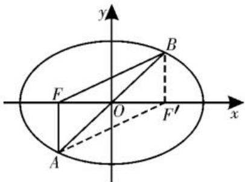
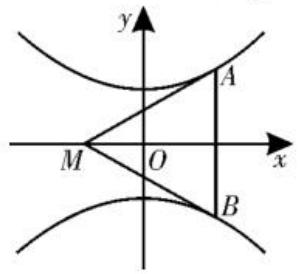

text_image

依托

# 依托离心率，定取值范围

text_image

范围

# ■江苏省曲塘高级中学

# 万海兵

离心率是反映圆锥曲线的形状特征的一个重要几何量, 是圆锥曲线统一定义的一个桥梁与纽带, 也是圆锥曲线的几何性质中的一个重要参数。而涉及圆锥曲线中椭圆(或双曲线)的离心率的取值范围(或最值)及其综合问题, 一直是圆锥曲线模块考查的一个热点问题。此类问题形式多变, 综合性强, 难度较大, 经常让同学们感到异常困惑, 力不从心, 甚至产生一定的恐惧心理, 导致严重失分。本文结合实例来总结与归纳破解离心率的取值范围(或最值)问题的一些常见的解题技巧, 希望能帮助同学们突破学习难点和瓶颈。

# 一、借助几何图形确定不等关系

根据平面图形的关系,如利用三角形两边之和大于第三边、折线段大于直线段、对称性质中的最值等得到不等关系,然后将这些量结合曲线的几何性质用 a, b, c 进行表示,进而得到不等式,从而破解离心率的取值范围(或最值)问题。

例 1 （1）已知椭圆 $C_{1}:\frac{x^{2}}{a^{2}}+\frac{y^{2}}{b^{2}}=1$ $(a>b>0)$ 与圆 $C_{2}:x^{2}+y^{2}=b^{2}$ ，若在椭圆 $C_{1}$ 上存在点 P，使得过点 P 所作的圆 $C_{2}$ 的两条切线互相垂直，则椭圆 $C_{1}$ 的离心率的取值范围是（）。

A. $\left[\frac{1}{2}, 1\right)$

B. $\left[\frac{\sqrt{2}}{2}, \frac{\sqrt{3}}{2}\right]$

C. $\left[\frac{\sqrt{2}}{2},1\right)$

D. $\left[\frac{\sqrt{3}}{2},1\right)$

(2) 已知 $F_{1}, F_{2}$ 是双曲线 $\frac{x^{2}}{a^{2}} - \frac{y^{2}}{b^{2}} = 1$ $(a > 0, b > 0)$ 的左焦点和右焦点，P 是双曲线上在第一象限内的一点，且 $2\sin \angle PF_{1}F_{2} = \sin \angle PF_{2}F_{1}$ ，则该双曲线的离心率的取值范围是 \_\_\_\_。

解析:(1)利用曲线的几何图形与几何性质可知,在椭圆 $C_{1}$ 的长轴端点 $P^{\prime}$ 处向圆 $C_{2}$ 引两条切线 $P^{\prime}A, P^{\prime}B$ , 若椭圆 $C_{1}$ 上存在点 P, 使过点 P 的两条切线互相垂直, 则只需 $\angle AP^{\prime}B \leqslant 90^{\circ}$ 。设 $\alpha = \angle AP^{\prime}O = \frac{1}{2} \angle AP^{\prime}B \leqslant 45^{\circ}$ , 则 $\sin \alpha = \frac{b}{a} \leqslant \sin 45^{\circ} = \frac{\sqrt{2}}{2}$ , 得 $a^{2} \leqslant 2c^{2}$ , 所以 $e^{2} = \frac{c^{2}}{a^{2}} \geqslant \frac{1}{2}$ 。又因为 0 < e < 1, 所以 $\frac{\sqrt{2}}{2} \leqslant e < 1$ , 即 $e \in \left[\frac{\sqrt{2}}{2}, 1\right)$ 。

故选C。

(2) 在 $\triangle PF_{1}F_{2}$ 中, $2\sin \angle PF_{1}F_{2} = \sin \angle PF_{2}F_{1}$ , 由正弦定理 $\frac{|PF_1|}{\sin \angle PF_2F_1} = \frac{|PF_2|}{\sin \angle PF_1F_2}$ , 得 $|PF_{1}| = 2|PF_{2}|$ 。又因为 $P$ 是双曲线上在第一象限内的一点, 所以 $|PF_{1}| - |PF_{2}| = 2a$ , 所以 $|PF_{1}| = 4a$ , $|PF_{2}| = 2a$ 。在 $\triangle PF_{1}F_{2}$ 中, 利用三角形的几何性质可知 $|PF_{1}| + |PF_{2}| > |F_{1}F_{2}|$ , 得 $4a + 2a > 2c$ , 即 $3a > c$ , 所以双曲线的离心率 $e = \frac{c}{a} < 3$ 。又 $e > 1$ , 所以 $1 < e < 3$ 。

故填(1,3)。

点评:借助几何图形确定不等关系解决离心率的取值范围(或最值)问题时,关键在于抓住题中的条件,联系解析几何与平面几何之间的关系,构建与之对应的平面几何图形,联想对应几何图形的几何性质,由此来构建对应的不等关系。

# 二、借助题目条件给出不等信息

根据试题本身给出的不等条件,如已知某些量、代数式或关系式的取值范围(或最值),存在点或直线使方程成立,构建相应的不等式,进一步得到离心率的不等关系式,从

而求解相应问题。

例 2 （1）已知平行四边形 ABCD 内接于椭圆 $\Omega:\frac{x^{2}}{a^{2}}+\frac{y^{2}}{b^{2}}=1(a>b>0)$ ，且 AB，AD 的斜率之积的范围为 $\left(-\frac{3}{4},-\frac{2}{3}\right)$ ，则椭圆 $\Omega$ 的离心率的取值范围是（）。

A. $\left(\frac{1}{2}, \frac{\sqrt{3}}{3}\right)$

B. $\left(\frac{\sqrt{3}}{3},\frac{\sqrt{2}}{2}\right)$

C. $\left(\frac{1}{4},\frac{\sqrt{3}}{3}\right)$

D. $\left(\frac{1}{4}, \frac{1}{3}\right)$

(2)已知 $F_{1}, F_{2}$ 分别是双曲线 $C: x^{2} - \frac{y^{2}}{b^{2}} = 1 (b > 0)$ 的左焦点和右焦点，O 为坐标原点，点 P 在双曲线 C 的右支上，且 $\left|F_{1}F_{2}\right| = 2|OP|$ ， $\tan \angle PF_{2}F_{1} \geqslant 4$ ，则双曲线 C 的离心率的取值范围是（）。

A. $\left(1,\frac{17}{9}\right]$

B. $\left[\frac{17}{9},+\infty\right)$

C. $\left[\frac{\sqrt{17}}{3},+\infty\right)$

D. $\left(1,\frac{\sqrt{17}}{3}\right]$

解析:(1)由题意知,D,B关于原点对称,设 $D(x_{0},y_{0}),B(-x_{0},-y_{0}),A(x,y)$ ,则 $k_{AD}\cdot k_{AB}=\frac{y-y_{0}}{x-x_{0}}\cdot\frac{y+y_{0}}{x+x_{0}}=\frac{y^{2}-y_{0}^{2}}{x^{2}-x_{0}^{2}}=\frac{b^{2}\left(1-\frac{x^{2}}{a^{2}}\right)-b^{2}\left(1-\frac{x_{0}^{2}}{a^{2}}\right)}{x^{2}-x_{0}^{2}}=-\frac{b^{2}}{a^{2}}$ 。而 $-\frac{b^{2}}{a^{2}}=\frac{c^{2}}{a^{2}}-1\in\left(-\frac{3}{4},-\frac{2}{3}\right)$ ，故 $\frac{c^{2}}{a^{2}}\in\left(\frac{1}{4},\frac{1}{3}\right)$ ，所以 $e\in\left(\frac{1}{2},\frac{\sqrt{3}}{3}\right)$ 。

故选A。

(2)由 $\left|F_{1}F_{2}\right|=2\left|OP\right|$ ，得 $F_{1}P\perp F_{2}P$ 。记 $\left|PF_{1}\right|=x,\left|PF_{2}\right|=y$ ，则 $x^{2}+y^{2}=(2c)^{2}=4c^{2}$ 。又x-y=2a，所以 $2xy=4c^{2}-4a^{2}$ ，所以 $(x+y)^{2}=x^{2}+y^{2}+2xy=4c^{2}+4c^{2}-4a^{2}=8c^{2}-4a^{2}$ ，则 $x+y=2\sqrt{2c^{2}-a^{2}}$ 。故 $x=\sqrt{2c^{2}-a^{2}}+a,y=\sqrt{2c^{2}-a^{2}}-a$ 。又 $\tan\angle PF_{2}F_{1}=\frac{x}{y}\geqslant4$ ，即 $x\geqslant4y$ ，则 $\sqrt{2c^{2}-a^{2}}+a\geqslant4(\sqrt{2c^{2}-a^{2}}-a)$ ，解得 $\frac{c^{2}}{a^{2}}\leqslant$

$\frac{17}{9}$ ，所以双曲线 C 的离心率 $e=\frac{c}{a}\leqslant\frac{\sqrt{17}}{3}$ 。
又因为 e>1，所以 $1<e\leqslant\frac{\sqrt{17}}{3}$ 。

故选D。

点评:借助题目条件给出不等信息解决离心率的取值范围(或最值)问题时,关键在于充分利用题目条件中的不等信息来合理构建对应的不等式(组),即依托不等信息的条件,将相关的知识点与思想方法渗透其中,形成合理的知识交汇与能力融合。

# 三、借助曲线类型挖掘几何性质

在求离心率的取值范围(或最值)时,常用到椭圆或双曲线自身的几何性质,如在椭圆 $\frac{x^{2}}{a^{2}}+\frac{y^{2}}{b^{2}}=1(a>b>0)$ 中,有 $-a\leqslant x\leqslant a$ ,若P是椭圆上任意一点,则 $a-c\leqslant\left|PF_{1}\right|\leqslant a+c$ 。

例 3 (1) 已知 F 是椭圆 $\frac{x^{2}}{a^{2}} + \frac{y^{2}}{b^{2}} = 1$ $(a > b > 0)$ 的一个焦点, 若直线 y = kx 与椭圆交于 A, B 两点, 且 $\angle AFB = 120^{\circ}$ , 则椭圆的离心率的取值范围是()。

A. $\left[\frac{\sqrt{3}}{2},1\right)$

B. $\left(0,\frac{\sqrt{3}}{2}\right]$

C. $\left[\frac{1}{2},1\right)$

D. $\left(0,\frac{1}{2}\right]$

(2)已知双曲线 $E:\frac{y^{2}}{a^{2}}-\frac{x^{2}}{b^{2}}=1(a>0,$ b>0)，过点 $M(-b,0)$ 的两条直线 $l_{1}, l_{2}$ 分别与双曲线 E 的上支和下支相切于点 A, B。
若△MAB 为锐角三角形，则双曲线 E 的离心率的取值范围是（）。

A. $\left(1,\frac{\sqrt{5}}{2}\right)$

B. $\left(1,\frac{\sqrt{6}}{2}\right)$

C. $\left(\frac{\sqrt{5}}{2},+\infty\right)$

D. $\left(\frac{\sqrt{6}}{2},+\infty\right)$

解析:(1)如图1,设F为椭圆的左焦点, $F'$ 为椭圆的右焦点,连接AF,BF, $AF',BF'$ 。由椭圆及直线的对称性知,四边形 $AFBF'$ 为平行四

text_image

y
B
F
O
x
A
F'

图1

# 定点问题巧分析，圆锥曲线妙应用

# ■陕西省商业学校

# 王莎莎

在解析几何应用场景中,有些含有参数的动直线或动曲线,不论参数如何变化总是经过某定点,探求这个定点的坐标,我们称这类问题为“定点问题”。定点问题是考查解析几何模块知识的一个热点问题,此类问题往往定中有动,动中有定,涉及一些比较常见的直线过定点、圆过定点,以及探究定点的存在性等问题,成为高考数学试卷中的一道亮丽风景线,备受各方关注。

# 一、直线过定点问题

例 1 （2025 年江西九江模拟）已知双曲线 $C: \frac{x^{2}}{a^{2}} - \frac{y^{2}}{b^{2}} = 1 (a > 0, b > 0)$ 的离心率为 $\sqrt{5}$ ，点 $P(3,4)$ 在 C 上。

(1)求双曲线 C 的方程；

(2)若直线 l 与双曲线 C 交于不同的两点 A, B, 且直线 PA, PB 的斜率互为倒数, 证明: 直线 l 过定点。

解析:(1)由已知得 $e=\frac{c}{a}=\sqrt{5}$ 。

又因为 $c^{2}=a^{2}+b^{2}$ ，所以 $b^{2}=4a^{2}$ 。

由点 $P(3,4)$ 在 $C$ 上，得 $\frac{9}{a^2} -\frac{16}{4a^2} = 1$ ，解得 $a^2 = 5$ ，则 $b^{2} = 20$ 。

所以双曲线 C 的方程为 $\frac{x^{2}}{5}-\frac{y^{2}}{20}=1$ 。

(2) 当直线 $l$ 的斜率不存在时, 可设

$A(m,n),B(m,-n)$ ，则 $\left\{ \begin{array}{l} \frac{m^2}{5} -\frac{n^2}{20} = 1,\\ \frac{4 - n}{3 - m}\cdot \frac{4 + n}{3 - m} = 1, \end{array} \right.$ 无解。

当直线 l 的斜率存在时, 如图 1 所示, 设

边形。又 $\angle AFB = 120^{\circ}$ ，则 $\angle FAF' = 60^{\circ}$ 。在 $\triangle AFF'$ 中，利用余弦定理有 $|FF'|^{2} = |AF|^{2} + |AF'|^{2} - 2|AF|\cdot |AF'|\cdot$ $\cos \angle FAF' = (|AF| + |AF'|)^{2} - 3|AF|\cdot$ $|AF'|$ 。所以 $(|AF| + |AF'|)^{2} - |FF'|^{2} =$ $3|AF|\cdot |AF'| \leqslant 3\left(\frac{|AF| + |AF'|}{2}\right)^{2}$ ，可得 $\frac{1}{4} (|AF| + |AF'|)^{2} \leqslant |FF'|^{2}$ ，即 $a^2 \leqslant 4c^2$ ，则 $e = \frac{c}{a} \geqslant \frac{1}{2}$ 。所以椭圆的离心率 $e \in \left[\frac{1}{2}, 1\right)$ 。

故选C。

(2)如图2,设过点 $M(-b,0)$ 的直线 $l_{1}$ : $y=k(x+b)(k>0)$ 。联立

$\left\{\begin{aligned}y&=k(x+b),\\ \frac{y^{2}}{a^{2}}-\frac{x^{2}}{b^{2}}&=1,\end{aligned}\right.$ 消去 y 整理得

$(b^{2}k^{2}-a^{2})x^{2}+2b^{3}k^{2}x+b^{2}(b^{2}k^{2}-a^{2})=0$ 。依题意知

图2

$\Delta = 4b^{6}k^{4} - 4b^{2}(b^{2}k^{2} - a^{2})^{2} = 0$ ，所以 $k^2 = \frac{a^2}{2b^2}$ 。由双曲线的对称性知 $0 < k^2 = \frac{a^2}{2b^2} < 1$

所以 $a^2 < 2(c^2 - a^2)$ ，整理得双曲线 $E$ 的离心率 $e = \frac{c}{a} > \frac{\sqrt{6}}{2}$ 。

故选D。

点评:借助曲线类型挖掘几何性质解决离心率的取值范围(或最值)问题时,关键在于挖掘椭圆或双曲线自身的几何性质,这既是不同曲线类型自身所具备的结构特征,也是问题隐含的基本条件,要合理挖掘并加以正确应用。

总之，在解决圆锥曲线中的离心率的取值范围(或最值)及其综合问题时，需要同学们依托问题场景，剖析并理解题目条件，挖掘问题的内涵与实质，或对圆锥曲线中的已知特征关系加以合理转化，或对平面几何关系加以合理挖掘，采用相应的技巧与方法，巧妙构建对应的不等关系，通过逻辑推理与数学运算来分析与应用，有效转化，巧妙应用，可使离心率的取值范围(或最值)问题的求解更简捷。

(责任编辑 王福华)