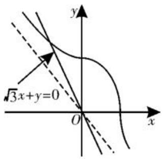
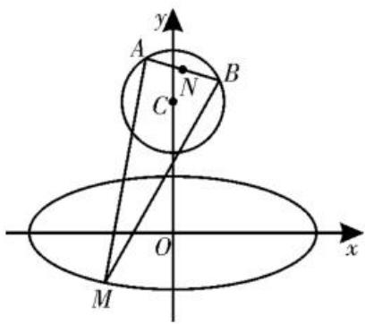

# 剖析圆锥曲线中有关最值问题的突破策略

■江苏省如东县掘港高级中学

胡松燕

圆锥曲线作为高中数学的重要内容,其参数方程在解决各类问题中具有独特的优势。在最值问题中,圆锥曲线参数方程的应用能够将复杂的几何问题转化为三角函数或代数函数问题,为解题提供了新的思路和方法。随着数学教育的发展和高考命题的改革,对圆锥曲线参数方程在最值问题中的考查也不断演变,更加注重对同学们创新思维和综合应用能力的检测。

# 一、圆锥曲线参数方程在最值问题中的应用例题分析

# 1. 面积最值问题

例 1 （2025 年河南模拟预测）已知椭圆 C 的中心与坐标原点 O 重合， $F(3,0)$ 为 C 的一个焦点，且点 $B(0,\sqrt{7})$ 在 C 上。

(1) 求 C 的方程及离心率;

(2) 设 P 为 C 在第一象限的部分上一点, 求四边形 OFPB 面积的最大值。

解析:(1)由题意可设 C 的方程为 $\frac{x^{2}}{a^{2}} + \frac{y^{2}}{b^{2}} = 1 (a > b > 0)$ ，C 的半焦距为 $c (c > 0)$ ，则 $c = 3, b = \sqrt{7}, a = \sqrt{b^{2} + c^{2}} = 4$ ，所以 C 的方程为 $\frac{x^{2}}{16} + \frac{y^{2}}{7} = 1$ ，离心率 $e = \frac{c}{a} = \frac{3}{4}$ 。

(2) 由题意及 (1) 可设点 $P(4\cos \theta, \sqrt{7}\sin \theta), 0 < \theta < \frac{\pi}{2}$ , 则 $S_{\text{四边形}OFPB} = S_{\triangle OFP} + S_{\triangle OPB} = \frac{1}{2} \times 3 \times \sqrt{7}\sin \theta + \frac{1}{2} \times \sqrt{7} \times 4\cos \theta = \frac{\sqrt{7}}{2}(3\sin \theta + 4\cos \theta) = \frac{5\sqrt{7}\sin(\theta + \varphi)}{2} \leqslant \frac{5\sqrt{7}}{2}$ （其中 $\varphi$ 为锐角，且 $\tan \varphi = \frac{4}{3}$ ）。

故当 $\theta = \frac{\pi}{2} -\varphi$ 时，四边形OFPB的面积取得最大值，且最大值为 $\frac{5\sqrt{7}}{2}$ 。

突破策略:面对含参数的椭圆与顶点,需先利用椭圆中的基本关系消元,将多元参数转化为单变量;若顶点为其他曲线动点,联立曲线方程得到坐标参数式,再通过“分割法”拆分四边形面积为三角形面积和,结合三角函数辅助角、导数或均值不等式,在参数约束下分析函数最值。

# 2. 距离最值问题

例 2 （2025 年江苏期末联考）已知曲线 $E: \frac{x|x|}{3} + \frac{y|y|}{6} = 1, P(x_{0}, y_{0})$ 是曲线 E 上任意一点，则 $\left|\sqrt{3}x_{0} + y_{0}\right|$ 的最大值为（）。

A. $\frac{15}{2}$

B. $\frac{\sqrt{30}}{2}$

C. $\sqrt{15}$

D. $\sqrt{30}$

解析:由 $\frac{x|x|}{3}+\frac{y|y|}{6}=1$ 知,当x<0,y>0时,方程为 $\frac{y^{2}}{6}-\frac{x^{2}}{3}=1$ ;当 $x\geqslant0,y\geqslant0$ 时,方程为 $\frac{x^{2}}{3}+\frac{y^{2}}{6}=1$ ;当x>0,y<0时,方程为 $\frac{x^{2}}{3}-\frac{y^{2}}{6}=1$ ;当x<0,y<0时,方程为 $-\frac{x^{2}}{3}-\frac{y^{2}}{6}=1$ ,无解。

如图1, 曲线在第二、四象限是双曲线的一部分, 在第一象限是椭圆 $\frac{x^2}{3} + \frac{y^2}{6} = 1$ 的一部分, $|\sqrt{3} x_0 + y_0|$ 可看成是点 $P(x_0, y_0)$ 到直线 $\sqrt{3} x + y = 0$ 的距离的两倍。

text_image

y
√3x+y=0
O
x

图1

由图可知，点 $P(x_0, y_0)$ 在椭圆上时，距离最大。

设 $P(\sqrt{3}\cos \theta ,\sqrt{6}\sin \theta)\left(0 <   \theta <  \frac{\pi}{2}\right)$ ，则 $\sqrt{3} x_0 + y_0 = 3\cos \theta +\sqrt{6}\sin \theta = \sqrt{15}\sin (\theta +$ $\varphi)$ ，其中 $\tan \varphi = \frac{\sqrt{6}}{2}$ ，则 $|\sqrt{3} x_0 + y_0|_{\max} =$

$\sqrt{15}$ 。故选C。

突破策略:如若遇到绝对值曲线,我们可先按 x,y 的正负分四象限拆解曲线,明确各区域方程;然后设直线方程,二次曲线联立用判别式找相切截距,高次曲线求导分析切线,转化为截距极值问题;综合各象限 t 的绝对值,依托分类讨论、转化与化归、函数与方程等思想,贯通“拆分—求解—比较”逻辑链。

# 3. 向量数量积最值问题

例 3 （2025 年江苏模拟预测）已知 M 是椭圆 $\frac{x^{2}}{10} + y^{2} = 1$ 上一点，线段 AB 是圆 C: $x^{2} + (y - 6)^{2} = 4$ 的一条动弦，且 $|AB| = 2\sqrt{2}$ ，则 $\overrightarrow{MA} \cdot \overrightarrow{MB}$ 的最大值为 \_\_\_\_。

解析:如图2,设AB的中点为N,由 $|AB|=2\sqrt{2}\Rightarrow|AN|=\sqrt{2},|CN|=\sqrt{|AC|^{2}-|AN|^{2}}=$ $\sqrt{2}$ ，故点 N 的轨迹是以
(0,6)为圆心， $r=\sqrt{2}$ 为

text_image

y
A
B
C
N
O
x
M

图2

半径的圆， $\overrightarrow{MA} \cdot \overrightarrow{MB} = (\overrightarrow{MN} + \overrightarrow{NA}) \cdot (\overrightarrow{MN} + \overrightarrow{NB}) = (\overrightarrow{MN} + \overrightarrow{NA}) \cdot (\overrightarrow{MN} - \overrightarrow{NA}) = |\overrightarrow{MN}|^2 - |\overrightarrow{NA}|^2 = |\overrightarrow{MN}|^2 - 2, |\overrightarrow{MN}|_{\max} = |\overrightarrow{MC}|_{\max} + r$ 。

$$
\begin{array}{l} \sqrt {3 7 + 9 \sin^ {2} \theta - 1 2 \cos \theta} = \\ \sqrt {3 7 + 9 (1 - \cos^ {2} \theta) - 1 2 \cos \theta} = \\ = 5 \sqrt {2} 。 \\ \end{array}
$$

设 $M(\sqrt{10}\sin \theta ,\cos \theta)$ ，则 $|MC| =$ $\sqrt{(\sqrt{10}\sin\theta)^2 + (\cos\theta -6)^2}$

$\sqrt{46 - 9\cos^2\theta - 12\cos\theta}$ , 当且仅当 $\cos \theta = -\frac{2}{3}$ 时, $|MC|_{\max} = \sqrt{46 - 9 \cdot \left(-\frac{2}{3}\right)^2 + 12 \cdot \frac{2}{3}}$

所以 $|MN|_{\max} = |MC|_{\max} + r = 5\sqrt{2} + \sqrt{2} = 6\sqrt{2}, (\overrightarrow{MA} \cdot \overrightarrow{MB})_{\max} = |\overrightarrow{MN}|_{\max}^2 - 2 = 72 - 2 = 70$ 。

突破策略:对于此类圆锥曲线与圆、向量结合的问题,利用圆的弦长、中点等性质,将向量关系转化为坐标或距离关系;借助圆锥曲线的方程,结合二次函数、均值不等式等工具,求相关距离、向量运算的最值,关键是把复杂条件(如向量、弦长)转化为可利用圆锥曲线性质求解的表达式。

# 二、圆锥曲线参数方程在最值问题中命题演变的特点

(1)知识融合度增加:不再单纯考查圆锥曲线参数方程与最值的简单结合,而是将其与函数、不等式、向量等知识融合,要求同学们具备综合运用知识的能力。  
(2)条件设置多样化:通过改变圆锥曲线的方程形式、增加限制条件、引入新的几何元素,使题目条件更加复杂多变,考查同学们对不同条件的分析和处理能力。  
(3)问题形式创新化:除了传统的求距离、代数式的最值等问题,还会出现一些新的问题形式,如求面积的最值、探究最值成立的条件、与实际应用相结合的最值问题等,更加注重对同学们创新思维和应用能力的考查。

# 三、应对圆锥曲线参数方程在最值问题中命题演变的策略

(1)强化基础知识:扎实掌握圆锥曲线参数方程的定义、形式和几何意义,熟练运用三角函数、代数函数的相关知识进行运算和分析,为解决复杂问题奠定基础。  
(2)注重思维训练: 培养转化与化归思想, 将几何问题转化为代数问题; 分类讨论思想, 根据不同的条件进行分类求解; 函数与方程思想, 建立目标函数求解最值。通过大量的练习和思考, 提高思维的灵活性和创新性。  
(3)加强综合能力培养:在日常学习中,多做综合性的练习题,将圆锥曲线参数方程与其他知识进行融合练习,提高综合运用知识解决问题的能力。同时,关注数学知识在实际生活中的应用,培养数学建模能力。

圆锥曲线参数方程在最值问题中的命题不断演变,从基础的单一曲线与直线位置关系求最值,逐渐向多参数、多知识融合方向发展。在解题时,要深刻理解参数方程的本质,把握参数的几何意义或代数意义,灵活运用函数、不等式、几何性质等知识突破命题难点,实现高效解题。同时,通过对命题演变规律的总结,能够更好地预测命题趋势,提升应对圆锥曲线最值问题的能力。(责任编辑 王福华)