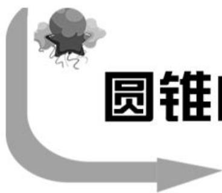

text_image

圆锥

# 圆锥曲线中定点、定值问题的求解策略

# ■河南省许昌高级中学 孙英环

圆锥曲线中的定点、定值问题是新高考热点与难点之一,此类题的综合性很强,考查范围广泛,涉及导数、向量、不等式、函数和平面几何等数学知识。同时在解题过程中,强调数学思维和数学运算相结合,不仅考查同学们的运算能力,还要求同学们能熟练运用函数方程、等价转换、数形结合、分类讨论等数学思想方法。下面通过例题归纳总结圆锥曲线中定点、定值问题的求解策略,供同学们复习时参考。

# 一、直接推理法求定点

例 1 已知椭圆 $C: \frac{x^{2}}{a^{2}} + \frac{y^{2}}{b^{2}} = 1 (a > b > 0)$ 的离心率为 $\frac{1}{2}$ ，其左焦点到点 $P(2,1)$ 的距离为 $\sqrt{10}$ 。

(1)求椭圆 C 的方程。

(2)若直线 $l: y = kx + m$ 与椭圆 C 交于点 A, B (A、B 不是左、右顶点)，且以 AB 为直径的圆过椭圆 C 的右顶点。求证：直线 l 过定点，并求出该定点的坐标。

解析:(1)设左焦点 $F_{1}(-c,0)$ ，所以 $\left|PF_{1}\right|=\sqrt{(-c-2)^{2}+(0-1)^{2}}=\sqrt{10}$ ，解得 c=1。又 $\frac{c}{a}=\frac{1}{2}$ ，则 a=2, $b=\sqrt{a^{2}-c^{2}}=\sqrt{3}$ 。故椭圆 C 的方程为 $\frac{x^{2}}{4}+\frac{y^{2}}{3}=1$ 。

(2)由(1)知椭圆 C 的右顶点为 $D(2,0)$ 。

设 $A(x_{1},y_{1}), B(x_{2},y_{2})$ ，因为以 AB 为直径的圆过 D(2,0)，所以 $DA \perp DB$ ，即 $\overrightarrow{DA} \perp \overrightarrow{DB}$ ，所以 $\overrightarrow{DA} \cdot \overrightarrow{DB} = 0$ 。

因为 $\overrightarrow{DA}=(x_{1}-2,y_{1}),\overrightarrow{DB}=(x_{2}-2,y_{2})$ ，所以 $\overrightarrow{DA}\cdot\overrightarrow{DB}=(x_{1}-2)(x_{2}-2)+y_{1}y_{2}=x_{1}x_{2}-2(x_{1}+x_{2})+4+y_{1}y_{2}=0$ 。

联立 $\left\{\begin{aligned}y=kx+m,\\ 3x^{2}+4y^{2}=12,\end{aligned}\right.$ 消去y整理得(3+ $4k^{2}$ ) $x^{2}+8mkx+4(m^{2}-3)=0$ ，则 $x_{1}+x_{2}=$

$$
- \frac {8 m k}{4 k ^ {2} + 3}, x _ {1} x _ {2} = \frac {4 (m ^ {2} - 3)}{4 k ^ {2} + 3}.
$$

所以 $y_{1}y_{2} = (kx_{1} + m)(kx_{2} + m) =$

$$
k ^ {2} x _ {1} x _ {2} + m k (x _ {1} + x _ {2}) + m ^ {2} = \frac {4 k ^ {2} (m ^ {2} - 3)}{4 k ^ {2} + 3} -
$$

$$
\frac {8 m ^ {2} k ^ {2}}{4 k ^ {2} + 3} + m ^ {2} = \frac {3 m ^ {2} - 1 2 k ^ {2}}{4 k ^ {2} + 3} 。
$$

故 $\overrightarrow{DA} \cdot \overrightarrow{DB} = \frac{4(m^{2}-3)}{4k^{2}+3} + 2 \cdot \frac{8mk}{4k^{2}+3} +$

$$
4 + \frac {3 m ^ {2} - 1 2 k ^ {2}}{4 k ^ {2} + 3} = \frac {7 m ^ {2} + 1 6 m k + 4 k ^ {2}}{4 k ^ {2} + 3} = 0 _ {\circ}
$$

所以 $7m^{2} + 16mk + 4k^{2} = (7m + 2k)$

$(m+2k)=0$ , 解得 $m=-\frac{2}{7}k$ 或 m=-2k。

当 $m = -\frac{2}{7} k$ 时，直线 $l:y = kx - \frac{2}{7} k = k\left(x - \frac{2}{7}\right)$ ，所以直线 $l$ 恒过点 $\left(\frac{2}{7},0\right)$

当 $m = -2k$ 时，直线 $l: y = kx - 2k = k(x - 2)$ ，所以直线 $l$ 恒过点 $(2,0)$ ，但 $(2,0)$ 为椭圆 $C$ 的右顶点，不符合题意，故舍去。

所以直线 l 恒过点 $\left(\frac{2}{7},0\right)$ 。

评注: 直接推理法求定点的一般步骤: 一选(设参), 二求(用参), 三定点(消参)。解答本题第(2)问的关键是设出直线 l 的方程, 与椭圆方程联立, 利用韦达定理及向量数量积坐标公式计算推理得证。同学们在解题过程中要注意排除不符合题意的点。

# 二、特殊探路，一般证明

例 2 已知椭圆 $C: \frac{y^{2}}{a^{2}} + \frac{x^{2}}{b^{2}} = 1 (a > b \geqslant 1)$ 的离心率为 $\frac{\sqrt{2}}{2}$ ，上焦点到直线 $bx + 2ay - \sqrt{2} = 0$ 的距离为 $\frac{\sqrt{2}}{3}$ 。

(1)求椭圆 C 的方程。

(2) 过点 $P\left(\frac{1}{3},0\right)$ 的直线 l 交椭圆 C 于

A, B 两点。试探究以线段 AB 为直径的圆是否过定点？若过，求出定点坐标；若不过，请说明理由。

解析:(1) 由 $e=\frac{c}{a}=\frac{\sqrt{2}}{2}$ ，得 $e^{2}=\frac{a^{2}-b^{2}}{a^{2}}=\frac{1}{2}$ ，则 $a^{2}=2b^{2}, c^{2}=a^{2}-b^{2}=b^{2}$ 。

又因为 $\frac{|2ac - \sqrt{2}|}{\sqrt{4a^2 + b^2}} = \frac{\sqrt{2}}{3}, a > b \geqslant 1$ ，所以 $b = 1, a^2 = 2$ ，故椭圆 $C$ 的方程为 $\frac{y^2}{2} + x^2 = 1$ 。

(2) 当 $AB \perp x$ 轴时, 以 AB 为直径的圆的方程为 $\left(x - \frac{1}{3}\right)^{2} + y^{2} = \frac{16}{9}$ ;

当 $AB \perp y$ 轴时，以 AB 为直径的圆的方程为 $x^{2} + y^{2} = 1$ 。

可得两圆交点为 $Q(-1,0)$ 。

由此可知,若以 AB 为直径的圆恒过定点,则该定点必为 $Q(-1,0)$ 。

下证 $Q(-1,0)$ 符合题意。

设直线 l 的斜率存在, 且不为 0 , 则方程为 $y = k \left( x - \frac{1}{3} \right)$ , 代入 $\frac{y^{2}}{2} + x^{2} = 1$ , 化简整理得 $(k^{2} + 2)x^{2} - \frac{2}{3}k^{2}x + \frac{1}{9}k^{2} - 2 = 0, \Delta = \frac{64}{9}k^{2} + 16 > 0$ 恒成立。

设 $A(x_{1},y_{1}),B(x_{2},y_{2})$ ，则 $x_{1} + x_{2} = \frac{2k^{2}}{3(k^{2} + 2)},x_{1}x_{2} = \frac{k^{2} - 18}{9(k^{2} + 2)}.$

所以 $\overrightarrow{QA} \cdot \overrightarrow{QB} = (x_{1} + 1)(x_{2} + 1) + y_{1}y_{2} = x_{1}x_{2} + x_{1} + x_{2} + 1 + k^{2}$

$$
\left(x _ {1} - \frac {1}{3}\right) \left(x _ {2} - \frac {1}{3}\right) = (1 + k ^ {2}) x _ {1} x _ {2} +
$$

$$
\left(1 - \frac {1}{3} k ^ {2}\right) (x _ {1} + x _ {2}) + 1 + \frac {1}{9} k ^ {2} = (1 + k ^ {2}) \cdot
$$

$$
\frac {k ^ {2} - 1 8}{9 (k ^ {2} + 2)} + \left(1 - \frac {1}{3} k ^ {2}\right) \frac {2 k ^ {2}}{3 (k ^ {2} + 2)} + 1 + \frac {1}{9} k ^ {2} =
$$

0, 故 $\overrightarrow{QA} \perp \overrightarrow{QB}$ ，即 $Q(-1,0)$ 在以 AB 为直径的圆上。

综上可知，以 $AB$ 为直径的圆恒过定点 $(-1,0)$ 。

评注:先找后证法求定点的一般思路:
(1)先猜后证,可先考虑运动图形是否有对称性及特殊(或极端)位置,如直线的水平位置、竖直位置,即 k=0 或 k 不存在;(2)以曲线上的点为参数,利用点在曲线 $f(x,y)=0$ 上进行消参。

# 三、参数法求定值

例 3 已知双曲线 $E: \frac{x^{2}}{a^{2}} - y^{2} = 1 (a > 0)$ 过点 $M(2,1)$ , MP, MQ 分别为圆 $C: (x - 2)^{2} + y^{2} = r^{2} \left(0 < r < \frac{\sqrt{3}}{3}\right)$ 的两条切线，且分别交双曲线 E 于点 P, Q。

(1)求双曲线 E 的离心率;

(2) 证明: 直线 PQ 的斜率为定值。

解析:(1)将 $M(2,1)$ 代入 $\frac{x^{2}}{a^{2}} - y^{2} = 1$ ，得 $a^{2}=2$ ，故双曲线 E 的离心率 $e=\sqrt{1+\frac{1}{a^{2}}}=\frac{\sqrt{6}}{2}$ 。

(2)由题意知,直线 MP,MQ 的斜率都存在且不为 0,设直线 MP 的方程为 $y=k_{1}(x-2)+1$ , 直线 MQ 的方程为 $y=k_{2}(x-2)+1$ , $P(x_{1},y_{1})$ , $Q(x_{2},y_{2})$ 。

联立 $\left\{ \begin{array}{l} y = k_{1}(x - 2) + 1, \\ \frac{x^{2}}{2} - y^{2} = 1, \end{array} \right.$ 消去 $y$ 整理得 $(1 - 2k_{1}^{2})x^{2} + 4k_{1}(2k_{1} - 1)x - 2(2k_{1} - 1)^{2} - 2 = 0$ 。

由 $1 - 2k_{1}^{2}\neq 0$ ，得 $k_{1}\neq \pm \frac{\sqrt{2}}{2}$

由 $\Delta=16k_{1}^{2}(2k_{1}-1)^{2}-4(1-2k_{1}^{2})\cdot[-2(2k_{1}-1)^{2}-2]=16(k_{1}-1)^{2}>0$ ，得 $k_{1}\neq1$ 。

由题意知， $2 + x_{1} = -\frac{4k_{1}(2k_{1} - 1)}{1 - 2k_{1}^{2}}$ ，解得 $x_{1} = \frac{4k_{1}^{2} - 4k_{1} + 2}{2k_{1}^{2} - 1}$ ，故 $y_{1} = k_{1}(x_{1} - 2) + 1 =$ $\frac{-2k_1^2 + 4k_1 - 1}{2k_1^2 - 1}$

所以 $P\left(\frac{4k_{1}^{2}-4k_{1}+2}{2k_{1}^{2}-1},\frac{-2k_{1}^{2}+4k_{1}-1}{2k_{1}^{2}-1}\right)$ 。

同理 $Q\left(\frac{4k_2^2 - 4k_2 + 2}{2k_2^2 - 1}, \frac{-2k_2^2 + 4k_2 - 1}{2k_2^2 - 1}\right)$ 。

由题意知， $r=\frac{1}{\sqrt{k_{1}^{2}+1}}=\frac{1}{\sqrt{k_{2}^{2}+1}}<\frac{\sqrt{3}}{3}$ ，
得 $k_{1}^{2}=k_{2}^{2}>2$ 。

因为 $k_{1} \neq k_{2}$ , 所以 $k_{2} = -k_{1}$ , 故 $Q$ 的坐标为 $\left(\frac{4k_1^2 + 4k_1 + 2}{2k_1^2 - 1}, \frac{-2k_1^2 - 4k_1 - 1}{2k_1^2 - 1}\right)$ 。

所以直线 $PQ$ 的斜率 $k = \frac{-2k_1^2 + 4k_1 - 1}{2k_1^2 - 1} - \frac{-2k_1^2 - 4k_1 - 1}{2k_1^2 - 1}}{\frac{4k_1^2 - 4k_1 + 2}{2k_1^2 - 1} - \frac{4k_1^2 + 4k_1 + 2}{2k_1^2 - 1}} = \frac{8k_1}{-8k_1} =$

-1, 即直线 PQ 的斜率为定值 -1。

评注:此题是求双曲线的离心率及双曲线中的定值问题。第(1)问是根据点在双曲线上,将点的坐标代入双曲线方程求出 $a^{2}$ 的值,再利用双曲线的离心率公式 $e=\sqrt{1+\frac{b^{2}}{a^{2}}}$ 来计算离心率。第(2)问是通过联立直线和双曲线方程,利用韦达定理求出交点坐标,再根据已知条件得出斜率关系,进而求出直线PQ的斜率为定值。

# 四、从特殊到一般求定值

例 4 设 O 为坐标原点, 动点 M 在椭圆 $\frac{x^{2}}{9} + \frac{y^{2}}{4} = 1$ 上, 过 M 作 x 轴的垂线, 垂足为 N, 点 P 满足 $\overrightarrow{NP} = \sqrt{2}\overrightarrow{NM}$ 。

(1) 求点 P 的轨迹 E 的方程；

(2) 过 $F(1,0)$ 的直线 $l_{1}$ 与 E 交于 A, B 两点，过 $F(1,0)$ 作与 $l_{1}$ 垂直的直线 $l_{2}$ 交 E 于 C, D 两点，求证： $\frac{1}{|AB|} + \frac{1}{|CD|}$ 为定值。

解析:(1)设 $P(x,y)$ , $M(x_{0},y_{0})$ ，则 $N(x_{0},0)$ 。

因为 $\overrightarrow{NP} = \sqrt{2}\overrightarrow{NM}$ ，所以 $(x - x_0,y) =$ $\sqrt{2}(0,y_0)$ ，故 $x_0 = x,y_0 = \frac{y}{\sqrt{2}}$ 。

又点 M 在椭圆上, 所以 $\frac{x^{2}}{9} + \frac{\left(\frac{y}{\sqrt{2}}\right)^{2}}{4} = 1$ ,
即 $\frac{x^{2}}{9}+\frac{y^{2}}{8}=1$ 。

故点 P 的轨迹 E 的方程为 $\frac{x^{2}}{9} + \frac{y^{2}}{8} = 1$ 。

(2)由(1)知 F 为椭圆 $\frac{x^{2}}{9} + \frac{y^{2}}{8} = 1$ 的右焦点。

当直线 $l_{1}$ 与 x 轴重合时， $|AB|=6$ ， $|CD|=\frac{2b^{2}}{a}=\frac{16}{3}$ ，所以 $\frac{1}{|AB|}+\frac{1}{|CD|}=\frac{17}{48}$ 。

当直线 $l_{1}$ 与 x 轴垂直时， $|AB|=\frac{16}{3}$ ， $|CD|=6$ ，所以 $\frac{1}{|AB|}+\frac{1}{|CD|}=\frac{17}{48}$ 。

当直线 $l_{1}$ 与 x 轴不垂直也不重合时，可设直线 $l_{1}$ 的方程为 $y=k(x-1)(k\neq0)$ ，则直线 $l_{2}$ 的方程为 $y=-\frac{1}{k}(x-1)$ 。

设 $A(x_{1},y_{1}),B(x_{2},y_{2})$ ，联立 $\left\{ \begin{array}{l}y = k(x - 1),\\ \frac{x^2}{9} +\frac{y^2}{8} = 1, \end{array} \right.$ 消去 $y$ 整理得 $(8 + 9k^{2})x^{2}-$ $18k^{2}x + 9k^{2} - 72 = 0$ ，则 $\Delta = (-18k^2)^2 -$ $4(8 + 9k^{2})(9k^{2} - 72) = 2304(k^{2} + 1) > 0,$ $x_{1} + x_{2} = \frac{18k^{2}}{8 + 9k^{2}},x_{1}x_{2} = \frac{9k^{2} - 72}{8 + 9k^{2}}.$

由弦长公式可得 $|AB| = \sqrt{1 + k^2} \cdot \sqrt{(x_1 + x_2)^2 - 4x_1x_2} = \frac{48(1 + k^2)}{8 + 9k^2}$ 。

同理可得 $|CD|=\frac{48(1+k^{2})}{9+8k^{2}}$ 。

所以 $\frac{1}{|AB|} + \frac{1}{|CD|} = \frac{8 + 9k^{2}}{48(k^{2} + 1)} + \frac{9 + 8k^{2}}{48(k^{2} + 1)} = \frac{17}{48}$ 。

综上可得， $\frac{1}{|AB|} +\frac{1}{|CD|}$ 为定值。

评注:从特殊到一般求定值的一般思路:
(1)研究特殊情形(如直线斜率不存在、直线与 x 轴重合等),得到所要探求的定值;(2)探究一般情形;(3)综合上面两种情形下结论。

解析几何是一个有机整体,由于圆锥曲线解答题的运算量过大,同学们应该从“形”和“数”两个角度去分析问题,注重数学的内在知识逻辑和思维逻辑,明确算理,掌握算法,提高运算效率。在日常学习过程中,同学们应培养几何推理能力、数学运算能力及高阶思维能力,提升数学核心素养。

(责任编辑 王福华)