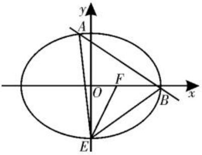
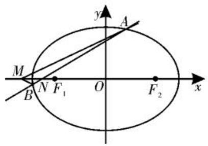
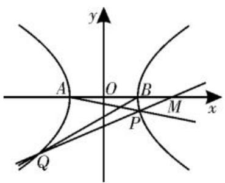
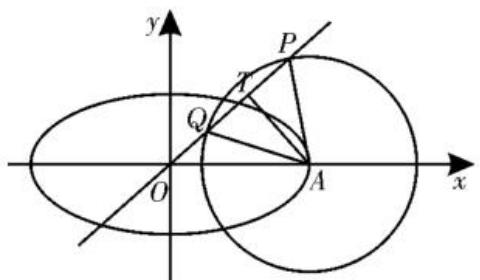

# 圆锥曲线中探究性问题的考向分析

# ■河南省许昌高级中学

# 张文龙

近年来，在圆锥曲线考查的题型中经常会出现探究性问题。探究性问题是指命题中缺少一定条件或无明确结论，需要经过猜测、归纳并加以证明的题型。在圆锥曲线的考题中常见的有探究位置关系，也有探究点、直线是否存在，还有探究是否存在常数值、定值等。这类题型在考查圆锥曲线基础知识和几何性质的同时，能很好地考查同学们的运算求解、推理论证等数学能力。探究性问题的解题策略通常采用“肯定顺推法”，将不确定性问题明朗化。先假设存在，推证满足条件的结论，若结论正确，则存在；若结论不正确，则不存在。同时，反证法与验证法也是求解探究性问题的常用方法。本文选取一些联考题，通过对考向的清晰梳理和典型例题的剖析，为同学们提供明确的备考策略，从而提升备考效率。

# 考向一、探究是否存在直线的问题

例 1 （2024 年山西大同高二统考期末）如图1,已知椭圆 $C:\frac{x^2}{a^2} +\frac{y^2}{b^2}$ $= 1(a > b > 0)$ 的离心率为 $\frac{\sqrt{3}}{3}, E, F$ 分别为下顶点

text_image

y
A
F
O
B
x
E

图1

和右焦点,坐标原点为 O, 且 $\triangle EOF$ 的面积为 $\sqrt{2}$ 。

(1)求椭圆 C 的方程。

(2)试问:是否存在直线 l, 使得直线 l 与椭圆 C 交于 A, B 两点, 且 F 恰为 $\triangle EAB$ 的垂心? 若存在, 求出直线 l 的方程; 若不存在, 请说明理由。

解析:(1)由题意知 $\left\{\begin{aligned}\frac{c}{a}&=\frac{\sqrt{3}}{3},\\ \frac{1}{2}bc&=\sqrt{2},\\ a^{2}&=b^{2}+c^{2},\end{aligned}\right.$ 解得

$\left\{\begin{aligned}a&=\sqrt{6},\\ b&=2,\end{aligned}\right.$ 所以椭圆 C 的方程为 $\frac{x^{2}}{6}+\frac{y^{2}}{4}=1$ 。
c= $\sqrt{2}$ ,

(2) 假设满足条件的直线 l 存在。

由 $E(0, -2), F(\sqrt{2}, 0)$ ，得 $k_{EF} = \sqrt{2}$ 。

因为 F 为 $\triangle EAB$ 的垂心, 所以 $AB \perp EF$ , 所以 $k_{AB} = -\frac{\sqrt{2}}{2}$ 。

设直线 l 的方程为 $y = -\frac{\sqrt{2}}{2}x + t$ ，代入 $\frac{x^{2}}{6} + \frac{y^{2}}{4} = 1$ ，得 $7x^{2} - 6\sqrt{2}tx + 6(t^{2} - 4) = 0$ ，
所以 $\Delta=(-6\sqrt{2}t)^{2}-4\times7\times6(t^{2}-4)=-96t^{2}+672>0$ ，解得 $-\sqrt{7}<t<\sqrt{7}$ 。

设 $A(x_{1},y_{1}),B(x_{2},y_{2})$ ，则 $x_{1} + x_{2} =$ $\frac{6\sqrt{2}}{7} t,x_1x_2 = \frac{6(t^2 - 4)}{7}$

由 $AF \perp BE$ 得 $\frac{y_1}{x_1 - \sqrt{2}} \cdot \frac{y_2 + 2}{x_2} = -1$ , 所以 $y_1 y_2 + 2y_1 + x_1 x_2 - \sqrt{2} x_2 = 0$ , 将 $y_1 = -\frac{\sqrt{2}}{2} x_1 + t, y_2 = -\frac{\sqrt{2}}{2} x_2 + t$ 代入得 $3x_1x_2 - \sqrt{2}(t + 2)(x_1 + x_2) + (2t^2 + 4t) = 0$ , 所以 $3 \times \frac{6(t^2 - 4)}{7} - \sqrt{2}(t + 2) \times \frac{6\sqrt{2}t}{7} + (2t^2 + 4t) = 0$ , 化简整理得 $5t^2 + t - 18 = 0$ , 解得 $t = \frac{9}{5}$ ( $t = -2$ 舍去), 满足 $\Delta > 0$ 。

所以直线 l 的方程为 $y = -\frac{\sqrt{2}}{2}x + \frac{9}{5}$ 。

评注:探究是否存在直线的问题,可先假设直线存在,设出直线方程,与圆锥曲线方程联立,利用韦达定理,结合已知条件建立关于参数的关系式,进而问题得到求解。

# 考向二、探究是否存在点的问题

例 2 （2024 年湖北月考）如图 2，已知椭圆 E 的焦点 $F_{1}, F_{2}$ 在 x 轴上，焦距为 4，点 $P(2, \sqrt{2})$ 在椭圆 E 上，过点 $N(-\sqrt{6}, 0)$ 的直线交椭圆 E 于 A, B 两点。

text_image

y
A
M
N F₁ O F₂ x
B

图2

(1)求椭圆 E 的方程。

(2)若直线 AB 与坐标轴不垂直,试问:在 x 轴上是否存在点 M,使得 $k_{AM} + k_{BM} = 0$ 成立?若存在,求出点 M 的坐标;若不存在,请说明理由。

解析:(1)设椭圆 E 的方程为 $\frac{x^{2}}{a^{2}} + \frac{y^{2}}{b^{2}} = 1$ $(a > b > 0)$ ，由题意知 $c = 2, \frac{4}{a^{2}} + \frac{2}{b^{2}} = 1$ ， $a^{2} - b^{2} = 4$ ，解得 $a^{2} = 8, b^{2} = 4$ ，故椭圆 E 的方程为 $\frac{x^{2}}{8} + \frac{y^{2}}{4} = 1$ 。

(2) 假设存在点 $M(m,0)$ 满足条件。

设直线 AB 的方程为 $y = k(x + \sqrt{6})$ $(k \neq 0)$ , $A(x_{1}, y_{1})$ , $B(x_{2}, y_{2})$ ，联立 $\left\{\begin{aligned}y&=k(x+\sqrt{6}),\\ \frac{x^{2}}{8}+\frac{y^{2}}{4}&=1,\end{aligned}\right.$ 消去 y 整理得 $(1+2k^{2})x^{2}+4\sqrt{6}k^{2}x+12k^{2}-8=0$ ，所以 $x_{1}+x_{2}=-\frac{4\sqrt{6}k^{2}}{1+2k^{2}},x_{1}x_{2}=\frac{12k^{2}-8}{1+2k^{2}},\Delta=16k^{2}+32>0.$

由 $k_{AM} + k_{BM} = \frac{y_1}{x_1 - m} +\frac{y_2}{x_2 - m} =$ $\frac{y_1(x_2 - m) + y_2(x_1 - m)}{(x_1 - m)(x_2 - m)} = 0$ ，可知 $y_{1}(x_{2}-$ $m) + y_{2}(x_{1} - m) = k(x_{1} + \sqrt{6})(x_{2} - m) +$ $k(x_{2} + \sqrt{6})(x_{1} - m) = 0$ ，整理得 $2x_{1}x_{2} + (\sqrt{6}$ $-m)(x_1 + x_2) - 2\sqrt{6} m = 0$ ，即 $2\times \frac{12k^2 - 8}{1 + 2k^2}$ $+(\sqrt{6} -m)\times \left(-\frac{4\sqrt{6}k^2}{1 + 2k^2}\right) - 2\sqrt{6} m = 0$ ，化简得 $\frac{-16 - 2\sqrt{6}m}{1 + 2k^2} = 0$ ，解得 $m = -\frac{4\sqrt{6}}{3}$ 。

因此存在点 $M\left(-\frac{4\sqrt{6}}{3},0\right)$ 满足题意。

评注:探究是否存在点的问题,可以依据条件,直接探究其结果。对于存在定点的问题,也可以通过举特例,先得到定点坐标,然后再证明其满足一般性。

# 考向三、探究是否存在常数的问题

例 3 (2024 年阜阳模拟)已知双曲线$C:\frac{x^{2}}{a^{2}}-\frac{y^{2}}{b^{2}}=1(a>0,b>0)$ 的左顶点和右顶点分别为A(-1,0),B(1,0)，动直线l过点M(2,0)，当直线l与双曲线C有且仅有一个公共点时，点B到直线l的距离为 $\frac{\sqrt{2}}{2}$ 。

(1)求双曲线 C 的方程；

(2) 如图 3, 当直线 l 与双曲线 C 交于异于 A, B 的两点 P, Q 时, 记直线 AP 的斜率为 $k_{1}$ , 直线 BQ 的斜率为 $k_{2}$ 。试问: 是否存在实数 $\lambda$ , 使得 $k_{2} = \lambda k_{1}$

text_image

y
A O B M x
P
Q

图3

成立？若存在，求出 $\lambda$ 的值；若不存在，请说明理由。

解析:(1)由题意知 a=1, 则 $x^{2}-\frac{y^{2}}{b^{2}}=1$ 。

当直线 $l$ 过(2,0)且与双曲线 $C$ 有且仅有一个公共点时， $l$ 与 $C$ 的渐近线平行。

设直线 $l:y = \pm b(x - 2)$ ，则点 $B(1,0)$ 到直线 $l$ 的距离为 $\frac{b}{\sqrt{1 + b^2}} = \frac{\sqrt{2}}{2}$ ，解得 $b = 1$ 。

故双曲线 C 的方程为 $x^{2}-y^{2}=1$ 。

(2)由题意知,直线 l 的斜率不为 0,设直线 $l: x = my + 2, P(x_{1}, y_{1}), Q(x_{2}, y_{2})$ , 联立 $\left\{\begin{aligned}x^{2}-y^{2}&=1,\\ x&=my+2,\end{aligned}\right.$ 消去 x 整理得 $(m^{2}-1)y^{2}+4my+3=0(m^{2}-1\neq0)$ , 则 $\Delta=4m^{2}+12>0, y_{1}+y_{2}=\frac{-4m}{m^{2}-1}, y_{1}y_{2}=\frac{3}{m^{2}-1}$ , 所以 $my_{1}y_{2}=-\frac{3}{4}(y_{1}+y_{2})$ 。

因为 $k_{1} = \frac{y_{1}}{x_{1} + 1}, k_{2} = \frac{y_{2}}{x_{2} - 1}$ , 所以 $\lambda =$

$$
\frac {k _ {2}}{k _ {1}} = \frac {\frac {y _ {2}}{x _ {2} - 1}}{\frac {y _ {1}}{x _ {1} + 1}} = \frac {y _ {2} (x _ {1} + 1)}{y _ {1} (x _ {2} - 1)} = \frac {y _ {2} (m y _ {1} + 3)}{y _ {1} (m y _ {2} + 1)} =
$$

$$
\frac {m y _ {1} y _ {2} + 3 y _ {2}}{m y _ {1} y _ {2} + y _ {1}} = \frac {- \frac {3}{4} (y _ {1} + y _ {2}) + 3 y _ {2}}{- \frac {3}{4} (y _ {1} + y _ {2}) + y _ {1}} =
$$

$$
\frac {- \frac {3}{4} y _ {1} + \frac {9}{4} y _ {2}}{\frac {1}{4} y _ {1} - \frac {3}{4} y _ {2}} = - 3 。
$$

故存在实数 $\lambda = -3$ ，使得 $k_{2} = \lambda k_{1}$ 成立。

评注:对于圆锥曲线中探究参数值的问题,可采用“设而不求”的方法,结合韦达定理,建立关系式。其中,优化运算、合理选择运算路径,是解题过程中的重点和难点。

# 考向四、探究其他存在性的问题

例 4 （2024 年江西模拟）已知椭圆 $C:\frac{x^{2}}{a^{2}}+\frac{y^{2}}{b^{2}}=1(a>b>0)$ 的一个焦点与抛物
线 $E: x = \frac{\sqrt{3}}{12} y^{2}$ 的焦点相同，A 为椭圆 C 的

右顶点。如图 4, 以 A 为圆心的圆与直线 $y=\frac{b}{a}x$ 交于 P、Q 两点，且 $\overrightarrow{AP} \cdot \overrightarrow{AQ} = 0$ ， $\overrightarrow{OP} = 3\overrightarrow{OQ}$ 。

text_image

y
P
T
Q
O
A
x

图 4

(1)分别求椭圆 C 和圆 A 的方程。

(2)不过原点的直线 l 与椭圆 C 交于 M、N 两点, 已知直线 OM, l, ON 的斜率 $k_{1}, k$ , $k_{2}$ 成等比数列, 记以 OM、ON 为直径的圆的面积分别为 $S_{1}$ 、 $S_{2}$ , 试探究 $S_{1} + S_{2}$ 的值是否为定值。若是, 求出此值; 若不是, 请说明理由。

解析:(1)由抛物线 $E: x = \frac{\sqrt{3}}{12} y^{2}$ ，即 $y^{2} = 4\sqrt{3} x$ ，得焦点为 $(\sqrt{3}, 0)$ ，则 $a^{2} - b^{2} = 3$ 。

设 $A(a,0)$ , 圆 $A$ 的半径为 $r$ , 则圆 $A$ 的方程为 $(x - a)^2 + y^2 = r^2$ , 将 $y = \frac{b}{a} x$ 代入圆 $A$ 的方程得 $\left(1 + \frac{b^2}{a^2}\right)x^2 - 2ax + a^2 - r^2 = 0$ 。

由 $\overrightarrow{OP} = 3\overrightarrow{OQ}$ ，可设 $Q(m,n),P(3m,$ $3n)$ ，则 $m + 3m = 4m = \frac{2a^3}{a^2 + b^2},3m^2 =$ $\frac{a^2(a^2 - r^2)}{a^2 + b^2}$

因为 $\overrightarrow{AP} \cdot \overrightarrow{AQ} = 0$ ，所以 $\overrightarrow{AP} \perp \overrightarrow{AQ}$ ，可得 $A$ 到直线 $y = \frac{b}{a} x$ 的距离为 $\frac{1}{2} |PQ| = \frac{\sqrt{2}}{2} r$ ，所以 $\frac{ab}{\sqrt{a^2 + b^2}} = \frac{\sqrt{2}}{2} r$ ，即 $r^2 = \frac{2a^2b^2}{a^2 + b^2}$ ，则 $a^2 - r^2 = \frac{a^2(a^2 - b^2)}{a^2 + b^2} = \frac{3a^2}{a^2 + b^2}$ 。

所以 $3m^{2}=\frac{a^{2}(a^{2}-r^{2})}{a^{2}+b^{2}}=\frac{3a^{4}}{(a^{2}+b^{2})^{2}}=3\cdot\frac{1}{4}\cdot\frac{a^{6}}{(a^{2}+b^{2})^{2}}$ ，解得 $a^{2}=4$ ，则 $b^{2}=1, r^{2}=\frac{8}{5}$ 。

所以椭圆 C 的方程为 $\frac{x^{2}}{4} + y^{2} = 1$ ;

圆 A 的方程为 $(x-2)^{2}+y^{2}=\frac{8}{5}$ 。

(2) 设 $M(x_{1}, y_{1})$ , $N(x_{2}, y_{2})$ ，直线 l 的方程为 $y = kx + m$ ，代入椭圆方程消去 y 整理得 $(1 + 4k^{2})x^{2} + 8kmx + 4m^{2} - 4 = 0$ ，所以 $x_{1} + x_{2} = -\frac{8km}{1 + 4k^{2}}$ , $x_{1}x_{2} = \frac{4m^{2} - 4}{1 + 4k^{2}}$ ，且 $\Delta = 16(1 + 4k^{2} - m^{2}) > 0$ 。

因为 $k_{1}, k, k_{2}$ 恰好构成等比数列，所以

$$
\begin{array}{l} k ^ {2} = k _ {1} k _ {2} = \frac {(k x _ {1} + m) (k x _ {2} + m)}{x _ {1} x _ {2}} = \\ \frac {k ^ {2} x _ {1} x _ {2} + k m (x _ {1} + x _ {2}) + m ^ {2}}{x _ {1} x _ {2}} = k ^ {2} + \\ \begin{array}{r l} & {\frac {k m (x _ {1} + x _ {2}) + m ^ {2}}{x _ {1} x _ {2}}, \text {所以} k m (x _ {1} + x _ {2}) + m ^ {2} =} \\ & {k m \left(- \frac {8 k m}{1 + 4 k ^ {2}}\right) + m ^ {2} = 0, \text {得} k = \pm \frac {1}{2}.} \end{array} \\ \end{array}
$$

所以 $x_{1}+x_{2}=\pm2m, x_{1}x_{2}=2m^{2}-2$ 。

所以 $|OM|^{2}+|ON|^{2}=x_{1}^{2}+y_{1}^{2}+x_{2}^{2}+y_{2}^{2}=\frac{3}{4}\left[(x_{1}+x_{2})^{2}-2x_{1}x_{2}\right]+2=5$ 。

所以 $S = S_{1} + S_{2} = \pi \left|\frac{1}{2} OM\right|^{2}+$ $\pi \left|\frac{1}{2} ON\right|^2 = \frac{5\pi}{4}$ 。

故 $S_{1} + S_{2}$ 的值是定值，且定值为 $\frac{5\pi}{4}$ 。

评注:本题是探究定值是否存在的问题,解题时结合条件,运用等比数列及圆的性质,考查同学们的数学运算及变形能力。韦达定理的灵活运用仍是解题的关键。

总之，圆锥曲线中的探究性问题的考向，常以直线与曲线的关系为载体，融合函数、方程等知识，突出数形结合与逻辑推理，注重考查同学们综合运用知识的能力及创新思维。

(责任编辑 王福华)