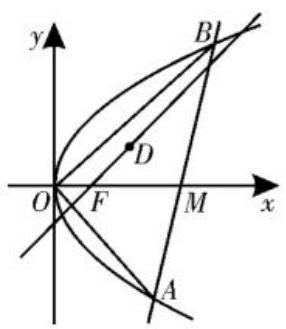
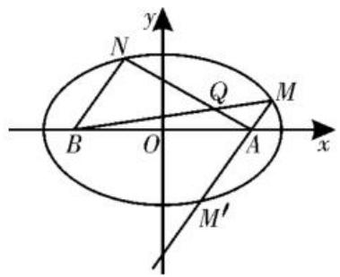
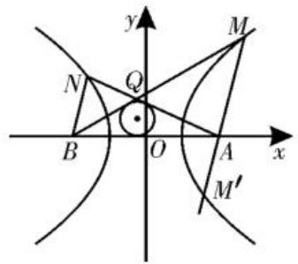

natural_image

Black-and-white illustration of a flowering plant with leaves and a flower bud (no text or symbols)

# 基于探索性情境，

# 探究圆锥曲线中的存在性问题

# ■山东省济南市莱芜第一中学 王克凤

高考中有关探索性情境及其应用问题，一直是一个重要考点。而涉及圆锥曲线知识的探索性情境及其应用问题，经常以探究元素（点、参数等）的存在性等形式来巧妙设置与创新应用，借助对应要素的存在性判断与探究，全面考查同学们的“四基”与“四能”，设置场景变化多端，设计形式新颖。

# 一、点的存在性

例 1 （2025 年山西太原模拟）已知抛物线 $C: y^{2} = 2px (p > 0)$ ，过点 D(2,1) 且斜率为 1 的直线经过抛物线 C 的焦点 F。

(1)求抛物线 C 的方程。

(2) 若 $A, B$ 是抛物线 $C$ 上的两个动点，

不妨设 A 在 B 的上方，联立 $\left\{\begin{aligned}x_{0}x-\frac{y_{0}y}{3}&=1,\\ y&=\pm\sqrt{3}x,\end{aligned}\right.$ 解得 $x_{A}=\frac{\sqrt{3}}{\sqrt{3}x_{0}-y_{0}},x_{B}=\frac{\sqrt{3}}{\sqrt{3}x_{0}+y_{0}}$ ，故 $x_{A}+x_{B}=\frac{\sqrt{3}}{\sqrt{3}x_{0}-y_{0}}+\frac{\sqrt{3}}{\sqrt{3}x_{0}+y_{0}}=2x_{0}$ ，所以 P 是线段 AB 的中点。

因为 $F_{1}, F_{2}$ 到过点 O 的直线的距离相等, 所以过点 O 的等线必定满足: A, B 到该等线的距离相等, 且分居两侧, 所以该等线必过点 P, 即 OP 的方程为 $y = \sqrt{2}x$ 。

联立 $\left\{ \begin{array}{l} y = \sqrt{2} x, \\ x^2 - \frac{y^2}{3} = 1, \end{array} \right.$ 解得 $\left\{ \begin{array}{l} x = \sqrt{3}, \\ y = \sqrt{6}, \end{array} \right.$ 所以 $P(\sqrt{3}, \sqrt{6})$ 。

所以 $y_{A} = \sqrt{3} x_{A} = \frac{3}{\sqrt{3}x_{0} - y_{0}} = \sqrt{6} + 3,$ $y_{B} = -\sqrt{3} x_{B} = \frac{-3}{\sqrt{3}x_{0} + y_{0}} = \sqrt{6} -3.$

试问: 在 x 轴上是否存在定点 M (异于坐标原点 O), 使得当直线 AB 经过点 M 时, 满足 $OA \perp OB$ ? 若存在, 求出点 M 的坐标; 若不存在, 请说明理由。

解析:(1)由题意知,过点 $D(2,1)$ 且斜率为 1 的直线方程为 y-1=x-2, 即 y=x-1。当 y=0 时, 得 x=1, 所以点 F 的坐标为 $(1,0)$ , 且 $\frac{p}{2}=1$ , 则 p=2。

所以抛物线 C 的方程为 $y^{2}=4x$ 。

(2)由(1)得抛物线 $C: y^{2} = 4x$ ，假设存在定点 $M(m, 0)$ 符合题意。

设直线 AB 的方程为 $x = ty + m (t \in \mathbb{R}, m \neq 0)$ , $A(x_{1}, y_{1})$ , $B(x_{2}, y_{2})$ ，如图 1 所示。

所以 $|y_A - y_B| = 6$ ，所以 $S_{\text{四边形}AF_1BF_2} = \frac{1}{2}|F_1F_2|\cdot |y_A - y_B| = 2|y_A - y_B| = 12$ 。

点评:借助新定义的创新形式,巧妙将函数、平面几何与解析几何中的相关知识加以合理交汇,基于解析几何这一应用场景来综合应用,实现问题的突破与解决。基于解析几何场景下的新定义交汇,经常将函数、方程、不等式、三角函数、数列、平面向量、解三角形等相关知识融进解析几何中去,综合起来全面考查基础知识与基本应用。

综上分析可知,涉及解析几何中的创新类问题,是以创新定义的形式来实现概念、知识与应用等方面的交汇与综合,契合“在知识交汇点处命题”的要求与命题趋势。解决这类解析几何中的创新问题,要在深刻理解对应知识的基础上,发现并挖掘题目中蕴含的信息,灵活变换角度,转化为“熟悉”的问题去解决。

(责任编辑 王福华)

联立 $\left\{ \begin{array}{l} x = ty + m, \\ y^2 = 4x, \end{array} \right.$ 消去 $x$ 整理得 $y^2 - 4ty - 4m = 0$ ，则 $y_1 + y_2 = 4t, y_1y_2 = -4m, \Delta = 16t^2 + 16m > 0$ 。

text_image

y
B
D
O
F
M
x
A

图1

若 $OA \perp OB$ ，可得 $\overrightarrow{OA}$ · 图1 $\overrightarrow{OB} = x_1x_2 + y_1y_2 = (ty_1 + m)(ty_2 + m) + y_1y_2 = (t^2 + 1)y_1y_2 + tm(y_1 + y_2) + m^2 = -4m(t^2 + 1) + 4mt^2 + m^2 = m^2 - 4m = 0$ ，解得 $m = 4$ 或 $m = 0$ （舍去）。

当 $m = 4$ 时，点 $M$ 的坐标为 $(4,0)$ ，满足 $OA \perp OB, \Delta = 16t^2 + 16m > 0$ ，所以存在定点 $M(4,0)$ 符合题意。

点评:此类涉及点的存在性及其综合问题,主要借助圆锥曲线场景的设置,通过满足相关条件的点的存在性来判断或探究,合理构建与之对应的探究性应用场景。解题时,经常借助满足条件的点存在,通过合理的逻辑推理与数学运算来验证,实现点的存在性的判断与应用。

# 二、参数的存在性

例 2 （2025 年广东深圳一模）已知动点 P 到定点 A(m,0) 的距离与动点 P 到定直线 $x=\frac{n^{2}}{m}$ 的距离之比为常数 $\frac{m}{n}$ ，其中 m>0，n>0，且 $m\neq n$ 。记动点 P 的轨迹为曲线 C。

(1)求曲线 C 的方程,并说明曲线 C 的形状特征。  
(2)设点 $B(-m,0)$ , 若曲线 $C$ 上的两个动点 $M,N$ 均在 $x$ 轴上方, 且满足 $AM \parallel BN$ , 其中 $AN$ 与 $BM$ 相交于点 $Q$ 。

①当 $m = 2\sqrt{2}, n = 4$ 时，求证：代数式 $\frac{1}{|AM|} + \frac{1}{|BN|}$ 的值为定值。  
②当 m > n 时, 设 $\triangle ABQ$ 的面积为 S, 其内切圆半径为 r, 试问: 是否存在常数 $\lambda$ , 使得 $S = \lambda r$ 恒成立? 若存在, 求 $\lambda$ 的表达式 (用 m, n 表示); 若不存在, 请说明理由。

解析:(1)设点 $P(x,y)$ ，由题意可知 $\frac{\sqrt{(x-m)^{2}+y^{2}}}{\left|x-\frac{n^{2}}{m}\right|}=\frac{m}{n}$ ，即 $(x-m)^{2}+y^{2}=$

$\left(\frac{m}{n} x - n\right)^2$ ，化简整理得曲线 $C$ 的方程为

$$
\frac {x ^ {2}}{n ^ {2}} + \frac {y ^ {2}}{n ^ {2} - m ^ {2}} = 1 _ {\circ}
$$

根据以上曲线 C 的方程可知, 当 m < n (或 m > n) 时, 曲线 C 表示焦点在 x 轴上的椭圆 (或双曲线)。

(2)设点 $M(x_{1},y_{1}), N(x_{2},y_{2}), M'(x_{3},y_{3})$ 与 N 关于原点对称，其中参数满足 $y_{1}>0, y_{2}>0$ ，且 $x_{3}=-x_{2}, y_{3}=-y_{2}$ 。  
①当 $m = 2\sqrt{2}, n = 4$ 时，由(1)可知曲线 $C$ 的方程为 $\frac{x^2}{16} + \frac{y^2}{8} = 1, A(2\sqrt{2}, 0), B(-2\sqrt{2}, 0)$ ，如图2所示。

因为 $AM \parallel BN$ ，所以

$$
\begin{array}{l} \frac {y _ {1}}{x _ {1} - 2 \sqrt {2}} = \frac {y _ {2}}{x _ {2} + 2 \sqrt {2}} = \\ \frac {- y _ {2}}{- x _ {2} - 2 \sqrt {2}} = \frac {y _ {3}}{x _ {3} - 2 \sqrt {2}} 。 \\ \end{array}
$$

因此 $M, A, M'$ 三点

text_image

y
N
Q
M
B
O
A
x
M'

图2

共线，且 $|BN| = \sqrt{(x_2 + 2\sqrt{2})^2 + y_2^2} = \sqrt{(-x_2 - 2\sqrt{2})^2 + (-y_2)^2} = |AM'$ 。

设直线 $MM^{\prime}$ 的方程为 $x = ty + 2\sqrt{2}$ ，联立 $\left\{ \begin{array}{l} x = ty + 2\sqrt{2}, \\ \frac{x^{2}}{16} + \frac{y^{2}}{8} = 1, \end{array} \right.$ 消去 $x$ 整理得 $(t^2 + 2)y^2 + 4\sqrt{2}ty$

-8=0,则 $y_{1}+y_{3}=-\frac{4\sqrt{2}t}{t^{2}+2},y_{1}y_{3}=-\frac{8}{t^{2}+2}$ 。

由(1)可知 $|AM|=\frac{2\sqrt{2}}{4}\left|x_{1}-\frac{16}{2\sqrt{2}}\right|=$ $4-\frac{\sqrt{2}}{2}x_{1},|BN|=|AM'|=4-\frac{\sqrt{2}}{2}x_{3}$ 。

所以 $\frac{1}{|AM|} +\frac{1}{|BN|} = \frac{|AM| + |BN|}{|AM|\bullet|BN|} =$ $\frac{\left(4 - \frac{\sqrt{2}}{2} x_1\right) + \left(4 - \frac{\sqrt{2}}{2} x_3\right)}{\left(4 - \frac{\sqrt{2}}{2} x_1\right)\left(4 - \frac{\sqrt{2}}{2} x_3\right)}$

$$
\frac {\left(2 - \frac {\sqrt {2}}{2} t y _ {1}\right) + \left(2 - \frac {\sqrt {2}}{2} t y _ {3}\right)}{\left(2 - \frac {\sqrt {2}}{2} t y _ {1}\right) \left(2 - \frac {\sqrt {2}}{2} t y _ {3}\right)} =
$$

$$
\frac {4 - \frac {\sqrt {2}}{2} t (y _ {1} + y _ {3})}{4 - \sqrt {2} t (y _ {1} + y _ {3}) + \frac {1}{2} t ^ {2} y _ {1} y _ {3}} =
$$

$$
\frac {4 - \frac {\sqrt {2}}{2} t \left(- \frac {4 \sqrt {2} t}{t ^ {2} + 2}\right)}{4 - \sqrt {2} t \left(- \frac {4 \sqrt {2} t}{t ^ {2} + 2}\right) + \frac {1}{2} t ^ {2} \left(- \frac {8}{t ^ {2} + 2}\right)} = 1 (\text {定值}) 。
$$

所以 $\frac{1}{|AM|}+\frac{1}{|BN|}$ 为定值1。

②当 m > n 时, 曲线 C 的方程为 $\frac{x^{2}}{n^{2}} - \frac{y^{2}}{m^{2} - n^{2}} = 1$ , 其对应的轨迹是焦点在 x 轴上的双曲线, 如图 3 所示。

设点 $M(x_{1}, y_{1})$ , $N(x_{2}, y_{2})$ , $M'(x_{3}, y_{3})$ 与 N 关于原点对称, 根据①的证明, 同理可得对应的 M, A, $M'$ 三点共线, 且满足 $|BN| = |AM'|$ 。

text_image

y
M
N
Q
B
O
A
x
M'

图3

$$
\begin{array}{l} \left. n ^ {2}\right) s ^ {2} - n ^ {2} ] y ^ {2} + 2 s m \left(m ^ {2} - n ^ {2}\right) y + \left(m ^ {2} - n ^ {2}\right) ^ {2} \\ = 0, \text {所以} y _ {1} + y _ {3} = - \frac {2 s m (m ^ {2} - n ^ {2})}{(m ^ {2} - n ^ {2}) s ^ {2} - n ^ {2}}, y _ {1} y _ {3} \\ = \frac {(m ^ {2} - n ^ {2}) ^ {2}}{(m ^ {2} - n ^ {2}) s ^ {2} - n ^ {2}}. \quad (\ast) \\ \end{array}
$$

设直线 $MM^{\prime}$ 的方程为 $x = sy + m$ ，联立 $\left\{ \begin{array}{l}x = sy + m,\\ \frac{x^2}{n^2} -\frac{y^2}{m^2 - n^2} = 1, \end{array} \right.$ 消去 $x$ 整理得 $[m^2 -$

$$
\begin{array}{l} \left. n ^ {2}\right) s ^ {2} - n ^ {2} ] y ^ {2} + 2 s m \left(m ^ {2} - n ^ {2}\right) y + \left(m ^ {2} - n ^ {2}\right) ^ {2} \\ = 0, \text {所以} y _ {1} + y _ {3} = - \frac {2 s m (m ^ {2} - n ^ {2})}{(m ^ {2} - n ^ {2}) s ^ {2} - n ^ {2}}, y _ {1} y _ {3} \\ = \frac {(m ^ {2} - n ^ {2}) ^ {2}}{(m ^ {2} - n ^ {2}) s ^ {2} - n ^ {2}}. \quad (\ast) \\ \end{array}
$$

$$
\begin{array}{l} \frac {1}{| B N |} = \frac {1}{| A M |} + \frac {1}{| A M ^ {\prime} |} = \frac {| A M | + | A M ^ {\prime} |}{| A M | \cdot | A M ^ {\prime} |} \\ = \frac {\left(\frac {m}{n} x _ {1} - n\right) + \left(\frac {m}{n} x _ {3} - n\right)}{\left(\frac {m}{n} x _ {1} - n\right) \left(\frac {m}{n} x _ {3} - n\right)} = \\ \end{array}
$$

因为 $|AM| = \frac{m}{n}\left(x_1 - \frac{n^2}{m}\right) = \frac{m}{n} x_1 - n,$ $|BN|=|AM'|=\frac{m}{n}x_{3}-n$ ，所以 $\frac{1}{|AM|}+$

$$
\frac {\left(\frac {s m}{n} y _ {1} + \frac {m ^ {2} - n ^ {2}}{n}\right) + \left(\frac {s m}{n} y _ {3} + \frac {m ^ {2} - n ^ {2}}{n}\right)}{\left(\frac {s m}{n} y _ {1} + \frac {m ^ {2} - n ^ {2}}{n}\right) \left(\frac {s m}{n} y _ {3} + \frac {m ^ {2} - n ^ {2}}{n}\right)} =
$$

$$
\frac {\frac {s m}{n} (y _ {1} + y _ {3}) + \frac {2 (m ^ {2} - n ^ {2})}{n}}{\frac {m ^ {2} s ^ {2}}{n ^ {2}} y _ {1} y _ {3} + \frac {(m ^ {2} - n ^ {2}) m s}{n ^ {2}} (y _ {1} + y _ {3}) + \frac {(m ^ {2} - n ^ {2}) ^ {2}}{n ^ {2}}} 。
$$

将 $(\ast)$ 式代入，化简得 $\frac{1}{|AM|} +\frac{1}{|BN|} =$ $\frac{2n}{m^2 - n^2}$ ，由双曲线定义得 $|BQ| + |QM| -$

$|MA|=2n$ ，所以 $|QM|=2n+|AM|-|BQ|$ 。

因为 $AM \parallel BN$ ，所以 $\triangle AQM \sim \triangle NQB$ ，所以 $\frac{|AM|}{|BN|} = \frac{|QM|}{|BQ|} = \frac{2n + |AM| - |BQ|}{|BQ|}$ ，所以 $|AM| \cdot |BQ| = 2n |BN| + |AM| \cdot |BN| - |BN| \cdot |BQ|$ ，所以 $|BQ| = \frac{(2n + |AM|) \cdot |BN|}{|AM| + |BN|}$ 。

同理 $|AQ|=\frac{(2n+|BN|)\cdot|AM|}{|AM|+|BN|}$ 。

$$
\begin{array}{l} + \frac {(2 n + | A M |) \cdot | B N |}{| A M | + | B N |} = 2 n + \frac {2 | A M | \cdot | B N |}{| A M | + | B N |} \\ = 2 n + \frac {2}{\frac {1}{| A M |} + \frac {1}{| B N |}} = 2 n + \frac {m ^ {2} - n ^ {2}}{n} = \frac {m ^ {2} + n ^ {2}}{n} 。 \\ \end{array}
$$

所以 $|AQ|+|BQ|=\frac{(2n+|BN|)\cdot|AM|}{|AM|+|BN|}$

由三角形的内切圆性质, 可得 $S = \frac{1}{2} (|AB| + |AQ| + |BQ|) \cdot r$ , 则当 $S = \lambda r$ 时， $\lambda=\frac{1}{2}(|AB|+|AQ|+|BQ|)=m+\frac{m^{2}+n^{2}}{2n}=\frac{(m+n)^{2}}{2n}$ （常数）。

所以存在常数 $\lambda$ 使得 $S = \lambda r$ 恒成立，此时 $\lambda = \frac{(m + n)^{2}}{2n}$ 。

点评:解决此类涉及参数的存在性及其综合问题,关键是依托圆锥曲线场景,通过假设,确定满足条件的参数存在,代入问题中去,通过合理的数学运算与逻辑推理,若得到符合条件的参数值,则表明满足条件的参数值存在;否则就不存在。

其实,涉及圆锥曲线场景下的存在性探究问题,往往依托一些比较常见的元素,先假设对应元素存在,以一个确定的条件,联合题设加以分析与推理,若得到正确的结论,则表示存在;否则就是不存在。同时,还要注意:当条件和存在性的结论不唯一时,需要加以合理的分类讨论;特别当要分类讨论的变量能够明确确定时,可先通过特殊值确定相应的变量或参数,再加以深入的数学运算或逻辑推理即可。

(责任编辑 王福华)