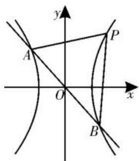
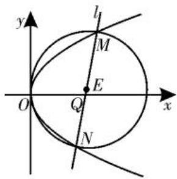

# 定点问题巧分析，圆锥曲线妙应用

# ■陕西省商业学校

# 王莎莎

在解析几何应用场景中,有些含有参数的动直线或动曲线,不论参数如何变化总是经过某定点,探求这个定点的坐标,我们称这类问题为“定点问题”。定点问题是考查解析几何模块知识的一个热点问题,此类问题往往定中有动,动中有定,涉及一些比较常见的直线过定点、圆过定点,以及探究定点的存在性等问题,成为高考数学试卷中的一道亮丽风景线,备受各方关注。

# 一、直线过定点问题

例 1 （2025 年江西九江模拟）已知双曲线 $C: \frac{x^{2}}{a^{2}} - \frac{y^{2}}{b^{2}} = 1 (a > 0, b > 0)$ 的离心率为 $\sqrt{5}$ ，点 $P(3,4)$ 在 C 上。

(1)求双曲线 C 的方程；

(2)若直线 l 与双曲线 C 交于不同的两点 A, B, 且直线 PA, PB 的斜率互为倒数, 证明: 直线 l 过定点。

解析:(1)由已知得 $e=\frac{c}{a}=\sqrt{5}$ 。

又因为 $c^{2}=a^{2}+b^{2}$ ，所以 $b^{2}=4a^{2}$ 。

由点 $P(3,4)$ 在 $C$ 上，得 $\frac{9}{a^2} -\frac{16}{4a^2} = 1$ ，解得 $a^2 = 5$ ，则 $b^{2} = 20$ 。

所以双曲线 C 的方程为 $\frac{x^{2}}{5}-\frac{y^{2}}{20}=1$ 。

(2) 当直线 $l$ 的斜率不存在时, 可设

$A(m,n),B(m,-n)$ ，则 $\left\{ \begin{array}{l} \frac{m^2}{5} -\frac{n^2}{20} = 1,\\ \frac{4 - n}{3 - m}\cdot \frac{4 + n}{3 - m} = 1, \end{array} \right.$ 无解。

当直线 l 的斜率存在时, 如图 1 所示, 设

边形。又 $\angle AFB = 120^{\circ}$ ，则 $\angle FAF' = 60^{\circ}$ 。在 $\triangle AFF'$ 中，利用余弦定理有 $|FF'|^{2} = |AF|^{2} + |AF'|^{2} - 2|AF|\cdot |AF'|\cdot$ $\cos \angle FAF' = (|AF| + |AF'|)^{2} - 3|AF|\cdot$ $|AF'|$ 。所以 $(|AF| + |AF'|)^{2} - |FF'|^{2} =$ $3|AF|\cdot |AF'| \leqslant 3\left(\frac{|AF| + |AF'|}{2}\right)^{2}$ ，可得 $\frac{1}{4} (|AF| + |AF'|)^{2} \leqslant |FF'|^{2}$ ，即 $a^2 \leqslant 4c^2$ ，则 $e = \frac{c}{a} \geqslant \frac{1}{2}$ 。所以椭圆的离心率 $e \in \left[\frac{1}{2}, 1\right)$ 。

故选C。

(2)如图2,设过点M(-b,0)的直线 $l_{1}$ : $y=k(x+b)(k>0)$ 。联立 $\left\{\begin{aligned}y&=k(x+b),\\ \frac{y^{2}}{a^{2}}-\frac{x^{2}}{b^{2}}=1,\end{aligned}\right.$ 消去y整理得

$(b^{2}k^{2}-a^{2})x^{2}+2b^{3}k^{2}x+b^{2}(b^{2}k^{2}-a^{2})=0$ 。依题意知

$\Delta = 4b^{6}k^{4} - 4b^{2}(b^{2}k^{2} - a^{2})^{2} = 0$ ，所以 $k^2 = \frac{a^2}{2b^2}$ 。由双曲线的对称性知 $0 < k^2 = \frac{a^2}{2b^2} < 1$

所以 $a^{2}<2(c^{2}-a^{2})$ ，整理得双曲线 E 的离心率 $e=\frac{c}{a}>\frac{\sqrt{6}}{2}$ 。

故选D。

点评:借助曲线类型挖掘几何性质解决离心率的取值范围(或最值)问题时,关键在于挖掘椭圆或双曲线自身的几何性质,这既是不同曲线类型自身所具备的结构特征,也是问题隐含的基本条件,要合理挖掘并加以正确应用。

总之，在解决圆锥曲线中的离心率的取值范围(或最值)及其综合问题时，需要同学们依托问题场景，剖析并理解题目条件，挖掘问题的内涵与实质，或对圆锥曲线中的已知特征关系加以合理转化，或对平面几何关系加以合理挖掘，采用相应的技巧与方法，巧妙构建对应的不等关系，通过逻辑推理与数学运算来分析与应用，有效转化，巧妙应用，可使离心率的取值范围(或最值)问题的求解更简捷。

(责任编辑 王福华)

其方程为 $y = kx + m$ ，与双曲线 C 的方程联立，消去 y 整理得 $(4 - k^{2})x^{2} - 2kmx - m^{2} - 20 = 0$ 。

text_image

y
A
P
O
x
B

图1

由已知得 $k^2 \neq 4$ ，且 $\Delta = 4k^2m^2 + 4(4 - k^2)(m^2 + 20) = 16(m^2 - 5k^2 + 20) > 0$ 。

设 $A(x_{1},y_{1}),B(x_{2},y_{2})$ ，则 $x_{1} + x_{2} =$ $\frac{2km}{4 - k^2},x_1x_2 = -\frac{m^2 + 20}{4 - k^2}$

设直线 $PA, PB$ 的斜率分别为 $k_{1}, k_{2}$ , 则 $k_{1} = \frac{y_{1} - 4}{x_{1} - 3} = \frac{kx_{1} + m - 4}{x_{1} - 3}, k_{2} = \frac{y_{2} - 4}{x_{2} - 3} = \frac{kx_{2} + m - 4}{x_{2} - 3}$ 。

由 $k_{1}k_{2} = 1$ ，可得 $(kx_{1} + m - 4)(kx_{2} + m - 4) = (x_{1} - 3)(x_{2} - 3)$ ，即 $(k^2 -1)x_1x_2+$ $(km - 4k + 3)(x_1 + x_2) + m^2 -8m + 7 =$ $(k^2 +1)\left(-\frac{m^2 + 20}{4 - k^2}\right) + (km - 4k + 3)\frac{2km}{4 - k^2} +m^2 -8m + 7 = 0$ ，化简得 $(m + 3k - 4)(5m$ $-9k - 12) = 0$ 。

又已知 $l$ 不过点 $P(3,4)$ ，故 $m + 3k - 4 \neq 0$ ，所以 $5m - 9k - 12 = 0$ ，即 $m = \frac{9}{5} k + \frac{12}{5}$ 。

故直线 l 的方程为 $y = k \left( x + \frac{9}{5} \right) + \frac{12}{5}$ ,
所以直线 l 过定点 $\left(-\frac{9}{5}, \frac{12}{5}\right)$ 。

点评:解析几何中定点问题的解题策略是:(1)设线法:用两个参数表示直线方程。一般解题步骤为:①设直线方程为 $y=kx+m$ 或 $x=ny+t$ ，联立直线与圆锥曲线方程，得出根与系数的关系；②结合根与系数的关系和已知条件，得到 k, m 或 n, t 的关系，解出 m 或 t 的值；③将②的结果代入 $y=kx+m$ 或 $x=ny+t$ ，得到定点坐标。(2)解点法：用一个参数表示直线方程。解题的一般步骤是:①引进参数，根据已知条件，求出直线上的两个点 A, B 的坐标（含参数）；②从特殊位置入手，找到定点 P（有时可考虑对称性）；③证明 A, B, P 三点共线，从而直线 AB 过定点 P。

# 二、圆过定点问题

例 2 （2025 年湖北协作体联考）已知平面内一动圆过点 $P(2,0)$ ，且在 y 轴上截得弦长为 4，动圆圆心的轨迹为曲线 C。

(1)求曲线 C 的方程。

(2)若过点 $Q(4,0)$ 的直线 $l$ 与曲线 $C$ 交于点 $M,N$ , 试问: 以线段 $MN$ 为直径的圆是否过定点? 若过定点, 求出这个定点; 若不过定点, 请说明理由。

解析:(1)设动圆圆心为 $(x,y)$ ，依题意， $\sqrt{|x|^{2}+2^{2}}=\sqrt{(x-2)^{2}+y^{2}}$ ，即 $y^{2}=4x$ 。

所以曲线 C 的方程为 $y^{2}=4x$ 。

(2)依题意可知,直线 l 不垂直于 y 轴,如图 2 所示,设直线 l 的方程为 $x=my+4$ , $M(x_{1},y_{1})$ , $N(x_{2},y_{2})$ , 联立 $\left\{\begin{aligned}x&=my+4,\\ y^{2}&=4x,\end{aligned}\right.$ 消去 x 整理得

  
图2

$y^{2}-4my-16=0,\Delta=16m^{2}+64>0$ 恒成立， $y_{1} + y_{2} = 4m, y_{1}y_{2} = -16$ 。

设以线段 MN 为直径的圆的圆心为 $E(x_{E}, y_{E})$ ，则 $y_{E} = 2m, x_{E} = 2m^{2} + 4$ ，即 $E(2m^{2} + 4, 2m)$ 。

由弦长公式得 $|MN| = \sqrt{m^2 + 1} \cdot |y_1 - y_2| = \sqrt{m^2 + 1} \cdot \sqrt{(y_1 + y_2)^2 - 4y_1y_2} = 4\sqrt{(m^2 + 1)(m^2 + 4)}$ 。

所以圆 $E$ 的方程为 $[x - (2m^2 + 4)]^2 + (y - 2m)^2 = 4(m^2 + 1)(m^2 + 4)$ ，化简整理得 $4xm^2 + 4ym - (x^2 - 8x + y^2) = 0$ 。

由 $\left\{\begin{aligned}4x&=0,\\ 4y&=0,\\ -(x^{2}-8x+y^{2})&=0,\end{aligned}\right.$ 解得 $\left\{\begin{aligned}x&=0,\\ y&=0.\end{aligned}\right.$

因此对任意 $m \in \mathbf{R}$ , 圆 $E$ 恒过原点, 所以以线段 $MN$ 为直径的圆过定点 $(0,0)$ 。

点评:解答圆过定点问题的一般策略是:(1)利用特殊情况寻找特殊点,实现圆过定点的判断与分析;(2)引入参变量建立关于曲线的方程,再根据其对参变量恒成立,令其系数等于零,从而得出定点。

# 三、探究定点问题

例 3 (2025 年新疆喀什模拟)已知双曲线 $E: x^{2}-3y^{2}=3$ 的左、右焦点分别为 $F_{1}$ 、 $F_{2}$ ，A 是直线 $l: y=-\frac{c}{a^{2}}x$ （其中 a 是双曲线 E 的实半轴长，c 是双曲线 E 的半焦距）上不同于原点 O 的一个动点，斜率为 $k_{1}$ 的直线 $AF_{1}$ 与双曲线 E 交于 M、N 两点，斜率为 $k_{2}$ 的直线 $AF_{2}$ 与双曲线 E 交于 P、Q 两点。

(1) 求 $\frac{1}{k_{1}} + \frac{1}{k_{2}}$ 的值。

(2) 若直线 $OM, ON, OP, OQ$ 的斜率分别为 $k_{OM}, k_{ON}, k_{OP}, k_{OQ}$ , 试问: 是否存在定点 $A$ , 满足 $k_{OM} + k_{ON} + k_{OP} + k_{OQ} = 0$ ? 若存在, 求出定点 $A$ 的坐标; 若不存在, 请说明理由。

解析:(1)由题意得双曲线 $E:\frac{x^{2}}{3}-y^{2}=$ 1, 则 $a^{2}=3, b^{2}=1$ , 所以 $c=\sqrt{a^{2}+b^{2}}=2$ 。

所以 $F_{1}(-2,0), F_{2}(2,0)$ ，直线 $l$ 的方程为 $y = -\frac{2}{3} x$ 。

设 $A\left(t, -\frac{2}{3} t\right) (t \neq 0)$ , 则 $k_{1} = \frac{-\frac{2}{3} t - 0}{t + 2}$ $= -\frac{2t}{3(t + 2)}$ 。

同理得 $k_{2}=-\frac{2t}{3(t-2)}$ 。

所以 $\frac{1}{k_1} +\frac{1}{k_2} = -\frac{3(t + 2)}{2t} -\frac{3(t - 2)}{2t} =$ $-\frac{6t}{2t} = -3_{\circ}$

(2) 设 $M(x_{1}, y_{1})$ , $N(x_{2}, y_{2})$ , $P(x_{3}, y_{3})$ , $Q(x_{4}, y_{4})$ 。

直线 $AF_{1}$ 的方程为 $y = k_{1}(x + 2)$ ，代入双曲线 $E$ 的方程得 $(1 - 3k_{1}^{2})x^{2} - 12k_{1}^{2}x - 12k_{1}^{2} - 3 = 0$ ，所以 $\Delta = 12k_{1}^{2} + 12 > 0, k_{1}^{2} \neq \frac{1}{3}$ ，

$$
x _ {1} + x _ {2} = \frac {1 2 k _ {1} ^ {2}}{1 - 3 k _ {1} ^ {2}}, x _ {1} x _ {2} = \frac {- 1 2 k _ {1} ^ {2} - 3}{1 - 3 k _ {1} ^ {2}} 。
$$

故 $k_{OM} + k_{ON} = \frac{y_1}{x_1} +\frac{y_2}{x_2} = \frac{y_1x_2 + y_2x_1}{x_1x_2} =$ $\frac{k_1(x_1 + 2)x_2 + k_1(x_2 + 2)x_1}{x_1x_2} = \frac{2k_1x_1x_2 + 2k_1(x_1 + x_2)}{x_1x_2} = \frac{2k_1}{4k_1^2 + 1}$

同理得 $k_{OP} + k_{OQ} = \frac{2k_2}{4k_2^2 + 1}\left(k_2^2\neq \frac{1}{3}\right)$ 。

假设存在定点 $A$ ，满足 $k_{OM} + k_{ON} + k_{OP} + k_{OQ} = 0$ ，即 $\frac{2k_1}{4k_1^2 + 1} +\frac{2k_2}{4k_2^2 + 1} = 0$ ，化简整理得 $(k_{1} + k_{2})(4k_{1}k_{2} + 1) = 0$ ，所以 $k_{1} + k_{2} = 0$ 或 $k_{1}k_{2} = -\frac{1}{4}$

又 $\frac{1}{k_1} +\frac{1}{k_2} = -3$ ，所以 $k_{1} + k_{2} = 0$ 无解，舍去，所以 $k_{1}k_{2} = -\frac{1}{4}$ 。结合 $\frac{1}{k_1} +\frac{1}{k_2} = -3,$ 解得 $\left\{ \begin{array}{l}k_{1} = -\frac{1}{4},\\ k_{2} = 1 \end{array} \right.$ 或 $\left\{ \begin{array}{l}k_{1} = 1,\\ k_{2} = -\frac{1}{4}. \end{array} \right.$

若 $k_{1} = -\frac{1}{4}, k_{2} = 1$ ，又 $A\left(t, -\frac{2}{3} t\right) (t \neq 0)$ ，由点 $A$ 在直线 $AF_{1}$ 上得 $-\frac{2}{3} t = -\frac{1}{4} \cdot (t + 2)$ ，解得 $t = \frac{6}{5}$ ，此时 $A\left(\frac{6}{5}, -\frac{4}{5}\right)$ ；

若 $k_{1} = 1, k_{2} = -\frac{1}{4}$ , 由点 $A$ 在直线 $AF_{1}$ 上得 $-\frac{2}{3} t = t + 2$ , 解得 $t = -\frac{6}{5}$ , 此时 $A\left(-\frac{6}{5}, \frac{4}{5}\right)$ 。

综上可知，存在定点 $A\left(\frac{6}{5}, - \frac{4}{5}\right)$ 或 $A\left(-\frac{6}{5},\frac{4}{5}\right)$ ，满足 $k_{OM} + k_{ON} + k_{OP} + k_{OQ} = 0$ 。

点评:此类探究定点问题的解题策略是:先假设存在,再推证满足条件的结论,若结论正确,则存在;若结论不正确,则不存在。同时还要注意以下几点:(1)当条件和结论不唯一时,要分类讨论;(2)当给出结论而要推导出存在的条件时,先假设成立,再推出条件;(3)当要讨论的量能够确定时,可先确定,再证明结论符合题意。

在实际确定或探究圆锥曲线中的定点问题时,根据问题场景与设置方式,采用合适的技巧方法,借助几何与代数的联系,通过“数”与“形”的结合,“动”与“静”的转化,来分析与探究相应的问题,同时注意相关的数学思想方法的灵活运用,从而提高同学们的数学解题能力与应用能力,实现知识与能力的和谐统一。(责任编辑 王福华)