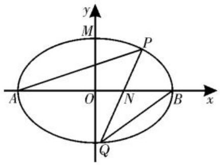
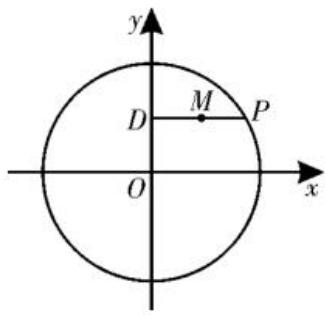
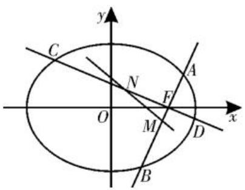

# 析几何之变 探最值之本

# 基于核心素养的圆锥曲线中的最值或取值范围问题的求解策略

# ■河南省许昌高级中学

# 朝博文

圆锥曲线中的最值或取值范围问题是高考数学试卷的核心与难点之一,每年考查的形式主要以椭圆、双曲线、抛物线为背景,通过合理创设综合性问题,结合圆锥曲线的定义、标准方程与几何性质,融合函数与方程思想、数形结合思想,综合运用代数运算、不等式放缩、参数转化等方法,解决与距离、面积、斜率、参数等相关的最值或取值范围问题,成为高考解析几何压轴题命题的重要方向与典型方式,具有较强的综合性与区分度。解决此类问题的根本在于深刻理解圆锥曲线的几何特征与代数表达,解题的关键重在“转化”——几何条件代数化、目标函数化、参数范围化,通过对复杂关系的结构分析与等价变形,实现问题的“统一”——统一变量、统一形式、统一目标,从而运用函数、不等式等工具求解问题。

# 一、圆锥曲线中距离类的最值问题

例 1 已知椭圆 $C: \frac{x^{2}}{a^{2}} + \frac{y^{2}}{b^{2}} = 1 (a > b > 0)$ 的离心率为 $\frac{1}{2}$ ，且经过点 $\left(\sqrt{3}, \frac{\sqrt{3}}{2}\right)$ 。

(1) 求椭圆 C 的方程；

(2) 如图 1, 已知 A, B 分别为椭圆 C 的左顶点和右顶点, M 为椭圆 C 的上顶点, 直线 l 交椭圆 C 于 P, Q (不

同于 A, B) 两点，记直线 AP, BQ 的斜率分别为 $k_{1}, k_{2}$ ，若 $k_{2} = 2k_{1}$ ，求点 M 到直线 l 的距离的最大值。

text_image

y
M
P
A
O
N
B
x
Q

图 1

解析:(1)由题意得 $\left\{\begin{aligned}\frac{3}{a^{2}}+\frac{3}{4b^{2}}=1,\\ \sqrt{1-\frac{b^{2}}{a^{2}}}=\frac{1}{2},\end{aligned}\right.$ 解得

$a^{2}=4,b^{2}=3$ ，故椭圆 C 的方程为 $\frac{x^{2}}{4}+\frac{y^{2}}{3}=1$ 。

(2) 因为 P, Q 不同于 A, B, 当直线 l 垂直于 y 轴时, $k_{1}$ 与 $k_{2}$ 异号, 不满足题意, 所以直线 l 不与 y 轴垂直。

设直线 l 的方程为 $x = ty + n (n \neq \pm 2)$ , $P(x_{1},y_{1}),Q(x_{2},y_{2})$ ，联立 $\left\{\begin{aligned}\frac{x^{2}}{4}+\frac{y^{2}}{3}&=1,\\x&=ty+n,\end{aligned}\right.$ 消
去 x 整理得 $(3t^{2}+4)y^{2}+6nty+3(n^{2}-4)=0$ ，则 $y_{1}+y_{2}=-\frac{6nt}{3t^{2}+4},y_{1}y_{2}=\frac{3(n^{2}-4)}{3t^{2}+4},$ $\Delta=(6nt)^{2}-4(3t^{2}+4)\times3(n^{2}-4)>0$ ，化简得 $3t^{2}-n^{2}+4>0$ 。

又因为 $A(-2,0), B(2,0)$ ，所以 $k_{1} = \frac{y_{1}}{x_{1} + 2}, k_{2} = \frac{y_{2}}{x_{2} - 2}, k_{PB} = \frac{y_{1}}{x_{1} - 2}$ 。

由 $P(x_{1},y_{1})$ 在椭圆 C 上，得 $\frac{x_{1}^{2}}{4}+\frac{y_{1}^{2}}{3}=$ 1, 即 $y_{1}^{2}=\frac{3}{4}(4-x_{1}^{2})$ 。

因此 $k_{1}k_{PB} = \frac{y_{1}}{x_{1} + 2}\cdot \frac{y_{1}}{x_{1} - 2} = \frac{y_{1}^{2}}{x_{1}^{2} - 4} =$ $\frac{\frac{3}{4}(4 - x_1^2)}{x_1^2 - 4} = -\frac{3}{4}$

因为 $k_{2} = 2k_{1}$ ，所以 $k_{2}k_{PB} = -\frac{3}{2} =$ $\frac{y_2}{x_2 - 2}\cdot \frac{y_1}{x_1 - 2} = \frac{y_1y_2}{(ty_2 + n - 2)(ty_1 + n - 2)} =$ $\frac{y_1y_2}{t^2y_1y_2 + t(n - 2)(y_1 + y_2) + (n - 2)^2}$

$\frac{\frac{3(n^2 - 4)}{3t^2 + 4}}{\frac{3(n^2 - 4)t^2}{3t^2 + 4} - \frac{6n(n - 2)t^2}{3t^2 + 4} + (n - 2)^2}$

$\frac{3(n + 2)}{4(n - 2)}$ ，解得 $n = \frac{2}{3}$ ，此时 $3t^2 - n^2 + 4 =$

$3t^{2} + \frac{32}{9} > 0$ ，对任意实数 $t$ 恒成立，直线 $l$ 的方程为 $x = ty + \frac{2}{3}$ ，所以直线 $l$ 恒过定点 $N\left(\frac{2}{3}, 0\right)$ 。

又 $M(0, \sqrt{3})$ ，则当 $MN \perp l$ 时，点 $M$ 到直线 $l$ 的距离最大，即点 $M$ 到直线 $l$ 的距离的最大值为 $|MN| = \sqrt{(\sqrt{3})^2 + \left(\frac{2}{3}\right)^2} = \frac{\sqrt{31}}{3}$ 。

评注:本题求解点 M 到直线 l 的距离的最大值,核心在于通过斜率关系推导出直线 l 恒过定点,将动态距离的最值问题转化为定点到定直线的距离问题。充分体现的核心素养有:数学运算——联立方程、运用韦达定理;逻辑推理——通过斜率乘积恒等式发现定点;直观想象——识别出当 $MN \perp l$ 时距离最大,依托几何直观简化问题。这种“先定位定点,再求最值”的策略,是处理动直线距离最值问题的经典方法。

# 二、圆锥曲线中参数类的取值范围问题

例 2 如图 2, 已知点 P 在圆 $O: x^{2} + y^{2} = 4$ 上, 作 PD 垂直于 y 轴, 垂足为 D, M 为 PD 的中点。

text_image

y
D M P
O x

图2

(1) 求动点 M 的轨迹 E 的方程；

(2)设直线 $l: y = kx + m$ 与 y 轴交于点 Q，与轨迹 E 交于 A、B 两点，且 $\overrightarrow{AQ} = 3\overrightarrow{QB}$ ，求 $m^{2}$ 的取值范围。

解析:(1)由题意可设点 $P(x_{0}, y_{0})$ , $M(x, y)$ , 则 $D(0, y_{0})$ 。

因为 M 为线段 PD 的中点, 所以 $\left\{\begin{aligned}x&=\frac{x_{0}}{2},\\ y&=y_{0},\end{aligned}\right.$ 即 $\left\{\begin{aligned}x_{0}&=2x,\\ y_{0}&=y_{0}\end{aligned}\right.$

因为点 $P$ 在圆 $O: x^{2} + y^{2} = 4$ 上，所以 $x_{0}^{2} + y_{0}^{2} = 4$ ，即 $(2x)^{2} + y^{2} = 4$ 。

故点 M 的轨迹 E 的方程为 $x^{2}+\frac{y^{2}}{4}=1$ 。

(2)由题意可得 $Q(0,m)$ 。

设 $A(x_{1},kx_{1} + m),B(x_{2},kx_{2} + m)$ ，联立 $\left\{ \begin{array}{ll}y = kx + m,\\ 4x^{2} + y^{2} = 4, \end{array} \right.$ 消去 $y$ 整理得 $(k^2 +4)x^2+$

$2kmx + m^{2} - 4 = 0$ ，则 $x_{1} + x_{2} = -\frac{2km}{k^{2} + 4},$

$x_{1}x_{2} = \frac{m^{2} - 4}{k^{2} + 4},\Delta = 4k^{2}m^{2} - 4(k^{2} + 4)(m^{2}-$ $4) > 0$ ，化简得 $k^2 -m^2 +4 > 0$ 。

由 $\overrightarrow{AQ} = 3\overrightarrow{QB}$ ，即 $(-x_{1}, - kx_{1}) = 3(x_{2},$ $kx_{2})$ ，得 $-x_{1} = 3x_{2}$ ，即 $x_{1} = -3x_{2}$ 。

所以 $3(x_{1} + x_{2})^{2} + 4x_{1}x_{2} = 0$ ，所以 $\frac{12k^2m^2}{(k^2 + 4)^2} +\frac{4(m^2 - 4)}{k^2 + 4} = 0,$ 即 $k^2 m^2 +m^2 -$ $k^2 -4 = 0$ 。

当 $m^2 = 1$ 时， $k^2 m^2 + m^2 - k^2 - 4 = 0$ 不成立，所以 $k^2 = \frac{4 - m^2}{m^2 - 1}$ ，代入 $k^2 - m^2 + 4 > 0$ 得 $\frac{4 - m^2}{m^2 - 1} - m^2 + 4 = \frac{m^2(4 - m^2)}{m^2 - 1} > 0$ ，解得 $1 < m^2 < 4$ 。

所以 $m^{2}$ 的取值范围是(1,4)。

评注:圆锥曲线中参数类的取值范围问题的五种求解策略:(1)利用圆锥曲线的几何性质或判别式构造不等关系,从而确定参数的取值范围;(2)利用已知参数的范围,求新参数的范围,解这类问题的核心是建立两个参数之间的等量关系;(3)利用隐含的不等关系建立不等式,从而求出参数的取值范围;(4)利用已知的不等关系建立不等式,从而求出参数的取值范围;(5)利用求函数值域的方法将待求量表示为其他变量的函数,求其值域,从而确定参数的取值范围。

# 三、圆锥曲线中距离类的取值范围问题

例 3 如图 3, 已知椭圆 $E: \frac{x^{2}}{a^{2}} + \frac{y^{2}}{b^{2}} =$

$1(a > b > 0)$ 的右焦点为 $F(1,0)$ ，长轴长为 $2\sqrt{2}$ 。过 $F$ 作斜率为 $k_{1}$ 的直线交椭圆 $E$ 于 $A, B$ 两点，过 $F$ 作斜率为 $k_{2}$ 的直线交椭圆 $E$ 于 $C, D$ 两点，

text_image

y
C
N
A
O
F
M
D
x
B

图3

设 AB, CD 的中点分别为 M, N。

(1)求椭圆 E 的方程；

(2) 若 $k_{1}k_{2} = -1$ ，设点 F 到直线 MN 的距离为 d，求 d 的取值范围。

解析:(1)由题意知 $2a=2\sqrt{2}$ ，则 $a=\sqrt{2}$ 。又焦点为 $F(1,0)$ ，所以 c=1，则 $b^{2}=a^{2}-c^{2}=1$ 。所以椭圆 E 的方程为 $\frac{x^{2}}{2}+y^{2}=1$ 。

(2) 设 $A(x_{1}, y_{1}), B(x_{2}, y_{2})$ ，直线 $AB$ 的方程为 $y = k_{1}(x - 1)$ ，联立 $\left\{ \begin{array}{l} y = k_{1}(x - 1), \\ \frac{x^{2}}{2} + y^{2} = 1, \end{array} \right.$ 消去 $y$ 整理得 $(1 + 2k_{1}^{2})x^{2} - 4k_{1}^{2}x + 2k_{1}^{2} - 2 = 0$ ，则 $x_{1} + x_{2} = \frac{4k_{1}^{2}}{1 + 2k_{1}^{2}}$ 。

又因为 $M$ 为 $AB$ 的中点，所以 $x_{M} = \frac{x_{1} + x_{2}}{2} = \frac{2k_{1}^{2}}{1 + 2k_{1}^{2}},y_{M} = k_{1}(x_{M} - 1) = \frac{-k_{1}}{1 + 2k_{1}^{2}}.$

因为 $k_{1}k_{2} = -1$ ，所以 $k_{2} = -\frac{1}{k_{1}}$ 。

又 $N$ 为 $CD$ 的中点，不妨用 $-\frac{1}{k_1}$ 代换 $k_{1}$ ，可得 $x_{N} = \frac{2}{2 + k_{1}^{2}},y_{N} = \frac{k_{1}}{2 + k_{1}^{2}}$

讨论:①若 $x_{M}=x_{N}$ ，则直线 MN 的斜率不存在，此时 $x_{M}=\frac{2k_{1}^{2}}{1+2k_{1}^{2}}=x_{N}=\frac{2}{2+k_{1}^{2}}$ ，解得 $k_{1}=\pm1$ 。

当 $k_{1} = 1$ 时， $M\left(\frac{2}{3}, -\frac{1}{3}\right), N\left(\frac{2}{3}, \frac{1}{3}\right)$ ，此时 $MN$ 的方程为 $x = \frac{2}{3}$ ，所以点 $F(1,0)$ 到直线 $MN$ 的距离 $d = \frac{1}{3}$ 。

同理，当 $k_{1} = -1$ 时， $d = \frac{1}{3}$ 。

②当 $k_{1} \neq \pm 1$ 时， $x_{M} \neq x_{N}$ ，此时 $k_{MN} = \frac{y_{M} - y_{N}}{x_{M} - x_{N}} = \frac{3k_{1}}{2 - 2k_{1}^{2}}$ ，所以直线 $MN$ 的方程为 $y - \frac{k_{1}}{2 + k_{1}^{2}} = \frac{3k_{1}}{2 - 2k_{1}^{2}}\left(x - \frac{2}{2 + k_{1}^{2}}\right)$ ，化简整理得 $3k_{1}x + (2k_{1}^{2} - 2)y - 2k_{1} = 0$ 。

法一: 点 $F(1,0)$ 到直线 MN 的距离 d = $\frac{|k_{1}|}{\sqrt{(3k_{1})^{2}+(2k_{1}^{2}-2)^{2}}}=\frac{|k_{1}|}{\sqrt{4k_{1}^{4}+k_{1}^{2}+4}}$ 。

因为 $k_{1} \neq 0$ ，所以 $d = \frac{1}{\sqrt{1 + 4k_1^2 + \frac{4}{k_1^2}}}$ 。

又 $k_{1}^{2} \neq 1$ ，所以 $4k_{1}^{2} + \frac{4}{k_{1}^{2}} > 2\sqrt{4k_{1}^{2} \cdot \frac{4}{k_{1}^{2}}} = 8$ ，所以 $0 < d < \frac{1}{3}$ 。

综上可得， $0 < d \leqslant \frac{1}{3}$ 。

法二: 直线 MN 的方程为 $3k_{1}x + (2k_{1}^{2} - 2)y - 2k_{1} = 0$ 。

令 $y = 0$ ，得 $x = \frac{2}{3}$ ，则直线MN恒过定点 $\left(\frac{2}{3},0\right)$ 。

所以点 $F(1,0)$ 到直线 $MN$ 的距离 $d$ 的最大值为 $\frac{1}{3}$ , 此时直线 $MN$ 的斜率不存在。

又因为直线 MN 的斜率一定不为 0，所以 $0 < d \leqslant \frac{1}{3}$ 。

评注:本题在求点 F 到直线 MN 的距离 d 的取值范围时体现了多元思路:法一(函数法)是将 d 表示为 $k_{1}$ 的函数,利用不等式求取值范围,凸显数学运算与不等式应用的能力;法二(几何法)是通过证明直线 MN 恒过定点 $\left(\frac{2}{3},0\right)$ ,从而发现 d 的最大值即为点 F 到该定点的距离,展现了直观想象与逻辑推理的巧妙结合。两种方法相辅相成,体现了“解析几何”中代数与几何的双重属性。

纵观全文,圆锥曲线中的最值或取值范围问题的求解过程,是一场对数学核心素养的综合检验。从问题的数学抽象(识别曲线的定义与几何特征),到逻辑推理(推导点、线关系与不等条件),再到数学建模(构建目标函数或方程),每一步都离不开数学运算的精准支撑和直观想象的思维引领。希望同学们从本文中不仅能学会解题的“术”,更能深刻领悟其中蕴含的“道”,即用数学的眼光观察世界,用数学的思维思考世界,用数学的语言表达世界。如此,方能以不变应万变,在高考中游刃有余,实现从“解题”到“解决问题”的能力飞跃。期待同学们在备考中勤加练习,内化方法,从而在高考考场上从容应对,斩获高分。

(责任编辑 王福华)