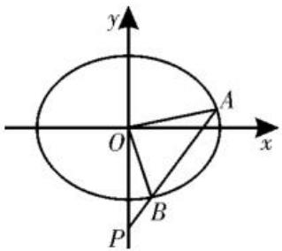

# 看似简单却不简单，多视角探究三角形面积

# ——2025年新高考全国Ⅱ卷第16题试题分析及解题启示

■河南省信阳市固始县高级中学 殷武娟

# 一、题目考法与特点

2025年新高考全国Ⅱ卷解析几何大题是在解答题的第二个位置，从难度上看确实算是比较简单了。试题考查椭圆的标准方程、直线与椭圆的位置关系。由已知面积反求过定点的弦长问题，用最基本的方法求解即可。试题很好地体现了高中数学课程中对于解析几何的学习与考查要求，符合同学们的学习实际，难度适中，计算量不大。试题重点考查同学们对椭圆概念的理解与掌握，以及运算求解能力，对不同思维类型的同学提供了不同的发挥空间，符合考试评价改革中对于基础性、综合性的考查要求。

# 二、真题呈现及方法探究

题目 （2025 年新高考全国Ⅱ卷第 16 题）已知椭圆 $C: \frac{x^2}{a^2} + \frac{y^2}{b^2} = 1 (a > b > 0)$ 的离心率为 $\frac{\sqrt{2}}{2}$ ，长轴长为 4。

(1)求椭圆 C 的方程。

(2) 过点 $(0, -2)$ 的直线 l 与椭圆 C 交于 A, B 两点，O 为坐标原点。若 $\triangle OAB$ 的面积为 $\sqrt{2}$ ，求 $|AB|$ 。

分析:(1)利用椭圆的基本知识和基本概念即可求解。(2)思路一:联立直线与椭圆方程,利用韦达定理,先求弦长|AB|,再求高h,则 $S_{\triangle OAB}=\frac{1}{2}|AB|\cdot h$ ,其中h为点O到

直线 $AB$ 的距离; 思路二:(作和法)如图 1, $S_{\triangle OAB}=$

$$
S _ {\triangle A O M} + S _ {\triangle B O M} = \frac {1}{2} | O M | \cdot
$$

$|y_{1}-y_{2}|=|x_{1}-x_{2}|$ ;思路三:(作差法)如图 2, $S_{\triangle OAB}$

$= |S_{\triangle AOP} - S_{\triangle BOP}|$ ，则 $S_{\triangle OAB} = \frac{1}{2}|OP|\cdot |x_1$

$$
- x _ {2} \mid = \mid x _ {1} - x _ {2} \mid_ {\circ}
$$

解:(1)由题意知,2a=4,则a=2。

因为 $e = \frac{c}{a} = \frac{\sqrt{2}}{2}$ ，所以 $c = \sqrt{2}$ ，故 $b^{2} = a^{2} - c^{2} = 2$ 。

所以椭圆 C 的方程为 $\frac{x^{2}}{4}+\frac{y^{2}}{2}=1$ 。

text_image

y
O
x
A
B
P

图2

(2) 方法一: (韦达定理 + 弦长公式) 易知直线 l 的斜率存在且不为 0, 设直线 l 的方程为 y = kx - 2, $A(x_{1}, y_{1}), B(x_{2}, y_{2})$ 。

联立 $\left\{ \begin{array}{l} y = kx - 2, \\ \frac{x^2}{4} + \frac{y^2}{2} = 1, \end{array} \right.$ 消去 $y$ 整理得（1+

$2k^{2})x^{2}-8kx+4=0$ ，所以 $x_{1}+x_{2}=\frac{8k}{1+2k^{2}}$

$$
x _ {1} x _ {2} = \frac {4}{1 + 2 k ^ {2}}, \Delta = 6 4 k ^ {2} - 1 6 (1 + 2 k ^ {2}) =
$$

$32k^{2}-16>0$ , 解得 $k<-\frac{\sqrt{2}}{2}$ 或 $k>\frac{\sqrt{2}}{2}$ 。

故 $S_{\triangle OAB} = \frac{1}{2}|x_1 - x_2|\sqrt{1 + k^2}\times \frac{2}{\sqrt{1 + k^2}}$

$$
= \mid x _ {1} - x _ {2} \mid = \sqrt {(x _ {1} + x _ {2}) ^ {2} - 4 x _ {1} x _ {2}} =
$$

$\frac{4\sqrt{2k^{2}-1}}{1+2k^{2}}=\sqrt{2}$ ，化简得 $k^{2}=\frac{3}{2}$ 。

由弦长公式得 $|AB| = \sqrt{1 + k^2} |x_1 - x_2|$ $=\sqrt{1+\frac{3}{2}}\times\sqrt{2}=\sqrt{5}$ 。

方法二:(作和法)易知直线 l 的斜率存在且不为 0, 设直线 l 的方程为 y=kx-2, $A(x_{1},y_{1}), B(x_{2},y_{2})$ 。

联立 $\left\{ \begin{array}{l} y = kx - 2, \\ \frac{x^2}{4} + \frac{y^2}{2} = 1, \end{array} \right.$ 消去 $y$ 整理得（1+

$2k^{2})x^{2}-8kx+4=0$ ，所以 $x_{1}+x_{2}=\frac{8k}{1+2k^{2}}$

$$
x _ {1} x _ {2} = \frac {4}{1 + 2 k ^ {2}}, \Delta = 6 4 k ^ {2} - 1 6 (1 + 2 k ^ {2}) =
$$

$32k^{2}-16>0$ , 解得 $k<-\frac{\sqrt{2}}{2}$ 或 $k>\frac{\sqrt{2}}{2}$ 。

设直线 l 交 x 轴于点 $M\left(\frac{2}{k},0\right)$ ，可得 $S_{\triangle OAB}=\frac{1}{2}|OM|\cdot|y_{1}-y_{2}|=\frac{1}{2}\left|\frac{2}{k}\right|\cdot$ $\left|(kx_{1}-2)-(kx_{2}-2)\right|=|x_{1}-x_{2}|=$ $\sqrt{(x_{1}+x_{2})^{2}-4x_{1}x_{2}}=\frac{4\sqrt{2k^{2}-1}}{1+2k^{2}}=\sqrt{2}$ ，化简得 $k=\frac{3}{2}$ 。

由弦长公式得 $|AB| = \sqrt{1 + k^2} |x_1 - x_2|$ $=\sqrt{1+\frac{3}{2}}\times\sqrt{2}=\sqrt{5}$ 。

方法三:(作差法)易知直线 l 的斜率存在且不为 0, 设直线 l 的方程为 y = kx - 2, $A(x_{1}, y_{1}), B(x_{2}, y_{2})$ 。

联立 $\left\{ \begin{array}{l} y = kx - 2, \\ \frac{x^2}{4} + \frac{y^2}{2} = 1, \end{array} \right.$ 消去 $y$ 整理得（ $1 + 2k^2)x^2 - 8kx + 4 = 0$ ，所以 $x_1 + x_2 = \frac{8k}{1 + 2k^2}$ ， $x_1x_2 = \frac{4}{1 + 2k^2}, \Delta = 64k^2 - 16(1 + 2k^2) = 32k^2 - 16 > 0$ ，解得 $k < -\frac{\sqrt{2}}{2}$ 或 $k > \frac{\sqrt{2}}{2}$ 。

设直线 l 交 y 轴于点 $P(0,-2)$ ，可得 $S_{\triangle OAB}=\frac{1}{2}|OP|\cdot|x_{1}-x_{2}|=\frac{1}{2}\times2\times$ $\sqrt{(x_{1}+x_{2})^{2}-4x_{1}x_{2}}=\frac{4\sqrt{2k^{2}-1}}{1+2k^{2}}=\sqrt{2}$ ，化简得 $k^{2}=\frac{3}{2}$ 。

由弦长公式得 $|AB| = \sqrt{1 + k^2} |x_1 - x_2|$ $=\sqrt{1+\frac{3}{2}}\times\sqrt{2}=\sqrt{5}$ 。

点评:本题第二问考查直线与椭圆的位置关系,对 $\triangle AOB$ 的面积的理解有不同的角度。如果将 $\triangle AOB$ 的面积理解为 $\frac{1}{2}|AB| \cdot h$ 就是思路一;如果将 $\triangle AOB$ 的面积理解为两个三角形的面积之和就是思路二;如果将 $\triangle AOB$ 的面积理解为两个三角形的面积之差就是思路三。在几种不同的解题思路中,可以选择使用韦达定理直接求解,也可以选择直线的点斜式方程或斜截式方程,着重考查理性思维和数学探究的综合素养,助力不同思维水平的同学正常发挥。

# 三、高考溯源

1. (2014年全国新课标卷第20题)已知点 $A(0, -2)$ , 椭圆 $E: \frac{x^2}{a^2} + \frac{y^2}{b^2} = 1 (a > b > 0)$ 的离心率为 $\frac{\sqrt{3}}{2}$ , $F$ 是椭圆的右焦点, 直线 $AF$ 的斜率为 $\frac{2\sqrt{3}}{3}$ , $O$ 为坐标原点。

(1)求椭圆 E 的方程；

(2)设过点 A 的直线 l 与椭圆 E 交于 P, Q 两点, 当 $\triangle OPQ$ 的面积最大时, 求直线 l 的方程。

2.(2024年新高考Ⅰ卷第16题)已知A(0,3)和 $P\left(3,\frac{3}{2}\right)$ 为椭圆C: $\frac{x^{2}}{a^{2}}+\frac{y^{2}}{b^{2}}=1$ (a>b>0)上两点。

(1)求椭圆 C 的离心率;

(2)若过点 P 的直线 l 交椭圆 C 于另一点 B，且 $\triangle ABP$ 的面积为 9，求直线 l 的方程。

# 四、备考方略

在高考数学中,解析几何一直是重点和难点,对同学们的综合能力要求较高,解析几何题目的特点在于将几何图形与代数方程紧密结合,需要同学们具备较强的数形结合能力、运算能力和逻辑推理能力。在具体解题时,同学们要仔细审题,明确题目所给出的条件和要求解的问题。例如,对于直线与圆锥曲线的位置关系问题,同学们要知道灵活运用直线方程的形式、圆锥曲线的方程及性质。

在解题方法的选择上,要根据题目的特点灵活运用。该真题方法的选择主要源于三角形面积求法的不同,解题时,不仅需要同学们掌握这些方法的具体步骤,还需要理解每种方法的适用条件和优势。比如,联立方程法适用于求交点坐标等问题,但运算量较大。运算能力是解决解析几何问题的关键。很多同学在解题过程中因为运算错误或烦琐而导致失分。因此,复习备考时要着重强调运算的技巧和规范性,如化简式子、合理利用对称性等,同时同学们要多做练习,提高运算速度和准确性。(责任编辑 王福华)