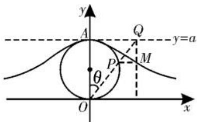
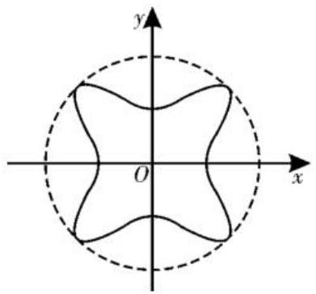

# 立足解析几何场景，创新形式应用

# ■江苏省锡山高级中学 方莉

随着高考改革的不断深入与新课程的逐步推进,高考对同学们的知识迁移、数学思维、探究创新等能力的考查不断加强,因此,解析几何中的创新问题成为高考命题的热点之一。解析几何中常见的创新问题有以下几类:一是“新定义曲线”,二是“新定义关系”,三是“新定义交汇”等。对于此类创新形式问题,要充分研透“新定义”的本质和内涵,从特殊到一般,结合已学过的知识、方法去解决问题,有时可以联系其他相关的知识,如函数、数列、不等式、向量等相关的知识加以交汇,契合“在知识交汇点处命题”的高考命题指导精神。

# 一、新定义曲线

以创新的形式来定义一类曲线,其与解析几何中学习过的曲线存在一定的差异与联系,需在理解新定义曲线的基础上来研究其对应的性质与特征。

例 1 （多选题）箕舌线因意大利著名的女数学家玛丽亚·阿涅西的深入研究而闻

名于世。如图1所示，过原点的动直线交定圆 $x^{2}+y^{2}-ay=0(a>0)$ 于点P，交直线y=a于点Q，过P和Q分别作x轴和

text_image

y
A
Q
y=a
P
M
θ
O
x

图1

y 轴的平行线交于点 M，则点 M 的轨迹叫作箕舌线。记箕舌线函数为 $f(x)$ ，设 $\angle AOQ = \theta$ ，则下列说法正确的是（）。

A. $f(x)$ 是偶函数

B. 点 $M$ 的横坐标为 $x_{M} = \frac{a}{\tan \theta}$

C. 点 M 的纵坐标为 $y_{M}=a\cos^{2}\theta$

D. $f(x)$ 的值域是 $(-∞,1]$

解析: 连接 AP, 则 $AP \perp OP$ 。圆 $x^{2} + y^{2} - ay = 0 (a > 0)$ 的标准方程为 $x^{2} + \left(y - \frac{a}{2}\right)^{2} = \frac{a^{2}}{4}$ ，则该圆的直径为 a。由题意

可设 $Q(x_0, a)$ , 当点 $Q$ 不与点 $A$ 重合时, 直线 $OQ$ 的方程为 $y = \frac{a}{x_0} x$ , 联立

$\left\{ \begin{array}{l} y = \frac{a}{x_0} x, \\ x^2 + y^2 - ay = 0, \\ y \neq 0, \end{array} \right.$ 解得 $y = \frac{a^3}{x_0^2 + a^2}$ ; 当点 $Q$

与点 A 重合时，点 A 的坐标也满足方程 $y=\frac{a^{3}}{x^{2}+a^{2}}$ 。所以 $f(x)=\frac{a^{3}}{x^{2}+a^{2}}$ 。因为对任意的 $x\in R, x^{2}+a^{2}>0$ 恒成立，所以函数 $f(x)$ 的定义域为 R。因为 $f(-x)=\frac{a^{3}}{(-x)^{2}+a^{2}}=\frac{a^{3}}{x^{2}+a^{2}}=f(x)$ ，所以函数 $f(x)$ 为偶函数，故选项 A 正确。当点 Q 在第一象限时， $x_{Q}=x_{M}$ ，因为 $\frac{x_{Q}}{a}=\tan\theta$ ，所以 $x_{Q}=x_{M}=a\tan\theta$ ，故选项 B 错误。当点 Q 不与点 A 重合时， $y_{M}=y_{P}>0$ ，因为 $|OP|=a\cos\theta$ ，所以 $y_{M}=y_{P}=|OP|\cos\theta=a\cos^{2}\theta$ ；当点 Q 与点 A 重合时，点 P 也与点 A 重合，此时 $\theta=0$ ，点 P 的纵坐标也满足 $y_{P}=a\cos^{2}\theta$ 。所以点 M 的纵坐标为 $y_{M}=a\cos^{2}\theta$ ，故选项 C 正确。因为 $x^{2}+a^{2}\geqslant a^{2}$ ，所以 $f(x)=\frac{a^{3}}{x^{2}+a^{2}}\in(0,a]$ ，故选项 D 错误。

故选 AC。

点评:对于“新定义曲线”类的创新形式问题,理解“新曲线”的定义(方程)是关键,通过“新曲线”的定义(方程)结合图形,与学过的研究解析几何中相关曲线的思路及方法进行合理联想,利用曲线与方程思想即可解决问题。

# 二、新定义关系

以创新的形式来定义一种关系,巧妙将不同曲线之间的关系加以“串联”,并借助新定义关系来分析与解决问题。

例 2 （2025 届四川省成都市高中毕业班第二次诊断性检测数学试题）对于一个平面图形，如果存在一个圆能完全覆盖住这个平面图形，则称这个图形被这个圆能够完全覆盖，其中我们把能覆盖平面图形的最小圆称为最小覆盖圆。则曲线 $x^{4} + y^{4} - x^{2}y^{2} - x^{2} - y^{2} = 0$ 的最小覆盖圆的半径为 \_\_\_\_。

解析:依题意,由曲线 $x^{4}+y^{4}-x^{2}y^{2}-x^{2}-y^{2}=0$ , 化简得 $x^{4}+y^{4}-x^{2}y^{2}=x^{2}+y^{2}$ , 故曲线关于 x 轴, y 轴均对称, 所以该曲线的最小覆盖圆一定以坐标原点为圆心, 设其方程为 $x^{2}+y^{2}=r^{2}$ , 则对曲线 $x^{4}+y^{4}-x^{2}y^{2}=x^{2}+y^{2}$ 上的任意点 $(x,y)$ , 均满足 $x^{2}+y^{2}\leqslant r^{2}$ , 所以 $r^{2}\geqslant(x^{2}+y^{2})_{\max}$ 。而 $x^{2}+y^{2}=x^{4}+y^{4}-x^{2}y^{2}=(x^{2}+y^{2})^{2}-3x^{2}y^{2}\geqslant(x^{2}+y^{2})^{2}-3\left(\frac{x^{2}+y^{2}}{2}\right)^{2}=\frac{1}{4}(x^{2}+y^{2})^{2}$ , 当且仅当 $x^{2}=y^{2}$ 时等号成立, 解得 $x^{2}+y^{2}\leqslant4$ 。所以 $r^{2}\geqslant(x^{2}+y^{2})_{\max}=4$ , 解得 $r\geqslant2$ , 即该曲线的最小覆盖圆的半径为 2。

故填2。

点评:对于高次方程 $x^{4} + y^{4} - x^{2}y^{2} - x^{2} - y^{2} = 0$ 所对应的曲线,通过主元法思想,结合相关方程的求解,分别得到对应的函数关系式 $y = \pm \sqrt{\frac{1 + x^{2} + \sqrt{1 + 6x^{2} - 3x^{4}}}{2}}$ 或 $y = \pm \sqrt{\frac{1 + x^{2} - \sqrt{1 + 6x^{2} - 3x^{4}}}{2}}$ ,可以借助函数思维, 利用“几何画板”作出如图 2 所示的对应曲线(图中的实线部分), 其既是关于坐标原点对称的中心对称图形, 也是关于 x 轴, y 轴对称的轴对称图形, 还是关于直

text_image

y
O
x

图2

线 $y=\pm x$ 对称的轴对称图形。利用平面图形中“最小覆盖圆”的创新定义，借助高次方程所对应的曲线的直观想象，通过数形结合分析可知其外层圆（图中的虚线部分）就是满足条件的最小覆盖圆。依托曲线所对应几何图形的直观想象，更加清晰直观地确定对应的结论。

# 三、新定义交汇

以创新的形式来定义解析几何与相关知识的交汇,并借助交汇的定义加以联系与巩固,通过创新定义来深入探究与应用,实现交汇知识的巧妙突破。

例 3 （2025 年山东青岛一模）在平面内，若直线 l 将多边形分为两部分，多边形在直线 l 两侧的顶点到直线 l 的距离之和相等，则称 l 为多边形的一条“等线”。已知 O 为坐标原点，双曲线 $E: \frac{x^{2}}{a^{2}} - \frac{y^{2}}{b^{2}} = 1 (a > 0, b > 0)$ 的左焦点和右焦点分别为 $F_{1}, F_{2}$ ，双曲线 E 的离心率为 2, P 为双曲线 E 右支上的一个动点，直线 m 与双曲线 E 相切于点 P，且与双曲线 E 的渐近线交于 A, B 两点，当 $PF_{2} \perp x$ 轴时，直线 y = 1 为 $\triangle PF_{1}F_{2}$ 的等线。

(1)求双曲线 E 的方程；

(2) 若 $y = \sqrt{2} x$ 是四边形 $AF_{1}BF_{2}$ 的等线，求四边形 $AF_{1}BF_{2}$ 的面积。

解析:(1)由题意知, $P\left(c,\frac{b^{2}}{a}\right)$ , $F_{1}(-c,0)$ , $F_{2}(c,0)$ ,显然点P在直线y=1的上方。

因为直线 $y = 1$ 为 $\triangle PF_{1}F_{2}$ 的等线，所以 $\frac{b^2}{a} - 1 = 2$ ，结合 $e = \frac{c}{a} = 2, c^2 = a^2 + b^2$ ，解得 $a = 1, b = \sqrt{3}$ 。

所以双曲线 E 的方程为 $x^{2}-\frac{y^{2}}{3}=1$ 。

(2) 设 $P(x_{0}, y_{0})$ ，切线 $m: y - y_{0} = k(x - x_{0})$ ，代入 $x^{2} - \frac{y^{2}}{3} = 1$ 整理得 $(3 - k^{2})x^{2} + 2k(kx_{0} - y_{0})x - (k^{2}x_{0}^{2} + y_{0}^{2} - 2kx_{0}y_{0} + 3) = 0$ ，所以 $\Delta = [2k(kx_{0} - y_{0})]^{2} + 4(3 - k^{2}) \cdot (k^{2}x_{0}^{2} + y_{0}^{2} - 2kx_{0}y_{0} + 3) = 0$ 。该式可以看作关于 k 的一元二次方程 $(x_{0}^{2} - 1)k^{2} - 2x_{0}y_{0}k + y_{0}^{2} + 3 = 0$ ，所以 $k = \frac{x_{0}y_{0}}{x_{0}^{2} - 1} = \frac{x_{0}y_{0}}{\left(1 + \frac{y_{0}^{2}}{3}\right) - 1} = \frac{3x_{0}}{y_{0}}$ ，即直线 m 的方程为 $x_{0}x - \frac{y_{0}y}{3} = 1$ 。

当直线 $m$ 的斜率不存在时也成立。

由(1)知渐近线的方程为 $y=\pm\sqrt{3}x$ ，

natural_image

Black-and-white illustration of a flowering plant with leaves and a flower bud (no text or symbols)

# 基于探索性情境，

# 探究圆锥曲线中的存在性问题

# ■山东省济南市莱芜第一中学 王克凤

高考中有关探索性情境及其应用问题，一直是一个重要考点。而涉及圆锥曲线知识的探索性情境及其应用问题，经常以探究元素（点、参数等）的存在性等形式来巧妙设置与创新应用，借助对应要素的存在性判断与探究，全面考查同学们的“四基”与“四能”，设置场景变化多端，设计形式新颖。

# 一、点的存在性

例 1 （2025 年山西太原模拟）已知抛物线 $C: y^{2} = 2px (p > 0)$ ，过点 D(2,1) 且斜率为 1 的直线经过抛物线 C 的焦点 F。

(1)求抛物线 C 的方程。

(2) 若 $A, B$ 是抛物线 $C$ 上的两个动点，

不妨设 A 在 B 的上方，联立 $\left\{\begin{aligned}x_{0}x-\frac{y_{0}y}{3}&=1,\\ y&=\pm\sqrt{3}x,\end{aligned}\right.$ 解得 $x_{A}=\frac{\sqrt{3}}{\sqrt{3}x_{0}-y_{0}},x_{B}=\frac{\sqrt{3}}{\sqrt{3}x_{0}+y_{0}}$ ，故 $x_{A}+x_{B}=\frac{\sqrt{3}}{\sqrt{3}x_{0}-y_{0}}+\frac{\sqrt{3}}{\sqrt{3}x_{0}+y_{0}}=2x_{0}$ ，所以 P 是线段 AB 的中点。

因为 $F_{1}, F_{2}$ 到过点 O 的直线的距离相等, 所以过点 O 的等线必定满足: A, B 到该等线的距离相等, 且分居两侧, 所以该等线必过点 P, 即 OP 的方程为 $y = \sqrt{2}x$ 。

联立 $\left\{ \begin{array}{l} y = \sqrt{2} x, \\ x^2 - \frac{y^2}{3} = 1, \end{array} \right.$ 解得 $\left\{ \begin{array}{l} x = \sqrt{3}, \\ y = \sqrt{6}, \end{array} \right.$ 所以 $P(\sqrt{3}, \sqrt{6})$ 。

所以 $y_{A} = \sqrt{3} x_{A} = \frac{3}{\sqrt{3}x_{0} - y_{0}} = \sqrt{6} + 3,$ $y_{B} = -\sqrt{3} x_{B} = \frac{-3}{\sqrt{3}x_{0} + y_{0}} = \sqrt{6} -3.$

试问: 在 x 轴上是否存在定点 M (异于坐标原点 O), 使得当直线 AB 经过点 M 时, 满足 $OA \perp OB$ ? 若存在, 求出点 M 的坐标; 若不存在, 请说明理由。

解析:(1)由题意知,过点 $D(2,1)$ 且斜率为 1 的直线方程为 y-1=x-2, 即 y=x-1。当 y=0 时, 得 x=1, 所以点 F 的坐标为 $(1,0)$ , 且 $\frac{p}{2}=1$ , 则 p=2。

所以抛物线 C 的方程为 $y^{2}=4x$ 。

(2)由(1)得抛物线 $C: y^{2} = 4x$ ，假设存在定点 $M(m, 0)$ 符合题意。

设直线 AB 的方程为 $x = ty + m (t \in \mathbb{R}, m \neq 0)$ , $A(x_{1}, y_{1})$ , $B(x_{2}, y_{2})$ ，如图 1 所示。

所以 $|y_A - y_B| = 6$ ，所以 $S_{\text{四边形}AF_1BF_2} = \frac{1}{2}|F_1F_2|\cdot |y_A - y_B| = 2|y_A - y_B| = 12$ 。

点评:借助新定义的创新形式,巧妙将函数、平面几何与解析几何中的相关知识加以合理交汇,基于解析几何这一应用场景来综合应用,实现问题的突破与解决。基于解析几何场景下的新定义交汇,经常将函数、方程、不等式、三角函数、数列、平面向量、解三角形等相关知识融进解析几何中去,综合起来全面考查基础知识与基本应用。

综上分析可知,涉及解析几何中的创新类问题,是以创新定义的形式来实现概念、知识与应用等方面的交汇与综合,契合“在知识交汇点处命题”的要求与命题趋势。解决这类解析几何中的创新问题,要在深刻理解对应知识的基础上,发现并挖掘题目中蕴含的信息,灵活变换角度,转化为“熟悉”的问题去解决。

(责任编辑 王福华)