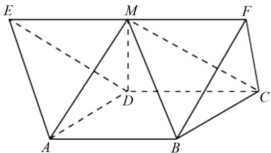
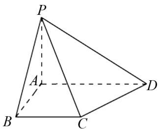

# 例谈学业质量标准视域下高中数学单元作业设计

陈莉(江苏省泰州中学 225300)

【摘 要】 本文立足“三新”背景,以学业质量标准为导向,探讨高中数学单元作业设计的优化路径.针对传统作业重技能训练、轻素养培养的问题,本文提出“锚定标准、目标协同”与“素养导向、实践育人”的设计思路.通过理论分析与案例结合,强调单元统筹下的系统性设计,促进知识整合与学科素养发展,推动作业从知识巩固向能力提升转型,助力育人目标落地.

【关键词】高中数学;作业设计;解题教学

# 1 引言

在“三新”背景下,学业质量标准已成为衔接课程目标与教学实践的核心纽带,从学业质量标准出发进行高中数学单元作业设计是新课改的必然要求,有助于实现学生能力进阶和学科素养提升目标的真正落地.实践表明,传统作业关注“题海”式的技能训练,存在题型重复问题,一定程度上忽视了学科本质和思维层次,与新课改难以契合.本文采取理论与实际案例相结合的方式,重点探讨高中数学单元作业设计的具体思路与方法,旨在提升作业质量,促进育人目标的有效落实.

# 2 锚定标准,单元统筹,目标协同

依据《普通高中数学课程标准(2017年版2020年修订)》，以教材为依据开展单元作业设计，应合理统筹作业目标、难度与时间，系统梳理知识体系与学科素养的内在关联，优化作业结构，提升作业的科学性与实效性。主要深挖课本教材中的例题和练习作业等资源，从学生的实际学习能力出发，对课本试题进行改编、变式和拓展，创新作业形式与内容，进而实现教材资源的有效利用。

例 1 如图 1 所示, 多面体 ABCDEF 为某一木匠师傅的作品, 正方形 ABCD 的边长为 1, 其中

$\triangle ADE$ 和 $\triangle BCF$ 为等边三角形，且 $AB \parallel EF$ ， $EF = 2$ ，试求：多面体 $ABCDEF$ 的体积.

text_image

E
M
F
D
C
A
B

图1

解析 根据题意,取 EF 的中点 M, 连接 MA, MD, MB, MC, $EF = 2AB = 2$ , $EF \parallel AB$ , 则 $EM \parallel AB$ 且 EM = AB, 则四边形 ABME 为平行四边形; 则 $AE \parallel BM$ , 且 AE = BM, 则多面体 ADE - BCM 为三棱柱, 则 $V_{ADE-BCM} = 3V_{M-ADE}$ ; 依据题意可得 $\triangle ADE \cong \triangle BCF$ , 则 $V_{M-ADE} = V_{M-BCF}$ , 则 $V_{ABCDEF} = V_{ADE-BCM} + V_{M-BCF} = 4V_{M-BCF}$ ; 根据题意可知, 四面体 M - BCF 是棱长为 1 的正四面体, 则 $V_{M-BCF} = \frac{\sqrt{2}}{12}$ , 则 $V_{ABCDEF} = 4 \times \frac{\sqrt{2}}{12} = \frac{\sqrt{2}}{3}$ .

例 2 如图 2 所示, 四棱锥 P-ABCD 的底面 ABCD 是直角梯形, $AD \parallel BC$ , AD = 2, $\angle ABC = \angle BAD = 90^{\circ}$ , 且 $PA \perp$ 平面 ABCD, $PA = AB = BC = 1$ . 试求: 平面 PCD 与平面 PBA 夹角的余弦值.

text_image

P
A
B
C
D

图2

解析 以 A 为坐标原点, 沿着 AB, AD, AP 分别构建 x 轴、y 轴和 z 轴建立空间直角坐标系, 则 $A(0,0,0)$ , $B(1,0,0)$ , $C(1,1,0)$ , $D(0,2,0)$ , $P(0,0,1)$ , 则 $\overrightarrow{PD} = (0,2,-1)$ , $\overrightarrow{PC} = (1,1,-1)$ ; 令平面 PCD 法向量 $\boldsymbol{n} = (x,y,z)$ , 则 $\left\{\begin{aligned}\boldsymbol{n} & \cdot \overrightarrow{PD} = 0, \\ \boldsymbol{n} & \cdot \overrightarrow{PC} = 0,\end{aligned}\right.$ 则 $\left\{\begin{aligned}2y - z = 0, \\ x + y - z = 0,\end{aligned}\right.$ 令 z = 2, 则 $y = 1, x = 1, n = (1,1,2)$ ; 令平面 PBA 法向量为 $\boldsymbol{m} = (0,1,0)$ , 则 $\frac{|\boldsymbol{m} \cdot \boldsymbol{n}|}{|\boldsymbol{m}| | \boldsymbol{n}|} = \frac{1}{\sqrt{6}} = \frac{\sqrt{6}}{6}$ , 即平面 PCD 与平面 PBA 夹角的余弦值为 $\frac{\sqrt{6}}{6}$ .

点评 例 1 源于课本例题的改编,综合考查棱柱与棱锥的体积计算,通过辅助线构造基本几何体,强化了学生的空间转化思想.例 2 源于课本习题的改编,以直角梯形为底面的四棱锥为情境,综合考查空间直角坐标系的建立、平面法向量的求解及其在求平面夹角余弦值与点到平面距离中的应用,符合教学进度与学生认知水平.这两个案例情境比较常见,贴近教学实际,有助于学生应用所学知识,提升空间想象与综合解题能力,体现教材习题二次开发的重要性,契合“教—学—评”一致性的理念.

# 3 单元统筹,素养导向,实践育人

在新高考改革背景下,数学文化情境试题日益成为命题的重要方向.此类试题融合数学知识与现实生活、文化背景及实践操作,旨在激发学生学习兴趣,引导学生深入理解数学本质,拓宽学科视野.通过情境化、生活化的作业设计,促进学生掌握数学思想方法,推动学生的学习从知识积累向能力与素养并重转变.以实践为导向的任务设置,有助于培养学生的创新意识、动手能力与数学应用能力,使其在解决真实问题中体会数学与生活的紧密联系,增强学习动机与成就感,切实促进综合素质的全面发展.

例 3 “中国剩余定理”又称“孙子定理”,1852年英国来华传教士伟烈亚力将《孙子算经》中“物不知数”问题的解法传至欧洲。1874年英国数学家马西森指出此法符合1801年由高斯得出的关于同余式解法的一般性定理，因而西方称之为“中国剩余定理”，“中国剩余定理”讲的是一个关于同余的问题。现有这样一个问题：将正整数中能被3除余1且被2除余1的数按由小到大的顺序排成一列，构成数列 $\{a_{n}\}$ ，试求： $a_{12}$ 。

解析 根据题意可知,正整数能被3除余1,同时也被2除余1,则被6除余1,则可以写出数列通项式 $a_{n}=(n-1)\times6+1=6n-5$ ,将n=12代入,可得 $a_{12}=6\times12-5=67$ .

点评 例 3 巧妙地将“中国剩余定理”这一数学文化典故与数列问题相结合,体现了数学史的应用价值,强化冗余概念的理解.题目设计简洁清晰,有效锻炼了学生的化归思想与抽象建模能力,展现了数学文化融入试题的育人功能;体现了新课标理念,助力学生实现数学学科素养提升目标的落地.

# 4 结语

总而言之,从学业质量标准视角出发,探讨高中数学单元作业设计,提出“锚定标准—单元统筹—目标协同”与“素养导向—实践育人”双轮驱动策略.实践表明,以标准为引领,实施单元整体规划与目标协同,有助于推动作业由知识重复转向素养培育;融入实践情境与文化载体,可增强数学的应用价值与育人功能.应进一步探索标准量化与个性化实施的平衡路径,促进学科素养培养目标在作业环节的切实落地.

【本文系江苏省教学研究立项课题《基于学业质量水平的高中数学单元作业设计研究》(编号：2023JY15-L242) 阶段性研究成果】

# 参考文献：

[1] 胡蓓蓓. 基于学业质量水平的高中数学单元作业设计——以“平面向量”为例[J]. 数学教学通讯, 2024(12):50-52.  
[2] 雍华. 例谈基于数学整体性的章末复习课的设计路径 [J]. 数理天地 (高中版), 2024(21): 94-96.