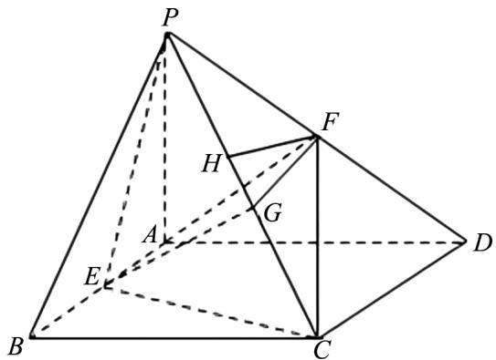
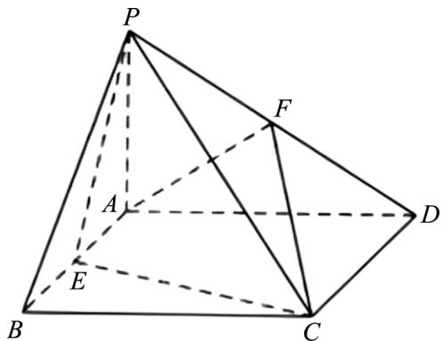

# 分类讨论思想在高中数学解题中的误区与突破研究

孙丽(江西省高安市灰埠中学 330800)

【摘 要】 分类讨论思想是高中数学解题的重要思维方法,在概率与数列综合问题中应用广泛.但学生常因分类标准模糊、思维局限等陷入解题误区.本文详细剖析这些误区,并提出明确分类标准、构建逻辑框架等针对性突破策略,以提升学生运用该思想解题的能力.

【关键词】 分类讨论思想；高中数学；解题误区；突破策略

分类讨论思想在高中数学中占据着极为重要的地位,广泛贯穿于函数、数列、不等式、立体几何、解析几何以及概率等众多知识板块.特别是在概率与数列综合问题的解决过程中,其重要性更是凸显无遗.这一思想能够依据特定的规则,把原本错综复杂的问题,细致地拆解成多个相对简单、易于处理的子问题.如此一来,学生在面对难题时,就能够更加清晰地找到解题的方向和路径.

# 1 分类讨论思想在高中数学解题中的常见误区

例 1 已知数列 $\{a_{n}\}$ 满足 $a_{1}=1, a_{n+1}=2a_{n}+c$ ，求通项公式 $a_{n}$ .

解题思路 （1）直接套用等比数列通项公式，未讨论常数 c 的取值 $(c=0$ 时为等比数列， $c \neq 0$ 时需构造新数列).

(2) 构造新数列时, 忽略 c=0 与 $c \neq 0$ 的本质差异, 导致通项公式推导错误.

解题步骤 （1）当 c=0 时，数列 $\{a_{n}\}$ 是以 1 为首项，2 为公比的等比数列， $a_{n}=2^{n-1}$ .

(2) 当 $c \neq 0$ 时，设 $a_{n+1} + k = 2(a_n + k)$ ，解得 k = c，即数列 $\{a_n + c\}$ 是以 $1 + c$ 为首项，2 为公比的等比数列，故 $a_n = (1 + c)2^{n-1} - c$ .

2 分类讨论思想在高中数学解题中误区的突破策略

# 2.1 以四棱锥线面平行及距离问题为例

例 2 如图 1 所示, 四棱锥 P-ABCD 中, PA ⊥ 平面 ABCD, 四边形 ABCD 是矩形, E, F 分别是 AB、PD 的中点. 若 PA=AD=3, $CD=\sqrt{6}$ .

(1) 求证: AF // 平面 PCE;  
(2) 求点 F 到平面 PCE 的距离.

text_image

Geometric diagram of a pyramid with labeled vertices and internal points, including dashed lines indicating hidden edges.

图1

解题思路 （1）证明线面平行: 常见误区是仅从直观找平行关系, 未充分利用中点条件构造平行四边形等辅助图形. 应想到取 PC 中点 G, 连接 FG、EG, 利用三角形中位线定理及矩形性质得到线线平行, 进而证线面平行.  
(2) 求点到面距离: 可能会忽略等体积法等多种方法选择, 只局限于直接找垂线段. 可利用等体积法 $V_{P-AEGF} = 2V_{F-PEG} = V_{F-PEC}$ 求解.

解题过程 （1）如图 2 所示，取 PC 的中点 G，连接 FG, EG.

因为 F 是 PD 的中点, G 是 PC 的中点, 根据三

角形中位线定理,所以 $PG \parallel CD$ ,且 $FG = \frac{1}{2}CD$ .

text_image

P
A
E
B
C
D
F

图 2

又因为四边形 ABCD 是矩形, E 是 AB 中点, 所以 $AE \parallel CD$ , 且 $AE = \frac{1}{2}AB = \frac{1}{2}CD$ .

从而 $FG \parallel AE$ 且 FG = AE，所以四边形 AEGF 是平行四边形，则 $AF \parallel EG$ .

又 $AF \subset$ 平面 PCE, $EG \subset$ 平面 PCE, 根据线面平行的判定定理, 所以 $AF \parallel$ 平面 PCE.

(2) 设点 F 到平面 PCE 的距离为 h，

连接 AC, PE, CE. 由 PA ⊥ 平面 ABCD, 可得 PA ⊥ AE.

已知 ABCD 为矩形, 所以 EA ⊥ AD.

因为 $PA \cap AD = A$ ，所以 $EA \perp$ 平面 $PAD$ ， $AEGF$ 是矩形.

因为 $\triangle PAD$ 为等腰直角三角形, 所以 PF 是棱锥 P-AEGF 的高.

所以 $V_{P-AEGF}=\frac{1}{3}\cdot PF\cdot FG\cdot AF=\frac{3\sqrt{6}}{4}$ ,

因为 $PE = EC = \frac{\sqrt{42}}{2}, PC = 2\sqrt{6}$ ，所以由余弦定理得 $\cos \angle PEC = -\frac{1}{7}, \sin \angle PEC = \frac{4\sqrt{3}}{7}, S_{\triangle PEC} = 3\sqrt{3}$ .

$V_{P-AEGF}=2V_{F-PEG}=V_{F-PEC}$ ，所以 $\frac{1}{3}\cdot3\sqrt{3}\cdot h=\frac{3\sqrt{6}}{4},h=\frac{3\sqrt{2}}{4}.$

所以点 F 到平面 PCE 的距离为 $\frac{3\sqrt{2}}{4}$ .

# 3 结语

分类讨论思想在高中数学解题中至关重要,却也容易出现误区.通过对上述例题的分析可知,学生常因条件挖掘不足导致分类不全,或几何关系转化不清造成逻辑混乱.明确分类标准、构建层级框架,能避免遗漏;运用树形图强化逻辑训练,可让思维更清晰;借助数形结合简化讨论,能提升效率.教学中应引导学生多维度提升能力,从根源上突破误区,使学生熟练运用分类讨论思想,增强解题的准确性与灵活性,助力其在高中数学学习中稳步前行,提升数学综合素养.

# 参考文献：

[1] 刘霞. 解读分类讨论思想在高中数学解题中的应用 [J]. 数学大世界 (中旬), 2021(3): 7.  
[2] 李英. 分类讨论思想在高中数学中的应用 [J]. 数理化解题研究, 2024(9): 9-11.