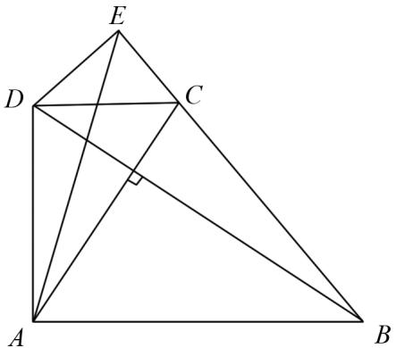
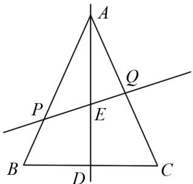

# 利用向量法解决平面几何题的新思路

朱志强(山东省蒙阴县实验中学 276200)

【摘 要】 本文探讨利用向量法解决平面几何问题的思路,旨在为平面几何问题提供一种更加直观、高效的解题方法.通过引入向量相关计算公式,将传统几何中涉及角度、距离、共线性、面积和分点等问题转化为向量代数运算,从而简化推导过程,避免烦琐的几何构造.研究表明,向量法不仅能快速解决常见的平面几何问题,还能为涉及复杂图形关系的难题提供新的解决途径.

【关键词】平面向量;高中数学;解题方法

# 1 引言

向量是表示具有大小和方向的量, 向量是线性代数的基础, 是构成线性空间的基本单位. 向量在几何、物理、工程等领域中应用广泛. 在二维空间中, 通常用于描述几何图形中的直线、线段、方向等, 向量的基本运算和定义为我们提供了分析几何问题的强大工具. 向量可以定义为具有大小和方向的有序数对(在二维空间)或有序数三元组(在三维空间), 通常用符号 v 表示, 既可以描述物理量的方向, 也可以表示两点间的位移. 用向量法解决平面几何问题时, 要广泛运用向量的性质, 特别是向量等式、向量等式的恒等变换及向量线性关系, 这些在解题中起到了极其重要的作用. 平面几何问题在一定程度上可以归结为线段关系、图形关系的分析. 而向量在解决线段关系问题上具有得天独厚的优势, 这种优势来源于向量运算法则和向量的平移不变性. 用向量表示问题中涉及的几何元素, 将平面几何问题转化为向量问题, 然后通过向量的运算, 研究几何元素间的关系是用向量法解决平面几何问题的核心思想.

# 2 实例应用

# 2.1 线段长度关系问题

例 1 已知梯形 ABCD, 边 CD, AB 分别为上、下底，且 $\angle ADC = 90^{\circ}$ ，对角线 $AC\perp BD$ .过点 $D$ 作 $DE\perp BC$ 于点 $E$ .证明： $AC^2 = CD^2 +AB\cdot CD$

text_image

Geometric diagram of triangle ABC with internal points D, E, C and a right angle at A

图1

解析 此问题为经典的线段长度关系问题,此类题型不涉及任何具体的线段长度,题目中并未给出任何长度关系,仅含角度关系,且提问涉及长度平方.角度关系中多为垂直关系,且存在直角梯形,可以考虑以直角梯形为基础构建直角坐标系解决.以点A为坐标原点, $\overrightarrow{AB}$ 方向为x轴正方向, $\overrightarrow{AD}$ 方向为y轴正方向,则图中点A,B,C,D的坐标可以表示为(0,0),(b,0),(c,d),(0,d).题中涉及的线段长度可分别表示为 $AC^{2}=c^{2}+d^{2},CD^{2}=c^{2},AB\cdot CD=bc,AD^{2}=d^{2}$ .对角线 $AC\perp BD$ 的关系可转化为向量 $\overrightarrow{AC}=(c,d)$ 和 $\overrightarrow{BD}=(-b,d)$ 的垂直关系,根据向量积公式可得 $AC\cdot BD=-bc+d^{2}=0$ ,则可知 $d^{2}=cb$ ,代入 $AC^{2}$ 的表达式,可得 $AC^{2}=CD^{2}+AB\cdot CD$ .

# 2.2 求三角形面积问题

例 2 已知平面上三点 A(1,2), B(4,6), C(5,3), 求 $\triangle ABC$ 的面积.

解析 该问题是简单的三角形面积问题,已知三角形三个端点的坐标,可利用向量积公式求解.向量积公式 $|\vec{X} \times \vec{Y}| = |\vec{X}| |\vec{Y}|\sin \theta$ 表示以两向量为邻边的平行四边形面积. 在向量法中, 三角形面积公式为 $S_{\triangle ABC} = \frac{1}{2} |\overrightarrow{AB}| |\overrightarrow{AC}| \sin \theta = \frac{1}{2} |x_1y_2 - x_2y_1|$ . 本题中 $\overrightarrow{AB} = (3,4)$ , $\overrightarrow{AC} = (4,1)$ , 则 $S_{\triangle ABC} = \frac{1}{2} |3 \times 1 - 4 \times 4| = 6.5$ .

# 2.3 分点问题

例 3 过 $\triangle ABC$ 的中线 AD 的中点 E 作直线 PQ 分别交 AB, AC 于 P, Q 两点, 若 $m \overrightarrow{AP} = \overrightarrow{AB}$ , $n \overrightarrow{AQ} = \overrightarrow{AC}$ , 则 $m + n =$ \_\_\_\_.

text_image

A
P
E
Q
B
D
C

图2

解析 本题为分点问题,线段 PQ 经过三角形的边 AB, AC 和中线 AD 的中点 E, 求 $m + n$ 的值. m, n 为向量 $\overrightarrow{AP}$ 与 $\overrightarrow{AB}$ 、 $\overrightarrow{AQ}$ 与 $\overrightarrow{AC}$ 的长度比例系数, 可采用向量法求解. 以点 A 为坐标原点, AB 为一分量轴, AC 为另一分量轴, 可设点 A, B, C 的坐标为 $(0,0)$ , $(b,0)$ , $(0,c)$ . 则点 E, P, Q 的坐标为 $\left(\frac{b}{2}, \frac{c}{2}\right)$ , $\left(\frac{b}{m}, 0\right)$ , $\left(0, \frac{c}{n}\right)$ . 向量 $\overrightarrow{PQ} = \left(-\frac{b}{m}, \frac{c}{n}\right)$ , $\overrightarrow{PE} = \left(\frac{b}{2} - \frac{b}{m}, \frac{c}{2}\right)$ 共线, 设 $k \overrightarrow{PE} = \overrightarrow{PQ}$ , 则 $k\left(\frac{b}{2} - \frac{b}{m}, \frac{c}{2}\right) = \left(-\frac{b}{m}, \frac{c}{n}\right)$ , 有 $k\left(\frac{b}{2} - \frac{b}{m}\right) = -\frac{b}{m}$ , $k \frac{c}{2} = \frac{c}{n}$ , 可得 $m = 2 - \frac{2}{k}$ , $n = \frac{2}{k}$ , $m + n = 2$ .

# 2.4 夹角问题

例 4 设 F 是抛物线 $C: y^{2} = 4x$ 的焦点, 过点 A (-1,0) 且斜率为 $k (k \neq 0)$ 的直线与抛物线 C 交于 M, N 两点, 设 $\overrightarrow{FM}$ 与 $\overrightarrow{FN}$ 的夹角为 $120^{\circ}$ , 求实数 k 的值.

解析 本题给定的条件是向量的夹角,所求的是直线的斜率.考虑到夹角与向量内积的关联,应从向量的内积公式入手.过点 $A(-1,0)$ 且斜率为 $k(k\neq 0)$ 的直线方程为: $y = k(x + 1)$ .将其与抛物线 $y^{2} = 4x$ 联立,得到: $k^2 x^2 +(2k^2 -4)x + k^2 = 0.$ 设 $M(x_{1},y_{1}),N(x_{2},y_{2})$ ，解得： $x_{1} + x_{2} = \frac{4 - 2k^{2}}{k^{2}},$ $x_{1}x_{2} = 1$ ，可得 $y_{1}y_{2} = 4.$ 所以 $\overrightarrow{FM}\cdot \overrightarrow{FN} = \frac{8k^2 - 4}{k^2},$ $|\overrightarrow{FM} |\cdot |\overrightarrow{FN}| = \frac{4}{k^2}$ ，由向量内积公式可知： $\frac{8k^2 - 4}{k^2} =$ $\frac{4}{k^2}\cos 120^\circ$ ，解得 $k = \pm \frac{1}{2}$

# 3 结语

本文从向量角度出发探讨了线段长度、三角形面积、分点和夹角等平面几何问题，向量法的核心是先建立坐标系获取点坐标，并结合平面几何性质，利用向量的模长、内积、外积等公式解决问题。与传统方法相比，向量法简化了计算和解题流程。尽管在建立直角坐标系时可能遇到困难，但在二维平面中，任意两个非共线方向均可作为坐标轴构建坐标系，进而解决相关问题。

# 参考文献：

[1] 陈俊斌, 叶雪梅. 浅析平面几何问题求解的向量方法 [J]. 福建中学数学, 2010(9): 40-42.  
[2] 李香瑞. 浅谈用向量的方法解决平面几何问题 [J]. 教育实践与研究, 2006(4): 57-58.  
[3] 彭明清. 利用向量方法解决平面几何问题 [J]. 中学生数理化 (高一使用), 2022(2): 5-6.