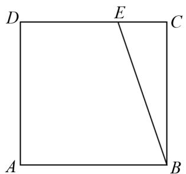
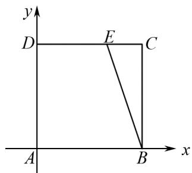

# 化归思想在平面向量基本定理教学中的应用

熊兴兰(广东省江门市新会陈经纶中学 529100)

【摘 要】“化归”即转化和归结,化归思想是通过梳理数量关系,将问题转化为统一形式求解.向量是沟通代数、几何与三角函数的一种重要工具,故向量具有很强的“交汇性和工具性”,是高考必考内容之一.解答题中也常与三角函数、立体几何和解析几何结合考查.本文以平面向量基本定理为支架,以解决平面向量相关题目,深化化归思想.

【关键词】 平面向量基本定理;化归思想

# 1 平面向量基本定理的教学侧重点

首先,要理解平面向量基本定理的实质是将平面内的任一向量转化为用平面内任意两个不共线向量线性表示的形式.应用平面向量基本定理求向量的实质是利用平行四边形法则或三角形法则进行向量的加、减或数乘运算,进而实现向量由几何形式转变为代数形式.

其次,通过引进正交基底开展探索,理解平面向量坐标的由来,激发学生积极探索知识,提高学生的观察能力与思维能力,培养其数学核心素养.

最后,让学生在学习中感受平面向量基本定理(乃至数学)的美和实用性,激发学习数学的热情,在数形结合的思维框架下逐步利用平面向量基本定理将几何问题转化为代数问题,领悟向量的本质.

但对于初学平面向量基本定理的学生来说,往往会因为基底的不唯一而无所适从.因此需对平面向量基本定理所蕴含的思想进行归纳总结,加深学生对平面向量数学知识的深入理解.

# 2 用一段基底表示相关向量

利用平面向量基本定理解题的关键是选取不共线的两个向量为基底,统一基底是解题的核心技巧.

例 1 （2008 年湖南卷）设 D, E, F 分别是 $\triangle ABC$ 的三边 BC, CA, AB 上的点，且 $\overrightarrow{CE} = 2\overrightarrow{EA}$ , $\overrightarrow{DC} = 2\overrightarrow{BD}$ , $\overrightarrow{AF} = 2\overrightarrow{FB}$ ，则 $\overrightarrow{AD} + \overrightarrow{BE} + \overrightarrow{CF}$ 与 $\overrightarrow{BC}()$

(A) 反向平行.

(B) 同向平行.

(C) 互相垂直.

(D) 既不平行也不垂直.

分析 解答本题的关键是将所有向量统一用同一基底表示.

解 $\overrightarrow{AD} + \overrightarrow{BE} + \overrightarrow{CF} = \left( \frac{2}{3} \overrightarrow{AB} + \frac{1}{3} \overrightarrow{AC} \right) +$

$$
\left(- \overrightarrow {A B} + \frac {1}{3} \overrightarrow {A C}\right) + \left(- \overrightarrow {A C} + \frac {2}{3} \overrightarrow {A B}\right) = - \frac {1}{3} \overrightarrow {B C}.
$$

$\overrightarrow{AD}+\overrightarrow{BE}+\overrightarrow{CF}$ 与 $\overrightarrow{BC}$ 反向平行. 故选(A).

点评 把条件中的每个向量化归到同一组基底下,达到统一形式,这样更容易发现向量之间的内在联系和规律.人类在现实生活中处理复杂问题时也常会使用化归统一的思想方法.

变式 1 若加入条件 1: AC = 2, AB = 1, $\angle BAC = 60^{\circ}$ , 求 $\overrightarrow{EF}$ 的模长及 $\left|\overrightarrow{EF}\right|$ 和 $\overrightarrow{AC}$ 夹角的余弦值.

分析 本题也是基底的选取问题,基底的选取要与题中条件联系密切,这样能简化化归运算过程.

解 $\left|\overrightarrow{EF}\right|=\left|\overrightarrow{AF}-\overrightarrow{AE}\right|=\left|\frac{2}{3}\overrightarrow{AB}-\frac{1}{3}\overrightarrow{AC}\right|$

$$
= \sqrt {\left(\frac {2}{3} \overrightarrow {A B} - \frac {1}{3} \overrightarrow {A C}\right) ^ {2}} = \frac {2}{3}.
$$

设 $\overrightarrow{EF}$ 和 $\overrightarrow{AC}$ 的夹角为 $\theta$ ,

$$
\overrightarrow {E F} \cdot \overrightarrow {A C} = | \overrightarrow {E F} | | \overrightarrow {A C} | \cos \theta = \frac {2}{3} \times 2 \cos \theta = - \frac {2}{3},
$$

所以 $\cos\theta=-\frac{1}{2}.$

变式 2 若将条件 1 改为: AC = 1, AB = 1, $\angle BAC = 90^{\circ}$ , 求 $\left|\overrightarrow{EF}\right|$ 的模长及 $\overrightarrow{EF}$ 和 $\overrightarrow{AC}$ 夹角的余弦值.

解 方法 1 | $\overrightarrow{EF}$ | = | $\overrightarrow{AF} -\overrightarrow{AE}$ | =

$$
\left| \frac {2}{3} \overrightarrow {A B} - \frac {1}{3} \overrightarrow {A C} \right| = \sqrt {\left(\frac {2}{3} \overrightarrow {A B} - \frac {1}{3} \overrightarrow {A C}\right) ^ {2}} = \frac {\sqrt {5}}{3},
$$

$$
\overrightarrow {E F} \cdot \overrightarrow {A C} = \left(\frac {2}{3} \overrightarrow {A B} - \frac {1}{3} \overrightarrow {A C}\right) \cdot \overrightarrow {A C} = - \frac {1}{3},
$$

$$
\overrightarrow {E F} \cdot \overrightarrow {A C} = | \overrightarrow {E F} | | \overrightarrow {A C} | \cos \theta = - \frac {1}{3},
$$

所以 $\cos\theta=-\frac{\sqrt{5}}{5}.$

方法2 因为 $\angle BAC=90^{\circ}$ ，以 A 为原点，AB 为 x 轴，AC 为 y 轴建系，则 $A(0,0)$ ， $B(1,0)$ ， $C(0,1)$ ，

$$
\overrightarrow {A C} = (0, 1), \overrightarrow {E F} = \left(\frac {2}{3}, - \frac {1}{3}\right),
$$

$$
\cos \langle \overrightarrow {E F}, \overrightarrow {A C} \rangle = \frac {\overrightarrow {E F} \cdot \overrightarrow {A C}}{| \overrightarrow {E F} | | \overrightarrow {A C} |} = - \frac {\sqrt {5}}{5}.
$$

点评 选择长度夹角已知的基底,将向量之间的运算转化为基底之间的运算,通过变式2可看出选择标准正交基底更好,可以简化运算,这也是向量坐标化的依据.

# 3 用正交基底表示相关向量

例 2 （2024 年高考天津卷）如图 1 所示，在边长为 1 的正方形 ABCD 中，点 E 为线段 CD 的三等分点， $CE = \frac{1}{2} DE, \overrightarrow{BE} = \lambda \overrightarrow{BA} + \mu \overrightarrow{BC}$ ，则 $\lambda + \mu =$ \_\_\_\_；若 F 为线段 BE 上的动点，G 为 AF 的中点，则 $\overrightarrow{AF} \cdot \overrightarrow{DG}$ 的最小值为 \_\_\_\_.

text_image

D
E
C
A
B

图1

text_image

y
D	E	C
A	B	x

图2

分析 依据 $AB \perp AD$ 建立平面直角坐标系，如图2所示，

则 $A(0,0)$ , $B(1,0)$ , $C(1,1)$ , $D(0,1)$ , $E\left(\frac{2}{3},1\right)$ ,

$$
\overrightarrow {B A} = (- 1, 0), \overrightarrow {B C} = (0, 1), \overrightarrow {B E} = \left(- \frac {1}{3}, 1\right),
$$

因为 $\overrightarrow{BE} = \lambda \overrightarrow{BA} +\mu \overrightarrow{BC} = (-\lambda ,\mu)$

则 $\left\{\begin{aligned}-\lambda&=-\frac{1}{3},\\ \mu&=1,\end{aligned}\right.$ 所以 $\lambda+\mu=\frac{4}{3};$

因为点 F 在线段 BE 上，记 $F(x_{0}, y_{0})$ ， $\overrightarrow{BF} = t\overrightarrow{BE}(0 \leqslant t \leqslant 1)$ ，得 $(x_{0} - 1, y_{0}) = t(-\frac{1}{3}, 1)$ ，

所以 $x_{0}=1-\frac{1}{3}t, y_{0}=t, \overrightarrow{AF}=\left(1-\frac{1}{3}t, t\right)$ ,

又 G 为 AF 的中点，则 $G\left(\frac{1}{2}\left(1-\frac{1}{3}t\right),\frac{1}{2}t\right)$ ， $\overrightarrow{DG}=\left(\frac{1}{2}\left(1-\frac{1}{3}t\right),\frac{1}{2}t-1\right)$ ,

则 $\overrightarrow{AF} \cdot \overrightarrow{DG} = \frac{1}{2}\left(1 - \frac{1}{3} t\right)^2 + \left(\frac{1}{2} t - 1\right)t = \frac{5}{9} t^2$

$$
- \frac {4}{3} t + \frac {1}{2} = \frac {5}{9} \left(t - \frac {6}{5}\right) ^ {2} - \frac {3}{1 0},
$$

所以当 t=1 时， $\overrightarrow{AF} \cdot \overrightarrow{DG}$ 取最小值为 $-\frac{5}{18}$ .

点评 借助平面向量基本定理引入标准正交基底,使得向量坐标化,以简化所求问题.

例 3 在棱长为 2 的正方体 $ABCD-A_{1}B_{1}C_{1}D_{1}$ 内（含正方体表面）任取一点 M，则 $\overrightarrow{AA_{1}}\cdot\overrightarrow{AM}\geqslant1$ 的概率 P= \_\_\_\_.

解 以 D 为坐标原点, DA 为 x 轴, DC 为 y 轴, $DD_{1}$ 为 z 轴建系, 则 $A(2,0,0)$ , $A_{1}(2,0,2)$ , 设 $M(x,y,z)$ , $\overrightarrow{AA_{1}} = (0,0,2)$ , $\overrightarrow{AM} = (x - 2,y,z)$ ,

$$
\overrightarrow {A A _ {1}} \cdot \overrightarrow {A M} = 2 z \geqslant 1, z \geqslant \frac {1}{2}, P = \frac {2 \times 2 \times \frac {3}{2}}{2 \times 2 \times 2} = \frac {3}{4}.
$$

点评 例 2 和例 3 选用交基底极大简化了向量运算, 即用代数思想解题, 使复杂问题简单化.

# 4 对平面向量复习的教学感悟

我们复习了向量的两种常见处理问题的方法，即基于平面向量基本定理的向量化归统一法。这些方法为我们今后处理相关问题提供了思考方向：在课堂上，教师可在解题教学过程中渗透转化与化归思想，加强学生对特殊与一般转化的应用，逐步锻炼学生简化题目内容的能力和意识，最大程度提高解题效率。数学家笛卡尔说过：“走过两遍的路就是方法。”若某种方法被古今中外的人在各个学科领域运用，那它便成为一种“思想”。在人类追寻真理的路上，思想方法就是指路明灯。

# 参考文献：

[1] 陈传熙. 由形入数探本质求简至美归本真——谈谈“平面向量的基本定理与坐标运算(第1课时)”的教学设计[J]. 数学通报, 2014, 53(4): 19-23.  
[2] 李硕.“转化与化归”思想在高中数学解题教学中的应用[J].中学数学.2023(23):58-59.  
[3] 郭应平. 高中数学解题中化归思想的应用 [J]. 数理化解题研究, 2025(4): 35-37.