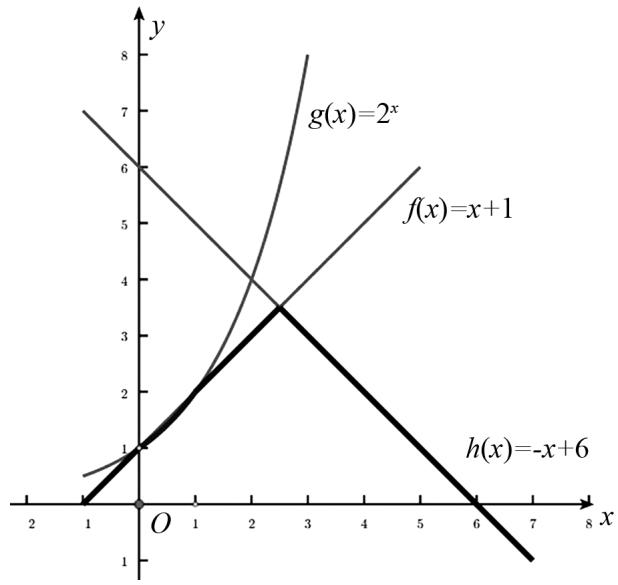

# 基于波利亚解题理论的高中函数问题解题方法研究

温远芳(赤峰学院数学与计算机科学学院 024000)

薛颖(赤峰学院教师教育学院 024000)

【摘 要】 本文结合波利亚解题理论,研究高中函数问题的解题方法.围绕该理论的四个步骤:理解题目、拟订方案、执行方案和回顾,通过具体例题,分析函数的值、函数的基本性质和最值问题的解题方法,展示数学归纳法、数形结合法等技巧.总结该理论的实用性,强调其在培养学生数学思维等方面的价值,展望其在高中数学其他模块的应用前景.

【关键词】波利亚解题理论;函数问题;高中数学

# 1 引言

函数知识在高中数学中占据着核心地位,它不仅要求学生掌握基础概念,更需要学生具备灵活的解题思路和完整的思维模式.同时高中数学具有系统性,函数知识掌握不牢会影响其他知识的学习.本文结合波利亚解题四步骤,探究高中常见函数类型的解题方法,如数学归纳法、数形结合法等,帮助学生熟练掌握解题方法,在面对函数问题时游刃有余,甚至将该理论应用于高中数学其他模块,实现“触类旁通”.在此过程中,学生可构建数学知识网络,提高学习能力,形成数学思维.

# 2 高中函数问题解题分析

本文结合波利亚解题理论,探究函数的值、基本性质和最值问题的解题方法.

# 2.1 函数的值

例 1 设 $f(n)$ 的定义域与值域均为正整数集合, 如果对所有正整数 n, m, 有 $f[f(m) + f(n)] = m + n$ , 求 $f(2017)$ 的值.

结合波利亚解题理论对该题进行分析：

第一步:本题的未知数是 $f(n)$ 的表达式以及 $f(2017)$ ，已知数是 $f(n)$ 的定义域与值域均为正整数，本题给出了一个条件是 $f[f(m)+f(n)]=$ $m+n$ . 根据这个条件, 猜想可能还满足一个条件: $f(n)=n.$

第二步: 假设 $f(1)=t$ ，则由 $f[f(m)+f(n)]=m+n$ 得 $f(2t)=f[f(1)+f(1)]=2$ .

如果 $t \neq 1$ ，则有 $t = b + 1$ （b 是正整数）.

若 $f(b)=c$ (c 是正整数)，

则 $f(2c) = 2b, 2c + 2t = f[f(2c) + f(2t)] = f(2b + 2) = f(2t) = 2.$

所以 $t + c = 1$ 矛盾, 故 $f(1) = 1$ .

假设 $f(n) = n$ ，则 $f(n + 1) = f[f(n) + f(1)] = n + 1$ .

由数学归纳法得: 对一切正整数 n, 由 $f(n)=n$ , 所以 $f(2017)=2017$ .

检验结论 $f(n)=n$ 是否正确, 随机取 m=1, n=3 代入公式 $f[f(m)+f(n)]=f[f(1)+f(3)]=f(1+3)=f(4)=4=1+3=m+n$ , 符合题干 $f[f(m)+f(n)]=m+n$ . 所以 $f(n)=n$ 结论正确, 故 $f(2017)=2017$ .

该题运用了数学归纳法,在与自然数相关的题型中,都可以考虑运用数学归纳法.

# 2.2 函数的基本性质相关问题解题分析

例2 函数 $y = \log_2(4^x + 16^x) - 3x$ 的图象（）

(A) 关于原点对称.  
(B) 关于 y 轴对称.  
(C) 关于直线 x = 2 对称.  
(D) 关于点 $(0,1)$ 对称.

方法 1 结合波利亚解题理论对该题进行分析.

第一步:该题是指数函数与对数函数相结合的一个复合函数,定义域是 R,未知数是无法知道该函数的图象及奇偶性与对称性,已知条件是给定了函数的表达式,可能隐含的条件是这个函数是奇函数或者偶函数.

第二步:首先验证该函数是否为偶函数,这里随机选取 x=3 和 x=-3,代入到原函数验证 $f(3)$ 和 $f(-3)$ 是否相等:

$$
\begin{array}{l} f (3) = \log_ {2} \left(4 ^ {3} + 1 6 ^ {3}\right) - 3 \times 3 = \log_ {2} \left[ 4 ^ {3} (1 + \right. \\ \left. 4 ^ {3}\right) ] - 9 = \log_ {2} 4 ^ {3} + \log_ {2} \left(1 + 4 ^ {3}\right) - 9 = 2 \times 3 + \log_ {2} (1 \\ \left. + 4 ^ {3}\right) - 9 = \log_ {2} \left(1 + 4 ^ {3}\right) - 3 = \log_ {2} 6 5 - 3. \\ \end{array}
$$

$$
\begin{array}{l} f (- 3) = \log_ {2} \left(4 ^ {- 3} + 1 6 ^ {- 3}\right) - 3 \times (- 3) = \\ \log_ {2} \left[ 4 ^ {- 3} \left(1 + 4 ^ {- 3}\right) \right] + 9 = \log_ {2} 4 ^ {- 3} + \log_ {2} \left(1 + 4 ^ {- 3}\right) + 9 = \\ 2 \times (- 3) + \log_ {2} (1 + 4 ^ {- 3}) + 9 = \log_ {2} (1 + 4 ^ {- 3}) + 3 = \\ \log_ {2} \frac {6 5}{6 4} + 3 = \log_ {2} 6 5 - \log_ {2} 6 4 + 3 = \log_ {2} 6 5 - 3. \\ \end{array}
$$

所以 $f(3)=f(-3)$ ，该结论正确，故选项(B)正确。本题还可以运用直接定义转化法进行函数的奇偶性判断。

方法 2 定义转化法.

$$
\begin{array}{l} f (- x) = \log_ {2} (4 ^ {- x} + 1 6 ^ {- x}) + 3 x \\ = \log_ {2} \left(\frac {1}{4 ^ {x}} + \frac {1}{1 6 ^ {x}}\right) + 3 x \\ = \log_ {2} \frac {4 ^ {x} + 1 6 ^ {x}}{2 ^ {6 x}} + 3 x = \log_ {2} \left(4 ^ {x} + 1 6 ^ {x}\right) - \log_ {2} 2 ^ {6 x} + \\ 3 x = \log_ {2} \left(4 ^ {x} + 1 6 ^ {x}\right) - 6 x + 3 x = \log_ {2} \left(4 ^ {x} + 1 6 ^ {x}\right) - 3 x \\ = f (x). \\ \end{array}
$$

$$
\begin{array}{l} 3 x = \log_ {2} \left(4 ^ {x} + 1 6 ^ {x}\right) - 6 x + 3 x = \log_ {2} \left(4 ^ {x} + 1 6 ^ {x}\right) - 3 x \\ = f (x). \\ \end{array}
$$

所以函数是偶函数,其图象关于 y 轴对称,故选项(B)正确.

# 2.3 最值问题解题分析

例 3 已知函数 $f(x)=x+1, g(x)=2^{x}$ ， $h(x)=-x+6(x\in\mathbb{R})$ ，如果函数 $F(x)=\min\{f(x), g(x), h(x)\}$ ，则 $F(x)$ 的最大值是多少？

结合波利亚解题理论对该题进行分析：

第一步:该题是常见的求函数的最值问题,常用的方法是借助图形来解决(如图1所示).该题的未知条件是函数 $F(x)$ 的最大值,已知条件是函数 $f(x),g(x)$ 和 $h(x)$ 的表达式,以及 $F(x)=\min\{f(x),g(x),h(x)\}$ .

line

| x    | g(x)=2^x | f(x)=x+1 | h(x)=-x+6 |
| ---- | -------- | -------- | --------- |
| 0    | 1        | 1        | 1         |
| 1    | 2        | 2        | 2         |
| 2    | 3        | 3        | 3         |
| 3    | 4        | 4        | 4         |
| 4    | 5        | 5        | 5         |
| 5    | 6        | 6        | 6         |
| 6    | 7        | 7        | 7         |
| 7    | 8        | 8        | 8         |

图1

第二步:先求出函数 $f(x)$ 与 $g(x)$ 图象的交点坐标为 $(1,2)$ , $f(x)$ 与 $h(x)$ 的图象交点坐标为 $\left(\frac{5}{2},\frac{7}{2}\right)$ , $g(x)$ 与 $h(x)$ 图象交点坐标为 $(2,4)$ , $F\left(\frac{5}{2}\right)=\min\left\{\frac{5}{2}+1,2^{\frac{5}{2}},-\frac{5}{2}+6\right\}=\frac{7}{2}$ . 所以 $F(x)$ 的最大值为 4.

# 3 结语

本文结合波利亚解题理论,阐述其四个步骤,通过函数值、基本性质、最值问题的实例,展示了高效解题方法.该理论的应用体现在:引导学生理解题目、拟订方案(如数学归纳法、等价变换法等)、执行方案、回顾总结.

# 参考文献：

[1] 马波. 中学数学解题研究(第2版)[M]. 北京: 北京大学出版社, 2017.  
[2] 胡建华. 等价转换, 数学运算——一道函数题的探究 [J]. 数学之友, 2022, 36(19): 95-97.