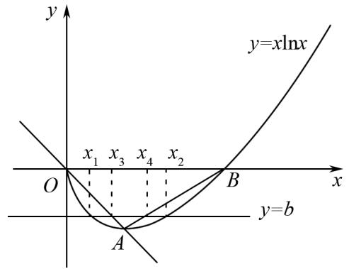
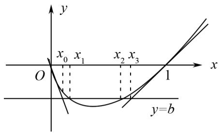
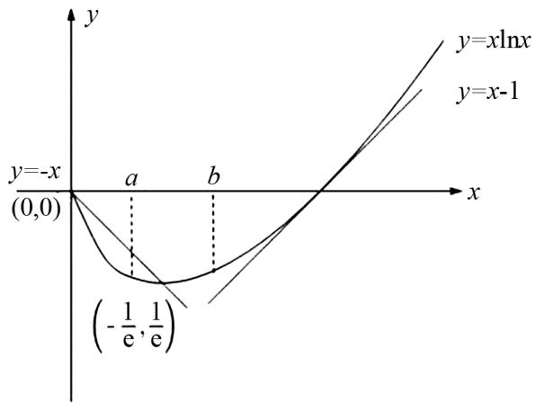

# 妙用切割放缩,巧解导数难题

程翠娥(湖北省天门市净潭初级中学 431700)

【摘 要】 函数与导数作为高考压轴题的考点,对学生的多种数学能力及思想方法掌握要求极高.本文聚焦高考真题,深入剖析导数重点问题与通性通法,通过运用切线、割线放缩的技巧,对函数与导数问题进行有效解决,将复杂问题简单化.具体以典型例题为例,详细展示切割放缩在证明不等式、处理方程根等问题中的应用过程,强调其在函数导数问题求解中的重要价值,为学生掌握导数相关知识、提升解题能力提供有效策略,同时也为高考备考提供参考方向.

【关键词】 导数;高中数学;解题技巧

# 试题再现

例 1 已知函数 $f(x)=x\ln x$ ,

(1) 若 $a \leqslant -2$ ，证明： $f(x) \geqslant ax - e^{-3}$ 在 $(0, +\infty)$ 上恒成立；  
(2) 若方程 $f(x)=b$ 有两个实数根 $x_{1}, x_{2}$ ，且 $x_{1}<x_{2}$ ，求证： $be+1<x_{2}-x_{1}<\frac{e^{-3}+3b+2}{2}$ .

解 (1) $f(x) \geqslant ax - e^{-3}$ 等价于 $f(x) \geqslant -2x - e^{-3}$ ，只需要证明： $x \ln x + 2x \geqslant -e^{-3}$ .

令 $g(x)=x\ln x+2x$ ,

则 $g'(x)=\ln x+3$ ,

当 $0 < x < e^{-3}$ 时， $g'(x) < 0$ ，

当 $x > e^{-3}$ 时， $g'(x) > 0$ ，

所以 $g(x)$ 在 $(0, e^{-3})$ 上单调递减，在 $(e^{-3}, +\infty)$ 上单调递增，

$g(x)_{\min}=g(e^{-3})=-e^{-3},f(x)\geqslant ax-e^{-3}$ 在 $(0,+\infty)$ 上恒成立.

(2) 首先, $y = x \ln x$ 的图象如图 1 所示, 先看左边不等式, 显然利用割线放缩来证明, 这两条割线很容易得到, 即求函数最低点 $\left(\frac{1}{\mathrm{e}}, -\frac{1}{\mathrm{e}}\right)$ 与 (0,0) 及 (1,0) 的连线, 即 $h(x) = -x$ 与 $l(x) = \frac{1}{\mathrm{e} - 1}(x - 1)$ ,

设两条割线与直线 y=b 交点的横坐标分别为 $x_{3}, x_{4}$ ,

解得 $x_{3}=-b, x_{4}=(e-1)b+1, x_{4}-x_{3}=b e+1$ (此时要说明 $x_{2}-x_{1}>x_{4}-x_{3}$ ，不能根据图象直接说明，不能以图代证).

text_image

y
y=qlnx
x₁ x₃ x₄ x₂
O
B
x
y=b
A

图1

当 $x \in \left(0, \frac{1}{\mathrm{e}}\right)$ 时，

$$
x \ln x + x = x (1 + \ln x) <   0,
$$

$$
f (x) <   h (x),
$$

当 $x \in \left(\frac{1}{\mathrm{e}}, 1\right)$ 时，

$$
x \ln x - \frac {1}{\mathrm{e} - 1} (x - 1) = x \left[ \ln x - \frac {1}{\mathrm{e} - 1} (1 - x) \right].
$$

令 $m(x)=\ln x-\frac{1}{e-1}\left(1-\frac{1}{x}\right)$ ,

$m^{\prime}(x) = \frac{(\mathrm{e} - 1)x - 1}{(\mathrm{e} - 1)x^{2}}, m(x)$ 在 $\left(\frac{1}{\mathrm{e}}, \frac{1}{\mathrm{e} - 1}\right)$ 上单调递减，在 $\left(\frac{1}{\mathrm{e} - 1}, 1\right)$ 上单调递增，

而 $m(1)=m\left(\frac{1}{\mathrm{e}}\right)=0$ ,

所以 $m(x) < 0$ ,

$$
\begin{array}{c} {h (x _ {1}) > f (x _ {1}) = h (x _ {3}) = l (x _ {4}) = f (x _ {2}) =} \\ {b <   l (x _ {2}),} \end{array}
$$

可得出 $x_{1}<x_{3},x_{4}<x_{2}$ ,

所以 $x_{2}-x_{1}>x_{4}-x_{3}>be+1$ ，不等式左边成立.

如图 2 所示, 存在较为明显的切线夹, 且这两条切线可以从给定的提示快速得到, 分别是 $x = e^{-3}$ 和 x = 1 时的两条切线, 切线方程分别为 $p(x) = -2x - e^{-3}$ 和 $q(x) = x - 1$ , 其与 y = b 的交点分别为 $x_{0} = -\frac{e^{-3} + b}{2}$ , $x_{3} = b + 1$ .

$f(x_{0})<p(x_{0})=f(x_{1})=f(x_{2})=q(x_{3})<f(x_{3})$ ，根据单调性，可得： $x_{0}<x_{1},x_{2}<x_{3}$

$$
x _ {2} - x _ {1} <   x _ {3} - x _ {0} = \frac {\mathrm{e} ^ {- 3} + 2 b + 3}{2}.
$$

text_image

y
x₀ x₁ x₂ x₃
O 1 x
y=b

图 2

例 2 （2024 年广州市高三阶段性测试）已知函数 $f(x)=x \ln x$ .

(1) 讨论函数 $f(x)$ 的单调性;  
(2) 若有两个不相等的正实数 a, b，满足 $f(a) = f(b)$ ，求证： $a + b < 1$ .

解 （1）过程略， $f(x)$ 的单调减区间为 $\left(0, \frac{1}{\mathrm{e}}\right)$ ，单调增区间为 $\left(\frac{1}{\mathrm{e}}, +\infty\right)$ .

(2) 由(1)得 $f(x)$ 在 $\left(0, \frac{1}{\mathrm{e}}\right)$ 的值域为 $\left(-\frac{1}{\mathrm{e}}, 0\right)$ , 在 $\left(\frac{1}{\mathrm{e}}, +\infty\right)$ 上的值域为 $\left(-\frac{1}{\mathrm{e}}, +\infty\right)$ , 因为 $f(1) = 0, f(a) = f(b)$ , 不妨设 $0 < a < \frac{1}{\mathrm{e}} < b < 1$ , 要证 $a + b < 1$ , 即证 $b < 1 - a$ .

由于 $\frac{1}{e}<b<1-a$ , $f(x)$ 在 $\left(\frac{1}{e},+\infty\right)$ 上单调递增, 故需要证明 $f(b)<f(1-a)$ ,

即证明 $f(a) < f(1 - a)$ .

# 方法 1(构造函数)

$\varphi(x)=f(x)-f(1-x)$ 其中变量 x 的范围为: $0<x<\frac{1}{e}$ .

# 方法 2(切割放缩)

$f(x)$ 的单调减区间为 $\left(0, \frac{1}{\mathrm{e}}\right)$ ，单调增区间为 $\left(\frac{1}{\mathrm{e}}, +\infty\right)$ ， $f(x)$ 的图象过点 $\left(-\frac{1}{\mathrm{e}}, \frac{1}{\mathrm{e}}\right)$ ，点 $(0,0)$ 割线方程为 $m(x) = -x$ ，过点 $(1,0)$ 的切线方程 $h(x) = x - 1$ .

根据图 3, 可知 $h(b) < f(b) = f(a) < m(a)$ ，即 b - 1 < -a，所以 $a + b < 1$ .

点评 此题解题方法比较灵活,将所学的函数知识融为一体,对学生的要求比较高.

text_image

y
y=-x
(0,0)
a
b
(-1/e, 1/e)
x
y=xlnx
y=x-1

图3

# 结语

探索函数与导数问题,关键在于深入理解,而非死记硬背.持续钻研能挖掘题目规律,深度思考可逼近问题本质,大胆尝试能开拓解题思路,总结反思则能构建知识体系,将陌生问题转化为熟悉模型,既提升解题能力,也能磨砺面对难题的意志与智慧.

# 参考文献：

[1] 卢恩良. 巧用切割线证明极值点偏移问题 [J]. 中学生数学, 2023(7): 6-7.  
[2] 徐春波. 师生共讨“切割线”放缩本质的点滴体会 [J]. 数学通讯, 2018, 32(6): 46-53.