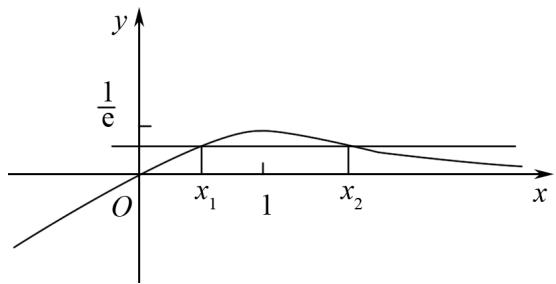

# 山重水复疑无路,等价转化寻出路

# ——对称化构造解极值点偏移问题

赵国华(山东省莘县第一中学 252400)

【摘 要】 极值点偏移问题是高中数学中一类复杂的题型,即它不仅是高中阶段的重点,也是难点.运用导数研究函数解决这类问题,需要学生具有较强的数学思维与丰富的知识结构,巧妙地运用对称化构造方法,将复杂问题转化为一类模型,进而找到解决问题的关键路径.

【关键词】对称化构造;极值点偏移;高中数学

# 1 引言

极值点偏移问题在高考数学中常常作为压轴题出现,是导数综合应用中的代表性问题.对称化构造法主要用来解决与两个极值点之和、积相关的不等式证明问题,学生需要具有较强的抽象思维能力,将问题等价转化,从而找到突破口.以下对一道对称化构造两个极值点之和的问题进行分析.

# 2 极值点偏移问题解析

例 已知函数 $f(x) = x\mathrm{e}^{-x}(x \in \mathbf{R})$ ，如果 $x_{1} \neq x_{2}$ ，且 $f(x_{1}) = f(x_{2})$ ，证明： $x_{1} + x_{2} > 2$ .

解题指导 $f(x)=x\mathrm{e}^{-x}$ 可以写作 $f(x)=\frac{x}{\mathrm{e}^{x}}$ 的形式，对 $f(x)$ 求导， $f'(x)=\frac{\mathrm{e}^{x}-x\cdot\mathrm{e}^{x}}{\mathrm{e}^{2x}}=\frac{1-x}{\mathrm{e}^{x}}$ ，令 $f'(x)=0$ ，即 $\frac{1-x}{\mathrm{e}^{x}}=0$ ，解得 x=1。当 x 的值发生变化时， $f'(x)$ ， $f(x)$ 的变化情况如表 1 所示。

表 1

<table><tr><td>x</td><td>(-∞,1)</td><td>1</td><td>(1,+∞)</td></tr><tr><td>f&#x27;(x)</td><td>+</td><td>0</td><td>-</td></tr><tr><td>f(x)</td><td>单调递增</td><td>极大值</td><td>单调递减</td></tr></table>

因此， $f(x)$ 在 $(-∞,1)$ 上是增函数，在$(1, +\infty)$ 上是减函数, 且函数在 x = 1 处取得极大值, 极大值为 $f(1) = \frac{1}{\mathrm{e}}$ .

已知 $x_{1} \neq x_{2}$ ，且 $f(x_{1}) = f(x_{2})$ ，可知， $(x_{1}, f(x_{1}))$ 与 $(x_{2}, f(x_{2}))$ 只能处于 $x$ 轴的上方，设 $x_{1}$ 位于 $x_{2}$ 的左边，作出如图1所示图象.

text_image

y
1/e
O
x₁ 1 x₂ x

图1

根据图象易知 $0 < x_{1} < 1 < x_{2}$ ，要证 $x_{1} + x_{2} > 2$ ，可以将不等式中的两个变量进行消元，试着将不等号的变量进行移动，可得 $x_{2} > 2 - x_{1}$ 。因为 $0 < x_{1} < 1$ ，所以 $2 - x_{1} > 1$ ，又因为 $x_{2} > 1$ ，而 $f(x)$ 在 $(1, +\infty)$ 上单调递减，所以证明 $x_{1} + x_{2} > 2$ 的问题可以转化为证明 $f(x_{2}) < f(2 - x_{1})$ 的问题，又因为 $f(x_{1}) = f(x_{2})$ ，所以要证 $x_{1} + x_{2} > 2$ ，只需证出 $f(x_{1}) < f(2 - x_{1})$ ，即证 $\frac{x_{1}}{e^{x_{1}}} < \frac{2 - x_{1}}{e^{2 - x_{1}}}$ ， $x_{1} \in (0, 1)$ 。

方法1 将 $\frac{x_1}{\mathrm{e}^{x_1}} < \frac{2 - x_1}{\mathrm{e}^{2 - x_1}}$ 变形为 $\frac{\mathrm{e}^{x_1}}{\mathrm{e}^{2 - x_1}} > \frac{x_1}{2 - x_1}$

即证 $\mathrm{e}^{2x_1 - 2} > \frac{x_1}{2 - x_1}$ .

令 $g(x)=\mathrm{e}^{2x-2}-\frac{x}{2-x}$ ,

则 $g'(x)=2\mathrm{e}^{2x-2}-\frac{x}{(2-x)^{2}}$ ,

$$
\begin{array}{l} g ^ {\prime} \left(x _ {1}\right) = 2 \left[ \left(\mathrm{e} ^ {x _ {1} - 1}\right) ^ {2} - \frac {1}{\left(2 - x _ {1}\right) ^ {2}} \right] \\ = 2 \left(\mathrm{e} ^ {x _ {1} - 1} + \frac {1}{2 - x _ {1}}\right) \left(\mathrm{e} ^ {x _ {1} - 1} - \frac {1}{2 - x _ {1}}\right). \\ \end{array}
$$

由于 $x_{1} \in (0,1)$ ，可知 $\left(\mathrm{e}^{x_1 - 1} + \frac{1}{2 - x_1}\right)$ 为正数，对于 $\left(\mathrm{e}^{x_1 - 1} - \frac{1}{2 - x_1}\right)$ 不易分辨正负，可对 $\mathrm{e}^{x_1 - 1}$ 和 $\frac{1}{2-x_{1}}$ 的倒数进行比较，即比较 $e^{1-x_{1}}$ 和 $2-x_{1}$ 的大小关系，令 $1-x_{1}=t$ ，比较 $e^{1-x_{1}}$ 和 $2-x_{1}$ 的大小就变成比较 $e^{t}$ 和 $1+t$ 的大小， $e^{t}$ 在(0,1)处的切线恰好为 $1+t$ ，也就是说 $e^{t}>1+t$ ，所以 $e^{x_{1}-1}<\frac{1}{2-x_{1}}$ ，所以 $\left(e^{x_{1}-1}-\frac{1}{2-x_{1}}\right)$ 为负数。因此 $g'(x_{1})<0$ ，即 $g(x_{1})$ 在 $x_{1}\in(0,1)$ 上单调递减，所以 $g(x_{1})>g(1)=0$ ，所以 $e^{2x_{1}-2}-\frac{x_{1}}{2-x_{1}}>0$ ，所以 $e^{2x_{1}-2}>\frac{x_{1}}{2-x_{1}}$ ，所以 $x_{1}+x_{2}>2$ ，即得证。

方法2 观察 $\frac{x_1}{\mathrm{e}^{x_1}} < \frac{2 - x_1}{\mathrm{e}^{2 - x_1}}$ ，发现不等式左右两边较为对称，对该式进行变形得 $x_1 \cdot \mathrm{e}^{2 - x_1} < (2 - x_1) \cdot \mathrm{e}^{x_1}$ ，令 $F(x) = f(1 + x) - f(1 - x) = \frac{1 + x - (1 - x)\mathrm{e}^{2x}}{\mathrm{e}^{1 + x}}, x \in (0, 1]$ ，

则 $F'(x)=\frac{x}{\mathrm{e}^{1+x}}(\mathrm{e}^{2x}-1)>0,$

所以 $F(x)$ 在 $x \in (0,1]$ 上单调递增， $F(x) > F(0) = 0$ ，

即 $f(1 + x) > f(1 - x)$ 对 $x \in (0,1]$ 恒成立，

由 $0 < x_{1} < 1 < x_{2}$

则 $1 - x_{1}\in (0,1]$ ，

所以 $f[1 + (1 - x_1)] = f(2 - x_1) > f[1 - (1 - x_1)] = f(x_1) = f(x_2)$ ，

即 $f(2-x_{1})>f(x_{2})$ ,

又因为 $2 - x_{1}, x_{2} \in (1, +\infty)$ ，且 $f(x)$ 在 $(1, +\infty)$ 上单调递减，所以 $2 - x_{1} < x_{2}$ ，

所以 $x_{1} + x_{2} > 2$ ，即得证.

分析 解决极值点偏移问题的解题步骤为对题目所给函数在定义域上的单调性进行分析,找出其极值点,再根据题目所给条件作出函数图象,观察函数图象,得出取值范围,接着分析要证明的结论,试着将多变量转变为单变量,根据变形后的特征,构造新的函数,再判断新函数的单调性进行证明.

本题解决的关键点在于学生是否认识到该题为极值点偏移问题，并进行等价转化，将多变量转化为单变量再求证。极值点偏移问题的典型条件是：需求证形如 $x_{1} + x_{2} > 2x_{0}$ 或 $x_{1} \cdot x_{2} > x_{0}^{2}$ 的式子在某个指定范围上成立。部分问题中给出的式子可能不满足以上形式，但经过转化一般都会回归以上两种形式。解决此类问题的难点是，学生在解题时需要运用反证法，对需要求证的结论进行分析，将结论作为条件，逆推演绎，构造函数并证明函数中的相关关系。

# 3 结语

对称化构造解极值点偏移问题在高中数学中是一类较难的问题，对于 $x_{1} + x_{2} > 2x_{0}$ 型，可构造函数 $F(x) = f(x_{2}) - f(2x_{0} - x_{1})$ ，结合已知条件进行解题.若学生能够发现其中的规律，感受到等价转化与对称特点，构造相应的函数证明，能够有效提高解题效率，并发展数学思维.