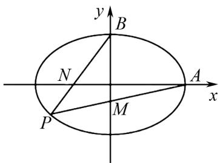
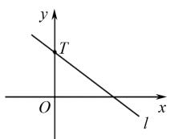
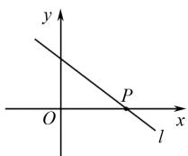
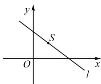
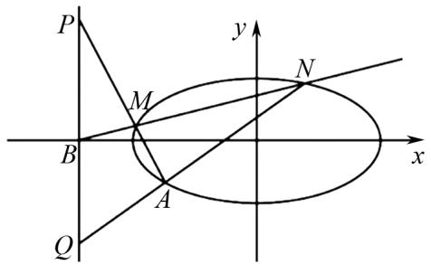

# 浅谈圆锥曲线设点还是设线问题

李恒(江西师范大学附属中学赣江创新研究院分校 341100)

【摘 要】 圆锥曲线问题作为高考数学的必考点,成为许多学生的难点,但此类问题往往存在通用解题思路,处理时通常会利用韦达定理进行化简,因此解题的关键在于第一步如何进行假设,合理的假设能够大幅减少计算量.本文重点分析如何设点以及设线,帮助大家更好地掌握圆锥曲线的解题策略.

【关键词】 圆锥曲线;高中数学;解题方法

# 1 思路 1(设点)

观察题目条件的出发点是直线还是点,若题目是以点为出发点进行构造时常考虑设点.此外,需要注意若所设点在圆锥曲线上,则此点一定满足曲线方程,且这一条件在化简过程中会用到.一般解题步骤为:(1)观察题目特征并设点;(2)利用此点得到条件表达式;(3)利用圆锥曲线方程化简求解.

例 1 如图 1 所示, 已知 P 是椭圆 $C: \frac{x^{2}}{4} + y^{2} = 1$ 上的一点, 直线 PA 与 y 轴交于点 M, 直线 PB 与 x 轴交于点 N. 求证: $|AN| \cdot |BM|$ 为定值.

text_image

y
B
N
A
x
P
M

图1

解 设点 $P(x_{0}, y_{0})$ ，则直线 PB 的方程为：

$$
y = \frac {y _ {0} - 1}{x _ {0}} x + 1,
$$

令 y=0 得 $x_{N}=-\frac{x_{0}}{y_{0}-1}$ ,

故 $|AN|=2+\frac{x_{0}}{y_{0}-1}=\frac{2y_{0}+x_{0}-2}{y_{0}-1}$ ,

同理, 直线 PA 的方程为: $y = \frac{y_{0}}{x_{0} - 2}(x - 2)$ .

令 x=0 得 $y_{M}=\frac{-2y_{0}}{x_{0}-2}$ ,

从而 $|BM|=1+\frac{2y_{0}}{x_{0}-2}=\frac{x_{0}+2y_{0}-2}{x_{0}-2}.$

进而 $|AN|\cdot|BM|=\frac{(x_{0}+2y_{0}-2)^{2}}{(x_{0}-2)(y_{0}-1)}$

$$
= \frac {x _ {0} ^ {2} + 4 y _ {0} ^ {2} + 4 + 4 x _ {0} y _ {0} - 8 y _ {0} - 4 x _ {0}}{x _ {0} y _ {0} - 2 y _ {0} - x _ {0} + 2},
$$

由于 $\frac{x_{0}^{2}}{4}+y_{0}^{2}=1$ ，

故 $|AN|\cdot|BM|=\frac{4(x_{0}y_{0}-2y_{0}-x_{0}+2)}{x_{0}y_{0}-2y_{0}-x_{0}+2}$

$$
= 4.
$$

解析 可以发现,题目中的所有条件都涉及点P,若选择设直线,则需要设两条直线方程,不易求解,因此考虑设点求解.设点之后利用两点坐标可以得到直线方程,进而得到点N,M的坐标,从而得到 $|AN|\cdot|BM|$ 的表达式,最后利用圆锥曲线方程求解.

# 2 思路 2(设直线)

如图 2 所示, 当问题的变化随直线变化而变化, 或者所涉及的核心关键点都在同一条直线上时, 可以优先考虑设直线进行求解. 下面展示基本的设直线的方法.

  
y轴定点

  
$x$ 轴定点

  
随意定点  
图2

(1) 当过 y 轴定点时, $y = kx + m$ .   
(2) 当过 x 轴定点时, $x = \lambda y + m$ .  
(3) 当过任意定点时, 若点坐标为 $(a, b)$ , 则 y - b = k (x - a).

例 2 如图 3 所示, 已知点 A(-2, -1) 在椭圆 C: $\frac{x^{2}}{8} + \frac{y^{2}}{2} = 1$ 上, 过点 B(-4, 0) 的直线 l 交椭圆 C 于点 M, N, 直线 MA, NA 分别交直线 x = -4 于点 P, Q, 求 $\frac{|PB|}{|BQ|}$ 的值.

text_image

P
y
M
N
B
A
x
Q

图3

解 设直线 MN 的方程为 $x = \lambda y - 4$ ,

联立得 $\left\{\begin{aligned}x^{2}+4y^{2}-8=0,\\ x=\lambda y-4,\end{aligned}\right.$

化简得 $(\lambda^{2}+4)y^{2}-8\lambda y+8=0$ ，

设 $M(x_{1},y_{1}),N(x_{2},y_{2})$

可得: $y_{1}+y_{2}=\frac{8\lambda}{\lambda^{2}+4},y_{1}y_{2}=\frac{8}{\lambda^{2}+4},$

直线 $AM:y + 1 = \frac{y_1 + 1}{x_1 + 2} (x + 2)$

$$
\Rightarrow y _ {P} = \frac {- 2 y _ {1} - x _ {1} - 4}{x _ {1} + 2} = \frac {- (\lambda + 2) y _ {1}}{\lambda y _ {1} - 2},
$$

同理可得 $y_{Q}=\frac{-(\lambda+2)y_{2}}{\lambda y_{2}-2}$ ,

故 $\frac{|PB|}{|BQ|}=\frac{|y_{P}|}{|y_{Q}|}=\left|\frac{\lambda y_{1}y_{2}-2y_{1}}{\lambda y_{1}y_{2}-2y_{2}}\right|$ ,

从上述韦达定理可知 $y_{1} + y_{2} = \lambda y_{1}y_{2}$ ,

代入上式得: $\frac{|PB|}{|BQ|}=\left|\frac{y_{1}+y_{2}-2y_{1}}{y_{1}+y_{2}-2y_{2}}\right|=1.$

解析 分析题目,可以发现问题中涉及的点都是从 M,N 引出,且这些点在同一条直线上,因此考虑设直线 MN 求解.需要注意的是,对于非齐次韦达定理,可以借助韦达定理中根与系数的内在联系进行求解.

# 3 结语

研究发现,求解圆锥曲线问题的第一步是设点或设直线,合理的假设可以大幅减少计算量,其关键在于观察题目中图形的改变是由直线引起还是由点引出,作出合理假设之后,结合题目条件进行转化即可.需要注意的是,设直线时需考虑实际情况,这样能大幅提高计算的准确性.

# 参考文献：

[1] 李罗, 孔德宏. 设点与设线: 不同设法对解析几何解题的影响 [J]. 上海中学数学, 2024(5): 33-36.  
[2] 李晖. 关于设点法解一类圆锥曲线问题的思考 [J]. 福建教育学院学报, 2020, 21(6): 24-25+30.  
[3] 李亚文. 设点法与设线法在解析几何中的应用 [J]. 数理化解题研究, 2023(22): 27-29.  
[4] 金建军, 方家鸿. 核心素养观下的解析几何复习教学——以设点与设线问题研究为例 [J]. 中学数学研究 (华南师范大学版), 2022(6): 38-41.  
[5] 魏挺路.“设线”还是“设点”，这是一个问题——对近三年浙江卷解析几何的几点思考[J].中学数学研究，2019(12):45-48.