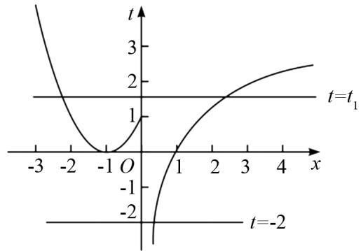

# 深度学习抓本质,突破难点现水平

# ——以分段函数为例

黄文彬(广东省河源市源城区东埔中学 517000)

【摘 要】 函数是高中数学的重要知识体系,分段函数作为重要的特殊函数类型,既是考查的难点又是高频考点.本文基于深度学习理论,通过解构分段函数的知识本质,系统梳理其在高考中的三大考查维度:函数值求解、函数零点及性质应用,同时结合典型例题分析,揭示分段函数“分段不割裂”的思维特征,为突破教学难点提供可操作性策略.

【关键词】 分段函数;高中数学;解题教学

分段函数是特殊函数,也是主要函数之一,是高考中考查的核心知识.本文通过对题型进行梳理、总结,得出分段函数考查呈现三维度特征:概念理解,即嵌套式函数值求解中的区间判定能力;形式表征,即函数零点与图象的关联性;应用迁移,即单调性等性质在参数求解中的综合运用.本文具体从求函数值、求分段函数的零点和分段函数单调性的应用三个方面展开讨论.

# 1 求函数值

这类问题属于对分段函数概念的考查,属于基础性问题,但也是易错题型,特别是求嵌套式函数值的题型.解决这类问题的核心是要根据分段函数的分类情况,根据自变量 x 的值恰当选择解析式进行求解.

例1 已知函数

$$
f (x) = \left\{ \begin{array}{l} x + 1, x \leqslant - 2, \\ x ^ {2} + 2 x, - 2 <   x <   2, \\ 2 x - 2, x \geqslant 2. \end{array} \right.
$$

(1) 求 $f(f(1))$ 的值；  
(2) 若 $f(m)=3$ ，求 m 的值.

解 （1）因为 $1 \in (-2, 2)$ ,

所以 $f(1)=(1)^{2}+2\times(1)=3$ ,

则 $f(f(1))=f(3)=2\times3-2=4.$

(2) 当 $m \leqslant -2$ 时, 有 $m + 1 = 3$ ,

解得 m=2(舍去).

当 $-2 < m < 2$ 时，

有 $m^2 + 2m = 3$

解得 m = -3 (舍去), 或 m = 1.

当 $m \geqslant 2$ 时，有 $2m - 2 = 3$

解得 $m=\frac{5}{2}$ .

综上所述, 当 $f(m)=3$ 时, m 的值为 1 或 $\frac{5}{2}$ .

评注 本题在已知分段函数解析式的情境下，(1) 是求函数值，(2) 是已知函数值求自变量。在(1)中，为嵌套式求函数值形式，嵌套求解需遵循“由内向外”的运算顺序，特别注意定义域边界值的双重验证；(2) 是已知函数值，求自变量的值，这类问题一般需要对自变量进行讨论，再代入解方程。

# 2 求函数零点个数

这类问题通常会与方程、函数图象关联考查，具体是一般要换元后转化为求方程根的个数。解这类问题时，主要依据为：换元解套，转化为 $t = g(x)$ 与 $y = f(t)$ 的零点；依次解方程，令 $f(t) = 0$ ，求 $t$ ，代入 $t = g(x)$ ，求出 $x$ 的值或判断图象交点个数。

例 2 已知函数 $f(x)=\left\{\begin{aligned}\ln x-\frac{1}{x},&x>0,\\ x^{2}+2x,&x\leqslant0,\end{aligned}\right.$ 求
函数 $y=f(f(x)+1)$ 的零点个数.

解 令 $t = f(x) + 1 = \begin{cases} \ln x - \frac{1}{x} + 1, & x > 0, \\ (x + 1)^2, & x \leqslant 0, \end{cases}$

当 t > 0 时， $f(t) = \ln t - \frac{1}{t}$ ，则函数 $f(t)$ 在 $(0, +\infty)$ 上单调递增.

因为 $f(1) = -1 < 0$ ,

$f(2) = \ln 2 - \frac{1}{2} >0,$

所以由函数零点存在定理可知, 存在 $t_{1} \in (1,2)$ , 使得 $f(t_{1}) = 0$ ;

当 $t \leqslant 0$ 时， $f(t) = t^2 + 2t$

由 $f(t)=t^{2}+2t=0$ , 解得 $t_{2}=-2, t_{3}=0$

画出函数 $t = f(x) + 1$ 的图象，直线 $t = t_{1}$ ，t = -2, t = 0，如图 1 所示.

line

| x    | t=t₁ | t=-2 |
| ---- | ---- | ---- |
| -3   | 3    | -2   |
| -2   | 1    | -1   |
| -1   | 0    | 0    |
| 0    | 0    | 1    |
| 1    | 1    | 2    |
| 2    | 2    | 3    |
| 3    | 3    | 4    |
| 4    | 4    | 5    |

图 1

由图 1 可知, 直线 $t = t_{1}$ 与函数 $t = f(x) + 1$ 的图象有两个交点;

直线 t=0 与函数 $t=f(x)+1$ 的图象有两个交点；

直线 t = -2 与函数 $t = f(x) + 1$ 的图象有且只有一个交点.

综上,函数 $y=f(f(x)+1)$ 的零点个数为 5.

评注 本题是求嵌套函数零点个数, 这也是高考考查的热点题型. 主要是根据换元, 令 $t = f(x) + 1$ , 把 $y = f(f(x) + 1)$ 的零点个数转化为方程 $f(t) = 0$ 的根的个数. 换元是解决这类问题的关键. 然后, 根据分段函数分段研究策略, 根据 $t$ 的不同取值范围对应不同解析式求解, 得出方程 $f(t) = 0$ 的解. 值得注意的是, 还要根据 $t$ 的值, 结合方程 $t = f(x) + 1$ 转化为图象交点个数问题.

# 3 单调性及其应用

这种题型形式多样,主要是针对函数的单调性,如已知函数的单调性求参数值、判断函数单调性、求单调区间以及解不等式等问题.

# 例3 已知函数

$f(x) = \left\{ \begin{array}{l}x^{2} - ax + 2a, x < -1,\\ 1 - \ln (x + 2), x\geqslant -1, \end{array} \right.$ 在 $\mathbf{R}$ 上单调递减，求实数 $a$ 的取值范围.

解 当 x<-1 时, 函数 $f(x)=x^{2}-ax+2a$ 在对称轴左侧单调递减,

则对称轴 $\frac{a}{2} \geqslant -1$

解得 $a \geqslant -2$ .

当 $x > -1$ 时，函数 $f(x) = 1 - \ln (x + 2)$ 在 $[-1, +\infty)$ 上单调递减.

当 $x = -1$ 时，要使函数 $f(x)$ 单调递减，则 $1^{2} - a + 2a\geqslant 1 - \ln 1$

解得 $a \geqslant 0$ .

综上所述, 函数 $f(x)$ 在 R 上单调递减时, 实数 a 的取值范围为 $[0, +\infty)$ .

评注 本题是在分段函数解析式含参数的情境下,已知函数在 R 上单调递减,求参数的取值范围.分段函数的特点是分段,不光解析式是分段的,性质也是分段的,所以在解决这类问题时,先考虑各段的单调性,根据单调性求出对应解析式内的参数取值范围,再考虑各段衔接处的单调性.一般情况下,单调递减则左端大于右端,单调递增则相反,最后将各种情况取并集即可.在解题时,需要注意:一是衔接处的单调性,很容易忽视;二是这类题型一般需要分类讨论,在分类时要做到不重不漏;三是在最终取值时,采用并集而不是交集,很多学生习惯性取交集.

# 4 结语

本文针对分段函数问题,以整体结构为单位,从专题角度对相应问题进行梳理和总结,深入分析分段函数.具体从求函数值,求函数的零点个数和单调性,以及其应用三个方面展开讨论,详细分析了题目类型、解题策略和注意事项,为复习备考的学生提供完备的知识体系和解题思路.

# 参考文献：

[1] 张子睿. 分段函数的题型及其解法 [J]. 语数外学习 (高中版下旬), 2017(5): 39.  
[2] 周敏. 高考分段函数归类解析 [J]. 数理化学习 (高三版), 2014(11): 16.  
[3] 易文峰. 解析分段函数常见题型 [J]. 数理化学习 (高中版), 2009(17): 21-24.