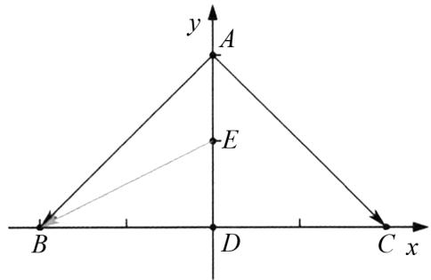

# 特殊与一般思想在解题中的应用

朱丽霞(江苏省海门证大中学 226100)

【摘 要】 在数学学习的过程中,对公式、定理、法则的学习往往都是从特殊开始,通过总结归纳得出来的,经过证明后,成为一般性结论,又使用它们来解决相关的数学问题.数学中的“特殊与一般思想”体现在解题中的归纳法、演绎法,以及在解题过程中采用的特殊化方法、一般化方法或者具体化方法.本文结合具体例子谈特殊与一般思想在高中数学解题中的应用,旨在为一线教师提供教学参考.

【关键词】 特殊与一般思想;高中数学;解题技巧

# 1 引言

数学作为一门逻辑性极强的学科,解题方法多种多样,特殊与一般思想在其中独具魅力.在高中数学的学习中,学生常常面临复杂抽象的问题,而特殊与一般思想犹如一把解题的钥匙,它不仅能帮助学生快速找到解题的切入点,还能培养学生的逻辑思维和创新能力.本文旨在系统研究这一思想在高中数学解题中的应用.

# 2 特殊化

在不改变本质的基础上,可以结合具体题目进行赋特值、构造特殊函数、利用特殊图形、特殊点、特殊位置等来进行特殊处理,这对某些高考小题而言,是有效的,而且是高效的.

例1 若 $f(x) = (x + a)\ln \frac{2x - 1}{2x + 1}$ 为偶函数，则 $a = (\quad)$

(A)-1.

(B)0.

(C) $\frac{1}{2}.$

(D)1.

解析 令 $\frac{2x - 1}{2x + 1} > 0 \Rightarrow x < -\frac{1}{2}$ 或 $x > \frac{1}{2}$ . 代入特殊值进行计算. 容易看出 $f(2) = (2 + a) \ln \frac{3}{5}$ , 同时 $f(-2) = (-2 + a) \ln \frac{5}{3}$ . 由 $f(2) = f(-2)$ 可得 $a = 0$ , 故选(B).

点评 本题的常规解法是根据偶函数的定义，利用 $f(-x) = f(x)$ 求解，运算量较大.这里进行特殊化处理，在定义域内取 x = 2，利用 $f(2) = f(-2)$ 求解，减少了运算量.

例 2 在 $\triangle ABC$ 中, AD 为 BC 边上的中线, E 为 AD 的中点, 则 $\overrightarrow{EB} = (\quad)$

(A) $\frac{3}{4}\overrightarrow{AB}-\frac{1}{4}\overrightarrow{AC}.$

(B) $\frac{1}{4}\overrightarrow{AB}-\frac{3}{4}\overrightarrow{AC}.$

(C) $\frac{3}{4}\overrightarrow{AB}+\frac{1}{4}\overrightarrow{AC}.$

(D) $\frac{1}{4}\overrightarrow{AB} +\frac{3}{4}\overrightarrow{AC}.$

解析 题中对 $\triangle ABC$ 的形状没有任何限定，故可以将 $\triangle ABC$ 特殊化，然后利用坐标运算求解.

text_image

y
A
E
B
D
C x

图1

如图 1 所示, 建立直角坐标系, 不妨设 $\triangle ABC$ 是以 BC = 4 为斜边的等腰直角三角形.

故 $A(0,2),B(-2,0),C(2,0),E(0,1)$

可得 $\overrightarrow{AB}=(-2,-2)$ ,

$\overrightarrow{AC} = (2, - 2),\overrightarrow{EB} = (-2, - 1),$

令 $\overrightarrow{EB}=x\overrightarrow{AB}+y\overrightarrow{AC};$

故可得 $\left\{\begin{aligned}-2x+2y&=-2,\\ -2x-2y&=-1,\end{aligned}\right.$

解得 $x=\frac{3}{4}, y=-\frac{1}{4}$ . 故选(A).

例 3 若 $f(x)=a\sin\left(x+\frac{\pi}{4}\right)+3\sin\left(x-\frac{\pi}{4}\right)$ 是偶函数, 则实数 a= \_\_\_\_.

解析 函数 $f(x)$ 是 R 上的偶函数, 故由题意可知对 $\forall x \in R$ 都有 $f(x) = f(-x)$ .

代入特值定参数,令 $x=\frac{\pi}{4}$ ,可得 $f\left(-\frac{\pi}{4}\right) = a\sin \left(-\frac{\pi}{4} +\frac{\pi}{4}\right) +$

$$
3 \sin \left(- \frac {\pi}{4} - \frac {\pi}{4}\right) = a \sin 0 + 3 \sin \left(- \frac {\pi}{2}\right) = - 3,
$$

$$
f \left(\frac {\pi}{4}\right) = a \sin \left(\frac {\pi}{4} + \frac {\pi}{4}\right) + 3 \sin \left(\frac {\pi}{4} - \frac {\pi}{4}\right) =
$$

$$
a \sin \frac {\pi}{2} + 3 \sin 0 = a,
$$

由 $f\left(\frac{\pi}{4}\right) = f\left(-\frac{\pi}{4}\right)$ 可得 $a = -3$

# 3 具体化

抽象函数是高考的一个难点,主要考查函数的单调性、对称性和奇偶性等性质.由于这类题目往往没有给出函数的解析式,让很多学生无从下手.如果学生熟悉指数函数、对数函数、幂函数和三角函数等各种函数满足的方程,则可根据题干得到函数的具体解析式,化抽象为具体,再利用函数的解析式解题,就容易多了.

例4 已知函数 $f(x)$ 的定义域为 $\mathbf{R}$ ，且 $f(x + y) + f(x - y) = f(x)f(y), f(1) = 1$ ，则 $\sum_{k=1}^{22} f(k) = (\quad)$

(A) - 3.

(B) - 2.

(C)0.

(D)1.

解析 抽象函数具体化,用特殊函数去满足题中要求.

由 $f(x+y)+f(x-y)=f(x)f(y)$ ，联想到余弦函数和差化积公式 $\cos(x+y)+\cos(x-y)=2\cos x\cos y$ ，

可设 $f(x)=a\cos\omega x$ .

因为 $f(x+y)+f(x-y)=f(x)f(y)$ ,

令 x=1, y=0,

可得 $2f(1)=f(1)f(0)$ ,

故 $f(0)=2$ ,

所以 $\left\{\begin{aligned}f(0)&=a=2,\\ f(1)&=a\cos\omega,\end{aligned}\right.$ 得 $a=2,\omega=\frac{\pi}{3};$

所以 $f(x)=2\cos\frac{\pi}{3}x$ 符合条件，

因此 $f(x)$ 的周期 $T=2\pi:\frac{\pi}{3}=6$ ,

因此 $f(0)=2, f(1)=1$ ,

且 $f(2) = -1, f(3) = -2, f(4) = -1, f(5) =$

$$
1, f (6) = 2,
$$

所以 $f(1)+f(2)+f(3)+f(4)+f(5)+f(6)=0$ ,

由于22除以6余4，所以 $\sum_{k = 1}^{22}f(k) = f(1) + f(2) + f(3) + f(4) = 1 - 1 - 2 - 1 = -3.$ 选(A).

点评 抽象函数具体化是解这类试题的关键. 根据题干的结构和和差化积公式, 可知 $f(x)$ 是余弦型函数. 可用赋值法确定 a 与 $\omega$ 的值, 这体现了方程的思想.

# 4 一般化

对于具有相似结构的数的比大小问题,可寻求相应函数并根据函数的单调性来求解.

例 5 设 $a=0.9^{1.3}$ , $b=0.9^{1.4}$ , $c=0.7^{1.4}$ ，则下列不等式中正确的是()

(A) $a < b < c$ .

(B) $c < b < a$ .

(C) $b < a < c$ .

(D) $c < a < b$ .

解析 观察数值特点, 找对应函数, 一般化处理.

设 $f(x)=0.9^{x}$ ，则由指数函数 $f(x)=0.9^{x}$ 在 R 上单调递减，

得 $f(1.3) > f(1.4) \Rightarrow a = 0.9^{1.3} > b = 0.9^{1.4}$ ,

设 $h(x)=x^{1.4}$ ，则幂函数 $h(x)=x^{1.4}$ 在 $(0,+\infty)$ 上单调递增，

得 $h(0.9)=0.9^{1.4}=b>c=h(0.7)=0.7^{1.4}$ ,

所以 a > b > c. 选(B).

# 5 结语

作为一线教师,应该将数学思想融入日常的教学当中,让学生在学习数学知识的同时,领悟到数学思想方法,从而提炼出问题的解题之法,提高解题能力.总之,特殊与一般思想是高中数学解题中不可或缺的重要策略.它不仅为解决具体问题提供了有效途径,还能深化学生对数学本质的理解.教师应在教学中注重引导学生运用这一思想,培养学生的数学素养.学生也应积极主动地掌握和运用特殊与一般思想,提升解题能力,为未来的数学学习和应用打下坚实基础.

# 参考文献：

[1] 朱潇, 李鸿昌. 从数学运算素养的内涵, 谈运算能力的培养 [J]. 中学数学, 2018(1): 57-59.