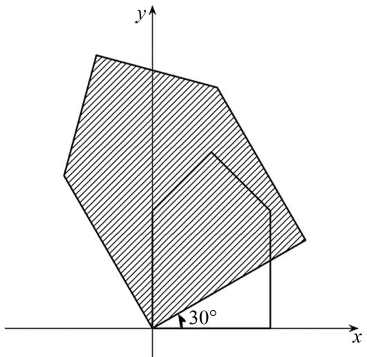

# 虚数不“虚”

# ——复数的生活应用案例

陶文清(江苏省扬州大学数学学院 225002)

【摘 要】 复数在高中数学中常常被视为抽象的符号,学生对其实际意义和应用缺乏理解.本文通过生活化案例——游戏角色旋转、地图缩放、声音叠加与波浪干涉,展示复数及其运算的几何含义和现实应用.复数加法对应向量合成,乘法统一了缩放与旋转,其运算简洁且直观.这些案例不仅有助于学生理解复数的代数运算,更能激发学生去探索数学背后蕴含的几何直观和现实意义.

【关键词】 复数;高中数学;代数运算;现实应用

在高中数学的学习中,复数常常让学生觉得既神秘又抽象.许多学生第一次接触虚数单位 i 时,都会疑惑:一个平方等于 -1 的数,真的存在吗?它究竟有什么意义?如果这些疑问得不到解答,复数往往被误解为“虚构”的符号,仅仅是解题的工具.

事实上, 复数确非虚构的. 它源于对二次方程的求解, 且在阿尔冈提出 (高斯推广) 复平面后, 复数 $z = x + iy$ 得以与平面上点 $(x, y)$ 建立联系, 从而获得了几何直观. 更重要的是, 复数的运算规律蕴含着深刻的几何含义: 加法对应向量的合成, 乘法则统一了缩放与旋转. 看似抽象的符号, 其实是描述现实世界的数学语言.

我们将看到, 复数并不“虚”. 它是“看”得到的——游戏角色的旋转、湖面波浪的干涉; 它是“摸”得到的——缩放和旋转手机地图; 它是“听”得到的——音乐和声的叠加, 都可以用复数运算来刻画. 换言之, 复数不仅存在于纸面公式中, 更渗透在日常的体验里. 我们将通过这些生活化的案例, 让学生体会到除代数技巧层面外, 复数运算蕴含的优美的几何直观.

# 案例 1 游戏角色旋转

在现代电子游戏中,二维角色的旋转是一个常见的操作.例如,在一款平面游戏中,人物的位置由屏幕上的坐标 $(x,y)$ 表示.当角色需要转身时,程序必须计算其新位置 $(x',y')$ .如果使用三角函数公式,过程往往烦琐,而复数方法则能在一行公式中优雅地完成.

设角色当前位置为 $(x,y)$ ，若要绕原点旋转一个角度 $\theta$ ，传统的坐标方法需要写出以下公式： $x^{\prime}=x\cos\theta-y\sin\theta, y^{\prime}=x\sin\theta+y\cos\theta$ 。这种表示方式虽然正确，但需要两个公式，且涉及多次乘法与加法，尤其在连续多次旋转时，计算量大。

如果改用复数计算,用复数 $z = x + iy$ 表示位置,旋转后新位置 $z' = x' + iy'$ 的表达则异常简洁: $z' = ze^{i\theta}$ . 其中 $e^{i\theta} = \cos\theta + i\sin\theta$ 是著名的欧拉公式. 几何上,复数乘以 $e^{i\theta}$ 的意义是“模长不变,幅角增加 $\theta$ ”. 因此,角色的坐标只需做一次复数乘法,就完成了旋转操作. 这种方法不仅避免了三角公式的烦琐,还揭示了旋转的几何本质.

例如 设角色最初位于点(1,0)，即复数 z=1。若要逆时针旋转 $90^{\circ}$ ，那么 $z'=1\cdot e^{i\frac{\pi}{2}}=i$ ，这对应的新坐标是(0,1)。若继续旋转 $90^{\circ}$ ，只需再次乘以 i，得到 -1，对应位置(-1,0)。类似地，若要旋转其他角度，只需乘以相应的复数。

此外, 复数乘法满足角度的加法规则: $(z\mathrm{e}^{i\theta_{1}})\mathrm{e}^{i\theta_{2}}=z\mathrm{e}^{i(\theta_{1}+\theta_{2})}$ , 这使得多次旋转可以统一表示为一次乘法, 角度的累积直接体现在指数上. 例如先旋转 $30^{\circ}$ 、再旋转 $60^{\circ}$ , 不必分两次计算, 只需乘以一次 $e^{i\frac{\pi}{2}}=i$ 即可.

这种“乘法即旋转”的几何意义既直观,又计算简洁,充分展现了复数运算的优雅之美.

# 案例 2 手机地图缩放和旋转

日常生活中, 学生对手机地图的 “缩小”“放大”“旋转” 操作十分熟悉——双指捏合、分开或旋转时, 地图上的建筑、道路等会相应缩放或旋转, 但始终保持原有位置关系与形状, 仅整体大小改变. 这一现象可通过复数的几何意义简洁直观地解释.

设平面上某个点的位置用复数 $z = x + iy$ 表示.

若选择某个点 c 作为缩放或旋转的中心（例如双指的中点或点击的地标），那么缩放后的点 $z'$ 可以用如下公式表示： $z' = c + k(z - c)$ ，其中 k 为缩放倍数。在这一公式中， $|k| > 1$ 表示放大， $0 < |k| < 1$ 表示缩小；如果 $k = r e^{i\theta}$ 为复数，则在缩放的同时还会伴随一个旋转角度 $\theta$ 。这个简洁的复数公式同时涵盖了缩放和旋转两种基本平面几何变换，远比传统坐标方法需要分开处理更加简洁。

为什么地图缩放不会改变街道或建筑的形状呢？这一点可以通过向量差来说明。设有两个点 $z_{1}, z_{2}$ ，它们的向量差为 $z_{2} - z_{1}$ 。缩放后 $z_{2}' - z_{1}' = (c + k(z_{2} - c)) - (c + k(z_{1} - c)) = k(z_{2} - z_{1})$ 。由此可以看出：缩放仅仅是把原有的向量差乘以常数 $k$ ，因此其长度按比例变 $|z_{2}' - z_{1}'| = |k||z_{2} - z_{1}|$ 。至于角度，可以用“向量比”来刻画。例如平面上三个点 $z_{1}, z_{2}, z_{3}$ 决定的角 $\angle z_{1}z_{2}z_{3}$ ，它的大小等于两个向量 $z_{1} - z_{2}$ 与 $z_{3} - z_{2}$ 的夹角，且可用复数商 $\frac{z_3 - z_2}{z_1 - z_2}$ 的辐角表示。但缩放和旋转后，复数商不变，辐角不变。可见变换后角度保持不变。因此，缩放和旋转使得所有边长成比例、所有角度不变，图形整体保持相似，形状不会改变。这正是手机地图在缩小、放大和旋转后，道路和建筑位置关系和外形保持不变的数学原因。

text_image

y
30°
x

图1

若用二阶矩阵描述点的位置变换,需先写出平移、缩放、旋转矩阵再做矩阵乘法,过程烦琐.而复数方法仅用一行公式,就能揭示几何本质,再次体现了复数的代数美感.

图 1 中以原点为中心放大 1.5 倍并逆时针旋转 $30^{\circ}$ 的变换可用 $z' = 1.5 e^{i \frac{\pi}{6}} z$ 来表示.

# 案例 3 声音的叠加和波的干涉

声音本质是空气振动的波动,日常听到的声音多是多频率、不同相位声波的叠加(如钢琴和弦);公园湖面两列水波相遇时,有的水花更高、有的近乎平静.如何在数学上描述声音和水波的叠加呢?复数为我们提供了最简洁的工具.

不论声波还是水波, 数学上都可以写成函数: $s(t)=A\cos(\omega t+\varphi)$ , 其中 A 表示振幅(声音大小或水波的高低), $\omega$ 表示频率, $\varphi$ 表示相位. 用欧拉公式可以把波改写为复数 $z(t)=A\mathrm{e}^{i(\omega t+\varphi)}$ . 这样, 振幅就是复数的模, 相位就是复数的幅角. 一个复数同时包含了“幅度 + 相位”的信息.

当有两个波时,例如: $z_{1}(t)=A_{1}\mathrm{e}^{i(\omega_{1}t+\varphi_{1})},z_{2}(t)=A_{2}\mathrm{e}^{i(\omega_{2}t+\varphi_{2})}$ ，它们的叠加就是 $z(t)=z_{1}(t)+z_{2}(t)$ .这意味着，声音的叠加就是复数对应向量的合成.给定时刻t，复数 $z(t)$ 的长度表示该时刻波合成的幅度， $z(t)$ 的幅角是该时刻合成波的相位，当有多个波叠加时，复数表示的优势会更加明显，完全避免了复杂的三角函数计算.

这种方法实用性强: 合唱中同相位声音叠加更响亮, 降噪耳机利用反相位声波抵消噪声, 湖面水波步调一致时叠加出更高波峰、相互对立时则抵消. 复数正是波叠加的“工具语言”, 它整合“幅度 + 相位”, 让多个波叠加转化为若干复数对应向量的合成, 几何上直观又统一.

# 结语

将抽象符号与生活经验联系起来,不仅有助于学生理解复数的真实价值,而且能够激发学习兴趣,体会数学的现实意义与“简洁之美”,进一步理解数学作为人类认识世界的语言所蕴含的深刻力量.

# 参考文献：

[1] 郭佩珍. 复数及其运算的几何表示在中学数学教学中的运用 [J]. 佛山师专学报 (自然科学版), 1986(2): 57-62.  
[2] 李清玉. 波函数为什么要用复数表示 [J]. 云南师范大学学报 (自然科学版), 1998(3): 76-79.  
[3] 彭艳贵. 核心素养背景下的高中复数内容与学生理解的若干相关问题探究 [D]. 长春: 东北师范大学, 2020.