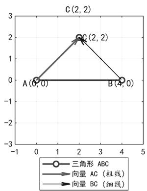
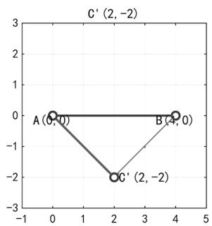

# 高中解析几何题中向量法与代数法的综合应用技巧研究

黎林(江苏联合职业技术学院苏州工业园区分院 215000)

【摘 要】 在高中数学解析几何教学与解题过程中,向量法与代数法是两种重要的工具.向量法以其简洁、直观的几何意义优势,适合处理空间位置关系及方向问题;代数法依托坐标系与方程求解的严密性,适合精确计算坐标与距离.本文结合实例分析,将两种方法综合运用于解析几何问题的求解,旨在帮助学生在不同情境下灵活选择与切换解法,提高解题效率与准确性.

【关键词】 向量法;代数法;高中数学;解题技巧

# 1 引言

在高中解析几何学习中,学生常常面对两类主要方法:向量法与代数法.向量法适用于处理方向、垂直、平行、投影等几何关系问题,计算量较小;代数法则以坐标、方程为核心,便于精确求解交点、距离与角度.实际教学与解题中,运用单一方法有时存在计算复杂或思路不直观等问题,因此将向量法与代数法综合运用,可兼顾几何直观与计算精确性.

# 2 两点确定直线——直线方程(向量式、点斜式、一般式)

例 1 已知 $A(1,2)$ , $B(-4,1)$ ，点 $P(x,y)$ 在平面直角坐标系中.

(1) 求直线 AB 的方程(分别用向量式、点斜式、一般式表示);  
(2) 若点 $Q(2, t)$ 在直线 AB 上, 求实数 t 的值;  
(3) 设点 P 在直线 AB 上, 且满足 $\overrightarrow{OP} \cdot \overrightarrow{AB} = 0$ , 其中 O 为坐标原点, 求点 P 的坐标.

解析 (1) 直线 $AB$ 的方程:

向量式: $\overrightarrow{AB}=(-4-1,1-2)=(-5,-1)$ ,

所以直线 AB 的向量方程为: $(x-1,y-2)=\lambda(-5,-1),\lambda\in\mathbf{R}.$

点斜式: 斜率 $k=\frac{1-2}{-4-1}=\frac{-1}{-5}=\frac{1}{5}$ ,

$$
y - 2 = \frac {1}{5} (x - 1),
$$

一般式: $x - 5y + 9 = 0$ .

(2) 点 $Q(2, t)$ 在直线上，

代入 $x - 5y + 9 = 0,2 - 5t + 9 = 0\Rightarrow t = \frac{11}{5}.$

(3) 点 P 的条件: $\overrightarrow{OP} \cdot \overrightarrow{AB} = 0$ ,

设 $P(x,y)$ 在直线上, $\overrightarrow{AB}=(-5,-1)$ ,

则 $\overrightarrow{OP}\cdot\overrightarrow{AB}=-5x-y=0,$

又因为 $P(x,y)$ 在直线 $AB$ 上，

所以 $x - 5y + 9 = 0$ ，

联立 $\left\{\begin{aligned}x-5y+9&=0,\\ -5x-y&=0,\end{aligned}\right.$

解得 $\left\{\begin{aligned}x&=-\frac{9}{26},\\ y&=\frac{45}{26},\end{aligned}\right.$

所以 $P\left(-\frac{9}{26},\frac{45}{26}\right)$ .

# 3 点到直线的距离(投影法与公式)

例 2 已知点 $P(2,3)$ ，直线为 $x+2y-7=0$ ，求点到直线的距离.

# 解析 代数公式法(标准距离公式)

点 $(x_{0},y_{0})$ 到直线 $Ax+Bx+C=0$ 的距离

$$
d = \frac {\left| A x _ {0} + B y _ {0} + C \right|}{\sqrt {A ^ {2} + B ^ {2}}},
$$

代入 A=1, B=2, C=-7, $x_{0}=2$ , $y_{0}=3$ ,

计算分子： $\left|Ax_{0}+Bx_{0}+C\right|=\left|1\times2+2\times3-7\right|=\left|2+6-7\right|=\left|1\right|=1,$

计算分母: $\sqrt{A^{2}+B^{2}}=\sqrt{1^{2}+2^{2}}=$

$$
\sqrt {1 + 4} = \sqrt {5},
$$

因此, $d=\frac{1}{\sqrt{5}}.$

# 向量(投影)法(等价、便于理解)

取直线上任一点, 如令 x=1, y=3, 代入验证 $1+2 \times 3-7 = 1 + 6 - 7 = 0$ , 所以点 Q(1,3) 在直线上. 向量 $\overrightarrow{QP} = (2 - 1, 3 - 3) = (1, 0)$ , 直线方向向量可取 $d = (2, -1)$ , 直线方向向量可取. 从一般式系数可得垂直向量 $\boldsymbol{n} = (A, B) = (1, 2)$ , 方向向量可取 $(2, -1)$ , 两向量垂直. 点到直线的距离等于投影的绝对值: $d = \frac{|\overrightarrow{QP} \cdot \boldsymbol{n}|}{|\boldsymbol{n}|} = \frac{|(1, 0) \cdot (1, 2)|}{\sqrt{1^2 + 2^2}} = \frac{1}{\sqrt{5}}$ , 两法一致.

# 4 数形结合法

例 3 在平面直角坐标系中, 已知 $\triangle ABC$ 的顶点 $A(0,0)$ , $B(4,0)$ , 点 C 在直线 x=2 上, 且满足 $\overrightarrow{AC} \cdot \overrightarrow{BC}=0$ . 求点 C 的坐标.

解析 (1) 向量法分析.

设 $C(2,y)$ ，

则 $\overrightarrow{AC}=(2,y),\overrightarrow{BC}=(-2,y)$ .

则 $\overrightarrow{AC}\cdot\overrightarrow{BC}=2\times(-2)+y\cdot y,$

即 $4 + y^{2} = 0$

解得 $y = \pm 2$ .

(2) 代数法补充.

利用直角条件: $AC^{2}+BC^{2}=AB^{2}$ ,

代入 $A(0,0)$ , $B(4,0)$ , $C(2,y)$ ,

$$
(2 ^ {2} + y ^ {2}) + [ (- 2) ^ {2} + y ^ {2} ] = 4 ^ {2},
$$

即 $4 + y^{2} + 4 + y^{2} = 16, 2y^{2} + 8 = 16, y^{2} = 4.$

与向量法一致,得到 $y=\pm2$ .

(3) 图形分析.

图 1 展示了 $\triangle ABC$ 及点 C 的两种位置.

line

| Point | X | Y |
|-------|---|---|
| A     | 0 | 0 |
| B     | 4 | 0 |
| C     | 2 | 2 |

line

| Point | x | y |
|---|---|---|
| A (0,0) | 0 | 0 |
| B (4,0) | 4 | 0 |
| C' (2,-2) | 2 | -2 |

图1

该例中,运用向量法可以迅速得出方程,代数法则通过勾股定理验证结果,两者互补提高了解题的准确性.

# 5 结语

向量法与代数法在高中解析几何中的综合运用,能够充分提高解题效率与准确性.在教学中,教师应注重引导学生建立各种方法之间的联系,使其在面对复杂几何问题时能够灵活选用、相互验证,从而提升数学综合素养.

# 参考文献：

[1] 刘洪亮, 石莹. 高质量数学课堂教学创新模式探究——“思维导学”在平面解析几何中的教学实践 [J]. 华夏教师, 2022(10):72-74.  
[2] 浦丽俐. 大单元教学观下的章末复习课教学思考——以“直线与方程”为例[J]. 数学通报, 2022, 61(2): 22-27.