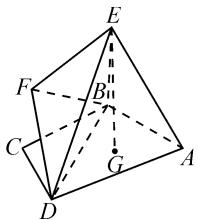
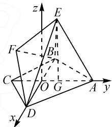
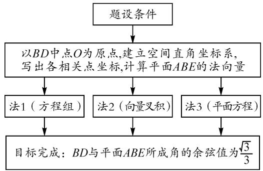
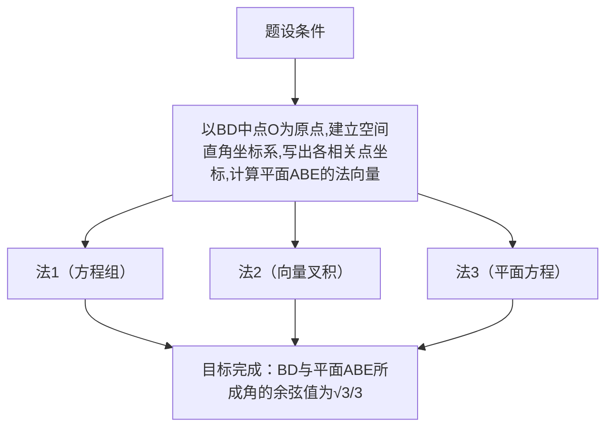
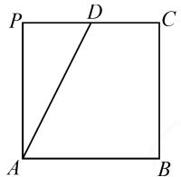
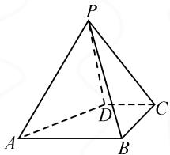
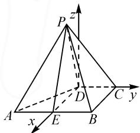
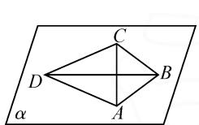
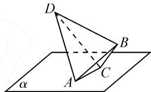
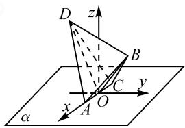

# 2023 年新疆高三第一次适应性检测 一道几何试题的探究

● 新疆昌吉州第一中学 张元志

# 1 题目

(2023年新疆自治区第一次检测第18题)如图1,在平面四边形ABCD中, $AB=AD=1$ ,BC= $CD=\frac{\sqrt{2}}{2}$ ,且 $BC\perp CD$ ,以BD为折痕把 $\triangle ABD$ 和 $\triangle CBD$ 向上折起,使点A到达点E位置,点C到达点F的位置,且E,F不重合.

text_image

Geometric diagram of a pyramid with labeled vertices and internal points, used in spatial geometry problems.

图 1

(1) 求证: $EF \perp BD$ ;   
(2) 若点 G 为 $\triangle ABD$ 的重心 (三条中线的交点), $EG \perp$ 平面 ABD, 求直线 BD 与平面 ABE 所成角的余弦值.

# 2 解法分析及详解

# 2.1 第(1)问思路及解析

第(1)问思路及解析如下.

思路 1: 利用直线与平面垂直的判定定理, 证明异面直线垂直问题.

思路 2: 利用向量坐标运算证明异面直线垂直.

证法 1: 设 BD 的中点为 O, 连接 EO, FO. 由 $\left\{\begin{aligned}EB &= ED, \\ FB &= FD,\end{aligned}\right.$ 得 $\left\{\begin{aligned}EO &\perp BD, \\ FO &\perp BD.\end{aligned}\right.$ 又 $EO \cap FO = O$ , 所以 $BD \perp$ 平面 EOF. 又 $EF \subset$ 平面 EOF, 所以 $BD \perp EF$ .

证法2:依据题意知BD=1，假设把 $\triangle ABD$ 和 $\triangle CBD$ 分别向上折起 $\alpha,\beta(0<\alpha,\beta<\pi)$ .以BD的中点O为坐标原点，建立如图2所示的空间直角坐标系，则 $E\left(0,\frac{\sqrt{3}}{2}\cos\alpha,\frac{\sqrt{3}}{2}\sin\alpha\right),F\left(0,-\frac{1}{2}\cos\beta,\frac{1}{2}\sin\beta\right)$ ，则 $\overrightarrow{EF}=\left(0,-\frac{1}{2}\cos\beta-\frac{\sqrt{3}}{2}\cos\alpha,\frac{1}{2}\sin\beta-\frac{\sqrt{3}}{2}\right)$ ，于是 $\overrightarrow{BD}\cdot\overrightarrow{EF}=0.$ 故 $BD\perp EF$

text_image

z
E
F
B₁₁
C
O
G
A
y
x
D

图 2

# 2.2 第(2)问思路及解析

建立空间直角坐标系,确定相关点的坐标,可用三种方法计算平面 ABE 的法向量.依据该思路,绘制如图 3 所示的思维导图.

flowchart

图3

解析: 同第(1)问建立空间直角坐标系, 则 $E\left(0, \frac{\sqrt{3}}{2}\cos\alpha, \frac{\sqrt{3}}{2}\sin\alpha\right), D\left(\frac{1}{2}, 0, 0\right), A\left(0, \frac{\sqrt{3}}{2}, 0\right), B\left(-\frac{1}{2}, 0, 0\right)$ , 其中 $\cos\alpha = \frac{1}{3}, \sin\alpha = \frac{2\sqrt{2}}{3}$ , 则 $E\left(0, \frac{\sqrt{3}}{6}, \frac{\sqrt{6}}{3}\right)$ .

下面计算平面 ABE 的法向量,有如下三种方法.

法1:(方程组) $\overrightarrow{AB}=\left(-\frac{1}{2},-\frac{\sqrt{3}}{2},0\right),\overrightarrow{AE}=\left(0,-\frac{\sqrt{3}}{3},\frac{\sqrt{6}}{3}\right)$ .设平面ABE的法向量为 $\boldsymbol{n}=(x,y,z)$ ，则有 $\left\{\begin{aligned}\boldsymbol{n}\cdot\overrightarrow{AB}&=0,\\ \boldsymbol{n}\cdot\overrightarrow{AE}&=0,\end{aligned}\right.$ 即 $\left\{\begin{aligned}-\frac{1}{2}x-\frac{\sqrt{3}}{2}y&=0,\\ -\frac{\sqrt{3}}{3}y+\frac{\sqrt{6}}{3}z&=0.\end{aligned}\right.$ 化简整理，可得

$\left\{ \begin{array}{l} x = -\sqrt{3} y, \\ \sqrt{6} z = \sqrt{3} y. \end{array} \right.$ 令 $y = \sqrt{2}$ , 则 $n = (-\sqrt{6}, \sqrt{2}, 1)$ .

法 2: (向量叉积) $\overrightarrow{AB} = \left(-\frac{1}{2}, -\frac{\sqrt{3}}{2}, 0\right), \overrightarrow{AE} =$

$\left(0, -\frac{\sqrt{3}}{3}, \frac{\sqrt{6}}{3}\right)$ , 则 $\overrightarrow{AB} \times \overrightarrow{AE} = \begin{vmatrix} i & j & k \\ -\frac{1}{2} & -\frac{\sqrt{3}}{2} & 0 \\ 0 & -\frac{\sqrt{3}}{3} & \frac{\sqrt{6}}{3} \end{vmatrix} =$

$\frac{\sqrt{3}}{6}(-\sqrt{6},\sqrt{2},1)$ ，因此平面ABE的一个法向量为 $n=(-\sqrt{6},\sqrt{2},1)$ .

法3：（平面方程）设平面ABE的方程为 $\frac{x}{-\frac{1}{2}} +\frac{y}{\frac{\sqrt{3}}{2}} +\frac{z}{c} = 1$ ，将点 $E\left(0,\frac{\sqrt{3}}{6},\frac{\sqrt{6}}{3}\right)$ 代入该平面方程得 $c=\frac{\sqrt{6}}{2}$ ，则平面 ABE 的一个法向量为 $\boldsymbol{n}=(-\sqrt{6},\sqrt{2},1)$ .

由 $\cos\langle\overrightarrow{BD},n\rangle=\frac{\overrightarrow{BD}\cdot n}{|\overrightarrow{BD}||n|}=-\frac{\sqrt{6}}{3}$ ，得直线 BD与平面 ABE 所成角的余弦值为 $\frac{\sqrt{3}}{3}$ .

# 3 相关链接

链接1（2020年天一大联考高三皖豫联盟体第三次考试·理)如图4，在正方形ABCP中， $AB = 4$ ， $D$ 是 $CP$ 的中点.把 $\triangle ADP$ 沿 $AD$ 折叠，使 $\triangle PAB$ 为等边三角形，得到如图5所示的几何体.

text_image

P
D
C
A
B

图 4

text_image

P
A
B
C
D

图 5

(Ⅰ)证明: $AB \perp PD$ ;

(Ⅱ)求二面角 A-PB-C 的余弦值.

（Ⅰ）证明：取 E 为 AB 中点，连接 DE。以 D 为原点，建立如图 6 所示的空间直角坐标系，则 A(4, -2, 0)，B(4, 2, 0)，C(0, 2, 0)。设 P(x, y, z)。依据题意可

知 $\left\{\begin{aligned}|PA|=4,\\ |PB|=4,\text{即}\\ |PD|=2,\end{aligned}\right.$

$\left\{ \begin{array}{l} (x - 4)^2 + (y + 2)^2 + z^2 = 16, \\ (x - 4)^2 + (y - 2)^2 + z^2 = 16, \\ x^2 + y^2 + z^2 = 4, \end{array} \right.$

解得 $\left\{\begin{aligned}x&=1,\\ y&=0,\end{aligned}\right.$ 所以 $P(1,0,\sqrt{3})$ . 由 $\overrightarrow{AB}=(0,4,0)$ , $\overrightarrow{DP}=(1,0,\sqrt{3})$ ，可得 $\overrightarrow{AB}\cdot\overrightarrow{DP}=0$ ，故 $AB\perp PD$ .

(Ⅱ) 解: 设平面 PAB 的方程为 $\frac{x}{4} + 0 + \frac{z}{c} = 1$ ，将点 $P(1, 0, \sqrt{3})$ 代入得 $c = \frac{4}{\sqrt{3}}$ ，则平面 PAB 的方程为 $\frac{x}{4} + 0 + \frac{\sqrt{3} z}{4} = 1$ ，平面 PAB 的一个法向量 $m = (1, 0, \sqrt{3})$ .

text_image

P
z
A
E
B
C
y
x

图6

设平面 PBC 的方程为 $0 + \frac{y}{2} + \frac{z}{c} = 1$ ，将点 $P(1, 0, \sqrt{3})$ 代入得 $c = \sqrt{3}$ ，则平面 PBC 的方程为 $0 + \frac{y}{2} + \frac{z}{\sqrt{3}} = 1$ ，平面 PAB 的一个法向量中 $n = (0, \sqrt{3}, 2)$ .

所以 $\cos\langle m,n\rangle=\frac{m\cdot n}{|m||n|}=\frac{\sqrt{3}}{\sqrt{7}}=\frac{\sqrt{21}}{7}.$

由图知二面角 A-PB-C 为钝角, 故所求的余弦值为 $-\frac{\sqrt{21}}{7}$ .

链接 2 （2021 年安徽六校教育研究会高三第一次联考·理）在平面 $\alpha$ 内的四边形 ABCD（如图 7）， $\triangle ABC$ 和 $\triangle ACD$ 均为等腰三角形，其中 AC = 2， $AB = BC = \sqrt{3}$ ， $AD = CD = \sqrt{6}$ ，现将 $\triangle ABC$ 和 $\triangle ACD$ 均沿 AC 边向上折起（如图 8），使得 B, D 两点到平面 $\alpha$ 的距离分别为 1 和 2.

text_image

C
D
B
A
α

图7

text_image

D
B
A
C
α

图8

(1) 求证: $BD \perp AC$ ;

(2)求二面角 A-BD-C 的余弦值.

(1) 证明: 略.

(2) 解: 以 O 为坐标原点, 建立如图 9 所示的空间直角坐标系, 则 A(1,0,0), C(-1,0,0), B(0,1,1), D(0,-1,2), 线段 BD 与 z 轴的交点为 $\left(0,0,\frac{3}{2}\right)$ .

text_image

D
z
B
C
y
A
O
x
α

图9

设平面 ABD 的方程为 $\frac{x}{1} + \frac{y}{b} + \frac{z}{\frac{3}{2}} = 1$ ，将点 B(0,1,1) 代入得 b = 3，则平面 ABD 的方程为 $\frac{x}{1} + \frac{y}{3} + \frac{z}{\frac{3}{2}} = 1$ ，平面 ABD 的一个法向量 $m = (3,1,2)$ .

同理,平面 CBD 的一个法向量为 $\boldsymbol{n}=(-3,1,2)$ .

所以 $\cos\langle m,n\rangle=\frac{m\cdot n}{|m||n|}=-\frac{2}{7}.$

由图知二面角 A-BD-C 为锐角, 故所求的余弦值为 $\frac{2}{7}$ .

向量坐标法,程序化强,易于操作.解题成功的关键,是平面法向量的计算:方程组法是通法,向量叉积属于高等运算,平面方程法是思维的拓展.Z