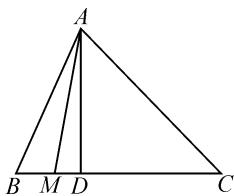

# “概率”章节易错点归纳例析

# 江苏省海安市立发中学 于明华

“概率”章节涉及到的概念、公式较多,很多学生往往会因为对概念、公式理解不清,考虑问题不全面等造成这样或那样的解题错误,故很有必要归类总结常见解题易错点.

# 1 易错点一: 将“非等可能”与“等可能”混同

例 1 掷两枚骰子,求事件 A 为“出现的点数之和等于 3”的概率.

错解: 掷两枚骰子出现的点数之和的可能数值为 2,3,4,……,12, 而满足事件 A 的结果只有数值 3, 故 $P(A)=\frac{1}{11}$ .

剖析:上述错解的根源在于没有厘清公式 $P(A)=\frac{m}{n}$ 中的 n,m 的具体含义.

正解:掷两枚骰子出现的等可能结果有(1,1),(1,2),……,(1,6),(2,1),(2,2),……,(2,6),……,(6,1),(6,2),……,(6,6),共36种.

在这些结果中,事件 A 包含两种等可能结果: $(1,2)$ , $(2,1)$ .

故所求概率为 $P(A)=\frac{2}{36}=\frac{1}{18}$ .

# 2 易错点二: 将目标事件包含的基本事件的个数算错

例 2 甲、乙二人参加普法知识竞赛,共有10个不同的题目,其中选择题6个,判断题4个,甲、乙二人依次各抽取一题.求甲、乙二人至少有一个抽到选择题的概率.

错解: 因为甲抽到选择题的事件数是 $6 \times 9$ ，乙抽到选择题的事件数 $6 \times 9$ ，所以甲、乙二人至少有一个抽到选择题的事件数为 $12 \times 9$ 。又甲、乙二人依次各抽取一题的事件数是 $10 \times 9$ ，故甲、乙二人至少有一个抽到选择题的概率是 $\frac{12}{10} = \frac{6}{5}$ 。

剖析:由于考虑不细致,实际上把甲、乙二人都抽到选择题的事件数计算了两次,这是上述错解的根本原因.

正解: 甲、乙二人依次各抽取一题的基本事件的总数是 $10 \times 9 = 90$ .

甲、乙二人至少有一个抽到选择题，包括以下三种情形：(1) 只有甲抽到了选择题，事件数是 $6 \times 4 = 24$ ; (2) 只有乙抽到了选择题，事件数是 $6 \times 4 = 24$ ; (3) 甲、乙同时抽到选择题，事件数是 $6 \times 5 = 30$ .

故甲、乙二人至少有一个抽到选择题的概率是 $\frac{24+24+30}{90}=\frac{13}{15}$ .

# 3 易错点三: 没有注意抽取时是否“放回”

例 3 一个袋子中有红、白、蓝三种颜色的球共24个，除颜色外完全相同，已知蓝色球3个。若将这三种颜色的球分别进行编号，并将1号红色球，1号白色球，2号蓝色球和3号蓝色球这四个球装入另一个袋子中，甲乙两人先后从这个袋子中各取一个球（甲先取，取出的球放回），求甲取出的球的编号比乙的大的概率。

错解: 记“甲取出的球的编号比乙的大”为事件 A.

所有的基本事件有(红1,白1),(红1,蓝2),(红1,蓝3),(白1,红1),(白1,蓝2),(白1,蓝3),(蓝2,红1),(蓝2,白1),(蓝2,蓝3),(蓝3,红1),(蓝3,白1),(蓝3,蓝2),共12个.

事件 A 包含的基本事件有(蓝 2, 红 1), (蓝 2, 白 1), (蓝 3, 红 1), (蓝 3, 白 1), (蓝 3, 蓝 2), 共 5 个.

故 $P(A)=\frac{5}{12}.$

剖析:由于题目要求“甲先取,取出的球放回”,而上述解题过程却是按“不放回”的方式思考的,这是导致上述错误的根源所在.

注意:如果把“甲先取,取出的球放回”这句话修改为“甲先取,取出的球不放回”,那么上述错解就是正确的.

正解: 记“甲取出的球的编号比乙的大”为事件 A.

所有的基本事件有(红1,白1),(红1,蓝2),(红1,蓝3),(白1,红1),(白1,蓝2),(白1,蓝3),(蓝2,红1),(蓝2,白1),(蓝2,蓝3),(蓝3,红1),(蓝3,白1),(蓝3,蓝2),(红1,红1),(白1,白1),(蓝2, 蓝 2), (蓝 3, 蓝 3), 共 16 个.

事件 A 包含的基本事件有(蓝 2, 红 1), (蓝 2, 白 1), (蓝 3, 红 1), (蓝 3, 白 1), (蓝 3, 蓝 2), 共 5 个.

故根据古典概型可知, $P(A)=\frac{5}{16}$ .

# 4 易错点四:没有注意“公式成立的前提条件”

例 4 一盒中装有各色球 6 个, 其中 2 个红球、2 个黑球、2 个白球, 现从中随机取出 2 个球, 求至少有一个红球或一个黑球的概率.

错解: 设事件 R 为“从中随机取出 2 个球”; 事件 A 为“从中随机取出 2 个球, 至少有一个红球或一个黑球”; 事件 B 为“从中随机取出 2 个球, 有一个红球”; 事件 C 为“从中随机取出 2 个球, 有一个黑球”.

事件 R 包含的基本事件有(红 1, 黑 1), (红 1, 黑 2), (红 1, 白 1), (红 1, 白 2), (红 2, 黑 1), (红 2, 黑 2), (红 2, 白 1), (红 2, 白 2), (黑 1, 白 1), (黑 1, 白 2), (黑 2, 白 1), (黑 2, 白 2), (红 1, 红 2), (黑 1, 黑 2), (白 1, 白 2), 共 15 个.

事件 B 包含的基本事件有(红 1, 黑 1), (红 1, 黑 2), (红 1, 白 1), (红 1, 白 2), (红 2, 黑 1), (红 2, 黑 2), (红 2, 白 1), (红 2, 白 2), (红 1, 红 2), 共 9 个.

事件 C 包含的基本事件有(红 1, 黑 1), (红 1, 黑 2), (红 2, 黑 1), (红 2, 黑 2), (黑 1, 白 1), (黑 1, 白 2), (黑 2, 白 1), (黑 2, 白 2), (黑 1, 黑 2), 共 9 个.

故由互斥事件的概率加法公式,可得

$$
P (A) = P (B + C) = P (B) + P (C) = \frac {9}{1 5} + \frac {9}{1 5} = \frac {6}{5}.
$$

剖析:利用互斥事件的概率加法公式 $P(A+B)=P(A)+P(B)$ 时,要注意事件 A 与 B 必须互斥.而本题中由于事件 B,C 都包含基本事件(红 1,黑 1),(红 1,黑 2),(红 2,黑 1),(红 2,黑 2),所以事件 B,C 不是互斥的,从而事件 A 不能转化为事件 B,C 之和,这是上述错解的根源所在.

正解: 设事件 R 为“从中随机取出两个球”; 事件 A 为“从中随机取出 2 个球, 至少有一个红球或一个黑球”; 事件 B 为“从中随机取出 2 个球, 有红球无黑球”; 事件 C 为“从中随机取出 2 个球, 有黑球无红球”; 事件 D 为“从中随机取出 2 个球, 既有红球又有黑球”.

事件 R 包含的基本事件有(红 1, 黑 1), (红 1, 黑 2), (红 1, 白 1), (红 1, 白 2), (红 2, 黑 1), (红 2, 黑 2), (红 2, 白 1), (红 2, 白 2), (黑 1, 白 1), (黑 1, 白 2), (黑 2, 白 1), (黑 2, 白 2), (红 1, 红 2), (黑 1, 黑 2), (白 1, 白 2), 共 15 个.

事件 B 包含的基本事件有(红 1, 白 1), (红 1, 白 2), (红 2, 白 1), (红 2, 白 2), (红 1, 红 2), 共 5 个.

事件 C 包含的基本事件有(黑 1, 白 1), (黑 1, 白 2), (黑 2, 白 1), (黑 2, 白 2), (黑 1, 黑 2), 共 5 个.

事件 D 包含的基本事件有(红 1, 黑 1), (红 1, 黑 2), (红 2, 黑 1), (红 2, 黑 2), 共 4 个.

因为易知事件 A 可转化为彼此互斥的事件 B, C, D 之和，即 $A = B + C + D$ ，故由互斥事件的概率加法公式，得所求概率为为 $P(A) = P(B + C + D) = P(B) + P(C) + P(D) = \frac{5}{15} + \frac{5}{15} + \frac{4}{15} = \frac{14}{15}$ .

# 5 易错点五: 将具体问题中的“测度”搞错

例 5 如图 1, 在 $\triangle ABC$ 中, $\angle B=\frac{\pi}{3},\angle C=\frac{\pi}{4}$ , 高 AD= $\sqrt{3}$ ，在 $\angle BAC$ 内作射线 AM 交 BC 于点 M，求 BM<1 的概率.

text_image

A
B M D C

图1

错解:由图易计算得 BD=

1, $DC = \sqrt{3}$ ，故由题设及几何概型的概率计算公式得所求概率 $P = \frac{BD}{BC} = \frac{1}{1 + \sqrt{3}} = \frac{\sqrt{3} - 1}{2}$ .

剖析: 解题时, 要特别注意对“在∠BAC 内作射线 AM 交 BC 于点 M”这句话的准确理解, 由此可确定本题的测度应该是“角度”, 而不是“长度”! 所以上述错解就是求概率时因转化错误而导致的.

注意:如果把“在 $\angle BAC$ 内作射线AM交BC于点M”这句话修改为“在线段BC上找一点M”，那么上述错解就是正确的.

正解:由图易计算得 $BD=1, DC=\sqrt{3}$ ，所以目标事件发生的区域为 $\angle BAD$ .

又 $\angle BAD = \frac{\pi}{2} -\frac{\pi}{3} = \frac{\pi}{6},\angle BAC = \pi -\frac{\pi}{3} -\frac{\pi}{4} =$ $\frac{5\pi}{12}$ ，所以由几何概型的概率计算公式得 $BM <   1$ 的概

率 $P=\frac{\angle BAD}{\angle BAC}=\frac{\frac{\pi}{6}}{\frac{5\pi}{12}}=\frac{2}{5}.$

总之，关注“概率”章节常见解题易错点，有利于帮助学生加深对教材基本知识和方法的准确理解，养成审慎思考的良好习惯，同时，能够较好地培养学生数据分析、数学运算以及直观想象等核心素养。一言以蔽之，关注易错点，有利于借误导悟，有利于逐步积累解题经验，避免一些常见错误的产生！Z