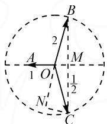
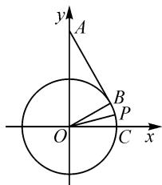

# 借助特殊思维,构建熟知模型

# ● 黑龙江省伊春市第一中学 刘海杰

在解决一些数学问题时,经常借助构建适当的特殊数学模型,有效实现数学问题的基本化、模型化、熟知化,实现数学知识的合理迁移与转化,通过熟知数学模型问题的分析、处理与破解,实现特殊思维化处理数学问题的目的.

# 1 巧构函数模型妙解题

熟知的基本函数模型是数学中最常见的数学模型之一,借助一些基本的初等函数模型的构建与应用,有效联系函数与方程、不等式等的问题,是解决与之有关的问题中比较常用的技巧方法,在此类问题的应用中经常有数学构造法的影子.

例 1 （多选题）已知函数 $f(x)$ 的定义域为 R， $f(xy)=y^{2}f(x)+x^{2}f(y)$ ，则（）.

A. $f(0)=0$

B. $f(1)=0$

C. $f(x)$ 是偶函数

D. x=0 为 $f(x)$ 的极小值点

分析:综合题干与选项,通过特殊值的赋值与应用,并利用特殊函数的构建来分析与判断.

解析: 令 x=y=0, 代入可得 $f(0)=0$ ; 令 x=y=1, 代入可得 $f(1)=0$ . 故选项 A, B 正确.

令 $x = y = -1$ ，代入可得 $f(-1) = 0.$ 单令 $y = -1$ ，则有 $f(-x) = f(x) + x^2 f(-1) = f(x)$ ，可知 $f(x)$ 是偶函数.故选项C正确.

对于条件 $f(xy)=y^{2}f(x)+x^{2}f(y)$ ，当 $x,y\neq0$ 时，有 $\frac{f(xy)}{x^{2}y^{2}}=\frac{f(x)}{x^{2}}+\frac{f(y)}{y^{2}}$ ，利用关系式的结构特征，取特殊函数 $\frac{f(x)}{x^{2}}=\ln|x|(x\neq0)$ ，于是 $f(x)=\left\{\begin{aligned}&x^{2}\ln|x|,x\neq0,\\ &0,x=0,\end{aligned}\right.$ 此时 x=0 不是函数 $f(x)$ 的极小值点。故选项 D 错误。

故选择:ABC.

点评:在解决一些抽象函数及其相关的应用问题时,经常借助抽象函数所满足的基本性质加以具体化,通过熟知的函数模型的构建,以具体函数来解决抽象函数问题,实现问题的破解与应用.

# 2 巧构方程模型妙解题

二次方程等熟知模型与对应函数紧密相关,借助方程模型的构建,可以很好地破解一些和代数式、函数与方程有关的问题,通过方程的应用,特别是利用构造法来转化与处理一些问题.

例 2 已知 a>0, b>0，则 $\frac{1}{a}+\frac{a}{b^{2}}+b$ 的最小值为 \_\_\_\_.

分析:根据所求代数式进行待定系数法处理,将问题方程化,结合关于参数a的二次方程有正数解,建立对应的不等式,分离系数,利用基本不等式来确定t的最小值,从而得以求解代数式最值问题.

解析:由于 a>0, b>0, 令 $\frac{1}{a}+\frac{a}{b^{2}}+b=t>0$ , 变形整理可得 $a^{2}+(b^{3}-tb^{2})a+b^{2}=0$ .

要使关于参数 $a$ 的二次方程有正数解，则需满足 $b^{3} - tb^{2} < 0$ 且 $\Delta = (b^{3} - tb^{2})^{2} - 4b^{2} \geqslant 0$ 有解，整理可得 $b^{3} - tb^{2} < 0$ 且 $\Delta = (b^{3} - tb^{2})^{2} \geqslant 4b^{2}$ 有解，解得 $b^{3} - tb^{2} \leqslant -2b$ ，即 $t \geqslant b + \frac{2}{b}$ 有解.

利用基本不等式, 可得 $t \geqslant b + \frac{2}{b} \geqslant 2\sqrt{b \times \frac{2}{b}} = 2\sqrt{2}$ , 当且仅当 $b = \frac{2}{b}$ , 即 $b = \sqrt{2}$ 时, 等号成立, 此时 $a = \sqrt{2}$ . 所以 $\frac{1}{a} + \frac{a}{b^{2}} + b$ 的最小值为 $2\sqrt{2}$ .

故填: $2\sqrt{2}$ .

点评: 引入参数进行待定系数法处理, 结合方程模型进行数学构造, 借助方程思维, 利用不等式的求解以及基本不等式的应用来巧妙破解.

# 3 巧构数列模型妙解题

数列模型是函数模型的一个特例,借助数列模型的构建,通过新数列的通项公式、基本性质等来巧妙解决数学问题.借助新数列的构建,有效转化一些陌生的数列问题,变形为常见的数列问题,利用构造法来处理.

例 3 若 $a_{i} \in \mathbb{N}^{*} (i=1,2,\cdots,9)$ ，对关系式 $a_{k} = a_{k-1} + 1$ 或 $a_{k} = a_{k+1} - 1 (2 \leqslant k \leqslant 8)$ 中有且仅有一个成立，且满足 $a_{1} = 6, a_{9} = 9$ ，则 $a_{1} + a_{2} + \cdots + a_{9}$ 的最小值为 \_\_\_\_.

分析:根据题设条件,数列相邻两项的差值是1或-1,进而借助数学构造法,构建新数列 $b_{k}=a_{k+1}-a_{k}$ ,结合新数列的结构特征加以分类讨论,从奇数项与偶数项两个不同层面来分析,通过比较即可确定相应的最值问题.

解析: 设 $b_{k}=a_{k+1}-a_{k}(k\geqslant1)$ ，由题意可得 $b_{k}, b_{k-1}$ 恰有一个为 1.

(1) 如果 $b_{1}=b_{3}=b_{5}=b_{7}=b_{9}=1$ ，那么 $a_{1}=6, a_{2}=7, a_{3}\geqslant1, a_{4}=a_{3}+1\geqslant2$ ，同样也有 $a_{5}\geqslant1, a_{6}=a_{5}+1\geqslant2, a_{7}\geqslant1, a_{8}=a_{7}+1\geqslant2$ ，则 $a_{1}+a_{2}+\cdots+a_{9}\geqslant6+7+1+2+1+2+1+2+9=31$ ;  
(2) 如果 $b_{2}=b_{4}=b_{6}=b_{8}=1$ ，那么 $a_{8}=8, a_{2}\geqslant1, a_{3}=a_{2}+1\geqslant2$ ，同样也有 $a_{4}\geqslant1, a_{5}\geqslant2, a_{6}\geqslant1, a_{7}\geqslant2$ ，则 $a_{1}+a_{2}+\cdots+a_{9}\geqslant6+1+2+1+2+1+2+8+9=32.$

综上可知所求的最小值是 31. 故填: 31.

点评:通过作差换元处理,合理构建数列模型,进行数学构造,可操作性强,破解起来自然流畅,是一种不错的解题方法.借助数学模型的构建,合理“翻译”题意来分析与应用.

# 4 巧构平面几何模型妙解题

熟知的平面几何图形与相应模型是初中数学的基础,也是用来解决一些与之相关的高中数学问题的常见模型,特别是与三角函数、平面向量以及解三角形等问题相关时,通过合理构建,直接有效.

例 4 已知向量 $a + b + c = 0$ , $|a| = 1$ , $|b| = |c| = 2$ , 则 $a \cdot b + b \cdot c + c \cdot a =$ \_\_\_\_.

分析:根据平面几何作图处理,合理构造,利用图形的对称性,结合平面几何中特殊图形的几何性质来分析并确定对应的线段长度,通过平面向量的投影确定对应三个向量两两之间的数量积.

解析: 如图 1 所示, 设 $a = \overrightarrow{OA}$ , $b = \overrightarrow{OB}$ , $c = \overrightarrow{OC}$ , 连接 BC, 交 AO 的延长线于点 M, 过点 C 作 BO 的延长线的垂线, 垂足为 N. 结合题目条件以及图形的对称性可知, $4 |OM| = 2 |OA| = |OB| = |OC| = 2$ , $BC \perp AM$ , 则有 $b + c = 2 \overrightarrow{OM}$ . 结合勾股定理, 可得 $|BM| = |CM| = \sqrt{2^2 - \left(\frac{1}{2}\right)^2} = \frac{\sqrt{15}}{2}$ . 由 $\triangle BMO \sim \triangle BNC$ , 可得 $\frac{|BM|}{|BO|} = \frac{|BN|}{|BC|}$ , 即 $\frac{\frac{\sqrt{15}}{2}}{2} = \frac{2 + |ON|}{\sqrt{15}}$ , 解得 $|ON| = \frac{7}{4}$ .

text_image

A
1
O
N
C
B
2
M
1/2

图1

而利用投影, 可知 $a \cdot b = a \cdot c = 1 \times \left(-\frac{1}{2}\right) = -\frac{1}{2}$ , $b \cdot c = 2 \times \left(-\frac{7}{4}\right) = -\frac{7}{2}$ , 所以 $a \cdot b + b \cdot c + c \cdot a = -\frac{9}{2}$ . 故填答案: $-\frac{9}{2}$ .

点评:借助平面几何图形的构建,几何直观对称,垂直投影运算.特别在解决一些解三角形、平面向量等问题中,合理利用构造法,结合三角形、四边形、圆等几何模型确定边、角等元素,直观形象,实现问题的破解.

# 5 巧构解析几何模型妙解题

熟知的平面解析几何模型可用于解决与三角函数、解三角形、代数与创新等相关的问题.借助解析几何模型,引入坐标,通过代数运算加以逻辑推理,快捷处理.

例5 若 $\alpha \in \left(0, \frac{\pi}{2}\right), \tan 2\alpha = \frac{\cos \alpha}{2 - \sin \alpha}$ , 则 $\tan \alpha =$ ( ).

A. $\frac{\sqrt{15}}{15}$

B. $\frac{\sqrt{5}}{5}$

C. $\frac{\sqrt{5}}{3}$

D. $\frac{\sqrt{15}}{3}$

分析:根据题设条件,抓住已知条件中三角关系式的结构特征加以合理构造,借助平面直角坐标系,将问题转化为平面坐标系中相关直线的位置关系问题,化“数”为“形”,利用平面解析几何知识来分析与处理.

解析:如图2,建立平面直角坐标系xOy,其中 $A(0,2)$ ,点P在单位圆 $x^{2}+y^{2}=1$ 上,且点B在直线AP上.令 $\angle POC=\alpha$ ,则 $P(\cos\alpha,\sin\alpha)$ .

设 $\angle BOC = 2\alpha$ ，由 $\tan 2\alpha = \frac{\cos\alpha}{2 - \sin\alpha}$ 得 $\tan 2\alpha = -\frac{1}{\frac{\sin\alpha - 2}{\cos\alpha - 0}}$

text_image

y
A
B
P
O
C
x

图2

则有 $k_{OB} \cdot k_{AP} = -1$ ，即 $OB \perp AP$ .

又 $\angle POC = \angle BOP = \alpha$ ，所以 $\angle OAB = \angle BOC = 2\alpha, \angle OPA = \frac{\pi}{2} - \alpha.$ 由 $|OB| = |OA|\sin 2\alpha = |OP|\sin \left(\frac{\pi}{2} - \alpha\right)$ ，得 $2\sin 2\alpha = \sin \left(\frac{\pi}{2} - \alpha\right)$ .

整理可得 $4\sin \alpha \cos \alpha = \cos \alpha$ 由 $\alpha \in \left(0, \frac{\pi}{2}\right)$ ，可知 $\cos \alpha \neq 0$ ，则有 $\sin \alpha = \frac{1}{4}$ ，利用平方关系有 $\cos \alpha = \sqrt{1 - \sin^2 \alpha} = \frac{\sqrt{15}}{4}$ .

所以 $\tan\alpha=\frac{\sin\alpha}{\cos\alpha}=\frac{\frac{1}{4}}{\frac{\sqrt{15}}{4}}=\frac{\sqrt{15}}{15}$ . 故选择答案: A.

点评:利用平面解析几何模型,从直观图形层面来解决一些特殊的三角函数问题,有效回避了复杂的三角函数公式与应用.特别,利用数学构造法,结合解析几何模型的构建,有奇效.

巧妙构建特殊且熟知的数学模型来解决问题,特别是借助函数与方程、不等式与数列、三角函数、平面向量与解三角形,以及解析几何与立体几何等基本数学模型的特征与性质,解题时才能无形中将问题与这些熟知的基本数学模型加以巧妙融合,“化生为熟”“化繁为简”“化难为易”,开拓思路,柳暗花明,迎刃而解. Z