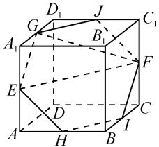

# 借助逻辑推理,培养核心素养

# ● 江苏省泗洪中学 白树忠

在数学学习的过程中,逻辑推理素养的培养重点在于提出并论证相关的数学命题,在掌握推理证明的基本形式的基础上,合乎逻辑地思考问题,正确理解相关事物之间的关联,准确把握对应的知识结构,形成重论据、有条理、合逻辑的思维品质和理性精神,培养良好的科学素养.

# 1 挖掘基本关系,巧妙逻辑推理

利用数学问题中给出的函数、方程、不等式等的基本关系,通过合理的变形与转化,巧妙运用逻辑推理,朝着目标方向不断前行.

例 1 若对任意 $m, n \in R$ ，关于 x 的不等式 $m - n \leqslant (x - m)^{2} + e^{x - n} - a$ 恒成立，则实数 a 的最大值为 \_\_\_\_.

分析:抓住题设条件与问题场景,巧妙变换主元,利用一元二次不等式恒成立的条件,通过判别式法来构建对应的不等式,合理分离参数,综合利用重要不等式 $\left(\mathrm{e}^{x}\geqslant x+1\right.$ ,当且仅当x=0时等号成立)的放缩处理来确定相关参数的取值范围.

解析:由不等式 $m-n \leqslant (x-m)^{2} + e^{x-n}-a$ 恒成立, 可得 $m^{2}-(2x+1)m+x^{2}+e^{x-n}+n-a \geqslant 0$ 对任意 $m \in R$ 恒成立, 则知判别式 $\Delta = (2x+1)^{2}-4(x^{2}+\mathrm{e}^{x-n}+n-a) \leqslant 0$ .

分离参数并整理可得不等式 $a \leqslant \mathrm{e}^{x - n} + n - x - \frac{1}{4}$ 恒成立. 由 $\mathrm{e}^x \geqslant x + 1$ ，可得 $\mathrm{e}^{x - n} + n - x - \frac{1}{4} \geqslant x - n + 1 + n - x - \frac{1}{4} = \frac{3}{4}$ ，当且仅当 $x - n = 0$ 时，等号成立. 所以 $a \leqslant \frac{3}{4}$ ，即实数 $a$ 的最大值为 $\frac{3}{4}$ .

点评:例1主要借助变换主元法进行消参处理,并正确分离参数,为问题的逻辑推理与解决提供条件.正确挖掘题设条件中涉及函数、方程、不等式等的数字、字母等的基本关系,综合逻辑推理来应用,为问题的解决开拓新局面.

# 2 依托信息关联,正确逻辑推理

结合数学问题中给出的相关信息之间的关联,构建不同信息之间的包含、互斥或对立关系等,正确分析相关信息的联系与区别,为正确的逻辑推理提供条件.

例 2 （2023 届江苏省苏州市高三第二学期初数学调研试卷）记函数 $f(x)=\sin\left(\omega x+\frac{\pi}{6}\right)(\omega>0)$ 的最小正周期为 T，给出下列三个命题：

甲： $T > 3$

乙: $f(x)$ 在区间 $\left(\frac{1}{2},1\right)$ 上单调递减;

丙: $f(x)$ 在区间 $(0,3)$ 上恰有三个极值点.

若这三个命题中有且仅有一个假命题,则假命题是\_\_\_\_(填“甲”“乙”或“丙”); $\omega$ 的取值范围是\_\_\_\_.

分析:根据题设条件,利用题设中三个命题分别为真命题时所确定的参数 $\omega$ 的取值范围,再结合约束条件“这三个命题中有且仅有一个假命题”,正确分析不同命题之间所对应结果的关系,借助信息关联,合理逻辑推理,正确分析判断.

解析: 函数 $f(x)=\sin\left(\omega x+\frac{\pi}{6}\right)(\omega>0)$ 的最小正周期为 $T=\frac{2\pi}{\omega}$ .

对于命题甲:由 T>3, 可得 $T=\frac{2\pi}{\omega}>3$ , 解得 0< $\omega<\frac{2\pi}{3}$ , 即 $\omega\in\left(0,\frac{2\pi}{3}\right)$ .

对于命题乙:由 $\frac{1}{2}<x<1$ ,可得 $\frac{1}{2}\omega+\frac{\pi}{6}<\omega x+\frac{\pi}{6}<\omega+\frac{\pi}{6}$ .而 $f(x)$ 在区间 $\left(\frac{1}{2},1\right)$ 上单调递减,结合正弦函数的单调性,有 $\left\{\begin{aligned}\frac{1}{2}\omega+\frac{\pi}{6}&\geqslant\frac{\pi}{2}+2k\pi,\\ \omega+\frac{\pi}{6}&\leqslant\frac{3\pi}{2}+2k\pi,\end{aligned}\right.$ $k\in Z$ ,解

得 $\frac{2\pi}{3}+4k\pi\leqslant\omega\leqslant\frac{4\pi}{3}+2k\pi,k\in Z.$ 结合 $\omega>0$ ，可得 $k\in$ N.当k=0时， $\omega\in\left[\frac{2\pi}{3},\frac{4\pi}{3}\right]$ ；当 $k\geqslant1$ 时， $\omega$ 无解.

对于命题丙:由 0<x<3, 得 $\frac{\pi}{6}<\omega x+\frac{\pi}{6}<3\omega+\frac{\pi}{6}$ .

而 $f(x)$ 在区间 $(0,3)$ 上恰有三个极值点，结合正弦函数的极值点，有 $\frac{5\pi}{2} < 3\omega + \frac{\pi}{6} \leqslant \frac{7\pi}{2}$ ，解得 $\omega \in \left(\frac{7\pi}{9}, \frac{10\pi}{9}\right]$ .

而这三个命题中有且仅有一个假命题，结合这三个命题为真命题时所对应的 $\omega$ 的取值范围，只能是命题甲错误，命题乙、丙正确。

而命题乙、丙同时成立时，由于 $\left(\frac{7\pi}{9}, \frac{10\pi}{9}\right) \subset \left[\frac{2\pi}{3}, \frac{4\pi}{3}\right]$ ，因此 $\omega$ 的取值范围是 $\left(\frac{7\pi}{9}, \frac{10\pi}{9}\right]$ .

# 3 借助图形直观,形象逻辑推理

依据数学问题场景,寻找或构建与之吻合的图象、几何图形等,借助图形直观,数形结合,形象地进行逻辑推理与分析判断.

例 3 [2023 届安徽省淮南市高三第一次模拟考试(一模)数学试卷] 在棱长为 2 的正方体 ABCD-A₁B₁C₁D₁ 中，点 E, F, G 分别是线段 AA₁, CC₁, A₁D₁ 的中点，点 M 在正方形 A₁B₁C₁D₁ 内（含边界），记过 E, F, G 的平面为 α，若 BM // α，则 BM 的取值范围为 \_\_\_\_.

分析:根据题设条件加以合理分析,构建对应的立体几何图形以及对应动点的轨迹,通过动点轨迹的确定以及图形直观加以数形结合,合理逻辑推理应用,进而正确判断动点 M 的轨迹为线段 $A_{1}C_{1}$ (含端点),并结合图形确定相关线段长度的取值范围.

解析: 如图 1 所示, 取 AB, BC, $C_{1}D_{1}$ 的中点 H, I, J.

易知过 E, F, G 的平面 $\alpha$ 即是截面正六边形 EHIFJG 所在的平面.

text_image

Geometric diagram of a cube with labeled vertices and internal points, used for spatial geometry problems.

图1

而在平面 $A_{1}BC_{1}$ 中， $A_{1}B \parallel$ 图1 $EH, BC_{1} \parallel IF, A_{1}B \cap BC_{1} = B$ ，所以平面 $A_{1}BC_{1} \parallel$ 平面 $\alpha$ ，则当 $M \in A_{1}C_{1}$ 时，一定有 $BM \parallel \alpha$ ，即动点 $M$ 的轨迹为线段 $A_{1}C_{1}$ （含端点）.

而正三角形 $A_{1}BC_{1}$ 的边长为 $2\sqrt{2}$ ，当动点 M 位于线段 $A_{1}C_{1}$ 的端点位置时， $|BM|=2\sqrt{2}$ ，为线段 BM 长度的最大值.

当动点 M 位于线段 $A_{1}C_{1}$ 的中点位置时， $|BM|=\sqrt{6}$ ，为线段 BM 长度的最小值.

所以 BM 的取值范围为 $\left[\sqrt{6}, 2\sqrt{2}\right]$ .

点评: 正确构建对应的立体几何图形并直观确定对应动点的轨迹, 为进一步的逻辑推理与直观分析提供条件. 在处理此类问题时, 依题构建相应的图象或几何图形等, 是深入逻辑推理与数学运算的基础, 也是

问题解决中最重要的一个环节.

# 4 给定操作方案,依规逻辑推理

以复杂情境或创新定义等的创设给出相应数学问题的操作方案与规则,要求学生阅读并理解对应的方案或规则,结合解题过程中的正确判断持续进行逻辑推理与分析判断.

例 4 [2023 年教育部新课标四省(云南、吉林、黑龙江、安徽)高考适应性考试数学试卷]数学家祖冲之曾给出圆周率 $\pi$ 的两个近似值: “约率” $\frac{22}{7}$ 与“密率” $\frac{355}{113}$ . 它们可用“调日法”得到: 称小于 3.141 592 6 的近似值为弱率, 大于 3.141 592 7 的近似值为强率. 由 $\frac{3}{1} < \pi < \frac{4}{1}$ , 取 3 为弱率, 4 为强率, 得 $a_{1} = \frac{3 + 4}{1 + 1} = \frac{7}{2}$ , 故 $a_{1}$ 为强率; 与上一次的弱率 3 计算得 $a_{2} = \frac{3 + 7}{1 + 2} = \frac{10}{3}$ , 故 $a_{2}$ 为强率; 继续计算……. 若某次得到的近似值为强率, 与上一次的弱率继续计算得到新的近似值; 若某次得到的近似值为弱率, 与上一次的强率继续计算得到新的近似值. 依此类推. 已知 $a_{m} = \frac{22}{7}$ , 则 m = \_\_\_\_; $a_{8} =$ \_\_\_\_ .

解析:由 $a_{2}=\frac{10}{3}$ 为强率, 可得 $a_{3}=\frac{3+10}{1+3}=\frac{13}{4}$ 为强率, $a_{4}=\frac{3+13}{1+4}=\frac{16}{5}$ 为强率, $a_{5}=\frac{3+16}{1+5}=\frac{19}{6}$ 为强率, $a_{6}=\frac{3+19}{1+6}=\frac{22}{7}$ 为强率. 结合 $a_{m}=\frac{22}{7}$ , 可得 m=6.

继续操作, $a_{6}=\frac{22}{7}$ 为强率,可得 $a_{7}=\frac{3+22}{1+7}=\frac{25}{8}$ 为弱率, $a_{8}=\frac{25+22}{8+7}=\frac{47}{15}$ .

点评:例 4 以中国古代数学文化为创新情境,结合圆周率 $\pi$ 的近似值确定的“调日法”的操作方案来进行逻辑推理与应用.准确识别与应用题设中给出的操作方案与规则等,是正确逻辑推理的基础所在.

作为数学核心素养之一的逻辑推理素养,是现实生活中的一种重要思维方式,更是数学学习必备的一种基本能力,对我们的终生学习与全面发展都具有特殊的作用.逻辑推理素养的养成,可以更加有效地培养学生的科学精神与严谨态度,增强分析与交流能力,拓展思维方式并优化思维品质,不断提高数学应用与数学能力,培养数学核心素养.Z