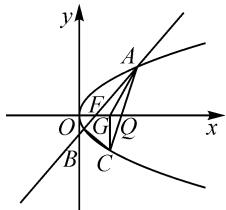

# 基于波利亚数学解题思想的解题教学

——以圆锥曲线的“最值问题”为例

● 哈尔滨师范大学 刘思宁 吴丽华

摘要:本文中以高考中圆锥曲线的“最值问题”为例,探析波利亚解题思想在数学解题教学中的应用,寻找能够启发学生数学思维的解题教学方法.

关键词: 波利亚; 解题教学; 圆锥曲线

圆锥曲线是高中数学的重要内容,也是高考数学重点考查的内容.这部分内容对于学生来说比较吃力,故本文中以圆锥曲线的“定值、最值问题”为例,探析波利亚解题思想在圆锥曲线解题教学中的应用.

# 1 波利亚的解题理论

“一个好的解法是如何想出来的？”这是大部分学生在完成数学作业中一直困惑的问题。波利亚 $^{[1]}$ 在《怎样解题》中的每一个问题就像是解决问题思维过程的“慢镜头动作”，也像是我们解决问题时内心的独白。

第 1 步: 理解题意 $^{[2]}$ .

理解问题的含义是波利亚“如何解决问题表”的第一步,即检查问题.学生应该熟悉问题,并回忆起相关的知识,以找到未知的数量、已知的数据和条件,并用数学符号表达条件给出的信息.

第 2 步: 拟定方案.

拟定方案是问题解决的中心环节,关键是要找到已知条件和所求问题之间的密切关联,从而形成一个可行的解题方案.学生要根据头脑中原有的数学知识结构找到与所求问题之间的桥梁.

第 3 步: 执行方案.

方案拟定完成,这个阶段学生要做的是认真写下解题过程,确保条件充分使用,在解决过程中准确无误,思路清晰.

第 4 步: 回顾.

回顾是检查问题解决活动的过程,也是问题解决活动中一个重要也很容易被忽视的环节.我们得出的解决问题的方法,要经得起“特殊”的检验,哪怕有特殊个体出现也适用才行,因为,我们找到的解决方法需要能重复使用,甚至能解决其他领域的问题.解答完后还需要复盘,找到可以改进的地方.

# 2 解题教学方法探析

笔者试图将解题教学策略应用在圆锥曲线的综合问题中,以近年来圆锥曲线常考的问题,如轨迹方程,圆锥曲线有关的最值问题为例.

例题 如图1, 已知点 $F(1, 0)$ 为抛物线 $y^{2} = 4x$ 的焦点. 过点 $F$ 的直线交抛物线于 $A, B$ 两点, 点 $C$ 在抛物线上, 使得 $\triangle ABC$ 的重心 $G$ 在 $x$ 轴上, 直线 $AC$ 交 $x$ 轴于点 $Q$ , 且 $Q$ 在点 $F$ 的右侧. 记 $\triangle AFG, \triangle CQG$ 的面积分别为 $S_{1}, S_{2}$ . 求 $\frac{S_{1}}{S_{2}}$ 的最小值.

text_image

y
A
F
O
G
Q
x
B
C

图1

解题分析：

第 1 步: 理解题目.

教师:未知是什么?

学生: $\frac{S_{1}}{S_{2}}$ 的最小值.

教师:已知是什么?

学生:焦点 $F(1,0)$ ; 抛物线方程 $y^{2}=4x$ ; $\triangle ABC$ 的重心 G 在 x 轴上; Q 在点 F 的右侧.

教师:条件是什么?

学生: 过点 F 的直线交抛物线于 A, B 两点, 点 C 在抛物线上, 使得 $\triangle ABC$ 的重心 G 在 x 轴上, 直线 AC 交 x 轴于点 Q, 且 Q 在点 F 的右侧. 记 $\triangle AFG$ , $\triangle CQG$ 的面积分别为 $S_{1}, S_{2}$ .

教师:是否满足条件?

学生: 满足条件.

①根据三角形重心性质构建三角形面积之比；  
②通过相似三角形和三角形的性质将面积比转化为底边之比；  
③利用面积和纵坐标之间的关系,借助基本不等

式、最值求解方法、韦达定理，求得比值的最小值.

教师:要确定条件是否充分? 是否多余? 是否矛盾?

学生:条件应该是充分的.

①已知点 G 为三角形的重心, 可得 $\triangle AFG$ 和 $\triangle CQG$ 与 $\triangle ABC$ 面积比值. 设点 $A(x_{1}, y_{1})$ , $B(x_{2}, y_{2})$ , $C(x_{3}, y_{3})$ , 这里 $y_{1} > 0$ , 将面积之比转化为边长之比, 再由边长之比转化为坐标之比.  
②由三角形重心坐标公式，得 $y_{1} + y_{2} + y_{3} = 0$ ，将直线与椭圆方程联立，通过韦达定理进一步得出 $\frac{S_{1}}{S_{2}}$ .  
③根据最值知识点求解问题.

点评:题目当中所蕴含的条件比较多,需要学生对其进行一一分析,体会条件与条件的关系.

第 2 步: 制定计划.

教师:本题与以前做过的题目相类似吗? 由此能联想到什么?

学生:有过类似的题目.能联想到三角形高线性质、焦点弦、最值的求解问题等.

教师:解决此类问题有什么常用方法?

学生:有几何问题代数化法,利用函数求最值等.

教师:能以其他方法叙述这道题目吗?

学生:①抛物线上三点 A, B, C 形成三角形, 三角形的重心在 x 轴上; ②根据重心的相关性质, 将面积之比转化为点的纵坐标之比, 得出 $\frac{S_{1}}{S_{2}}$ ; ③利用换元法简化算式, 化简后结合函数的单调性求解.

点评: 结合题目给出的条件, 从已知推未知, 梳理思路, 建立联系.

第 3 步: 执行计划.

教师:上述解题思路是正确的吗?

学生: 是正确的. 根据三角形重心, 得出 $\triangle AFG$ 和 $\triangle CQG$ 与 $\triangle ABC$ 面积的关系, 再转化为纵坐标之比; 根据三角形重心坐标公式, 找出纵坐标 $y_{1}, y_{2}, y_{3}$ 的关系进行转化; 针对问题建立关于参数的函数式, 利用函数单调性或者求极值的方法求最值, 并结合换元法来简化计算.

教师:能否证明它是正确的?

学生:延长 AG, 交线段 BC 于点 P, 由 $\triangle ABC$ 的重心为点 G, 可得 AG:GP = 2:1, 所以 $S_{\triangle BGC} = \frac{1}{3}S_{\triangle ABC}$ . 同理, 可得 $S_{\triangle AGC} = \frac{1}{3}S_{\triangle ABC}$ , $S_{\triangle CGQ} = \frac{|CQ|}{|AC|}S_{\triangle AGC}$ . 又因为 $\frac{|CQ|}{|AC|} = \frac{|y_3|}{|y_3| + y_1}$ , 所以 $S_{\triangle CGQ} = S_2 = \frac{|y_3|}{|y_3| + y_1} \cdot \frac{S_{\triangle ABC}}{3}$ . 又 $\frac{|AF|}{|AB|} = \frac{y_1}{|y_2| + y_1}$ , 所以 $S_{\triangle AFG} = S_1 = \frac{|AF|}{|AB|} \cdot \frac{S_{\triangle ABC}}{3} = \frac{y_1}{|y_2| + y_1} \cdot \frac{S_{\triangle ABC}}{3}$ . 故 $\frac{S_1}{S_2} = \frac{y_1}{|y_2| + y_1} \cdot \frac{|y_3| + y_1}{|y_3|}$ .

根据三角形重心坐标公式，可知 $y_{1} + y_{2} + y_{3} = 0$ 。因为直线 AC 交 x 轴于点 Q，且 Q 在点 F 的右侧，所以只需点 C 在点 B 的右侧，即 $y_{3} < y_{2}, y_{3} = -y_{1} - y_{2}$ 。将过 F 的直线 AB 与抛物线方程联立，由韦达定理，得 $y_{1}y_{2} = -4$ ，所以 $\frac{S_{1}}{S_{2}} = \frac{y_{1}}{|y_{2}| + y_{1}} \cdot \frac{|y_{3}| + y_{1}}{|y_{3}|} = \frac{2y_{1}^{2} + y_{1} \cdot y_{2}}{|y_{1} + y_{2}| \cdot (y_{1} - y_{2})}$ ，化简，可得 $\frac{S_{1}}{S_{2}} = \frac{2y_{1}^{2} - 4}{y_{1}^{2} - y_{2}^{2}} = \frac{2y_{1}^{4} - 4y_{1}^{2}}{y_{1}^{4} - 16}$ 。令 $y_{1}^{2} = t$ ，则有 $\frac{S_{1}}{S_{2}} = \frac{2t^{2} - 4t}{t^{2} - 16} = 2 + \frac{32 - 4t}{t^{2} - 16} = 2 - 4 \times \frac{t - 8}{t^{2} - 16}$ 。令 $\frac{t - 8}{t^{2} - 16} = u$ ，对 u 求导，得 $u' = \frac{-t^{2} + 16t - 16}{(t^{2} - 16)^{2}}$ 。令 $u' = 0$ ，根据条件可知 t > 4，所以 $t = 8 + 4\sqrt{3}$ ，可知所求的 t 为 u 的最大值点，此时 $\frac{S_{1}}{S_{2}}$ 最小，将 $t = 8 + 4\sqrt{3}$ 代入可求得 $\frac{S_{1}}{S_{2}}$ 的最小值等于 $1 + \frac{\sqrt{3}}{2}$ 。

点评:整个解题过程建立在数形结合的基础之上,这个过程需要学生有一定的运算能力,通过最值问题的求解提升学生的数学运算核心素养和推理论证能力.

第 4 步: 回顾.

教师:此题主要考查了哪些知识点?解决最值问题可以从哪些变量入手?

学生:三角形面积的比值的最小值问题,其中涉及了抛物线、直线方程、重心性质、韦达定理等基础知识,考查了运算求解与转换化归的思想.求函数最值常用配方法、单调性法、判别式法、基本不等式法、导数法和换元法等搭配使用.

点评:本题所涉及的知识点较多,运用的方法也比较多元,计算量大,需要学生有很强的逻辑思维才能完成.通过此题的练习,学生在解圆锥曲线最值问题的求解方面会有很大突破.

在解决问题的过程中,教师需要把握教学目标,巩固学生对已学知识的认知结构,丰富学生对问题的认知体验,培养学生解决问题的能力和兴趣.以波利亚 $^{[1]}$ 的《怎样解题》为依据,教师也应立足主题,充分发挥主题的价值,并运用到实际教学中.

# 参考文献：

[1]波利亚.怎样解题[M].涂泓,冯承天,译.上海:上海科技教育出版社,2002.  
[2]周晨晨.浅谈波利亚四步解题法在数学解题中的应用——以一道高考圆锥曲线题为例[J].数学学习与研究,2020(5):133-134.Z