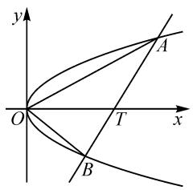
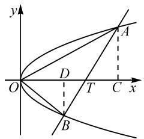

# 多思妙解:一道高三一模联调解析几何题的探究

# ● 江苏省南通市通州湾中学 曹均

摘要:依托于问题的不同数学思维的展开与应用,是全面提升与开拓数学逻辑思维与能力的关键所在.基于一道高考解析几何模拟题中相关三角形面积的求解,借助平面解析几何与平面几何等不同数学思维视角进行“一题多解”,开拓解题思路,发散数学思维,有助于指导教师的教学与解题研究.

关键词: 直线; 抛物线; 垂直; 面积; 射影定理

圆锥曲线中的最值或定值问题,一直是高考数学考查此模块知识比较常见的基本题型之一.此类问题往往以直线与圆锥曲线的位置关系为问题场景,结合圆锥曲线中的元素(离心率、渐近线斜率等)、点的坐标、参数值或相应的代数式,以及相关的距离、角度、面积等综合应用,有“动”有“静”,有“数”有“形”,变化多端,创新新颖,趣味性高,可以很好体现高考命题的基础性、综合性与应用性等.

# 1 问题呈现

问题〔2023届江苏省苏北四市(徐州、连云港、宿迁、淮安)高三上学期第一次联合调研测试(一模)(1月)数学试卷·15〕已知抛物线 $y^{2}=2x$ 与过点 $T(6,0)$ 的直线相交于A,B两点，且 $OB\perp AB$ (O为坐标原点)，则 $\triangle OAB$ 的面积为\_\_\_\_.

此题以直线与抛物线的位置关系为情境,通过过定点的直线以及两直线的垂直关系来合理构建相应的几何场景,进而确定对应三角形的面积问题,题目简捷明了,条件简洁易懂,难度中等.

在实际解决问题时,关键是剖析问题的内涵与实质,通过平面解析几何问题的基本属性,可以借助解析几何思维来合理数学运算与逻辑推理,是处理问题的“通技通法”;也可以借助平面几何思维来合理直观想象与数形结合等,是处理问题的“巧技妙法”.无论从哪种基本思维切入,都可以很好地挖掘问题的本质,进而得以分析与求解问题.

# 2 问题破解

# 2.1 思维视角——解析几何思维

抓住问题本质,从平面解析几何的内涵入手,通过直线 AB 的方程、点 B 的坐标的设置以及点的轨迹应用等来切入,结合两直线的垂直关系加以分析,利用直线与抛物线方程的联立,通过合理的数学运算来转化与应用.

方法 1: 设线法 + 向量法.

解析:设直线 AB 的方程为 $x=my+6$ , $A(x_{1})$ ,$y_{1}$ , $B(x_{2}, y_{2})$ , $x_{1} > 0$ , $x_{2} > 0$ ,
如图 1 所示.

联立 $\left\{\begin{aligned}x=my+6,\\ y^{2}=2x,\end{aligned}\right.$ 消去 x 并整理，得 $y^{2}-2my-12=0$ ，则有 $y_{1}+y_{2}=2m,y_{1}y_{2}=-12$ ，可得 $x_{1}x_{2}=\frac{y_{1}^{2}}{2}\cdot\frac{y_{2}^{2}}{2}=36.$

text_image

y
O
T
x
A
B

图1

由于 $OB \perp AB$ ，则有 $\overrightarrow{OB} \cdot \overrightarrow{AB} = (x_2, y_2) \cdot (x_2 - x_1, y_2 - y_1) = x_2(x_2 - x_1) + y_2(y_2 - y_1) = x_2^2 + y_2^2 - 24 = x_2^2 + 2x_2 - 24 = 0$ .

解得 $x_{2} = 4$ 或 $x_{2} = -6$ （舍去），则有 $y_{2}^{2} = 2x_{2} = 8$ ，不失一般性，取 $y_{2} = -2\sqrt{2}$

所以 $x_{1} = 9, y_{1} = 3\sqrt{2}$ ，得 $|OB| = \sqrt{16 + 8} = 2\sqrt{6}$ ， $|AB| = \sqrt{25 + 50} = 5\sqrt{3}$ .

所以 $\triangle OAB$ 的面积 $S = \frac{1}{2} |OB||AB| = 15\sqrt{2}$ .

故填答案: $15\sqrt{2}$ .

方法 2: 设点法 + 向量法.

解析: 不失一般性, 设点 B 在第四象限, 其坐标为 $B\left(\frac{m^{2}}{2}, m\right)$ , m < 0, 则 $\overrightarrow{TB} = \left(\frac{m^{2}}{2} - 6, m\right)$ .

由于 $OB \perp AB$ ，因此可得 $\overrightarrow{OB} \cdot \overrightarrow{TB} = \left( \frac{m^{2}}{2}, m \right) \cdot \left( \frac{m^{2}}{2} - 6, m \right) = \frac{m^{2}}{2} \left( \frac{m^{2}}{2} - 6 \right) + m^{2} = \frac{1}{4} m^{4} - 2m^{2} = 0$ ，即 $m^{2} = 8$ ，解得 $m = -2\sqrt{2}$ .

所以直线 $AB$ 的斜率为 $k_{TB} = \frac{m}{\frac{m^2}{2} - 6} = \sqrt{2}$ ，于是直线 $AB$ 的方程为 $y = \sqrt{2}(x - 6)$ ，即 $y = \sqrt{2} x - 6\sqrt{2}$ .

联立 $\left\{ \begin{array}{l} y = \sqrt{2} x - 6\sqrt{2}, \\ y^2 = 2x, \end{array} \right.$ 消去 $x$ 并整理，可得 $y^2 - \sqrt{2} y - 12 = 0$ ，解得 $y_A = 3\sqrt{2}$ .

所以 $\triangle OAB$ 的面积 $S = \frac{1}{2} |OT||y_A - m| = \frac{1}{2}\times$

$6 \times 5\sqrt{2} = 15\sqrt{2}$ . 故填答案: $15\sqrt{2}$ .

方法 3: 设点法 + 斜率法.

解析: 不失一般性, 设点 B 在第四象限, 其坐标为 $B\left(\frac{m^{2}}{2}, m\right)$ , m < 0.

由 $OB \perp AB$ ，可得 $k_{OB} k_{TB} = \frac{m}{\frac{m^2}{2}} \cdot \frac{m}{\frac{m^2}{2} - 6} = -1$ ，即 $m^2 = 8$ ，解得 $m = -2\sqrt{2}$ .

下同方法 2 的部分解析.

方法 4: 轨迹法.

解析:由于 $OB \perp AB$ ，直线 AB 过点 $T(6,0)$ ，则知点 B 的轨迹方程为 $(x-3)^{2} + y^{2} = 9$ ，与抛物线 $y^{2} = 2x$ 联立，消去 x 并整理，可得 $x^{2} - 4x = 0$ ，解得 x = 4 或 x = 0（舍去）.

不失一般性,取点 B 的坐标为 $(4,-2\sqrt{2})$ , 则直线 AB 的斜率为 $k_{TB}=\frac{-2\sqrt{2}}{4-6}=\sqrt{2}$ , 所以直线 AB 的方程为 $y=\sqrt{2}(x-6)$ , 即 $y=\sqrt{2}x-6\sqrt{2}$ .

下同方法 2 的部分解析.

解后反思:根据平面解析几何思维,或利用设线法切入,或利用设点法切入,或利用点的轨迹法等切入,这些都是解决平面解析几何问题中的“通技通法”.解决此类问题的关键是通过对应直线方程的构建,然后与圆锥曲线方程联立,借助函数与方程思维的转化,从“数”的视角来逻辑推理与数学运算,实现问题的巧妙解决与应用,达到解题的目的.

# 2.2 思维视角——平面几何思维

抓住问题内涵,从平面几何的直观入手,结合直角三角形中的场景,通过射影定理以及点的特征来确定对应的线段长度,并结合两直角三角形的相似来构建关系式,得以确定其他线段的长度,通过合理的直观想象来转化与应用.

方法 5: 射影定理法.

解析: 过 A, B 两点分别作 x 轴的垂线, 垂足分别为 C, D, 如图 2 所示.

由于 $OB \perp AB$ ，在 Rt△OBT 中，由射影定理可得 $|BD|^{2} = |OD||DT|$ .

text_image

y
A
D
O
T
C x
B

图 2

由点 A, B 在抛物线 $y^{2}=$ 图 2
2x 上，可知 $\left|AC\right|^{2}=2\left|OC\right|,\left|BD\right|^{2}=2\left|OD\right|$ .

所以 $\left|BD\right|^{2}=\left|OD\right|\left|DT\right|=2\left|OD\right|$ ，解得 $\left|DT\right|=2$ ，则 $\left|OD\right|=4,\left|BD\right|=2\sqrt{2}$ .

由 Rt△BDT∽Rt△ACT，可得 $\frac{|DT|}{|BD|}=\frac{|CT|}{|AC|}$ ，即 $\frac{2}{2\sqrt{2}}=\frac{\frac{1}{2}|AC|^{2}-6}{|AC|}$ ，亦即 $|AC|^{2}-\sqrt{2}|AC|-12=0$ ，解

得 $|AC|=3\sqrt{2}$ .

所以 $\triangle OAB$ 的面积 $S = \frac{1}{2} |OT| (|BD| + |AC|) = \frac{1}{2} \times 6 \times 5\sqrt{2} = 15\sqrt{2}$ . 故填答案: $15\sqrt{2}$ .

解后反思:根据平面几何思维,回归平面解析几何的本质,利用平面图形的结构与性质加以直观分析与处理,是解决平面解析几何问题中的“巧技妙法”.解决此类问题的关键是通过平面几何图形的构建,挖掘圆锥曲线方程相关问题的内涵,通过数形结合思维的直观与转化,从“形”的视角来逻辑推理与直观想象,进而实现问题的“数”与“形”的转化与巧妙应用.

# 3 变式拓展

回归问题本质,改变问题的求解方式,将“ $\triangle OAB$ 的面积”的求解转化为“弦 AB 的长度”的求解,得到相应的变式与拓展.

变式 已知抛物线 $y^{2}=2x$ 与过点 T(6,0) 的直线相交于 A, B 两点，且 OB⊥AB(O 为坐标原点)，则弦 AB 的长度为 \_\_\_\_.

答案: $5\sqrt{3}$ .(具体解析过程可以参照原问题的方法1以及其他相关方法,这里不多加叙述.)

# 4 教学启示

# 4.1 比较解题方法,提升数学能力

原问题的解法中,平面解析几何思维是“通技通法”,需要学生牢固掌握,并结合具体场景来合理选择切入视角;在此基础上,回归平面解析几何的本质与内涵,平面几何思维是“巧技妙法”,有利于学生借助平面几何图形进行直观分析与代数运算,有效调控数学运算过程并提升数学运算与逻辑推理能力等,实现平面解析几何与平面几何等相关知识之间的融会贯通,达成知识与方法的综合.

# 4.2 开展“一题多解”，实现“一题多得”

2019 年发行的《中国高考评价体系》为今后的高考试题改革指明了方向,其中包括“高考试题要体现基础性、综合性、应用性和创新性”等,为高考命题与高中教学提供了更加直接有效的方向.

这就要求教师在平时的教学与解题研究中，在强化学生对数学基础知识、基本方法与基本技能等方面训练的基础上，以习题的“一题多解”探究为载体，开阔学生解题视野，使他们熟练掌握更多解题方法；同时，在此基础上做到深度学习，合理“一题多变”，达到“一题多得”，总结解题规律，有效避免题海战术，真正有效培养学生的逻辑思维能力、数学运算能力和创新应用能力等. Z