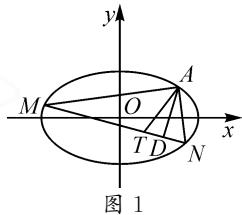

# 对一道圆锥曲线问题的探究与拓广

# 山东省菏泽市定陶区第一中学 郭永生

摘要:深刻剖析典型问题本质,发现规律,找到题眼,把问题弄得清清楚楚、明明白白,真正把提升数学素养落地做实,培养科学精神,提高数学学习效率.

关键词: 剖析问题; 圆锥曲线; 定点; 定值

一套成功的试卷总是不乏好题,立意新颖,典型突出,亮点十足,引人注目.这类试题往往知识融合自然,考点科学交汇,具有良好的教研价值,倍受众多数学爱好者青睐,非常值得我们深入思考、分析与探究.

# 1 问题呈现

问题 已知轨迹 E 上任意一点 $M(x,y)$ 与定点 $F(2,0)$ 的距离和 M 到定直线 l:x=4 的距离的比为 $\frac{\sqrt{2}}{2}$ .

(1)求轨迹 E 的方程.  
(2)设过点 $A(0,-1)$ 且斜率为 $k_{1}$ 的动直线与轨迹 E 交于 C, D 两点，且点 $B(0,2)$ ，直线 BC, BD 分别交圆 $x^{2}+(y-1)^{2}=1$ 于异于点 B 的点 P, Q，设直线 PQ 的斜率为 $k_{2}$ ，问是否存在实数 $\lambda$ ，使得 $k_{2}=\lambda k_{1}$ 成立？若存在，求出 $\lambda$ 的值；若不存在，请说明理由.

# 2 问题解答

上述问题的解答如下.

解:(1)易得 E 的方程为 $\frac{x^{2}}{8}+\frac{y^{2}}{4}=1$ , 过程略.

(2)由题意知,直线 CD 的方程为 $y=k_{1}x-1$ . 设 $C(x_{1},k_{1}x_{1}-1)$ , $D(x_{2},k_{1}x_{2}-1)$ .

将 $y=k_{1}x-1$ 与 $x^{2}+2y^{2}-8=0$ 联立，消去 y，得

$$
(1 + 2 k _ {1} ^ {2}) x ^ {2} - 4 k _ {1} x - 6 = 0.
$$

所以， $x_{1} + x_{2} = \frac{4k_{1}}{1 + 2k_{1}^{2}},x_{1}x_{2} = \frac{-6}{1 + 2k_{1}^{2}}.$

因为 $B(0,2)$ ，所以 $k_{BC} = k_1 - \frac{3}{x_1}, k_{BD} = k_1 - \frac{3}{x_2}$ ，于是 $k_{BC} + k_{BD} = 2k_1 - 3\left(\frac{1}{x_1} + \frac{1}{x_2}\right) = 4k_1, k_{BC}k_{BD} = k_1^2 - 3k_1\left(\frac{1}{x_1} + \frac{1}{x_2}\right) + \frac{9}{x_1x_2} = -\frac{3}{2}$ .

设直线 PQ 的方程为 $y=k_{2}x+m, P(x_{3}, k_{2}x_{3}+m)$ , $Q(x_{4}, k_{2}x_{4}+m)$ .

将 $y=k_{2}x+m$ 与 $x^{2}+(y-1)^{2}=1$ 联立，消去 y，得 $(1+k_{2}^{2})x^{2}+2(m-1)k_{2}x+m(m-2)=0$ 。当 $\Delta>0$ 时， $x_{3}+x_{4}=\frac{-2(m-1)k_{2}}{1+k_{2}^{2}}$ ， $x_{3}x_{4}=\frac{m(m-2)}{1+k_{2}^{2}}$ 。

由 $B(0,2)$ ，可得 $k_{BP} = k_2 + \frac{m - 2}{x_3}, k_{BQ} = k_2 + \frac{m - 2}{x_4}$ ，所以 $k_{BP} + k_{BQ} = 2k_2 + (m - 2)\left(\frac{1}{x_3} + \frac{1}{x_4}\right) = \frac{2k_2}{m}, k_{BP}k_{BQ} = k_2^2 + k_2(m - 2)\left(\frac{1}{x_3} + \frac{1}{x_4}\right) + \frac{(m - 2)^2}{x_3x_4} = \frac{m - 2}{m}$ .

因为 B, C, P 三点共线, B, D, Q 三点也共线, 所以 $k_{BC} = k_{BP}, k_{BD} = k_{BQ}$ . 于是 $4k_{1} = \frac{2k_{2}}{m}$ , 且 $-\frac{3}{2} = \frac{m-2}{m}$ , 解得 $k_{2} = 2mk_{1}, m = \frac{4}{5}$ . 所以存在 $\lambda = 2m = \frac{8}{5}$ 满足要求.

深入思考分析上面解题过程不难引发如下联想：一是发现问题得到解决的关键是 $k_{BC} \cdot k_{BD} = -\frac{3}{2}$ 为一个常数，这个常数传递给 $k_{BP} \cdot k_{BQ}$ ，由 $k_{BP} \cdot k_{BQ} = -\frac{3}{2}$ 又得到直线 $PQ$ 恒过定点 $\left(0, \frac{4}{5}\right)$ ；二是追问 $k_{BC} \cdot k_{BD} = -\frac{3}{2}$ 的原因是直线 $CD$ 恒过定点 $(0, -1)$ ；三是思考“椭圆或圆的两条共点弦斜率之积与这两条弦的另一端点连线过某一定点之间是否存在必然的联系？”

# 3 问题探究

经过初步探究,发现:

已知曲线 C 的方程为 $Ax^{2} + By^{2} = 1 (A \neq 0, B \neq 0)$ ， $T(x_{0}, y_{0})$ 在曲线 C 上，直线 $x = dy + t$ 与曲线 C 相交于 M, N 两点，设 $k_{TM} \cdot k_{TN} = w$ ，若 w 是常数，则直线 MN 恒过定点 $\left(\frac{wB + A}{wB - A}x_{0}, -\frac{wB + A}{wB - A}y_{0}\right)$ .

证明: 因为曲线 $C: Ax^{2} + By^{2} = 1 (A \neq 0, B \neq 0)$ ，且 $T(x_{0}, y_{0})$ 在曲线 C 上，所以 $Ax_{0}^{2} + By_{0}^{2} = 1$ 。把直线 MN 的方程 $x = dy + t$ 与曲线 C 的方程联立消去 x，得 $(d^{2}A + B)y^{2} + 2dAty + At^{2} - 1 = 0$ 。

设 $M(dy_{1}+t,y_{1}),N(dy_{2}+t,y_{2})$ ，则

$$
y _ {1} + y _ {2} = \frac {- 2 d A t}{d ^ {2} A + B}, y _ {1} y _ {2} = \frac {A t ^ {2} - 1}{d ^ {2} A + B},
$$

$$
k _ {T M} = \frac {y _ {1} - y _ {0}}{d y _ {1} + (t - x _ {0})}, k _ {T N} = \frac {y _ {2} - y _ {0}}{d y _ {2} + (t - x _ {0})}.
$$

所以 $k_{TM} \cdot k_{TN}$

$$
\begin{array}{l} = \frac {y _ {1} - y _ {0}}{d y _ {1} + (t - x _ {0})} \cdot \frac {y _ {2} - y _ {0}}{d y _ {2} + (t - x _ {0})} \\ = \frac {y _ {1} y _ {2} - y _ {0} \left(y _ {1} + y _ {2}\right) + y _ {0} ^ {2}}{d ^ {2} y _ {1} y _ {2} + d \left(t - x _ {0}\right) \left(y _ {1} + y _ {2}\right) + \left(t - x _ {0}\right) ^ {2}} \\ = \frac {A \left(t ^ {2} + 2 d t y _ {0} + d ^ {2} y _ {0} ^ {2}\right) + B y _ {0} ^ {2} - 1}{d ^ {2} A x _ {0} ^ {2} + B \left(t - x _ {0}\right) ^ {2} - d ^ {2}} \\ \end{array}
$$

$$
= \frac {A (t + d y _ {0}) ^ {2} - A x _ {0} ^ {2}}{d ^ {2} A x _ {0} ^ {2} + B (t - x _ {0}) ^ {2} - d ^ {2}}
$$

$$
= \frac {A (t + d y _ {0} + x _ {0}) (t + d y _ {0} - x _ {0})}{B (t - x _ {0}) ^ {2} + d ^ {2} \left(A x _ {0} ^ {2} - 1\right)}
$$

$$
= \frac {A (t + d y _ {0} + x _ {0}) (t + d y _ {0} - x _ {0})}{B (t - x _ {0}) ^ {2} - d ^ {2} B y _ {0} ^ {2}}
$$

$$
= \frac {A (t + d y _ {0} + x _ {0}) (t + d y _ {0} - x _ {0})}{B (t - x _ {0} - d y _ {0}) (t - x _ {0} + d y _ {0})}
$$

$$
= \frac {A}{B} \cdot \frac {t + x _ {0} + d y _ {0}}{t - x _ {0} - d y _ {0}}.
$$

由 $k_{TM} \cdot k_{TN} = w$ ，得 $t = \frac{wB + A}{wB - A}(x_0 + dy_0)$ ，所以直线 $MN$ 的方程为 $x = dy + \frac{wB + A}{wB - A}(x_0 + dy_0)$ ，即 $x = \left(y + \frac{wB + A}{wB - A}y_0\right)d + \frac{wB + A}{wB - A}x_0$ 。根据 $d$ 的任意性可知，直线 $MN$ 恒过点 $\left(\frac{wB + A}{wB - A}x_0, -\frac{wB + A}{wB - A}y_0\right)$ 。

特别地,可得以下结论:

(1) 当曲线 $C: \frac{x^{2}}{a^{2}} + \frac{y^{2}}{b^{2}} = 1 (a > b > 0)$ 时，直线 MN 恒过定点 $\left(\frac{wa^{2} + b^{2}}{wa^{2} - b^{2}} x_{0}, -\frac{wa^{2} + b^{2}}{wa^{2} - b^{2}} y_{0}\right)$ .

当 $TM \perp TN$ 时，则直线 $AB$ 恒过点 $\left(\frac{a^2 - b^2}{a^2 + b^2} x_0, -\frac{a^2 - b^2}{a^2 + b^2} y_0\right)$ ，即 $\left(\frac{e^2}{2 - e^2} x_0, -\frac{e^2}{2 - e^2} y_0\right)$ .

(2) 当曲线 $C: \frac{x^{2}}{a^{2}} - \frac{y^{2}}{b^{2}} = 1 (a > 0, b > 0)$ 时，直线 MN 恒过定点 $\left(\frac{wa^{2} - b^{2}}{wa^{2} + b^{2}} x_{0}, -\frac{wa^{2} - b^{2}}{wa^{2} + b^{2}} y_{0}\right)$ .

当 $TM \perp TN$ 时，则直线 $AB$ 恒过点 $\left(\frac{a^2 + b^2}{a^2 - b^2} x_0, -\frac{a^2 + b^2}{a^2 - b^2} y_0\right)$ ，即 $\left(\frac{e^2}{2 - e^2} x_0, -\frac{e^2}{2 - e^2} y_0\right)$ .

(3) 当曲线 $C: x^{2} + y^{2} = R^{2}$ 时，直线 MN 恒过定点 $\left(\frac{w+1}{w-1}x_{0}, -\frac{w+1}{w-1}y_{0}\right)$ .

当 $TM \perp TN$ 时, 则直线 AB 恒过点 $(0,0)$ .

(注:上述 e 为相应曲线的离心率.)

# 4 拓广探索

再进一步深入研究抛物线,发现类似性质:

当曲线 C 的方程为 $y^{2}=2px(p>0)$ ， $T(x_{0},y_{0})$ 在曲线 C 上，直线 $x=dy+t$ 与曲线 C 相交于 M, N 两点，设 $k_{TM} \cdot k_{TN} = w$ ，若 w 是常数，则直线 MN 恒过定点 $\left(\frac{-2p}{w} + x_{0}, -y_{0}\right)$ . (证明略.)

特别地：

(1) 当 $TM \perp TN$ 时, 时, 直线 MN 恒过定点 $(2p + x_{0}, -y_{0})$ ;  
(2) 当 $x_{0}=y_{0}=0$ ，且 $TM \perp TN$ 时，直线 MN 恒过定点 $(2p,0)$ .

事实上，对于“ $k_{TM} \cdot k_{TN} = \frac{A}{B} \cdot \frac{t + x_0 + dy_0}{t - x_0 - dy_0}$ ”，当其中的 $t, x_0, y_0$ 再满足一些特殊条件时，又可以得到一系列的结论，请大家探讨！

# 5 链接高考

高考真题 （2020 年新高考 I 卷 · 山东 · 22）已知椭圆 $C: \frac{x^{2}}{a^{2}} + \frac{y^{2}}{b^{2}} = 1 (a > b > 0)$ 的离心率为 $\frac{\sqrt{2}}{2}$ ，且过点 A(2,1).

(1) 求 C 的方程;  
(2) 点 M, N 在 C 上, 且 $AM \perp AN, AD \perp MN, D$ 为垂足. 证明: 存在定点 Q, 使得 $|DQ|$ 为定值.

解:(1)因为离心率为 $\frac{\sqrt{2}}{2}$ ，所以 $\frac{b^{2}}{a^{2}}=\frac{1}{2}$ .又椭圆过点 $A(2,1)$ ，所以 $\frac{4}{a^{2}}+\frac{1}{b^{2}}=1$ ，解得 $a^{2}=6,b^{2}=3$ .所以

椭圆 C 的方程为 $\frac{x^{2}}{6} + \frac{y^{2}}{3} = 1$ .

(2) 证明: 根据以上发现的结论(1) 可知, 直线 MN 恒过定点 $T\left(\frac{2}{3}, -\frac{1}{3}\right)$ . 如图 1, 因为 $AD \perp MN$ , 所以 $\triangle ADT$ 是以定

text_image

y
M
O
A
x
T D N
图 1

线段 $AT$ 为斜边， $D$ 为直角顶点的直角三角形。因此，线段 $AT$ 的中点就是所求的点 $Q$ ，其坐标为 $\left(\frac{4}{3}, \frac{1}{3}\right)$ ，且 $|DQ| = \frac{1}{2} |AT| = \frac{2\sqrt{2}}{3}$ 。

当下高中数学教学面临新教材、新课程、新高考所引领的三新环境，单纯从学科教与学的角度来看，学习探究应该成为适应新时代下教与学的新常态，特别是像学习圆锥曲线等一类难度较大的内容时，教师更有必要下功夫思考与探究。圆锥曲线的性质十分丰富，可供探究的方面十分广泛，以上笔者所探讨的这些只不过是圆锥曲线性质中的冰山一角，沧海一粟，期盼早日见到新时代同行们更多、更好的教学研究成果，以期同学习、共进步！Z