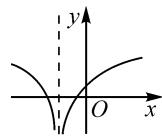
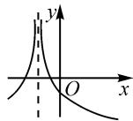
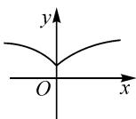
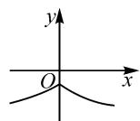

# 对数函数的单元教学：

# 知识全面梳理,应用巧妙解读\*

# ● 甘肃省张掖市第二中学 白亚兰

对数函数作为高中数学的一种基本初等函数,是最为重要的一个基本函数模型,也是每年高考数学必考的重点函数类型与内容之一.以对数函数为问题场景,结合对数运算、对数与指数之间的转化、对数函数的概念、对数函数的基本性质等知识加以全面梳理,以细致周到的应用来创设,全面针对对数函数的单元教学与学习进行合理设计与研究.

# 1 函数概念问题

例 1 已知 a > 0，且 $a \neq 1$ ，函数 $f(x) = \left\{ \begin{aligned} a^{x}, & x < 0, \\ \log_{a}(2x^{2} + 1), & x \geqslant 0, \end{aligned} \right.$ 若 $f(f(-1)) = 2$ ，则 $a =$ \_\_\_\_， $f(x) \leqslant 4$ 的解集为 \_\_\_\_.

分析:结合分段函数场景,融入含参的指数函数与对数函数,利用函数值的应用来求解对应的参数值,并结合不等式的确立,通过分类讨论思想来分析与解决涉及指数函数、对数函数的基本概念与基本应用问题.

解析:依题意可得 $f(f(-1))=f(a^{-1})=\log_{a}(2a^{-2}+1)=2$ ，则有 $2a^{-2}+1=a^{2}$ ，整理可得 $a^{4}-a^{2}-2=0$ ，解得 $a^{2}=2$ 。又 a>0，且 $a\neq1$ ，所以 $a=\sqrt{2}$ 。

当 x<0 时， $f(x)=(\sqrt{2})^{x}\leqslant4$ 恒成立，此时不等式的解为 x<0.

当 $x \geqslant 0$ 时， $f(x) = \log_{\sqrt{2}}(2x^2 + 1) \leqslant 4$ ，则有 $2x^2 + 1 \leqslant 4$ ，解得 $0 \leqslant x \leqslant \frac{\sqrt{6}}{2}$ .

综上可知,不等式 $f(x) \leqslant 4$ 的解为 $x \leqslant \frac{\sqrt{6}}{2}$ .

故填答案: $\sqrt{2}$ ; $\left(-\infty,\frac{\sqrt{6}}{2}\right]$ .

点评: 涉及对数函数的解析式、定义域、值域以及函数值的求解等基本问题, 是基于对数函数模块的基础知识之一, 要求熟练掌握并会加以应用.

# 2 函数图象问题

例 2 [2022 年内蒙古通辽市高考数学模拟试卷(4月份)]若函数 $f(x) = (k - 1)a^x - a^{-x}$ ( $a > 0$ , 且 $a \neq 1$ ) 在 R 上既是奇函数又是减函数, 则函数 $g(x) = \log_a |x + k|$ 的大致图象是().

  
A

  
B

  
C

  
D

分析:根据函数的奇偶性来确定相关参数的值,并利用指数函数的单调性来确定参数的取值范围,进一步转化为利用对数函数的定义域与单调性来判断复杂函数的图象.

解析: 若函数 $f(x)=(k-1)a^{x}-a^{-x}(a>0$ ，且 $a\neq1)$ 在 R 上是奇函数，则有 $f(0)=0$ ，即 $(k-1)-1=0$ ，解得 k=2，此时函数 $f(x)=a^{x}-a^{-x}$ 为奇函数，满足条件.

又函数 $f(x)$ 在 R 上是减函数, 则知 0 < a < 1.

所以 $g(x)=\log_{a}|x+k|=\log_{a}|x+2|$ ，其定义域为 $\{x|x\neq-2\}$ ，则知函数 $g(x)$ 在 $(-∞,-2)$ 上单调递增，在 $(-2,+∞)$ 上单调递减，其大致图象为选项 B 中的函数图象

故选择答案:B.

点评:在判断指数函数与对数函数的综合应用中的函数图象问题时,关键要通过相关函数的奇偶性、单调性等来确定参数的值或取值范围,由此及彼,合理过渡,实现两个基本初等函数之间的联系与转化.

# 3 大小比较问题

例 3 （2021 年高考数学新高考Ⅱ卷·7）已知 $a=\log_{5}2, b=\log_{8}3, c=\frac{1}{2}$ ，则下列判断正确的是（）.

$$
\mathrm{A.} c <   b <   a
$$

$$
\mathrm{B}. b <   a <   c
$$

$$
\mathrm{C}. a <   c <   b
$$

$$
\mathrm{D}. a <   b <   c
$$

分析:以对数函数为场景,结合对数值的构建来判断代数式的大小比较问题,破解的关键就是直接利用对数运算加以合理变形,并借助对数函数的单调性来合理放缩处理,从而得以正确判断.

解析:依题知 $a=\log_{5}2=\log_{5}\sqrt{4}<\log_{5}\sqrt{5}=\frac{1}{2}=c$ 而 $b=\log_{8}3=\log_{8}\sqrt{9}>\log_{8}\sqrt{8}=\frac{1}{2}=c$ ，可得 a<c<b.

故选择答案:C.

点评:在处理此类大小比较及其相关应用问题时,关键在于借助对数运算加以合理变形与转化,结合对数函数的单调性、不等式的基本性质以及其他一些相关的知识加以合理放缩.

# 4 函数模型问题

例 4 （多选题）已知函数 $f(x)$ 的定义域是 $(0, +\infty)$ ，当 x > 1 时， $f(x) < 0$ ，且 $f(xy) = f(x) + f(y)$ ， $f(2) = -1$ ，下列说法正确的是（）.

A. $f(1)=0$   
B. 函数 $f(x)$ 在 $(0, +\infty)$ 上单调递减

$$
\mathrm{C}. f \left(\frac {1}{2 0 2 3}\right) + f \left(\frac {1}{2 0 2 2}\right) + \dots \dots + f \left(\frac {1}{3}\right) +
$$

$$
f \left(\frac {1}{2}\right) + f (2) + f (3) + \dots + f (2 0 2 2) +
$$

$$
f (2 0 2 3) = 2 0 2 3
$$

D. 满足不等式 $f(\frac{1}{x}) - f(x - 3) \geqslant 2$ 的 x 的取值范围为 $[4, +\infty)$

分析:根据题设条件,通过关系式 $f(xy)=f(x)+f(y)$ 的结构特征及对数的运算性质 $\log_{a}(xy)=\log_{a}x+\log_{a}y$ 加以合理联想,化抽象为具体,并结合题设中的相关条件合理配凑对数函数中的相关系数,进而构建特殊对数函数模型,利用特殊化处理来巧妙解决问题.

解析: 令函数 $f(x)=\log_{0.5}x$ ，则该函数 $f(x)$ 满足题设条件.

于是 $f(1)=0$ ，且 $f(x)$ 在 R 上是单调递减函数，故选项 A, B 正确.

由于 $f\left(\frac{1}{x}\right)+f(x)=\log_{0.5}\frac{1}{x}+\log_{0.5}x=\log_{0.5}1=$ 0, 则知 $f\left(\frac{1}{2023}\right)+f\left(\frac{1}{2022}\right)+\cdots+f\left(\frac{1}{3}\right)+$ $f\left(\frac{1}{2}\right)+f(2)+f(3)+\cdots+f(2022)+f(2023)=$ 0, 故选项 C 错误.

由 $f\left(\frac{1}{x}\right) - f(x - 3) \geqslant 2$ ，可得 $\log_{0.5} \frac{1}{x} - \log_{0.5}(x - 3) \geqslant 2$ ，即 $\log_{0.5} \frac{1}{x(x - 3)} \geqslant 2 = \log_{0.5} \frac{1}{4}$ ，于是可得 $\left\{\frac{x - 3 > 0}{x(x - 3)} \leqslant \frac{1}{4}, \text{解得 } x \geqslant 4.\right.$ 所以原不等式的解集为 $[4, +\infty)$ ，故选项 D 正确。

故选择答案: ABD.

点评:借助对数函数模型来特殊化解决此类问题时,关键要熟练掌握对数函数的结构特征以及与之相关的运算特征,其中对数函数 $f(x)=\log_{a}x(a>0,a\neq1)$ 中的底数决定函数的单调性,特别地,真数可以与常数进行适当的加减配凑来决定常数情况,根据具体场景加以合理正确选取.特别要注意的是,该方法对于选择题而言,虽可快速作出选择,但不够严谨.

# 5 实际应用问题

例 5 [2023 年四川省雅安市部分学校数学联考试卷(4 月份)]住房的许多建材都会释放甲醛.甲醛是一种无色、有着刺激性气味的气体,对人体健康有着极大的危害.新房入住时,空气中甲醛浓度不能超过 $0.08 \, mg/m^{3}$ , 否则,该新房达不到安全入住的标准.若某套住房自装修完成后,通风 $x(x=1,2,3,\cdots\cdots,50)$ 周与室内甲醛浓度 y (单位: $mg/m^{3}$ ) 之间近似满足函数关系式 $y=0.48-0.1f(x)(x\in\mathbf{N}^{*})$ , 其中 $f(x)=\log_{a}[k(x^{2}+2x+1)](k>0, x=1,2,3,\cdots\cdots,50)$ , 且 $f(2)=2, f(8)=3$ , 则该住房装修完成后要达到安全入住的标准, 至少需要通风().

A.17 周

B.24 周

C.28 周

D.26 周

分析:根据题设条件,结合已知的函数值,合理构建相应的关系式,通过变形与转化来确定并求解对应的参数值,进而确定对应的对数函数的解析式,并结合不等式的构建与应用来求解.

解析:依题知 $f(x)=\log_{a}[k(x^{2}+2x+1)]=\log_{a}[k(x+1)^{2}]=\log_{a}k+2\log_{a}(x+1)$ .

由 $f(2) = 2, f(8) = 3$ ，可得 $\log_a k + 2\log_a (2 + 1) = 2, \log_a k + 2\log_a (8 + 1) = 3.$

以上两式对应相减, 可得 $\log_{a}9=1$ , 解得 a=9, 则有 $\log_{a}k+2=3$ , 解得 k=9.

所以 $f(x)=1+2\log_{9}(x+1)$ .

若该住房装修完成后要达到安全入住的标准，则有 $0.48 - 0.1f(x) \leqslant 0.08$ ，可得 $f(x) \geqslant 4$ ，即 $1 + 2\log_9(x + 1) \geqslant 4$ ，解得 $x \geqslant 26$ ，故至少需要通风26周.

故选择答案:D.

点评:结合实际应用中的创新情境设置,合理构建与对数函数有关的数学模型,合理结合对数的运算与应用、对数函数的解析式与基本性质等来分析与处理,并反馈到实际应用问题中去,给出科学的决策或分析.

作为高考数学中最重要的一种基本初等函数,对数函数有其自身的显著特点,同时又可以很好地联系起幂函数、指数函数等,串联起抽象函数和复合函数,基本性质与结构特征明显,对知识的理解与掌握有其独特的要求.全面梳理知识体系,构建完整应用题型,从知识入手,渗透思想方法,融入数学能力,形成数学知识网络体系与解题思维,提升数学核心素养.Z