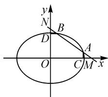

# 巧妙设参,探究拓展

——以 2022 年高考数学新高考Ⅱ卷第 16 题为例

# 福建省晋江市养正中学 郑明铿

# 1 真题呈现

高考真题 （2022年高考数学新高考Ⅱ卷·16）已知椭圆 $\frac{x^{2}}{6}+\frac{y^{2}}{3}=1$ ，直线l与椭圆在第一象限交于A，B两点，与x轴、y轴分别交于M,N两点，且 $|MA|=|NB|$ ， $|MN|=2\sqrt{3}$ ，则直线l的方程为\_\_\_\_。

此题以椭圆为问题背景,结合直线与椭圆位置关系的设置,综合线段的长度以及长度关系,唯一确定相应的直线方程.

抓住直线的特征,设置直线的截距式方程更加契合条件,进而从平面几何的直观、“点差法”的应用以及椭圆的中点弦性质等视角来分析与应用,实现问题的切入、突破与求解.

# 2 真题破解

方法 1: 几何转化法.

解析:设直线 l 的方程为 $\frac{x}{m} + \frac{y}{n} = 1 (m > 0, n > 0)$ ，则 $M(m, 0), N(0, n)$ .

text_image

y
N
B
D
O
A
C M x

图1

不失一般性,取如图1所示的点A,B的位置,过点A,B分别作 x 轴、y 轴的垂线，垂足分别为 C, D. 设 $A(x_{1}, y_{1}), B(x_{2}, y_{2})$ .

易知 $\triangle MCA \cong \triangle BDN$ ，从而 $|AC| = |ND|$ ，即 $y_{1} = n - y_{2}$ ，亦即 $y_{1} + y_{2} = n$ 。

联立 $\left\{\begin{aligned}\frac{x}{m}+\frac{y}{n}=1,\\ \frac{x^{2}}{6}+\frac{y^{2}}{3}=1,\end{aligned}\right.$ 消去x并整理，可得

$$
\left(\frac {m ^ {2}}{n ^ {2}} + 2\right) y ^ {2} - \frac {2 m ^ {2}}{n} y + m ^ {2} - 6 = 0.
$$

利用韦达定理，可得 $y_{1} + y_{2} = \frac{2m^{2}n}{m^{2} + 2n^{2}}$ ，则有 $\frac{2m^2n}{m^2 + 2n^2} = n$ ，即 $m^2 = 2n^2$

又 $|MN|=2\sqrt{3}$ ，即 $m^{2}+n^{2}=12$ ，因此解得m= $2\sqrt{2}$ ，n=2。

所以直线 l 的方程为 $\frac{x}{2\sqrt{2}} + \frac{y}{2} = 1$ ，即 $x + \sqrt{2}y - 2\sqrt{2} = 0$ ，故填答案： $x + \sqrt{2}y - 2\sqrt{2} = 0$ 。

解后反思:抓住直线与圆锥曲线位置关系的本质,借助“形”的直观,构建平面几何图形,通过平面几何的相关知识来构建边、角的关系,从而建立相应的关系式.在解决平面解析几何问题中,经常从“形”的视角切入,主要借助三角形是基本计算或推理证明的基本图形来直观分析,数形结合,实现直观形象的转化与应用.

方法 2: 点差法.

解析: 设 $A(x_{1}, y_{1})$ , $B(x_{2}, y_{2})$ , 其 $x_{1} \neq x_{2}$ , 则线段 AB 的中点为 $E\left(\frac{x_{1} + x_{2}}{2}, \frac{y_{1} + y_{2}}{2}\right)$ .

由 $\frac{x_1^2}{6} +\frac{y_1^2}{3} = 1,\frac{x_2^2}{6} +\frac{y_2^2}{3} = 1$ ，两式对应相减并整理可得 $\frac{y_2^2 - y_1^2}{x_2^2 - x_1^2} = -\frac{1}{2}$ ，则有

$$
k _ {O E} \cdot k _ {A B} = \frac {y _ {1} + y _ {2}}{x _ {1} + x _ {2}} \cdot \frac {y _ {2} - y _ {1}}{x _ {2} - x _ {1}} = \frac {y _ {2} ^ {2} - y _ {1} ^ {2}}{x _ {2} ^ {2} - x _ {1} ^ {2}} = - \frac {1}{2}.
$$

设直线 l 的方程为 $\frac{x}{m} + \frac{y}{n} = 1 (m > 0, n > 0)$ ，则 $M(m, 0), N(0, n)$ .

而由 $\left|MA\right|=\left|NB\right|$ ，可知 E 是线段 MN 的中点，即 $E\left(\frac{m}{2},\frac{n}{2}\right)$ .

又 $k_{AB} = k_{MN} = -\frac{n}{m}, k_{OE} = \frac{n}{m}$ , 所以 $k_{OE} \cdot k_{AB} = \frac{n}{m} \cdot \left(-\frac{n}{m}\right) = -\frac{1}{2}$ , 即 $m^2 = 2n^2$ .

又 $|MN|=2\sqrt{3}$ ，即 $m^{2}+n^{2}=12$ ，因此解得m= $2\sqrt{2}$ ，n=2。

所以直线 l 的方程为 $\frac{x}{2\sqrt{2}} + \frac{y}{2} = 1$ ，即 $x + \sqrt{2}y - 2\sqrt{2} = 0$ ，故填答案： $x + \sqrt{2}y - 2\sqrt{2} = 0$ 。

解后反思:根据题设条件设出椭圆上的两点坐标,利用“点差法”以及直线的斜率公式加以转化与应用,进而设出对应直线的截距式方程,并确定直线与坐标轴的交点,结合直线的斜率、中点坐标公式、两点间的距离公式的应用来确定对应的参数值,从而得以确定直线的方程.“点差法”可以很好地解决圆锥曲线上的两点与对应直线的斜率问题,为进一步构建相应的关系式提供条件.

方法 3: 中点弦性质法.

解析:设直线 l 的方程为 $\frac{x}{m} + \frac{y}{n} = 1 (m > 0, n > 0)$ ，则 $M(m, 0), N(0, n)$ .

取线段 AB 的中点 E，由 $\left|MA\right|=\left|NB\right|$ ，可知 E 是线段 MN 的中点，即 $E\left(\frac{m}{2},\frac{n}{2}\right)$ .

而 $k_{AB} = k_{MN} = -\frac{n}{m}, k_{OE} = \frac{n}{m}$ ，结合椭圆的中点弦性质，可知 $k_{OE} \cdot k_{AB} = -\frac{b^2}{a^2} = -\frac{1}{2}$ ，则有 $-\frac{n}{m} \times \frac{n}{m} = -\frac{1}{2}$ ，即 $m^2 = 2n^2$ 。

又 $|MN| = 2\sqrt{3}$ ，即 $m^2 + n^2 = 12$ ，因此解得 $m = 2\sqrt{2}, n = 2.$

所以直线 l 的方程为 $\frac{x}{2\sqrt{2}} + \frac{y}{2} = 1$ ，即 $x + \sqrt{2}y - 2\sqrt{2} = 0$ ，故填答案： $x + \sqrt{2}y - 2\sqrt{2} = 0$ 。

解后反思:根据题设条件设置与之吻合的直线方程,是简单快捷处理直线与圆锥曲线的位置关系问题中的一个重点.此题结合直线与x轴、y轴分别交于两点,利用直线截距式方程的设置,可以快捷确定对应的交点问题,方便问题的进一步分析与求解.而熟练掌握圆锥曲线中的一些“二级结论”(本题中用到圆锥曲线的中点弦性质),在破解小题时可以优化解题过程,提升解题效益,节约宝贵时间.

# 3 变式拓展

探究 1: 保留椭圆标准方程的确定性, 借助直线与椭圆交点的变化以及与坐标轴的交点情况, 利用线段的三等分点来创设情境, 从而达到变式与拓展的目的.

变式 1 已知椭圆 $\frac{x^{2}}{10} + \frac{y^{2}}{5} = 1$ ，直线 l 与椭圆在第一象限交于 A, B 两点，与 x 轴、y 轴分别交于 M, N 两点，且 A, B 是线段 MN 的两个三等分点，则直线 l 的方程为 \_\_\_\_.

解析:设直线 l 的方程为 $\frac{x}{m} + \frac{y}{n} = 1 (m > 0, n > 0)$ ，则 $M(m, 0), N(0, n)$ .

取线段 AB 的中点 E，由 A, B 是线段 MN 的两个三分点，可知 E 是线段 MN 的中点，即 $E\left(\frac{m}{2}, \frac{n}{2}\right)$ .

而 $k_{AB}=k_{MN}=-\frac{n}{m}, k_{OE}=\frac{n}{m}$ ，结合椭圆的中点弦性质，可知 $k_{OE}\cdot k_{AB}=-\frac{b^{2}}{a^{2}}=-\frac{1}{2}$ ，则有 $-\frac{n}{m}\times\frac{n}{m}=-\frac{1}{2}$ ，即 $m^{2}=2n^{2}$ .

由 A, B 是线段 MN 的两个三分点, 可得其中一点的坐标为 $A\left(\frac{2}{3}m, \frac{1}{3}n\right)$ (不失一般性, 选取点 A 靠近点 M).

由于点 A 在椭圆上，则有 $\left(\frac{2}{3}m\right)^{2}+2\left(\frac{1}{3}n\right)^{2}=10$ ，即 $2m^{2}+n^{2}=45$ 。

结合 $m^{2}=2n^{2}$ ，解得 $m=3\sqrt{2}, n=3$ .

所以直线 l 的方程为 $\frac{x}{3\sqrt{2}} + \frac{y}{3} = 1$ ，即 $x + \sqrt{2}y - 3\sqrt{2} = 0$ ，故填答案： $x + \sqrt{2}y - 3\sqrt{2} = 0$ 。

探究 2: 在变式 1 的基础上, 进一步深入研究, 借助直线的平移变化所形成的直线与椭圆的交点变化情况以及直线与坐标轴的交点情况, 从另一个视角来创设情境, 同样以线段的三等分点来设置, 得以变式与拓展.

变式 2 已知椭圆 $\frac{x^{2}}{10} + \frac{y^{2}}{5} = 1$ ，经过第一象限的直线 l 与椭圆在第二象限、第四象限分别交于 A, B 两点，与 x 轴、y 轴分别交于 M, N 两点，且 M, N 是线段 AB 的两个三等分点，则直线 l 的方程为 \_\_\_\_.

# 4 教学启示

# (1) 合理设参, 契合条件

合理设参(点的坐标,直线或曲线的方程等)是解决平面解析几何问题中的关键之一,如点的坐标的设置(三角换元等),直线方程的设置(结合直线的斜率是否存在的斜截式方程以及变形形式,截距式方程等),圆锥曲线方程的设置(标准方程或统一方程等),都可以为进一步解决问题提供更加直接便捷的条件,优化解题过程,提升解题效益.

# (2)开拓思维,深入探究

涉及直线与圆锥曲线的综合应用问题,要充分挖掘条件的内涵与本质,深入理解题意条件与所求,合理变形与整合,发散思维,一题多解,并进一步借助破题的技巧策略,举一反三,灵活变通,借助“一题多变”,达到“一题多得”,真正实现融会贯通,综合应用,从数学知识、数学能力、数学思维等层面融合,形成数学知识体系,进而转变为数学能力,创新拓展. Z