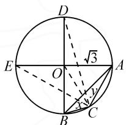

# 平面向量与其他知识的综合应用问题

# ● 江苏省灌云高级中学 周玉凤

平面向量是既有大小又有方向的量,同时具有“数”与“形”的双重特点,是数形结合自然一体的“桥梁”,可以有效“串联”起平面向量与其他知识,实现不同数学知识点之间的交汇与融合.平面向量既可以将几何问题代数化,借助坐标、符号、数量等将推理转化为数学运算来处理,也可以将代数问题几何化,借助几何意义、图形等将运算转化为直观模型来解决.

# 1 平面向量的实际应用问题

平面向量这一“数”“形”兼备工具在实际问题中的应用,可以使一些相关问题转化为数学问题.合理应用平面向量,可使问题的解答更加简捷,清晰.特别是借助平面向量来解决实际生活中一些与“力”有关的应用问题.

例 1 （多选题）在日常生活中，我们会看到两人共提一个行李包的情境，如图 1 所示，假设行李包所受重力为 G，两个拉力分别为 $F_{1}, F_{2}$ ，若 $\left|F_{1}\right| = \left|F_{2}\right|$ ， $F_{1}$ 与 $F_{2}$ 的夹角为 $\theta$ ，则以下结论正确的是（）.

text_image

D
√3
E
O
A
B
C

图1

A. $|\pmb{F}_1|$ 的最小值为 $\frac{1}{2} |\pmb{G}|$   
B. $\theta$ 的取值范围为 $[0,\pi]$   
C. 当 $\theta = \frac{\pi}{2}$ 时， $|F_1| = \frac{\sqrt{2}}{2} |G|$   
D. 当 $\theta=\frac{2\pi}{3}$ 时， $|F_{1}|=|G|$

分析:根据题目条件,利用行李包为平衡状态时的受力平衡构建力的关系式,通过平面向量数量积公式的应用与转化,结合两拉力的夹角 $\theta$ 的取值范围或确定的取值,与各选项中的条件联系加以分析与判断.

解析: 当行李包为平衡状态时, $\left|G\right|=\left|F_{1}+F_{2}\right|$ 为定值, 且 $\left|F_{1}\right|=\left|F_{2}\right|$ , 所以有 $\left|G\right|^{2}=\left|F_{1}\right|^{2}+\left|F_{2}\right|^{2}+2\left|F_{1}\right|\left|F_{2}\right|\cdot\cos\theta=2\left|F_{1}\right|^{2}(1+\cos\theta)$ , 解得 $\left|F_{1}\right|^{2}=\frac{\left|G\right|^{2}}{2(1+\cos\theta)}$ .

对于选项 A, 由 $\theta\in[0,\pi)$ , $y=\cos\theta$ 在 $[0,\pi)$ 上单调递减, 可知 $|F_{1}|$ 的最小值为 $\frac{1}{2}|G|$ , 故选项 A 正确;

对于选项 B, 由题意可知, 当 $\theta = \pi$ 时, $|F_{1}|^{2} =$

$\frac{\left|G\right|^{2}}{2(1+\cos\theta)}$ 没有意义, 故选项 B 不正确;

对于选项 C, 当 $\theta=\frac{\pi}{2}$ 时, $|F_{1}|^{2}=\frac{|G|^{2}}{2}$ , 所以 $|F_{1}|=\frac{\sqrt{2}}{2}|G|$ , 故选项 C 正确;

对于选项 D, 当 $\theta=\frac{2\pi}{3}$ 时, $|F_{1}|^{2}=|G|^{2}$ , 所以 $|F_{1}|=|G|$ , 故选项 D 正确.

综上分析,选择:ACD.

# 2 平面向量与三角函数(或解三角形)的综合问题

三角函数(或解三角形)和平面向量的综合问题是近几年高考数学的一个高频考点与热点.这类问题的求解,既要求我们具有娴熟的三角恒等变换技能,又要求能熟练地进行平面向量的基本运算,特别是平面向量中的数乘运算和数量积运算.

例 2 [2021 年全国决胜高考数学仿真试卷(理科)(一)(全国Ⅱ卷)]已知 A, B, C 三点共线, AB = 3, $\overrightarrow{AC} = 2\overrightarrow{CB}$ , 平面内一点 P 满足 $\frac{\overrightarrow{PA} \cdot \overrightarrow{PC}}{|\overrightarrow{PA}|} = \frac{\overrightarrow{PB} \cdot \overrightarrow{PC}}{|\overrightarrow{PB}|}$ , 则 $\sin\angle PAB$ 的最大值是().

A. $\frac{\sqrt{3}}{2}$

B. $\frac{1}{2}$

C. $\frac{1}{3}$

D. $\frac{2\sqrt{2}}{3}$

分析:根据题目条件,结合平面向量的线性关系式确定线段上三点的比例关系,利用平面向量的数量积公式与条件加以转化,确定PC为 $\angle APB$ 的平分线,借助三角形的角平分线定理以及余弦定理的应用,最后利用同角三角函数的基本关系式来确定 $\sin\angle PAB$ 的最大值.

解析: 由 $\overrightarrow{AC}=2\overrightarrow{CB}$ ，可知 C 为线段 AB 上靠近点 B 的三等分点，且 $|AC|=2|CB|$ .

由 $\frac{\overrightarrow{PA}\cdot\overrightarrow{PC}}{|\overrightarrow{PA}|}=\frac{\overrightarrow{PB}\cdot\overrightarrow{PC}}{|\overrightarrow{PB}|}$ ，可以得到 $\cos\angle APC=\cos\angle BPC$ ，则 $\angle APC=\angle BPC$ ，所以PC为 $\angle APB$ 的平分线.

根据三角形的角平分线定理，得 $\frac{|PA|}{|PB|}=\frac{|AC|}{|CB|}=\frac{2}{1}$ ，设 $|PB|=m(m>0)$ ，则 $|PA|=2m$ 。

在 $\triangle ABP$ 中，由余弦定理，可得 $\cos \angle PAB = \frac{|PA|^2 + |AB|^2 - |PB|^2}{2|PA|\cdot|AB|} = \frac{4m^2 + 9 - m^2}{12m} = \frac{m}{4} +\frac{3}{4m}\geqslant$ $2\sqrt{\frac{m}{4}\times\frac{3}{4m}}=\frac{\sqrt{3}}{2}$ ，当且仅当 $m=\sqrt{3}$ 时，等号成立.

结合同角三角函数基本关系式,有 $\sin\angle PAB=$

$$
\sqrt {1 - \cos^ {2} \angle P A B} \leqslant \sqrt {1 - \left(\frac {\sqrt {3}}{2}\right) ^ {2}} = \frac {1}{2}.
$$

所以 $\sin\angle PAB$ 的最大值是 $\frac{1}{2}$ . 故选择: B.

点评:平面向量的概念、运算、数量积等的几何意义中涉及三角函数(或解三角形)相关知识,这也为三角函数(或解三角形)和平面向量的综合问题做好了无缝链接,实现不同知识之间交互与整合.

# 3 平面向量与函数(或不等式、数列)的综合问题

平面向量作为数学工具,在“数”的视角与函数(或不等式、数列)等知识层面之间有着千丝万缕的联系,以“数”为本,拓展类比,交汇融合起平面向量与函数(或不等式、数列)相关知识的联系,创设更加丰富多彩的综合应用场景.

例 3 [2021 年全国高考数学临门一卷试卷 (二)] 定义向量列 $a_{1}, a_{2}, a_{3}, \cdots, a_{n}$ 从第二项开始，每一项与它的前一项的差都等于同一个常向量（即坐标都是常数的向量），即 $a_{n} = a_{n-1} + d (n \geqslant 2$ ，且 $n \in N^{*}$ ），其中 d 为常向量，则称这个向量列 $\{a_{n}\}$ 为等差向量列。这个常向量叫作等差向量列的公差向量，且向量列 $\{a_{n}\}$ 的前 n 项和 $S_{n} = a_{1} + a_{2} + \cdots + a_{n}$ 。已知等差向量列 $\{a_{n}\}$ 满足 $a_{1} = (1, 1), a_{2} + a_{4} = (6, 10)$ ，则向量列 $\{a_{n}\}$ 的前 n 项和 $S_{n} =$ \_\_\_\_.

分析:根据题目条件,结合等差向量列的创新定义,易知等差数列的性质、通项公式与求和公式对等差向量列也适合,进而分别确定公差向量 d 与通项公式 $a_{n}$ , 利用对应的求和公式即可求解.

解析:根据创新定义,类比等差数列的等差中项的性质,可得 $2a_{3}=a_{2}+a_{4}=(6,10)$ , 解得 $a_{3}=(3,5)$ .

所以，等差向量列 $\{\pmb{a}_n\}$ 的公差向量 $d = \frac{\pmb{a}_3 - \pmb{a}_1}{2} = \frac{(3,5) - (1,1)}{2} = \frac{(3 - 1,5 - 1)}{2} = \frac{(2,4)}{2} = (1,2).$

类比等差数列的通项公式，可得等差向量列 $\{\pmb{a}_n\}$ 的通项公式为 $a_{n} = (1,1) + (n - 1)(1,2) = (1,1) + (n - 1,2n - 2) = (1 + n - 1,1 + 2n - 2) = (n,2n - 1)$ .

再类比等差数列的前 n 项和公式求 $S_{n}$ .

所以得到等差向量列 $\{\pmb{a}_n\}$ 的前 $n$ 项和 $S_{n} = \frac{n(\pmb{a}_{1} + \pmb{a}_{n})}{2} = \frac{n[(1,1) + (n,2n - 1)]}{2} = \frac{n(1 + n,2n)}{2} =$

$\frac{(n + n^2, 2n^2)}{2} = \left(\frac{n + n^2}{2}, n^2\right)$ . 故填: $\left(\frac{n + n^2}{2}, n^2\right)$ .

# 4 平面向量与几何(平面几何、解析几何或立体几何)的综合应用

平面向量作为数学工具,在“形”的视角与几何(平面几何、解析几何或立体几何)知识层面之间有着密切的联系,以“形”为媒,以“形”创设,可以将向量知识渗透进平面几何、解析几何或立体几何等相关知识中.

例 4 [2021 年浙江省 Z20 联盟高考数学第三次联考试卷(5 月份)]已知 A, B, C, D 是以 O 为球心, 2 为半径的球面上的四个点, $\overrightarrow{OA} + \overrightarrow{OB} + \overrightarrow{OC} = 0$ , 则 $AD + BD + CD$ 不可能等于().

A.6

B.7

C.8

D. $6\sqrt{2}$

分析:根据题目条件,确定 O,A,B,C 四点共面,进而结合点 D 的变化情况,从“点 D 和 A,B,C 中的一个重合”与“OD ⊥ 平面 ABC”两个极端位置来确定 $AD + BD + CD$ 的取值,进而求出其取值范围,利用选项中的数值加以分析与判断.

解析: 连接 AB, BC, AC.

因为 A, B, C, D 是以 O 为球心，2 为半径的球面上的四个点， $\overrightarrow{OA} + \overrightarrow{OB} + \overrightarrow{OC} = 0$ ，所以 O, A, B, C 四点共面，且 $\triangle ABC$ 为等边三角形， $\angle AOB = \angle AOC = \angle BOC = 120^{\circ}$ .

当点 D 和 A, B, C 中的一个重合时, $AD + BD + CD = 2 \times \sqrt{2^{2} + 2^{2} - 2 \times 2 \times 2 \cos 120^{\circ}} = 4\sqrt{3}$ (极限状态, 不能重合).

连接 OD，当 $OD \perp$ 平面 ABC 时，易得 $AD + BD + CD = 3 \times 2\sqrt{2} = 6\sqrt{2}$ .

所以 $4\sqrt{3}<AD+BD+CD\leqslant6\sqrt{2}$ . 对比各选项中的数值，则知选项 A 中的值不可能，故选择：A.

点评:利用平面向量解决此类平面向量与几何(平面几何、解析几何或立体几何)的综合问题时,可以选择建系,使问题坐标化,从“数”的视角将问题巧妙解决;也可直接利用平面向量自身“形”的性质来数形结合,合理解决.

平面向量是衔接代数与几何的纽带, 沟通“数”与“形”, 是数形结合的典范, 也为平面向量与其他知识的交汇融合提供了更多的新颖情境与创新应用, 实现抽象的问题与具体的问题之间的交互与转化, 方法巧妙, 思维创新, 在解决一些具体问题中有奇效, 值得借鉴与推广. 在复习备考过程中, 应当选择一些典型的平面向量与实际应用问题、三角函数 (或解三角形) 问题、函数 (或不等式、数列等) 问题以及几何 (平面几何、解析几何或立体几何) 问题的综合应用进行求解训练, 提高学生处理这类综合问题的能力. Z